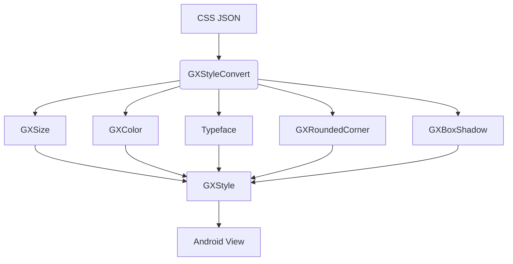
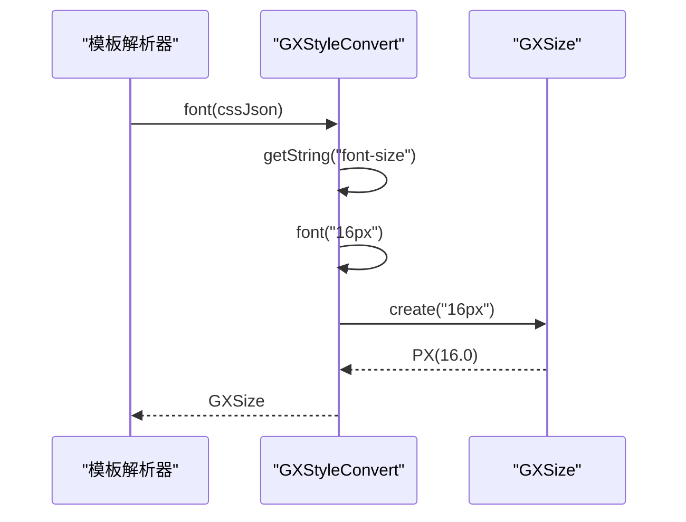
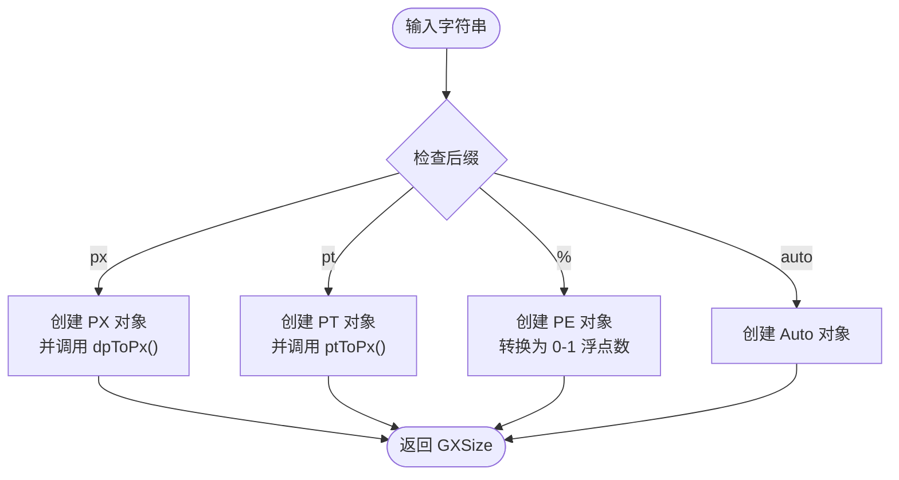
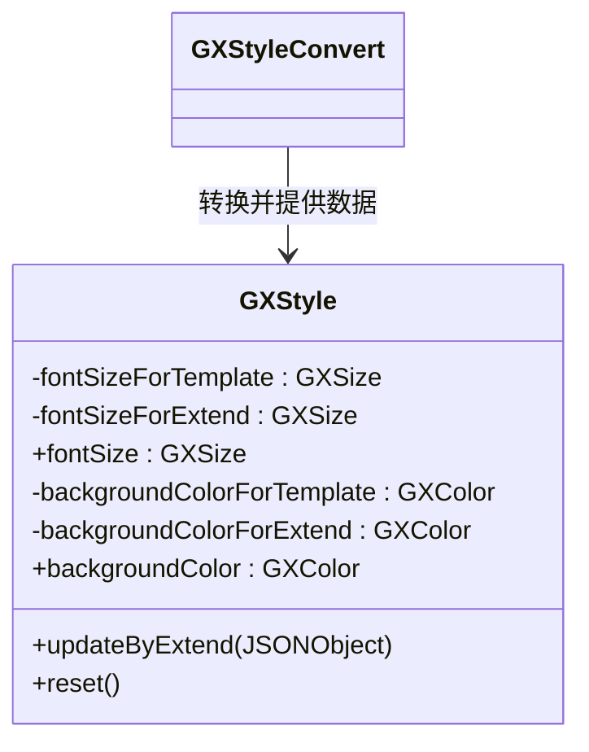
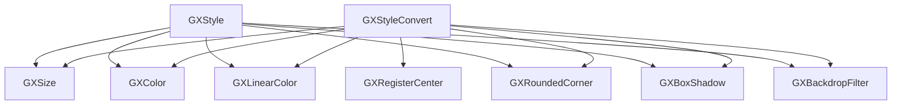

# 样式转换

<cite>
**本文档引用文件**  
- [GXStyleConvert.kt](file://GaiaXAndroid/src/main/kotlin/com/alibaba/gaiax/template/GXStyleConvert.kt)
- [GXStyle.kt](file://GaiaXAndroid/src/main/kotlin/com/alibaba/gaiax/template/GXStyle.kt)
- [GXTemplateKey.kt](file://GaiaXAndroid/src/main/kotlin/com/alibaba/gaiax/template/GXTemplateKey.kt)
- [GXSize.kt](file://GaiaXAndroid/src/main/kotlin/com/alibaba/gaiax/template/GXSize.kt)
- [GXColor.kt](file://GaiaXAndroid/src/main/kotlin/com/alibaba/gaiax/template/GXColor.kt)
- [GXLinearColor.kt](file://GaiaXAndroid/src/main/kotlin/com/alibaba/gaiax/template/GXLinearColor.kt)
- [GXRoundedCorner.kt](file://GaiaXAndroid/src/main/kotlin/com/alibaba/gaiax/template/GXRoundedCorner.kt)
- [GXBoxShadow.kt](file://GaiaXAndroid/src/main/kotlin/com/alibaba/gaiax/template/GXBoxShadow.kt)
- [GXBackdropFilter.kt](file://GaiaXAndroid/src/main/kotlin/com/alibaba/gaiax/template/GXBackdropFilter.kt)
- [GXMode.kt](file://GaiaXAndroid/src/main/kotlin/com/alibaba/gaiax/template/GXMode.kt)
</cite>

## 目录
1. [简介](#简介)
2. [项目结构](#项目结构)
3. [核心组件](#核心组件)
4. [架构概述](#架构概述)
5. [详细组件分析](#详细组件分析)
6. [依赖分析](#依赖分析)
7. [性能考虑](#性能考虑)
8. [故障排除指南](#故障排除指南)
9. [结论](#结论)

## 简介
本文档详细阐述了 GaiaX Android 样式转换系统的核心机制，重点分析 GXStyleConvert 的样式转换逻辑与 GXStyle 的样式管理机制。文档涵盖从 CSS 样式到原生 Android 样式的完整转换流程，包括属性映射、值解析与单位转换。为初学者提供样式定义与应用的基本指南，为高级开发者深入剖析样式继承、优先级计算与性能优化策略。通过实际代码示例展示复杂样式处理、动态样式更新与主题切换，并说明样式系统与布局引擎的交互关系及最佳实践。

## 项目结构
GaiaX Android 样式系统主要位于 `GaiaXAndroid/src/main/kotlin/com/alibaba/gaiax/template/` 目录下，核心文件包括 `GXStyleConvert.kt` 和 `GXStyle.kt`。该系统负责将模板中的 CSS 样式（JSON 格式）转换为 Android 原生可识别的样式对象，并进行管理。

**Diagram sources**
- [GXStyleConvert.kt](file://GaiaXAndroid/src/main/kotlin/com/alibaba/gaiax/template/GXStyleConvert.kt)
- [GXStyle.kt](file://GaiaXAndroid/src/main/kotlin/com/alibaba/gaiax/template/GXStyle.kt)

## 核心组件
本系统的核心组件为 `GXStyleConvert` 和 `GXStyle`。`GXStyleConvert` 是一个单例工具类，负责执行具体的转换逻辑。`GXStyle` 是一个数据类，用于封装和管理所有转换后的样式属性。

**Section sources**
- [GXStyleConvert.kt](file://GaiaXAndroid/src/main/kotlin/com/alibaba/gaiax/template/GXStyleConvert.kt)
- [GXStyle.kt](file://GaiaXAndroid/src/main/kotlin/com/alibaba/gaiax/template/GXStyle.kt)

## 架构概述
样式转换系统采用“转换器-样式对象”模式。`GXStyleConvert` 作为转换器，提供一系列静态方法，将 JSON 中的字符串值解析并转换为特定的 Android 对象（如 `GXSize`、`GXColor`、`Typeface` 等）。`GXStyle` 对象则作为最终的样式容器，它内部维护了两套属性：一套来自模板（`ForTemplate`），另一套来自动态扩展（`ForExtend`）。当获取某个样式属性时，系统会优先返回扩展属性，若不存在则返回模板属性，从而实现了样式的动态覆盖。

**Diagram sources**
- [GXStyleConvert.kt](file://GaiaXAndroid/src/main/kotlin/com/alibaba/gaiax/template/GXStyleConvert.kt)
- [GXStyle.kt](file://GaiaXAndroid/src/main/kotlin/com/alibaba/gaiax/template/GXStyle.kt)

## 详细组件分析

### GXStyleConvert 分析
`GXStyleConvert` 类是样式转换的核心引擎，其主要职责是解析 CSS 属性并将其转换为原生 Android 类型。

#### 样式转换逻辑
该类通过一系列 `convertXxx` 和 `xxx` 方法实现转换。例如，`font(css: JSONObject)` 方法会调用 `font(target: String)` 方法。后者通过 `GXSize.create(target)` 将字符串（如 "16px"）解析为 `GXSize` 对象。这种设计将 JSON 解析与字符串解析分离，提高了代码的复用性和可测试性。

**Diagram sources**
- [GXStyleConvert.kt](file://GaiaXAndroid/src/main/kotlin/com/alibaba/gaiax/template/GXStyleConvert.kt)
- [GXSize.kt](file://GaiaXAndroid/src/main/kotlin/com/alibaba/gaiax/template/GXSize.kt)

#### 属性映射与值解析
`GXTemplateKey.kt` 文件定义了所有 CSS 属性的常量，如 `STYLE_FONT_SIZE`、`STYLE_BACKGROUND_COLOR` 等。`GXStyleConvert` 使用这些常量从 JSON 中提取对应的值。对于复杂值，如 `linear-gradient`，`GXStyleConvert` 提供了专门的解析方法（`getLinearGradient`, `getDirection`）来处理字符串，提取颜色和方向信息。

**Section sources**
- [GXStyleConvert.kt](file://GaiaXAndroid/src/main/kotlin/com/alibaba/gaiax/template/GXStyleConvert.kt)
- [GXTemplateKey.kt](file://GaiaXAndroid/src/main/kotlin/com/alibaba/gaiax/template/GXTemplateKey.kt)

#### 单位转换
单位转换由 `GXSize` 类完成。`GXSize.create()` 方法根据字符串后缀（`px`, `pt`, `%`）创建不同类型的 `GXSize` 子类（`PX`, `PT`, `PE`）。`PX` 表示像素，会通过 `dpToPx()` 转换为设备独立像素；`PT` 表示点，会根据屏幕尺寸进行缩放；`PE` 表示百分比，会转换为浮点数比例。

**Diagram sources**
- [GXSize.kt](file://GaiaXAndroid/src/main/kotlin/com/alibaba/gaiax/template/GXSize.kt)

### GXStyle 分析
`GXStyle` 类是样式数据的最终载体，它采用“模板-扩展”双层结构来管理样式。

#### 样式管理机制
`GXStyle` 内部为每个样式属性（如 `fontSize`, `backgroundColor`）都定义了两个字段：`ForTemplate` 和 `ForExtend`。`ForTemplate` 存储从模板 JSON 中解析出的初始值，`ForExtend` 存储运行时动态更新的值。其公开的 `val` 属性（如 `fontSize`）通过 `?:` 操作符实现优先级逻辑：`return fontSizeForExtend ?: fontSizeForTemplate`。

#### 样式继承与优先级
当调用 `updateByExtend(extendCssData: JSONObject)` 方法时，`GXStyle` 会使用 `GXStyleConvert` 将扩展 JSON 转换为新的样式值，并赋值给对应的 `ForExtend` 字段。这使得动态更新的样式可以覆盖模板样式。`reset()` 方法用于清空所有 `ForExtend` 字段，恢复到模板定义的状态。

**Diagram sources**
- [GXStyle.kt](file://GaiaXAndroid/src/main/kotlin/com/alibaba/gaiax/template/GXStyle.kt)
- [GXStyleConvert.kt](file://GaiaXAndroid/src/main/kotlin/com/alibaba/gaiax/template/GXStyleConvert.kt)

#### 复杂样式处理
`GXStyle` 支持多种复杂样式：
- **背景渐变**: 通过 `backgroundImage` 属性，支持 `linear-gradient` 解析。
- **阴影**: 通过 `boxShadow` 属性，解析 `xOffset`, `yOffset`, `blur`, `spread`, `color` 五个值。
- **圆角**: 通过 `borderRadius` 属性，支持统一圆角和四个角分别设置。
- **字体**: 支持 `fontFamily`, `fontWeight`, `fontTextAlign`, `fontTextOverflow` 等。

**Section sources**
- [GXStyle.kt](file://GaiaXAndroid/src/main/kotlin/com/alibaba/gaiax/template/GXStyle.kt)

## 依赖分析
样式系统依赖于多个核心类：
- `GXSize`: 处理尺寸和单位转换。
- `GXColor`: 处理颜色解析，支持十六进制、RGB、RGBA 和动态颜色。
- `GXLinearColor`: 封装线性渐变的颜色和方向。
- `GXRoundedCorner`: 封装四个角的圆角半径。
- `GXBoxShadow` 和 `GXBackdropFilter`: 封装阴影和背景滤镜效果。
- `GXRegisterCenter`: 提供扩展点，允许外部实现自定义的字体、颜色等转换逻辑。

**Diagram sources**
- [GXStyleConvert.kt](file://GaiaXAndroid/src/main/kotlin/com/alibaba/gaiax/template/GXStyleConvert.kt)
- [GXStyle.kt](file://GaiaXAndroid/src/main/kotlin/com/alibaba/gaiax/template/GXStyle.kt)

## 性能考虑
- **单例模式**: `GXStyleConvert` 使用 `by lazy` 实现单例，避免重复创建实例。
- **值对象**: `GXSize` 和 `GXColor` 等类被设计为不可变的值对象，有利于缓存和减少内存分配。
- **延迟计算**: `GXStyle` 中的 `paddingForAndroid` 等属性采用 `get()` 方法进行延迟计算，避免不必要的对象创建。
- **扩展点**: 通过 `GXRegisterCenter` 的扩展机制，避免了在核心代码中硬编码业务逻辑，保持了核心的轻量和高效。

## 故障排除指南
- **样式不生效**: 检查 `GXTemplateKey` 中的常量名是否与 JSON 中的键名完全一致。
- **单位转换错误**: 确认输入的尺寸字符串格式正确（如 "16px" 而非 "16 px"）。
- **颜色解析失败**: 确保颜色值符合标准格式（如 "#RRGGBB", "rgb(255, 0, 0)"）。
- **动态更新无效**: 确保调用了 `GXStyle` 的 `updateByExtend()` 方法，并且 `reset()` 方法没有被意外调用。

**Section sources**
- [GXStyleConvert.kt](file://GaiaXAndroid/src/main/kotlin/com/alibaba/gaiax/template/GXStyleConvert.kt)
- [GXStyle.kt](file://GaiaXAndroid/src/main/kotlin/com/alibaba/gaiax/template/GXStyle.kt)

## 结论
GaiaX Android 的样式转换系统通过 `GXStyleConvert` 和 `GXStyle` 的协同工作，实现了从 CSS 样式到 Android 原生样式的高效、灵活转换。其双层样式管理机制（模板/扩展）为动态更新和主题切换提供了坚实的基础。系统设计清晰，职责分离，易于扩展和维护，是 GaiaX 框架实现跨平台一致性的关键组件之一。