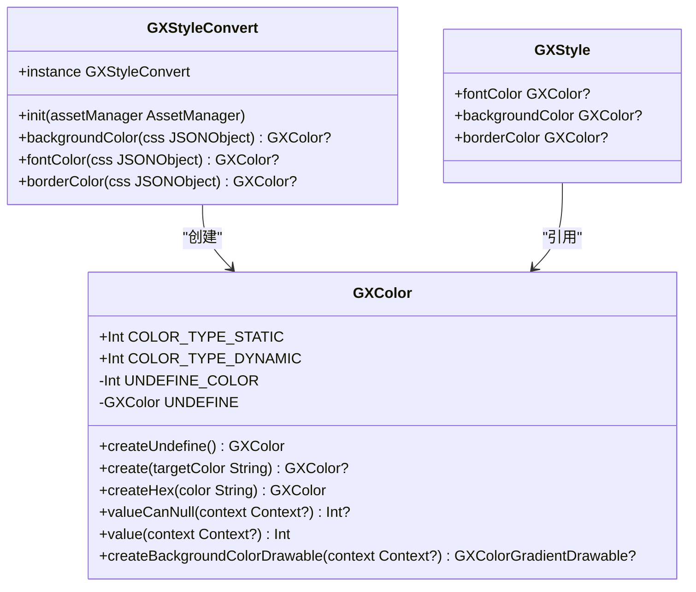
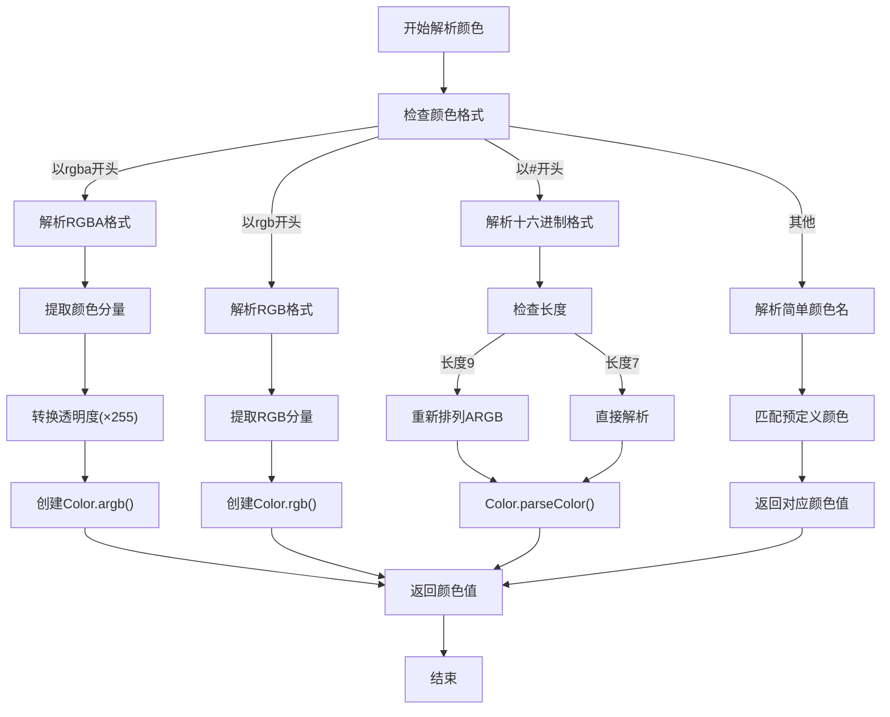
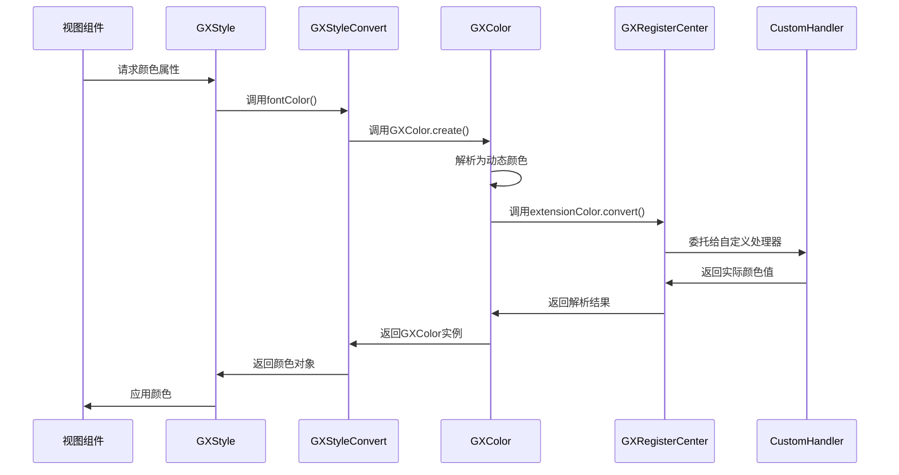
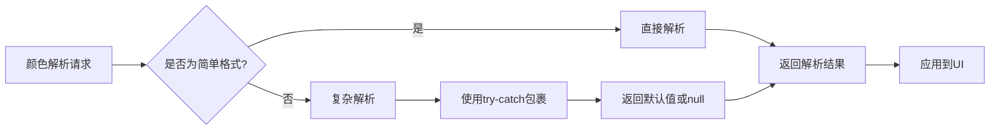

# 颜色系统

<cite>
**本文档引用文件**   
- [GXColor.kt](file://GaiaXAndroid/src/main/kotlin/com/alibaba/gaiax/template/GXColor.kt)
- [GXStyleConvert.kt](file://GaiaXAndroid/src/main/kotlin/com/alibaba/gaiax/template/GXStyleConvert.kt)
- [GXStyle.kt](file://GaiaXAndroid/src/main/kotlin/com/alibaba/gaiax/template/GXStyle.kt)
- [GXLinearColor.kt](file://GaiaXAndroid/src/main/kotlin/com/alibaba/gaiax/template/GXLinearColor.kt)
- [GXColorTest.kt](file://GaiaXAndroid/src/androidTest/java/com/alibaba/gaiax/template/GXColorTest.kt)
- [GXStyleConvertTest.kt](file://GaiaXAndroid/src/androidTest/java/com/alibaba/gaiax/template/GXStyleConvertTest.kt)
</cite>

## 目录
1. [简介](#简介)
2. [核心组件](#核心组件)
3. [颜色解析机制](#颜色解析机制)
4. [主题色与动态换肤](#主题色与动态换肤)
5. [透明度与渐变色支持](#透明度与渐变色支持)
6. [夜间模式与性能优化](#夜间模式与性能优化)
7. [实际应用示例](#实际应用示例)
8. [总结](#总结)

## 简介
GaiaX Android的颜色系统为开发者提供了强大且灵活的颜色处理能力，支持多种颜色格式的解析、主题色管理以及动态换肤功能。本系统通过`GXColor`类和`GXStyleConvert`工具类协同工作，实现了从字符串到Android原生颜色值的高效转换。系统支持十六进制、RGB、RGBA等标准颜色格式，并扩展了对主题色、渐变色和透明度的处理能力，为构建现代化的UI界面提供了坚实基础。

**Section sources**
- [GXColor.kt](file://GaiaXAndroid/src/main/kotlin/com/alibaba/gaiax/template/GXColor.kt#L1-L187)
- [GXStyleConvert.kt](file://GaiaXAndroid/src/main/kotlin/com/alibaba/gaiax/template/GXStyleConvert.kt#L1-L508)

## 核心组件

### GXColor类
`GXColor`是颜色系统的核心包装类，负责将各种颜色格式转换为Android可识别的颜色值。该类通过私有构造函数创建实例，区分静态颜色（`COLOR_TYPE_STATIC`）和动态颜色（`COLOR_TYPE_DYNAMIC`）两种类型。静态颜色直接存储解析后的整型颜色值，而动态颜色则存储颜色标识符，通过扩展机制在运行时解析。



**Diagram sources **
- [GXColor.kt](file://GaiaXAndroid/src/main/kotlin/com/alibaba/gaiax/template/GXColor.kt#L29-L187)
- [GXStyleConvert.kt](file://GaiaXAndroid/src/main/kotlin/com/alibaba/gaiax/template/GXStyleConvert.kt#L40-L508)
- [GXStyle.kt](file://GaiaXAndroid/src/main/kotlin/com/alibaba/gaiax/template/GXStyle.kt#L1-L567)

### GXStyleConvert类
`GXStyleConvert`是样式转换工具类，负责将CSS样式的JSON配置转换为Android可用的样式对象。该类通过单例模式提供全局访问点，包含多个静态方法用于解析不同类型的样式属性。在颜色处理方面，它提供了`backgroundColor`、`fontColor`和`borderColor`等方法，这些方法最终都调用`GXColor.create()`来完成颜色解析。

**Section sources**
- [GXColor.kt](file://GaiaXAndroid/src/main/kotlin/com/alibaba/gaiax/template/GXColor.kt#L29-L187)
- [GXStyleConvert.kt](file://GaiaXAndroid/src/main/kotlin/com/alibaba/gaiax/template/GXStyleConvert.kt#L40-L508)

## 颜色解析机制

### 十六进制颜色解析
系统支持标准的十六进制颜色格式，包括6位（#RRGGBB）和8位（#AARRGGBB）表示法。解析过程首先检查字符串是否以"#"开头，然后根据长度进行不同的处理。对于8位格式，系统会重新排列颜色通道，将ARGB格式转换为Android标准的ARGB格式。

```kotlin
private fun parseHexColor(color: String): Int? {
    if (color.startsWith("#")) {
        return if (color.length == 9) {
            val alpha = color.substring(7, color.length)
            val rgb = color.substring(1, color.length - 2)
            val argb = "#$alpha$rgb"
            Color.parseColor(argb)
        } else {
            Color.parseColor(color)
        }
    }
    return null
}
```

### RGB/RGBA颜色解析
对于RGB和RGBA格式的颜色，系统通过正则表达式提取颜色分量。RGB格式包含三个分量（红、绿、蓝），而RGBA格式额外包含一个透明度分量。透明度值在0.0到1.0之间，系统会将其乘以255转换为0-255的整数范围。



**Diagram sources **
- [GXColor.kt](file://GaiaXAndroid/src/main/kotlin/com/alibaba/gaiax/template/GXColor.kt#L94-L129)
- [GXColor.kt](file://GaiaXAndroid/src/main/kotlin/com/alibaba/gaiax/template/GXColor.kt#L169-L183)

### 颜色格式优先级
系统在解析颜色时遵循特定的优先级顺序：首先尝试解析十六进制格式，然后是RGBA、RGB，最后是简单颜色名。这种设计确保了对标准CSS颜色格式的兼容性，同时提供了扩展能力。

**Section sources**
- [GXColor.kt](file://GaiaXAndroid/src/main/kotlin/com/alibaba/gaiax/template/GXColor.kt#L70-L85)

## 主题色与动态换肤

### 动态颜色处理
系统通过`COLOR_TYPE_DYNAMIC`类型支持动态颜色，允许开发者定义主题色。动态颜色不直接存储颜色值，而是存储颜色标识符，在运行时通过`GXRegisterCenter`的扩展机制解析。这种方式实现了主题色的动态切换和换肤功能。

```kotlin
fun create(targetColor: String): GXColor? {
    var color = targetColor.trim()
    // ... 其他解析逻辑
    parseExtendColor(color)?.let {
        return GXColor(COLOR_TYPE_DYNAMIC, it)
    }
    return null
}
```

### 主题色管理
主题色通过`GXRegisterCenter.instance.extensionColor`接口进行管理。开发者可以注册自定义的颜色解析器，实现从颜色标识符到实际颜色值的映射。这种设计模式使得主题色管理完全可扩展，支持从远程服务器加载主题、根据用户偏好选择主题等高级功能。



**Diagram sources **
- [GXColor.kt](file://GaiaXAndroid/src/main/kotlin/com/alibaba/gaiax/template/GXColor.kt#L31-L37)
- [GXStyleConvert.kt](file://GaiaXAndroid/src/main/kotlin/com/alibaba/gaiax/template/GXStyleConvert.kt#L270-L275)

## 透明度与渐变色支持

### 透明度处理
系统通过RGBA格式的第四个分量（Alpha通道）处理透明度。透明度值在0.0（完全透明）到1.0（完全不透明）之间，系统会将其线性映射到0-255的整数范围。此外，系统还支持通过`STYLE_OPACITY`样式属性设置整体视图的透明度。

### 渐变色支持
系统通过`GXLinearColor`类支持线性渐变色。渐变色的解析分为三个步骤：首先提取渐变方向，然后解析颜色停止点，最后创建渐变着色器。系统支持多种方向关键字，如"to right"、"to bottom"等，并能正确映射到Android的`GradientDrawable.Orientation`。

```kotlin
fun getLinearGradient(linear: String): List<String> {
    val result = mutableListOf<String>()
    try {
        val substring = linear.substring(linear.indexOf("(") + 1, linear.lastIndexOf(")"))
        when {
            substring.contains("rgba") -> {
                substring.split("rgba").forEachIndexed { index, s ->
                    var content = s.trim()
                    if (content.endsWith(",")) {
                        content = content.substring(0, content.length - 1)
                    }
                    if (index > 0) {
                        result.add("rgba$content")
                    } else {
                        result.add(content)
                    }
                }
            }
            // ... 其他格式处理
        }
    } catch (e: Exception) {
        e.printStackTrace()
    }
    return result
}
```

**Section sources**
- [GXStyleConvert.kt](file://GaiaXAndroid/src/main/kotlin/com/alibaba/gaiax/template/GXStyleConvert.kt#L416-L456)
- [GXLinearColor.kt](file://GaiaXAndroid/src/main/kotlin/com/alibaba/gaiax/template/GXLinearColor.kt#L1-L71)

## 夜间模式与性能优化

### 夜间模式支持
系统通过`GXDarkUtils`工具类检测当前是否为夜间模式。虽然核心颜色系统本身不直接处理夜间模式切换，但其设计为夜间模式提供了良好的支持基础。开发者可以通过动态颜色机制，在夜间模式下返回不同的颜色值，实现自动的主题切换。

### 性能优化策略
1. **缓存机制**：`GXStyleConvert`使用单例模式，避免了重复创建实例的开销。
2. **懒加载**：实例通过`lazy`委托创建，确保在首次使用时才初始化。
3. **批量处理**：颜色解析方法设计为可批量处理，减少重复解析的开销。
4. **异常处理**：在解析复杂格式（如渐变色）时使用try-catch包裹，防止解析错误影响整体流程。



**Diagram sources **
- [GXStyleConvert.kt](file://GaiaXAndroid/src/main/kotlin/com/alibaba/gaiax/template/GXStyleConvert.kt#L50-L53)
- [GXStyleConvert.kt](file://GaiaXAndroid/src/main/kotlin/com/alibaba/gaiax/template/GXStyleConvert.kt#L453-L455)

## 实际应用示例

### 基础颜色使用
```kotlin
// 创建十六进制颜色
val hexColor = GXColor.create("#FF0000")

// 创建RGBA颜色
val rgbaColor = GXColor.create("rgba(255,0,0,0.5)")

// 创建简单颜色
val redColor = GXColor.create("RED")
```

### 渐变色应用
```kotlin
// 创建线性渐变
val gradient = "linear-gradient(to right, #FF0000, #00FF00)"
val linearColor = GXStyleConvert.instance.backgroundImage(gradient)

// 应用到视图
view.background = linearColor?.createDrawable(context)
```

### 动态换肤实现
```kotlin
// 注册自定义颜色解析器
GXRegisterCenter.instance.extensionColor = object : GXIExtensionColor {
    override fun convert(context: Context?, color: String): Int? {
        return when (color) {
            "primary_color" -> if (isDarkMode(context)) {
                Color.parseColor("#BB86FC")
            } else {
                Color.parseColor("#6200EE")
            }
            else -> null
        }
    }
}

// 使用主题色
val themeColor = GXColor.create("primary_color")
```

**Section sources**
- [GXColorTest.kt](file://GaiaXAndroid/src/androidTest/java/com/alibaba/gaiax/template/GXColorTest.kt#L1-L61)
- [GXStyleConvertTest.kt](file://GaiaXAndroid/src/androidTest/java/com/alibaba/gaiax/template/GXStyleConvertTest.kt#L1-L717)

## 总结
GaiaX Android的颜色系统通过`GXColor`和`GXStyleConvert`两个核心类，构建了一个完整且灵活的颜色处理框架。系统不仅支持标准的CSS颜色格式，还通过动态颜色机制实现了强大的主题管理和换肤能力。渐变色支持和透明度处理使得UI设计更加丰富多样。系统的模块化设计和扩展接口为开发者提供了充分的自定义空间，同时保持了良好的性能表现。对于初学者，系统提供了简单直观的API；对于高级开发者，则开放了底层机制以实现复杂的定制需求。

**Section sources**
- [GXColor.kt](file://GaiaXAndroid/src/main/kotlin/com/alibaba/gaiax/template/GXColor.kt#L1-L187)
- [GXStyleConvert.kt](file://GaiaXAndroid/src/main/kotlin/com/alibaba/gaiax/template/GXStyleConvert.kt#L1-L508)