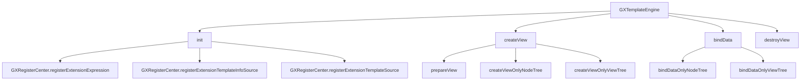
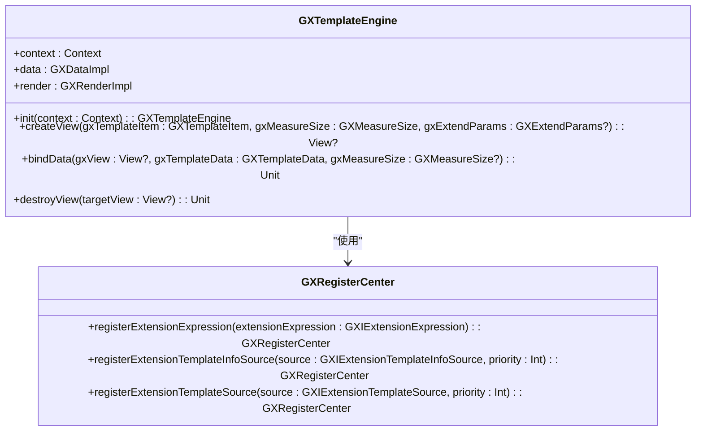
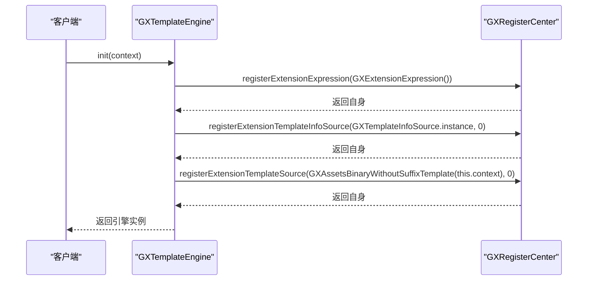
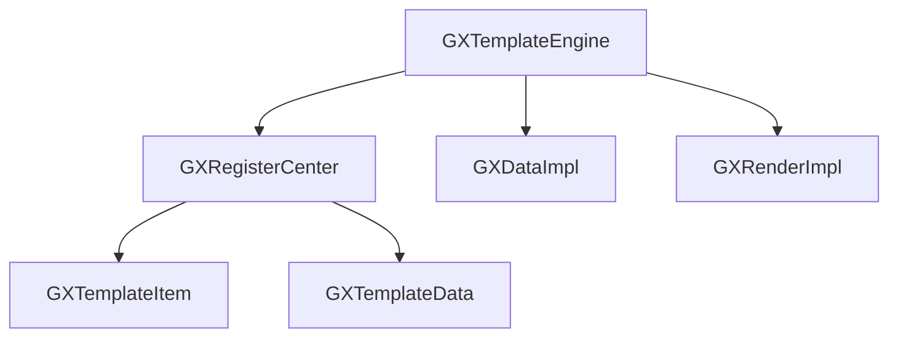

# 核心引擎

<cite>
**本文档引用文件**   
- [GXTemplateEngine.kt](file://GaiaXAndroid/src/main/kotlin/com/alibaba/gaiax/GXTemplateEngine.kt)
- [GXRegisterCenter.kt](file://GaiaXAndroid/src/main/kotlin/com/alibaba/gaiax/GXRegisterCenter.kt)
- [GXTemplateContext.kt](file://GaiaXAndroid/src/main/kotlin/com/alibaba/gaiax/context/GXTemplateContext.kt)
- [GXExceptionHelper.kt](file://GaiaXAndroid/src/main/kotlin/com/alibaba/gaiax/utils/GXExceptionHelper.kt)
- [Log.kt](file://GaiaXAndroid/src/main/kotlin/com/alibaba/gaiax/utils/Log.kt)
- [GXPropUtils.kt](file://GaiaXAndroid/src/main/kotlin/com/alibaba/gaiax/utils/GXPropUtils.kt)
</cite>

## 目录
1. [简介](#简介)
2. [项目结构](#项目结构)
3. [核心组件](#核心组件)
4. [架构概述](#架构概述)
5. [详细组件分析](#详细组件分析)
6. [依赖分析](#依赖分析)
7. [性能考虑](#性能考虑)
8. [故障排除指南](#故障排除指南)
9. [结论](#结论)

## 简介
GaiaX 是阿里巴巴优酷技术团队开发的轻量级纯原生动态卡片跨平台解决方案。其核心引擎 `GXTemplateEngine` 作为系统主入口，协调模板解析、数据绑定和视图渲染等核心组件，旨在保证原生体验和性能的同时，帮助客户端实现低代码开发。本文档将深入剖析 `GXTemplateEngine` 的架构设计与实现机制。

## 项目结构
项目结构清晰地展示了 GaiaX 的模块化设计，包括 Android、iOS、Harmony 等多个平台的实现，以及分析、适配、JS 引擎等辅助模块。核心引擎 `GXTemplateEngine` 位于 `GaiaXAndroid/src/main/kotlin/com/alibaba/gaiax/` 目录下。

## 核心组件
`GXTemplateEngine` 类是 GaiaX 动态模板引擎的核心，负责模板的创建、数据绑定和视图管理。`GXRegisterCenter` 类则提供了扩展注册机制，允许注册自定义组件、事件处理器和适配器。

**本文档引用文件**   
- [GXTemplateEngine.kt](file://GaiaXAndroid/src/main/kotlin/com/alibaba/gaiax/GXTemplateEngine.kt)
- [GXRegisterCenter.kt](file://GaiaXAndroid/src/main/kotlin/com/alibaba/gaiax/GXRegisterCenter.kt)

## 架构概述
`GXTemplateEngine` 采用单例模式，通过 `instance` 属性提供全局唯一的实例。它通过 `init` 方法进行初始化，注册必要的扩展和数据源。模板的创建和数据绑定分为两个阶段：`createViewOnlyNodeTree` 和 `createViewOnlyViewTree`，分别负责节点树和视图树的创建。

**图表来源**
- [GXTemplateEngine.kt](file://GaiaXAndroid/src/main/kotlin/com/alibaba/gaiax/GXTemplateEngine.kt#L889-L914)

## 详细组件分析

### GXTemplateEngine 分析
`GXTemplateEngine` 类通过 `init` 方法初始化上下文和注册中心，确保引擎的正常运行。`createView` 方法负责创建模板视图，`bindData` 方法负责绑定数据，`destroyView` 方法负责销毁视图。

#### 类图

**图表来源**
- [GXTemplateEngine.kt](file://GaiaXAndroid/src/main/kotlin/com/alibaba/gaiax/GXTemplateEngine.kt#L889-L914)
- [GXRegisterCenter.kt](file://GaiaXAndroid/src/main/kotlin/com/alibaba/gaiax/GXRegisterCenter.kt#L392-L395)

### GXRegisterCenter 分析
`GXRegisterCenter` 类提供了扩展注册机制，允许注册自定义组件、事件处理器和适配器。通过 `registerExtensionExpression`、`registerExtensionTemplateInfoSource` 和 `registerExtensionTemplateSource` 方法，可以注册表达式解析、模板信息源和模板源。

#### 序列图

**图表来源**
- [GXTemplateEngine.kt](file://GaiaXAndroid/src/main/kotlin/com/alibaba/gaiax/GXTemplateEngine.kt#L893-L899)
- [GXRegisterCenter.kt](file://GaiaXAndroid/src/main/kotlin/com/alibaba/gaiax/GXRegisterCenter.kt#L370-L374)

## 依赖分析
`GXTemplateEngine` 依赖于 `GXRegisterCenter` 进行扩展注册，依赖于 `GXDataImpl` 和 `GXRenderImpl` 进行数据处理和视图渲染。`GXRegisterCenter` 依赖于 `GXTemplateEngine` 的 `GXTemplateItem` 和 `GXTemplateData` 类。

**图表来源**
- [GXTemplateEngine.kt](file://GaiaXAndroid/src/main/kotlin/com/alibaba/gaiax/GXTemplateEngine.kt#L493-L499)
- [GXRegisterCenter.kt](file://GaiaXAndroid/src/main/kotlin/com/alibaba/gaiax/GXRegisterCenter.kt#L370-L374)

## 性能考虑
`GXTemplateEngine` 通过缓存机制和懒加载优化性能。`GXGlobalCache` 用于缓存布局结果，`lazy` 属性用于延迟初始化 `data` 和 `render` 实例。此外，`GXPropUtils.isTrace()` 方法用于控制调试日志的输出，减少不必要的性能开销。

**本文档引用文件**   
- [GXTemplateEngine.kt](file://GaiaXAndroid/src/main/kotlin/com/alibaba/gaiax/GXTemplateEngine.kt)
- [GXPropUtils.kt](file://GaiaXAndroid/src/main/kotlin/com/alibaba/gaiax/utils/GXPropUtils.kt)

## 故障排除指南
当遇到模板创建失败或数据绑定异常时，首先检查 `GXTemplateEngine` 是否已正确初始化。确保 `GXRegisterCenter` 已注册必要的扩展。查看日志输出，特别是 `GXExceptionHelper` 抛出的异常，可以帮助定位问题。

**本文档引用文件**   
- [GXTemplateEngine.kt](file://GaiaXAndroid/src/main/kotlin/com/alibaba/gaiax/GXTemplateEngine.kt)
- [GXExceptionHelper.kt](file://GaiaXAndroid/src/main/kotlin/com/alibaba/gaiax/utils/GXExceptionHelper.kt)
- [Log.kt](file://GaiaXAndroid/src/main/kotlin/com/alibaba/gaiax/utils/Log.kt)

## 结论
`GXTemplateEngine` 作为 GaiaX 核心引擎，通过单例模式和扩展注册机制，实现了高效、灵活的模板解析、数据绑定和视图渲染。其模块化设计和丰富的扩展点，使得开发者可以轻松地集成和定制功能，满足不同场景的需求。