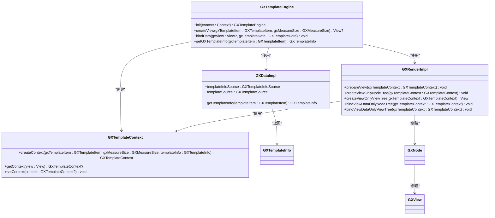
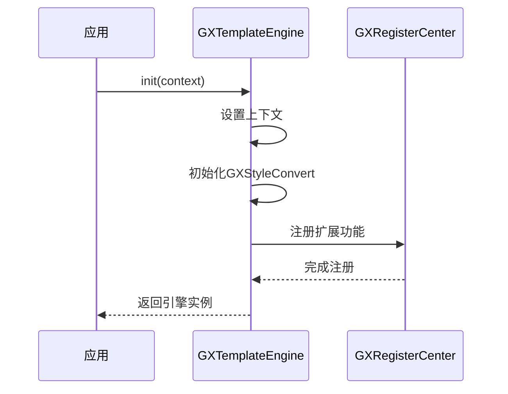
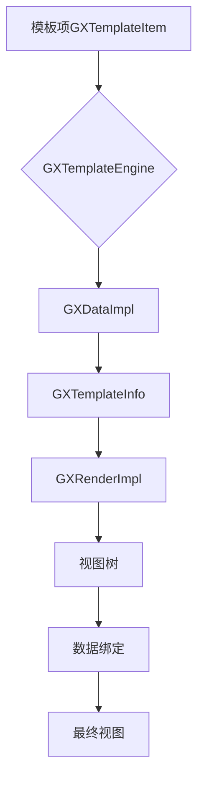
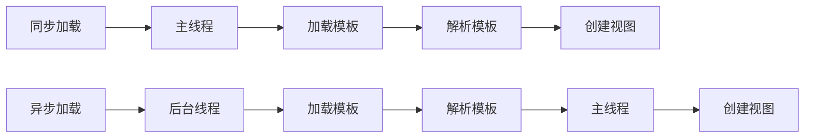

# 模板引擎

<cite>
**Referenced Files in This Document**   
- [GXTemplateEngine.kt](file://GaiaXAndroid/src/main/kotlin/com/alibaba/gaiax/GXTemplateEngine.kt)
- [GXTemplateInfo.kt](file://GaiaXAndroid/src/main/kotlin/com/alibaba/gaiax/template/GXTemplateInfo.kt)
- [GXLayer.kt](file://GaiaXAndroid/src/main/kotlin/com/alibaba/gaiax/template/GXLayer.kt)
- [GXTemplate.kt](file://GaiaXAndroid/src/main/kotlin/com/alibaba/gaiax/template/GXTemplate.kt)
- [GXDataImpl.kt](file://GaiaXAndroid/src/main/kotlin/com/alibaba/gaiax/data/GXDataImpl.kt)
- [GXRenderImpl.kt](file://GaiaXAndroid/src/main/kotlin/com/alibaba/gaiax/render/GXRenderImpl.kt)
</cite>

## 目录
1. [引言](#引言)
2. [架构设计与实现机制](#架构设计与实现机制)
3. [初始化流程与单例模式](#初始化流程与单例模式)
4. [核心组件协调机制](#核心组件协调机制)
5. [模板生命周期管理](#模板生命周期管理)
6. [同步与异步加载模式](#同步与异步加载模式)
7. [开发者使用指南](#开发者使用指南)
8. [高级特性与最佳实践](#高级特性与最佳实践)
9. [总结](#总结)

## 引言
GaiaX Android模板引擎是一个轻量级的跨平台纯原生动态卡片解决方案，旨在保证原生体验和性能的同时，帮助客户端实现低代码开发。该引擎以GXTemplateEngine类为核心，作为系统的主入口，协调模板解析、数据绑定和视图渲染等核心组件，实现动态模板的高效加载与展示。本文档将深入解析GXTemplateEngine的架构设计与实现机制，为开发者提供全面的技术指导。

## 架构设计与实现机制
GXTemplateEngine类作为GaiaX模板引擎的核心，采用模块化设计，通过内部组件的协作实现模板的完整生命周期管理。其架构设计主要包括以下几个关键部分：

- **数据管理组件**：通过GXDataImpl类实现，负责模板信息的获取与缓存，包括模板的层级结构、样式、数据绑定等。
- **渲染管理组件**：通过GXRenderImpl类实现，负责视图的创建、布局计算和数据绑定，确保模板的正确渲染。
- **上下文管理**：通过GXTemplateContext类实现，封装了模板的上下文信息，包括模板项、测量尺寸、模板信息等，为渲染过程提供必要的数据支持。



**Diagram sources**
- [GXTemplateEngine.kt](file://GaiaXAndroid/src/main/kotlin/com/alibaba/gaiax/GXTemplateEngine.kt#L77-L927)
- [GXDataImpl.kt](file://GaiaXAndroid/src/main/kotlin/com/alibaba/gaiax/data/GXDataImpl.kt#L1-L44)
- [GXRenderImpl.kt](file://GaiaXAndroid/src/main/kotlin/com/alibaba/gaiax/render/GXRenderImpl.kt)

**Section sources**
- [GXTemplateEngine.kt](file://GaiaXAndroid/src/main/kotlin/com/alibaba/gaiax/GXTemplateEngine.kt#L77-L927)
- [GXDataImpl.kt](file://GaiaXAndroid/src/main/kotlin/com/alibaba/gaiax/data/GXDataImpl.kt#L1-L44)
- [GXRenderImpl.kt](file://GaiaXAndroid/src/main/kotlin/com/alibaba/gaiax/render/GXRenderImpl.kt)

## 初始化流程与单例模式
GXTemplateEngine的初始化流程是引擎正常工作的前提，通过`init`方法完成。该方法接收一个Android Context对象，用于初始化引擎所需的资源和配置。初始化过程中，引擎会注册扩展功能，如表达式解析、模板信息源和模板源，确保引擎具备完整的功能。



**Diagram sources**
- [GXTemplateEngine.kt](file://GaiaXAndroid/src/main/kotlin/com/alibaba/gaiax/GXTemplateEngine.kt#L889-L905)

**Section sources**
- [GXTemplateEngine.kt](file://GaiaXAndroid/src/main/kotlin/com/alibaba/gaiax/GXTemplateEngine.kt#L889-L905)

## 核心组件协调机制
GXTemplateEngine作为系统主入口，通过协调模板解析、数据绑定和视图渲染等核心组件，实现模板的完整生命周期管理。其协调机制主要体现在以下几个方面：

- **模板解析**：通过GXDataImpl组件获取模板信息，包括层级结构、样式、数据绑定等，为后续的渲染提供数据支持。
- **视图创建**：通过GXRenderImpl组件创建视图树，根据模板的层级结构和样式信息，生成相应的视图节点。
- **数据绑定**：通过GXRenderImpl组件将数据绑定到视图上，确保模板的动态内容能够正确显示。



**Diagram sources**
- [GXTemplateEngine.kt](file://GaiaXAndroid/src/main/kotlin/com/alibaba/gaiax/GXTemplateEngine.kt#L557-L582)
- [GXDataImpl.kt](file://GaiaXAndroid/src/main/kotlin/com/alibaba/gaiax/data/GXDataImpl.kt#L1-L44)
- [GXRenderImpl.kt](file://GaiaXAndroid/src/main/kotlin/com/alibaba/gaiax/render/GXRenderImpl.kt)

**Section sources**
- [GXTemplateEngine.kt](file://GaiaXAndroid/src/main/kotlin/com/alibaba/gaiax/GXTemplateEngine.kt#L557-L582)
- [GXDataImpl.kt](file://GaiaXAndroid/src/main/kotlin/com/alibaba/gaiax/data/GXDataImpl.kt#L1-L44)
- [GXRenderImpl.kt](file://GaiaXAndroid/src/main/kotlin/com/alibaba/gaiax/render/GXRenderImpl.kt)

## 模板生命周期管理
模板的生命周期管理是GXTemplateEngine的核心功能之一，涵盖了模板的加载、解析、缓存和销毁等环节。通过合理的生命周期管理，可以有效提升模板的加载效率和用户体验。

- **模板加载**：通过GXTemplateSource接口从指定的数据源（如Assets、网络等）加载模板数据。
- **模板解析**：将加载的模板数据解析为GXTemplateInfo对象，包含模板的层级结构、样式、数据绑定等信息。
- **模板缓存**：将解析后的模板信息缓存到内存中，避免重复解析，提高加载速度。
- **模板销毁**：在模板不再使用时，释放相关资源，防止内存泄漏。


**Diagram sources**
- [GXTemplateEngine.kt](file://GaiaXAndroid/src/main/kotlin/com/alibaba/gaiax/GXTemplateEngine.kt#L545-L547)
- [GXTemplateInfo.kt](file://GaiaXAndroid/src/main/kotlin/com/alibaba/gaiax/template/GXTemplateInfo.kt#L31-L415)

**Section sources**
- [GXTemplateEngine.kt](file://GaiaXAndroid/src/main/kotlin/com/alibaba/gaiax/GXTemplateEngine.kt#L545-L547)
- [GXTemplateInfo.kt](file://GaiaXAndroid/src/main/kotlin/com/alibaba/gaiax/template/GXTemplateInfo.kt#L31-L415)

## 同步与异步加载模式
GXTemplateEngine支持同步和异步两种加载模式，以适应不同的使用场景和性能需求。

- **同步加载**：在主线程中直接加载和解析模板，适用于简单的模板或对性能要求不高的场景。同步加载的优点是实现简单，但可能会阻塞主线程，影响用户体验。
- **异步加载**：在后台线程中加载和解析模板，完成后在主线程中创建视图。异步加载的优点是不阻塞主线程，用户体验更好，适用于复杂的模板或对性能要求较高的场景。



**Diagram sources**
- [GXTemplateEngine.kt](file://GaiaXAndroid/src/main/kotlin/com/alibaba/gaiax/GXTemplateEngine.kt#L557-L582)

**Section sources**
- [GXTemplateEngine.kt](file://GaiaXAndroid/src/main/kotlin/com/alibaba/gaiax/GXTemplateEngine.kt#L557-L582)

## 开发者使用指南
为帮助开发者快速上手GaiaX模板引擎，以下提供引擎初始化和基本调用的代码示例。

### 初学者示例
```kotlin
// 初始化GXTemplateEngine
GXTemplateEngine.instance.init(activity)

// 构建模板参数
val params = GXTemplateEngine.GXTemplateItem(activity, "template biz", "template id")

// 构建测量尺寸
val size = GXTemplateEngine.GXMeasureSize(screenWidth, null)

// 构建模板数据
val templateData = GXTemplateEngine.GXTemplateData(jsonData)

// 创建视图
val view = GXTemplateEngine.instance.createView(params, size)

// 更新数据
GXTemplateEngine.instance.bindData(view, templateData)

// 注入视图到容器
findViewById<LinearLayoutCompat>(R.id.xxx).addView(view, 0)
```

**Section sources**
- [GXTemplateEngine.kt](file://GaiaXAndroid/src/main/kotlin/com/alibaba/gaiax/GXTemplateEngine.kt#L63-L76)

## 高级特性与最佳实践
### 线程管理
GXTemplateEngine在异步加载模式下，通过后台线程处理模板的加载和解析，避免阻塞主线程。开发者应合理使用异步加载，确保应用的流畅性。

### 资源缓存策略
引擎通过GXGlobalCache和GXTemplateInfoSource实现模板信息的缓存，减少重复解析的开销。开发者应根据实际需求，合理配置缓存策略，平衡内存使用和性能。

### 性能优化技巧
- **预加载**：在应用启动时预加载常用模板，减少用户等待时间。
- **多实例管理**：对于不同的业务场景，可以创建多个GXTemplateEngine实例，避免资源竞争。
- **模板复用**：对于相似的模板，可以通过修改数据实现复用，减少模板的创建开销。

### 与GXTemplateInfo、GXLayer的交互
GXTemplateInfo和GXLayer是模板信息的核心数据结构，GXTemplateEngine通过它们与模板的层级结构和样式信息进行交互。开发者可以通过GXTemplateInfo获取模板的详细信息，通过GXLayer操作模板的节点。

**Section sources**
- [GXTemplateEngine.kt](file://GaiaXAndroid/src/main/kotlin/com/alibaba/gaiax/GXTemplateEngine.kt)
- [GXTemplateInfo.kt](file://GaiaXAndroid/src/main/kotlin/com/alibaba/gaiax/template/GXTemplateInfo.kt)
- [GXLayer.kt](file://GaiaXAndroid/src/main/kotlin/com/alibaba/gaiax/template/GXLayer.kt)

## 总结
GXTemplateEngine作为GaiaX Android模板引擎的核心，通过模块化设计和高效的生命周期管理，实现了模板的快速加载与渲染。其单例模式的应用确保了引擎的全局唯一性，协调模板解析、数据绑定和视图渲染等核心组件，为开发者提供了强大的动态模板解决方案。通过合理使用同步与异步加载模式，结合资源缓存和性能优化技巧，可以显著提升应用的用户体验。