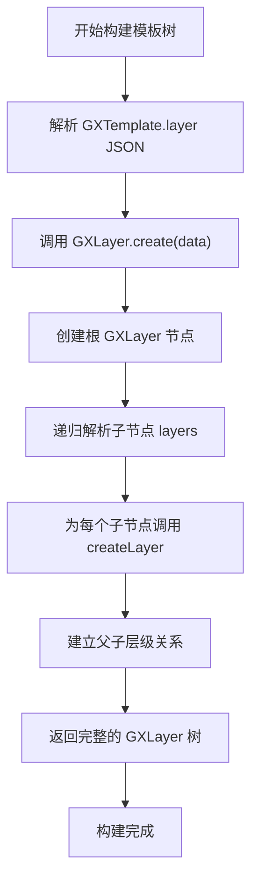
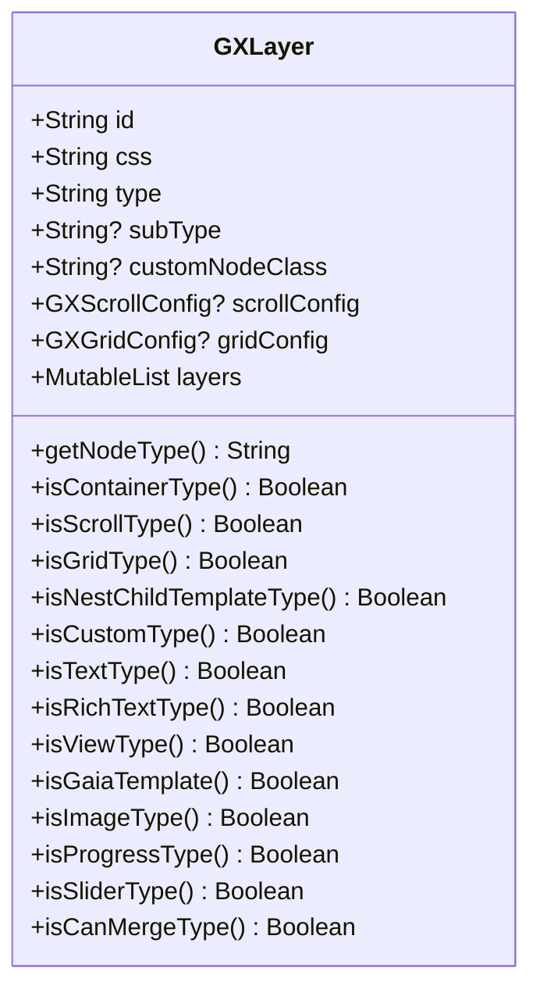
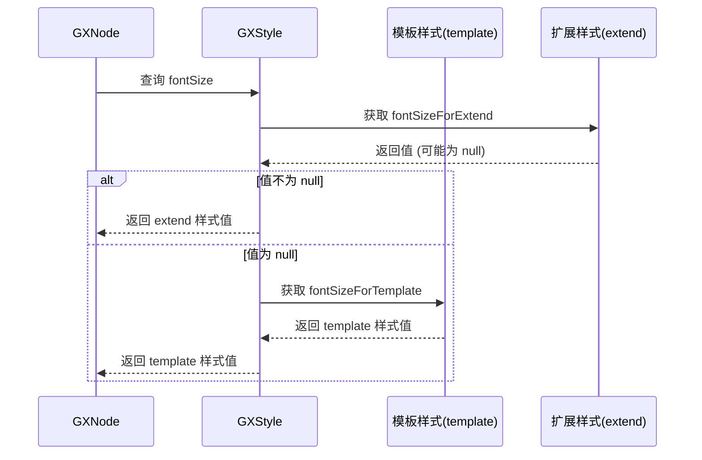
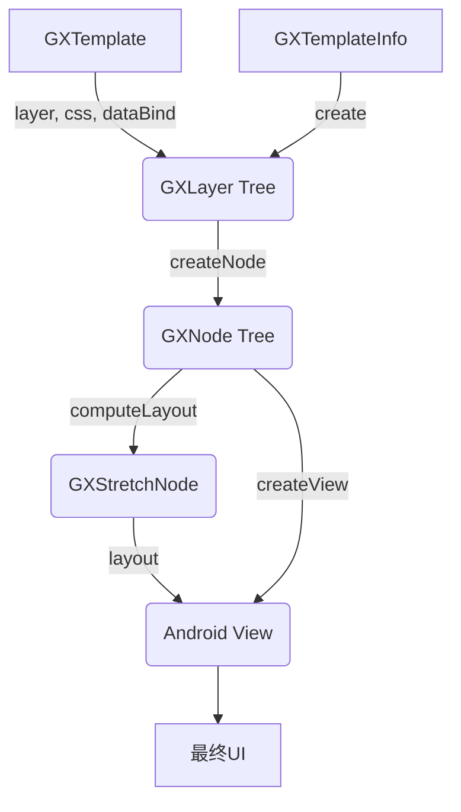

# 层级结构处理

<cite>
**本文档引用文件**  
- [GXLayer.kt](file://GaiaXAndroid/src/main/kotlin/com/alibaba/gaiax/template/GXLayer.kt)
- [GXTemplate.kt](file://GaiaXAndroid/src/main/kotlin/com/alibaba/gaiax/template/GXTemplate.kt)
- [GXStyle.kt](file://GaiaXAndroid/src/main/kotlin/com/alibaba/gaiax/template/GXStyle.kt)
</cite>

## 目录
1. [引言](#引言)
2. [核心数据结构分析](#核心数据结构分析)
3. [模板树构建与节点层级关系](#模板树构建与节点层级关系)
4. [样式继承与数据绑定传递](#样式继承与数据绑定传递)
5. [节点生命周期与动态操作](#节点生命周期与动态操作)
6. [视图渲染驱动机制](#视图渲染驱动机制)
7. [性能优化与最佳实践](#性能优化与最佳实践)
8. [调试技巧与常见问题](#调试技巧与常见问题)

## 引言
GaiaX 是一个跨平台的动态模板渲染引擎，其核心在于通过模板树（Template Tree）实现高效的 UI 构建与渲染。在 Android 平台中，`GXLayer` 类是构建模板树的基础单元，负责描述节点的层级信息、类型、样式及子节点结构。本文档深入解析 `GXLayer` 在模板树构建中的核心作用，阐述节点层级关系的维护机制、父子节点通信方式、样式继承与数据绑定的传递逻辑。为初学者提供层级遍历、节点查询的基础操作指南；为高级开发者剖析节点生命周期管理、动态节点插入与删除的实现细节、性能瓶颈及优化策略。结合 `GXTemplate` 和 `GXStyle` 说明层级结构如何驱动视图渲染，并提供复杂模板场景下的最佳实践与调试技巧。

## 核心数据结构分析

### GXLayer 节点层级信息
`GXLayer` 是 GaiaX 模板系统中的核心数据结构，用于描述模板中每个节点的完整信息。它是一个 Kotlin 数据类，包含了节点的 ID、类型、样式、配置以及子节点列表。

**Section sources**
- [GXLayer.kt](file://GaiaXAndroid/src/main/kotlin/com/alibaba/gaiax/template/GXLayer.kt#L28-L77)

### GXTemplate 模板定义
`GXTemplate` 类封装了整个模板的元数据，包括模板 ID、业务标识（biz）、版本号、以及模板的 JSON 层级结构（layer）、CSS 样式（css）、数据绑定（dataBind）和 JavaScript 代码（js）。

**Section sources**
- [GXTemplate.kt](file://GaiaXAndroid/src/main/kotlin/com/alibaba/gaiax/template/GXTemplate.kt#L22-L30)

### GXStyle 样式系统
`GXStyle` 类负责管理节点的样式信息，它支持模板定义的样式（template）和扩展样式（extend）的合并。样式属性包括字体、颜色、背景、边距、边框、圆角、透明度等，并通过 `updateByExtend` 方法实现运行时样式的动态更新。

**Section sources**
- [GXStyle.kt](file://GaiaXAndroid/src/main/kotlin/com/alibaba/gaiax/template/GXStyle.kt#L31-L563)

## 模板树构建与节点层级关系

### 模板树构建流程
模板树的构建始于 `GXTemplate` 的 `layer` 字段，该字段是一个 JSON 字符串，描述了整个模板的树形结构。解析过程由 `GXLayer.create(data: JSONObject)` 静态方法启动，该方法递归地解析 JSON 数据，为每个节点创建 `GXLayer` 实例，并建立父子关系。

**Diagram sources**
- [GXLayer.kt](file://GaiaXAndroid/src/main/kotlin/com/alibaba/gaiax/template/GXLayer.kt#L81-L94)

### 节点类型与分类
`GXLayer` 通过 `type` 和 `subType` 字段定义了丰富的节点类型，这些类型决定了节点的行为和渲染方式。

**Diagram sources**
- [GXLayer.kt](file://GaiaXAndroid/src/main/kotlin/com/alibaba/gaiax/template/GXLayer.kt#L28-L310)

### 父子节点通信机制
父子节点之间的通信主要通过 `GXNode`（运行时节点）对象实现。`GXNode` 持有对父节点 (`parentNode`) 和子节点列表 (`children`) 的引用，形成了双向链表结构。当需要向上或向下传递事件、数据或样式时，可以通过遍历这些引用来完成。

**Section sources**
- [GXNodeTreeCreator.kt](file://GaiaXAndroid/src/main/kotlin/com/alibaba/gaiax/render/node/GXNodeTreeCreator.kt#L52-L134)

## 样式继承与数据绑定传递

### 样式继承机制
`GXStyle` 的设计支持样式继承。每个 `GXLayer` 关联一个 `GXStyle`，该样式由两部分组成：`template` 样式（来自 CSS 文件）和 `extend` 样式（来自数据绑定或运行时更新）。当查询某个样式属性时，系统会优先返回 `extend` 样式中的值，如果不存在，则返回 `template` 样式中的值。

**Diagram sources**
- [GXStyle.kt](file://GaiaXAndroid/src/main/kotlin/com/alibaba/gaiax/template/GXStyle.kt#L112-L115)

### 数据绑定传递逻辑
数据绑定（Data Binding）是 GaiaX 实现动态化的核心。`GXTemplate` 中的 `dataBind` 字段包含了数据、事件、埋点等绑定规则。在渲染时，这些规则会与实际的数据源结合，生成最终的 `GXTemplateNode`，其中包含了 `css`、`data`、`event` 等绑定后的结果。`GXNode` 在创建时会持有 `GXTemplateNode`，从而获得其样式和数据。

**Section sources**
- [GXTemplateInfo.kt](file://GaiaXAndroid/src/main/kotlin/com/alibaba/gaiax/template/GXTemplateInfo.kt#L179-L248)

## 节点生命周期与动态操作

### 节点生命周期管理
`GXNode` 的生命周期贯穿于模板的准备（Prepare）、布局（Layout）、绑定（Bind）和渲染（Render）四个阶段。在 `GXNodeTreePrepare` 阶段创建节点并初始化 `stretchNode`（用于布局计算）；在 `GXNodeTreeUpdate` 阶段，根据数据更新节点的样式和内容。

**Section sources**
- [GXNodeTreePrepare.kt](file://GaiaXAndroid/src/main/kotlin/com/alibaba/gaiax/render/node/GXNodeTreePrepare.kt#L55-L139)
- [GXNodeTreeUpdate.kt](file://GaiaXAndroid/src/main/kotlin/com/alibaba/gaiax/render/node/GXNodeTreeUpdate.kt#L288-L383)

### 动态节点操作
虽然 `GXLayer` 本身是不可变的（immutable），但运行时的 `GXNode` 树是可变的。高级开发者可以通过操作 `GXNode` 的 `children` 列表来实现动态节点的插入与删除。例如，调用 `gxNode.children?.add(newChildNode)` 可以添加一个新节点，调用 `gxNode.children?.remove(childNode)` 可以移除一个节点。操作后，需要触发重新布局和渲染。

**Section sources**
- [GXNodeTreeCreator.kt](file://GaiaXAndroid/src/main/kotlin/com/alibaba/gaiax/render/node/GXNodeTreeCreator.kt#L52-L134)

## 视图渲染驱动机制

### 层级结构驱动视图渲染
`GXLayer` 定义的层级结构是视图渲染的蓝图。`GXTemplate` 提供了原始数据，`GXStyle` 提供了样式规则，`GXNodeTreeCreator` 将它们组合成一个可操作的 `GXNode` 树。`GXStretchNode` 负责根据 Flexbox 布局规则计算每个节点的位置和大小。最后，`GXViewCreator` 根据 `GXNode` 的类型和样式创建对应的 Android View，并将其添加到视图层级中。

**Diagram sources**
- [GXLayer.kt](file://GaiaXAndroid/src/main/kotlin/com/alibaba/gaiax/template/GXLayer.kt#L28-L77)
- [GXNodeTreeCreator.kt](file://GaiaXAndroid/src/main/kotlin/com/alibaba/gaiax/render/node/GXNodeTreeCreator.kt#L52-L134)

## 性能优化与最佳实践

### 性能瓶颈分析
1.  **JSON 解析**：`GXLayer.create()` 方法中的 JSON 解析是性能关键点，尤其是在处理大型模板时。
2.  **样式计算**：`GXStyle.updateByExtend()` 方法需要遍历所有 CSS 属性，频繁调用可能导致性能下降。
3.  **节点遍历**：在复杂的模板中，对 `GXNode` 树进行深度遍历（如查找节点）会消耗大量时间。

### 优化策略
1.  **缓存 `GXLayer` 树**：对于不经常变化的模板，可以将解析好的 `GXLayer` 树缓存起来，避免重复解析。
2.  **批量样式更新**：避免频繁调用 `updateByExtend`，尽量将多个样式变更合并为一次操作。
3.  **使用 ID 索引**：为 `GXNode` 树建立基于 ID 的哈希表索引，可以将 O(n) 的查找时间降低到 O(1)。

**Section sources**
- [GXLayer.kt](file://GaiaXAndroid/src/main/kotlin/com/alibaba/gaiax/template/GXLayer.kt#L81-L94)
- [GXStyle.kt](file://GaiaXAndroid/src/main/kotlin/com/alibaba/gaiax/template/GXStyle.kt#L272-L363)

## 调试技巧与常见问题

### 常见问题
1.  **节点未渲染**：检查 `GXLayer` 的 `type` 是否正确，以及 `layers` 列表是否为空。
2.  **样式不生效**：确认 `css` 字段是否正确加载，以及 `updateByExtend` 是否覆盖了预期的样式。
3.  **布局错乱**：检查 `GXStretchNode` 的布局参数是否正确设置，特别是 `flex` 相关属性。

### 调试技巧
1.  **日志输出**：利用 `GXLayer.toString()` 方法打印节点信息，快速定位问题节点。
2.  **断点调试**：在 `GXNodeTreeCreator.createNode()` 方法中设置断点，观察节点创建过程。
3.  **可视化工具**：使用 Android Studio 的 Layout Inspector 查看最终的 View 层级结构。

**Section sources**
- [GXLayer.kt](file://GaiaXAndroid/src/main/kotlin/com/alibaba/gaiax/template/GXLayer.kt#L307-L309)