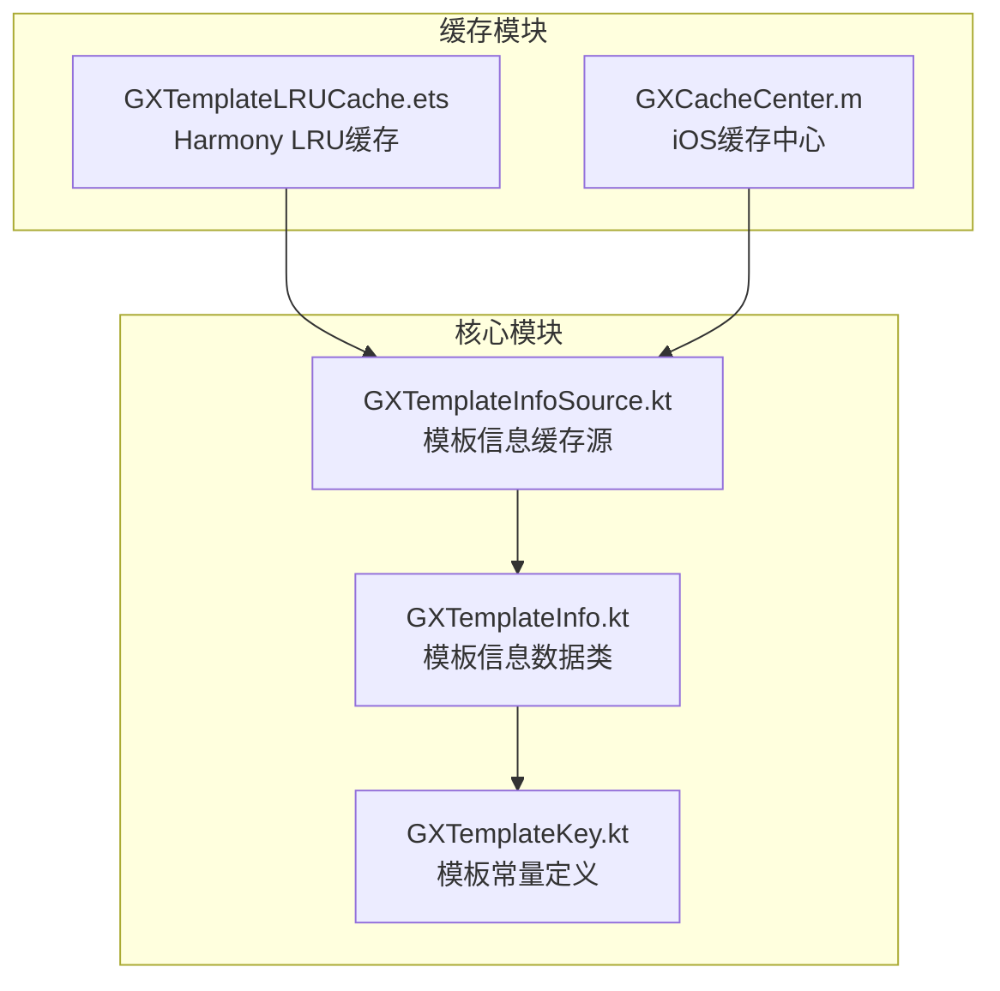
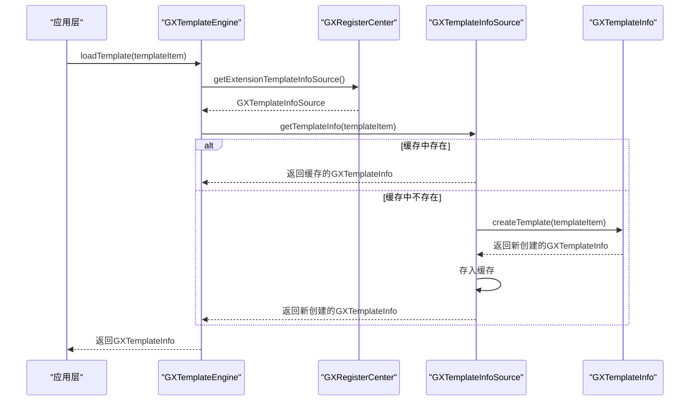
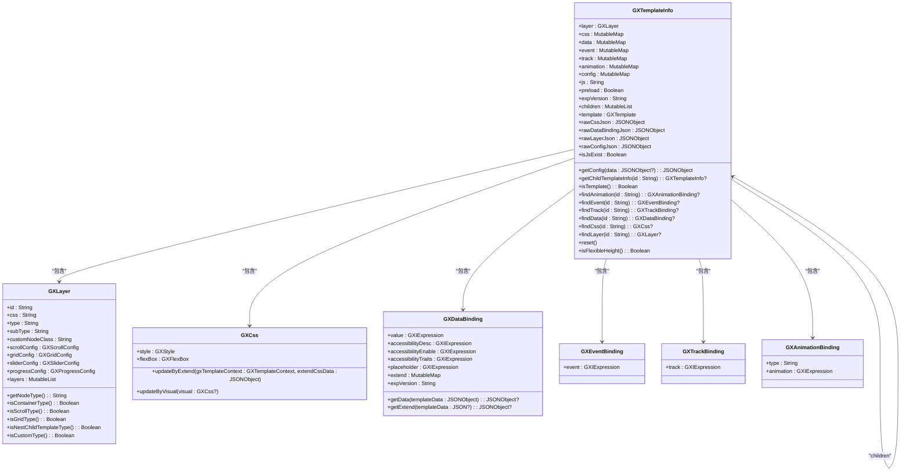
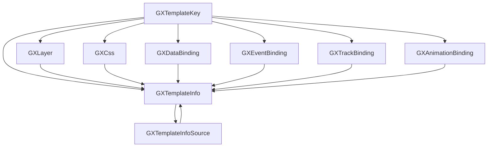

# 模板信息管理

<cite>
**本文档引用文件**   
- [GXTemplateInfo.kt](file://GaiaXAndroid/src/main/kotlin/com/alibaba/gaiax/template/GXTemplateInfo.kt)
- [GXTemplateKey.kt](file://GaiaXAndroid/src/main/kotlin/com/alibaba/gaiax/template/GXTemplateKey.kt)
- [GXTemplateInfoSource.kt](file://GaiaXAndroid/src/main/kotlin/com/alibaba/gaiax/data/cache/GXTemplateInfoSource.kt)
- [GXTemplateLRUCache.ets](file://GaiaXHarmony/GaiaXCore/GaiaX/src/main/ets/template/GXTemplateLRUCache.ets)
- [GXCacheCenter.m](file://GaiaXiOS/GaiaXiOS/Template/Cache/GXCacheCenter.m)
</cite>

## 目录
1. [简介](#简介)
2. [项目结构](#项目结构)
3. [核心组件](#核心组件)
4. [架构概述](#架构概述)
5. [详细组件分析](#详细组件分析)
6. [依赖分析](#依赖分析)
7. [性能考虑](#性能考虑)
8. [故障排除指南](#故障排除指南)
9. [结论](#结论)

## 简介
本文档详细介绍了GaiaX Android平台中模板信息管理的核心机制，重点分析了`GXTemplateInfo`和`GXTemplateKey`两个关键类的设计与实现。文档将深入探讨模板标识、版本控制、元数据存储以及模板缓存机制的工作原理。为初学者提供模板加载流程和模板信息提取的使用示例；为高级开发者深入剖析模板序列化、反序列化过程、缓存策略优化及内存管理机制。结合实际代码说明模板信息如何与模板解析器、缓存中心协同工作，并提供性能调优建议和常见问题排查方法。

## 项目结构
GaiaX项目是一个跨平台的模板渲染引擎，其Android部分的核心代码位于`GaiaXAndroid`模块中。模板信息管理相关的类主要分布在`template`包下，而缓存机制则分布在`data/cache`包中。`GXTemplateInfo`和`GXTemplateKey`是模板信息管理的核心数据结构，它们与`GXTemplateInfoSource`等缓存类协同工作，共同构成了模板信息的加载、解析和缓存体系。

**图表来源**
- [GXTemplateInfo.kt](file://GaiaXAndroid/src/main/kotlin/com/alibaba/gaiax/template/GXTemplateInfo.kt)
- [GXTemplateKey.kt](file://GaiaXAndroid/src/main/kotlin/com/alibaba/gaiax/template/GXTemplateKey.kt)
- [GXTemplateInfoSource.kt](file://GaiaXAndroid/src/main/kotlin/com/alibaba/gaiax/data/cache/GXTemplateInfoSource.kt)
- [GXTemplateLRUCache.ets](file://GaiaXHarmony/GaiaXCore/GaiaX/src/main/ets/template/GXTemplateLRUCache.ets)
- [GXCacheCenter.m](file://GaiaXiOS/GaiaXiOS/Template/Cache/GXCacheCenter.m)

**章节来源**
- [GXTemplateInfo.kt](file://GaiaXAndroid/src/main/kotlin/com/alibaba/gaiax/template/GXTemplateInfo.kt)
- [GXTemplateKey.kt](file://GaiaXAndroid/src/main/kotlin/com/alibaba/gaiax/template/GXTemplateKey.kt)

## 核心组件
`GXTemplateInfo`和`GXTemplateKey`是GaiaX模板系统中最核心的两个组件。`GXTemplateInfo`是一个数据类，它封装了从JSON模板文件解析出来的所有信息，包括层级结构、样式、数据绑定、事件、动画等。`GXTemplateKey`则是一个常量对象，它定义了所有在模板JSON中使用的键名，确保了代码与模板数据之间的一致性。

**章节来源**
- [GXTemplateInfo.kt](file://GaiaXAndroid/src/main/kotlin/com/alibaba/gaiax/template/GXTemplateInfo.kt)
- [GXTemplateKey.kt](file://GaiaXAndroid/src/main/kotlin/com/alibaba/gaiax/template/GXTemplateKey.kt)

## 架构概述
GaiaX的模板信息管理采用了一种分层的设计模式。最上层是`GXTemplateEngine`，它是开发者调用的入口。当请求加载一个模板时，`GXTemplateEngine`会通过`GXRegisterCenter`获取`GXIExtensionTemplateInfoSource`的实现，即`GXTemplateInfoSource`。`GXTemplateInfoSource`负责管理模板信息的缓存，并在缓存中不存在时，调用`GXTemplateInfo`的`createTemplate`方法来解析和创建新的`GXTemplateInfo`实例。

**图表来源**
- [GXTemplateInfo.kt](file://GaiaXAndroid/src/main/kotlin/com/alibaba/gaiax/template/GXTemplateInfo.kt)
- [GXTemplateInfoSource.kt](file://GaiaXAndroid/src/main/kotlin/com/alibaba/gaiax/data/cache/GXTemplateInfoSource.kt)

## 详细组件分析

### GXTemplateInfo 分析
`GXTemplateInfo`是整个模板信息的核心载体。它是一个Kotlin数据类，包含了模板的所有元数据。

#### 类图

**图表来源**
- [GXTemplateInfo.kt](file://GaiaXAndroid/src/main/kotlin/com/alibaba/gaiax/template/GXTemplateInfo.kt)
- [GXLayer.kt](file://GaiaXAndroid/src/main/kotlin/com/alibaba/gaiax/template/GXLayer.kt)
- [GXCss.kt](file://GaiaXAndroid/src/main/kotlin/com/alibaba/gaiax/template/GXCss.kt)
- [GXDataBinding.kt](file://GaiaXAndroid/src/main/kotlin/com/alibaba/gaiax/template/GXDataBinding.kt)
- [GXEventBinding.kt](file://GaiaXAndroid/src/main/kotlin/com/alibaba/gaiax/template/GXEventBinding.kt)
- [GXTrackBinding.kt](file://GaiaXAndroid/src/main/kotlin/com/alibaba/gaiax/template/GXTrackBinding.kt)
- [GXAnimationBinding.kt](file://GaiaXAndroid/src/main/kotlin/com/alibaba/gaiax/template/animation/GXAnimationBinding.kt)

#### 主要属性
- **layer**: `GXLayer`类型，代表模板的层级结构，是整个模板的根节点。
- **css**: `MutableMap<String, GXCss>`类型，存储了所有节点的样式信息，键为节点ID。
- **data**: `MutableMap<String, GXDataBinding>`类型，存储了所有节点的数据绑定信息，键为节点ID。
- **event**: `MutableMap<String, GXEventBinding>`类型，存储了所有节点的事件绑定信息，键为节点ID。
- **track**: `MutableMap<String, GXTrackBinding>`类型，存储了所有节点的埋点绑定信息，键为节点ID。
- **animation**: `MutableMap<String, GXAnimationBinding>`类型，存储了所有节点的动画绑定信息，键为节点ID。
- **config**: `MutableMap<String, GXIExpression>`类型，存储了模板的配置信息。
- **js**: `String`类型，存储了模板的JavaScript代码。
- **children**: `MutableList<GXTemplateInfo>`类型，用于存储嵌套子模板的`GXTemplateInfo`实例。

#### 核心方法
- **createTemplate**: 静态工厂方法，负责从`GXTemplate`对象创建`GXTemplateInfo`实例。它会解析JSON字符串，创建`GXLayer`、`GXCss`等对象，并递归地初始化嵌套子模板。
- **findLayer**: 根据节点ID查找对应的`GXLayer`实例，使用了缓存机制来提高查找效率。
- **reset**: 重置模板中的缓存，通常在模板需要重新渲染时调用。

### GXTemplateKey 分析
`GXTemplateKey`是一个Kotlin对象（单例），它定义了所有在模板JSON中使用的键名常量。

#### 常量分类
`GXTemplateKey`中的常量可以分为以下几类：

| 常量类别 | 描述 | 示例 |
| :--- | :--- | :--- |
| **样式属性** | 定义CSS样式相关的键名 | `STYLE_FONT_SIZE`, `STYLE_BACKGROUND_COLOR` |
| **布局属性** | 定义Flexbox布局相关的键名 | `FLEXBOX_FLEX_DIRECTION`, `FLEXBOX_JUSTIFY_CONTENT` |
| **模板元数据** | 定义模板核心数据的键名 | `GAIAX_LAYER`, `GAIAX_DATABINDING`, `GAIAX_CSS` |
| **组件配置** | 定义特定组件的配置键名 | `GAIAX_LAYER_SLIDER_SCROLL_TIME_INTERVAL`, `GAIAX_LAYER_PROGRESS_STROKE_COLOR` |
| **数据绑定** | 定义数据绑定相关的键名 | `GAIAX_DATA`, `GAIAX_EVENT`, `GAIAX_TRACK` |

**章节来源**
- [GXTemplateInfo.kt](file://GaiaXAndroid/src/main/kotlin/com/alibaba/gaiax/template/GXTemplateInfo.kt)
- [GXTemplateKey.kt](file://GaiaXAndroid/src/main/kotlin/com/alibaba/gaiax/template/GXTemplateKey.kt)

## 依赖分析
`GXTemplateInfo`和`GXTemplateKey`与其他组件有着紧密的依赖关系。`GXTemplateInfo`依赖于`GXLayer`、`GXCss`、`GXDataBinding`等类来构建其内部结构，同时它也依赖于`GXTemplateInfoSource`来进行缓存管理。`GXTemplateKey`作为常量定义，被`GXTemplateInfo`、`GXLayer`等几乎所有与模板解析相关的类所依赖。

**图表来源**
- [GXTemplateInfo.kt](file://GaiaXAndroid/src/main/kotlin/com/alibaba/gaiax/template/GXTemplateInfo.kt)
- [GXTemplateKey.kt](file://GaiaXAndroid/src/main/kotlin/com/alibaba/gaiax/template/GXTemplateKey.kt)
- [GXLayer.kt](file://GaiaXAndroid/src/main/kotlin/com/alibaba/gaiax/template/GXLayer.kt)
- [GXCss.kt](file://GaiaXAndroid/src/main/kotlin/com/alibaba/gaiax/template/GXCss.kt)
- [GXDataBinding.kt](file://GaiaXAndroid/src/main/kotlin/com/alibaba/gaiax/template/GXDataBinding.kt)
- [GXEventBinding.kt](file://GaiaXAndroid/src/main/kotlin/com/alibaba/gaiax/template/GXEventBinding.kt)
- [GXTrackBinding.kt](file://GaiaXAndroid/src/main/kotlin/com/alibaba/gaiax/template/GXTrackBinding.kt)
- [GXAnimationBinding.kt](file://GaiaXAndroid/src/main/kotlin/com/alibaba/gaiax/template/animation/GXAnimationBinding.kt)
- [GXTemplateInfoSource.kt](file://GaiaXAndroid/src/main/kotlin/com/alibaba/gaiax/data/cache/GXTemplateInfoSource.kt)

## 性能考虑
模板信息的加载和解析是一个相对耗时的操作，因此缓存机制至关重要。`GXTemplateInfoSource`使用了`ConcurrentHashMap`来存储模板信息，确保了线程安全。同时，它还使用了一个`dataLock`来防止同一个模板被多个线程同时加载，避免了资源浪费和潜在的数据不一致问题。

在Harmony平台，`GXTemplateLRUCache`实现了LRU（最近最少使用）缓存算法，可以有效地管理内存，避免缓存无限增长。而在iOS平台，`GXCacheCenter`则提供了不同类型的缓存，如模板缓存、表达式缓存等，以满足不同场景的需求。

**章节来源**
- [GXTemplateInfoSource.kt](file://GaiaXAndroid/src/main/kotlin/com/alibaba/gaiax/data/cache/GXTemplateInfoSource.kt)
- [GXTemplateLRUCache.ets](file://GaiaXHarmony/GaiaXCore/GaiaX/src/main/ets/template/GXTemplateLRUCache.ets)
- [GXCacheCenter.m](file://GaiaXiOS/GaiaXiOS/Template/Cache/GXCacheCenter.m)

## 故障排除指南
在使用模板信息管理功能时，可能会遇到以下常见问题：

1.  **模板加载失败**: 检查`GXTemplateItem`中的`bizId`和`templateId`是否正确，确保模板文件存在于指定位置。
2.  **样式或数据不生效**: 检查`GXTemplateKey`中定义的常量是否与模板JSON中的键名完全一致，注意大小写和拼写错误。
3.  **内存泄漏**: 如果发现内存占用持续增长，检查`GXTemplateInfoSource`的缓存是否被正确清理。在适当的时候调用`clean()`方法可以释放所有缓存。
4.  **并发问题**: 由于`GXTemplateInfoSource`已经处理了并发加载的问题，通常不会出现线程安全问题。但如果自定义了`GXIExtensionTemplateInfoSource`，需要确保其线程安全性。

**章节来源**
- [GXTemplateInfoSource.kt](file://GaiaXAndroid/src/main/kotlin/com/alibaba/gaiax/data/cache/GXTemplateInfoSource.kt)
- [GXTemplateInfo.kt](file://GaiaXAndroid/src/main/kotlin/com/alibaba/gaiax/template/GXTemplateInfo.kt)

## 结论
`GXTemplateInfo`和`GXTemplateKey`是GaiaX模板系统中不可或缺的核心组件。`GXTemplateInfo`作为一个强大的数据容器，将复杂的JSON模板结构映射为易于操作的Kotlin对象。`GXTemplateKey`则通过集中管理所有键名，极大地提高了代码的可维护性和健壮性。两者结合，配合高效的缓存机制，为GaiaX提供了稳定、高性能的模板信息管理能力。理解这两个类的设计与实现，是深入掌握GaiaX框架的关键一步。