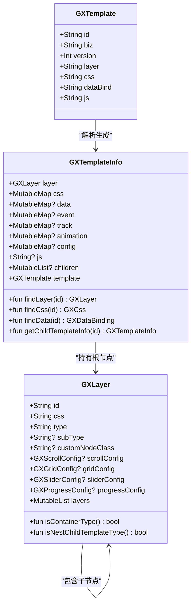
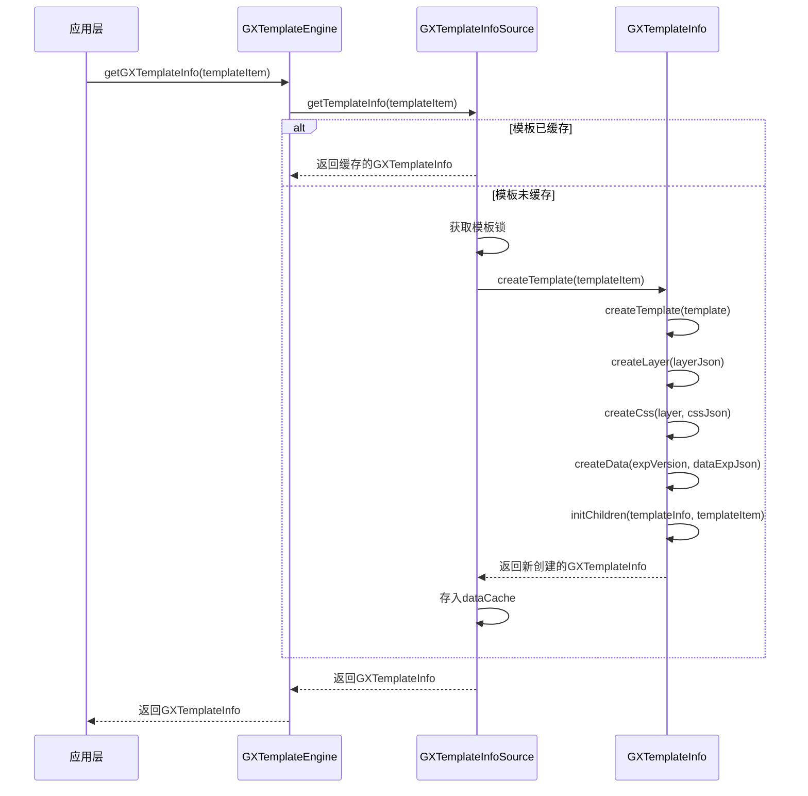
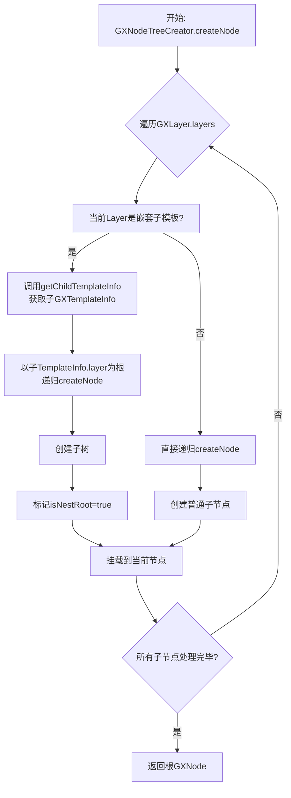
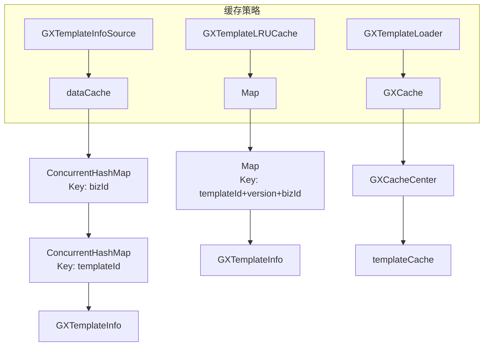
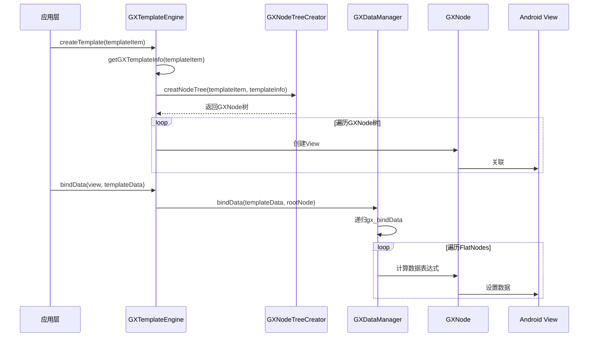

# 模板系统

<cite>
**本文档引用的文件**   
- [GXTemplateInfo.kt](file://GaiaXAndroid/src/main/kotlin/com/alibaba/gaiax/template/GXTemplateInfo.kt)
- [GXLayer.kt](file://GaiaXAndroid/src/main/kotlin/com/alibaba/gaiax/template/GXLayer.kt)
- [GXTemplate.kt](file://GaiaXAndroid/src/main/kotlin/com/alibaba/gaiax/template/GXTemplate.kt)
- [GXTemplateNode.kt](file://GaiaXAndroid/src/main/kotlin/com/alibaba/gaiax/render/node/GXTemplateNode.kt)
- [GXNodeTreeCreator.kt](file://GaiaXAndroid/src/main/kotlin/com/alibaba/gaiax/render/node/GXNodeTreeCreator.kt)
- [GXTemplateLRUCache.ets](file://GaiaXHarmony/GaiaXCore/GaiaX/src/main/ets/template/GXTemplateLRUCache.ets)
- [GXTemplateLoader.m](file://GaiaXiOS/GaiaXiOS/Template/Loader/GXTemplateLoader.m)
- [GXTemplateManager.m](file://GaiaXiOS/GaiaXiOS/Template/Loader/GXTemplateManager.m)
- [GXNodeTreeCreator.m](file://GaiaXiOS/GaiaXiOS/Core/Creator/GXNodeTreeCreator.m)
- [GXDataManager.m](file://GaiaXiOS/GaiaXiOS/Binding/Data/GXDataManager.m)
- [GXJSDelegateImplManager.m](file://GaiaXiOS/GaiaXiOS/Binding/JS/GXJSDelegateImplManager.m)
- [GXTemplateContext.kt](file://GaiaXAndroid/src/main/kotlin/com/alibaba/gaiax/context/GXTemplateContext.kt)
- [GXDataImpl.kt](file://GaiaXAndroid/src/main/kotlin/com/alibaba/gaiax/data/GXDataImpl.kt)
- [GXTemplateInfoSource.kt](file://GaiaXAndroid/src/main/kotlin/com/alibaba/gaiax/data/cache/GXTemplateInfoSource.kt)
</cite>

## 目录
1. [引言](#引言)
2. [核心组件](#核心组件)
3. [模板解析流程](#模板解析流程)
4. [层级结构管理](#层级结构管理)
5. [模板缓存策略](#模板缓存策略)
6. [模板加载与数据绑定](#模板加载与数据绑定)
7. [高级特性与最佳实践](#高级特性与最佳实践)
8. [总结](#总结)

## 引言
GaiaX Android模板系统是一个高性能、可扩展的UI渲染框架，其核心由`GXTemplateInfo`、`GXLayer`和`GXTemplate`三个关键类协同工作。该系统负责将JSON格式的模板文件解析为内存中的数据结构，构建视图层级树，并通过高效的缓存机制提升渲染性能。本指南将深入剖析其内部工作机制，为初学者提供基础流程，为高级开发者揭示性能优化的深层技术。

## 核心组件

`GXTemplateInfo`、`GXLayer`和`GXTemplate`是构成模板系统的核心三要素，它们各司其职，共同完成模板的解析与渲染。

**GXTemplate** 是模板的原始数据载体，它封装了从数据源（如网络、本地文件）获取的完整模板信息，包括`id`、`biz`（业务标识）、`version`（版本号）以及最重要的`layer`（层级JSON字符串）、`css`（样式字符串）、`dataBind`（数据绑定字符串）和`js`（JavaScript代码）。

**GXLayer** 代表了模板的节点层级信息，是构建视图树的蓝图。它是一个树形结构，每个`GXLayer`实例包含`id`（节点ID）、`css`（关联的样式ID）、`type`（节点类型，如`gaia-template`、`view`、`image`等）和`layers`（子节点列表）。通过递归遍历`layers`，可以构建出完整的视图层级结构。

**GXTemplateInfo** 是模板解析后的最终状态，它将`GXTemplate`中的原始字符串数据解析并组织成结构化的对象。它持有`layer`（已解析的`GXLayer`根节点）、`css`（样式映射表）、`data`（数据绑定映射表）等，并提供了`findLayer`、`findCss`、`findData`等便捷方法来快速查询特定节点的信息。`GXTemplateInfo`是后续创建视图节点树的唯一数据来源。

**Diagram sources**
- [GXTemplate.kt](file://GaiaXAndroid/src/main/kotlin/com/alibaba/gaiax/template/GXTemplate.kt#L22-L30)
- [GXLayer.kt](file://GaiaXAndroid/src/main/kotlin/com/alibaba/gaiax/template/GXLayer.kt#L28-L76)
- [GXTemplateInfo.kt](file://GaiaXAndroid/src/main/kotlin/com/alibaba/gaiax/template/GXTemplateInfo.kt#L32-L41)

## 模板解析流程

模板的解析是一个从原始数据到内存对象的转换过程，其核心入口是`GXTemplateInfo.createTemplate`方法。

1.  **获取原始模板**：系统首先通过`GXTemplateEngine`获取一个`GXTemplateItem`（包含`bizId`、`templateId`等信息），然后调用`GXTemplateInfoSource.getTemplateInfo`方法。
2.  **加锁与去重**：为了防止多线程并发加载同一个模板造成资源浪费和数据不一致，系统使用`dataLock`为每个`bizId+templateId`组合创建一个锁对象，确保同一模板的加载是串行的。
3.  **解析核心数据**：获取到`GXTemplate`实例后，调用`GXTemplateInfo.createTemplate(template)`进行解析。该方法会：
    *   使用`safeParseToJson()`将`layer`字符串解析为`layerJson`。
    *   使用`GXCssFileParserUtils`将`css`字符串解析为`cssJson`。
    *   将`dataBind`字符串解析为`dataBindFileJson`。
4.  **构建结构化对象**：利用解析出的JSON对象，分别调用`createLayer`、`createCss`、`createData`等私有方法，将JSON数据转换为`GXLayer`、`GXCss`、`GXDataBinding`等对象，并最终组装成一个`GXTemplateInfo`实例。
5.  **处理嵌套模板**：对于包含嵌套子模板（`isNestChildTemplateType`为true）的节点，系统会递归地调用`initChildren`方法，为每个子模板创建独立的`GXTemplateInfo`，并将其添加到父`GXTemplateInfo`的`children`列表中。

**Diagram sources**
- [GXTemplateInfoSource.kt](file://GaiaXAndroid/src/main/kotlin/com/alibaba/gaiax/data/cache/GXTemplateInfoSource.kt#L28-L58)
- [GXTemplateInfo.kt](file://GaiaXAndroid/src/main/kotlin/com/alibaba/gaiax/template/GXTemplateInfo.kt#L174-L248)
- [GXTemplateInfo.kt](file://GaiaXAndroid/src/main/kotlin/com/alibaba/gaiax/template/GXLayer.kt#L81-L94)

**Section sources**
- [GXTemplateInfoSource.kt](file://GaiaXAndroid/src/main/kotlin/com/alibaba/gaiax/data/cache/GXTemplateInfoSource.kt#L28-L58)
- [GXTemplateInfo.kt](file://GaiaXAndroid/src/main/kotlin/com/alibaba/gaiax/template/GXTemplateInfo.kt#L174-L248)

## 层级结构管理

在`GXTemplateInfo`构建完成后，系统会利用其数据来创建最终的视图节点树（`GXNode`）。这个过程由`GXNodeTreeCreator`负责。

1.  **创建根节点**：`GXNodeTreeCreator.createNode`方法以`GXTemplateInfo.layer`为起点，创建根`GXNode`。
2.  **递归构建子树**：对于根节点的每一个子`GXLayer`，系统会递归调用`createNode`方法创建子`GXNode`，并将其添加到父节点的`children`列表中，从而形成一棵完整的树。
3.  **处理嵌套模板**：当遇到`isNestChildTemplateType`为true的`GXLayer`时，系统会通过`getChildTemplateInfo`找到对应的子`GXTemplateInfo`，然后以该子模板的根`GXLayer`作为起点，递归创建一个子树。这个子树的根节点会被标记为`isNestRoot = true`，并挂载到当前节点下。
4.  **初始化节点数据**：每个`GXNode`都会持有一个`GXTemplateNode`，它通过`GXTemplateNode.createNode`方法，从`GXTemplateInfo`中查找并关联该节点ID对应的`layer`、`css`、`dataBinding`等信息。

**Diagram sources**
- [GXNodeTreeCreator.kt](file://GaiaXAndroid/src/main/kotlin/com/alibaba/gaiax/render/node/GXNodeTreeCreator.kt#L52-L134)
- [GXTemplateInfo.kt](file://GaiaXAndroid/src/main/kotlin/com/alibaba/gaiax/template/GXTemplateInfo.kt#L67-L74)
- [GXTemplateNode.kt](file://GaiaXAndroid/src/main/kotlin/com/alibaba/gaiax/render/node/GXTemplateNode.kt#L186-L205)

**Section sources**
- [GXNodeTreeCreator.kt](file://GaiaXAndroid/src/main/kotlin/com/alibaba/gaiax/render/node/GXNodeTreeCreator.kt#L52-L134)

## 模板缓存策略

为了提升性能，避免重复解析相同的模板，GaiaX系统采用了多级缓存策略。

1.  **内存缓存**：`GXTemplateInfoSource`内部使用`dataCache`（`ConcurrentHashMap<String, ConcurrentHashMap<String, GXTemplateInfo>>`）来缓存已解析的`GXTemplateInfo`。缓存的键为`bizId`和`templateId`。当`getTemplateInfo`被调用时，系统会首先检查缓存，如果存在则直接返回，否则才进行解析并存入缓存。
2.  **LRU缓存**：在HarmonyOS版本中，系统使用`GXTemplateLRUCache`实现了一个容量限制的LRU（最近最少使用）缓存。当缓存达到容量上限时，会自动移除最久未使用的模板，防止内存无限增长。
3.  **iOS缓存**：在iOS端，`GXTemplateLoader`通过`GXCache`（由`GXCacheCenter`提供）来缓存模板的原始JSON内容。`loadCacheTemplateForKey`和`cacheTemplate:forKey:`方法负责读写缓存，`removeCacheTemplateForKey`用于清除缓存。

**Diagram sources**
- [GXTemplateInfoSource.kt](file://GaiaXAndroid/src/main/kotlin/com/alibaba/gaiax/data/cache/GXTemplateInfoSource.kt#L20-L21)
- [GXTemplateLRUCache.ets](file://GaiaXHarmony/GaiaXCore/GaiaX/src/main/ets/template/GXTemplateLRUCache.ets#L4-L27)
- [GXTemplateLoader.m](file://GaiaXiOS/GaiaXiOS/Template/Loader/GXTemplateLoader.m#L50-L60)

**Section sources**
- [GXTemplateInfoSource.kt](file://GaiaXAndroid/src/main/kotlin/com/alibaba/gaiax/data/cache/GXTemplateInfoSource.kt#L20-L21)
- [GXTemplateLRUCache.ets](file://GaiaXHarmony/GaiaXCore/GaiaX/src/main/ets/template/GXTemplateLRUCache.ets#L4-L27)

## 模板加载与数据绑定

模板的完整生命周期包括加载、创建视图和数据绑定。

1.  **加载模板**：应用层调用`GXTemplateEngine.instance.createTemplate(templateItem)`。该方法会先通过`getGXTemplateInfo`获取`GXTemplateInfo`，然后调用`GXNodeTreeCreator.creatNodeTreeWithTemplateItem`创建`GXNode`树。
2.  **创建视图**：`GXNode`树构建完成后，系统会遍历这棵树，根据每个节点的`type`创建对应的Android `View`（如`TextView`、`ImageView`），并将`View`与`GXNode`关联。
3.  **数据绑定**：当需要更新视图数据时，调用`GXTemplateEngine.instance.bindData(view, templateData)`。系统会通过`GXDataManager.bindData`方法，将`templateData`中的数据与`GXNode`树中的`dataBinding`表达式进行匹配和计算，最终将结果设置到对应的`View`上。数据绑定支持从JavaScript层触发，通过`setBindingData`接口传递数据。

**Diagram sources**
- [GXTemplateEngine.kt](file://GaiaXAndroid/src/main/kotlin/com/alibaba/gaiax/GXTemplateEngine.kt#L545-L547)
- [GXNodeTreeCreator.kt](file://GaiaXAndroid/src/main/kotlin/com/alibaba/gaiax/render/node/GXNodeTreeCreator.kt#L52-L134)
- [GXDataManager.m](file://GaiaXiOS/GaiaXiOS/Binding/Data/GXDataManager.m#L53-L83)
- [GXJSDelegateImplManager.m](file://GaiaXiOS/GaiaXiOS/Binding/JS/GXJSDelegateImplManager.m#L179-L210)

**Section sources**
- [GXTemplateEngine.kt](file://GaiaXAndroid/src/main/kotlin/com/alibaba/gaiax/GXTemplateEngine.kt#L545-L547)
- [GXDataManager.m](file://GaiaXiOS/GaiaXiOS/Binding/Data/GXDataManager.m#L53-L83)

## 高级特性与最佳实践

### 模板预处理与动态生成
开发者可以通过`GXTemplateInfo`提供的`getConfig`、`findLayer`等方法，在渲染前对模板进行预处理。例如，根据运行时环境动态修改某个节点的样式或数据绑定规则。动态模板生成则可以通过在服务端组合不同的`GXTemplate`片段来实现。

### 模板版本管理
`GXTemplate`中的`version`字段是实现模板版本管理的关键。客户端可以根据`version`来决定是否从缓存加载旧模板，还是从服务端拉取新版本。建议在服务端为每个模板变更都递增版本号，以确保客户端能及时获取最新UI。

### 与数据绑定和样式系统的集成
*   **数据绑定**：`GXTemplateInfo.data`字段存储了所有数据绑定的表达式。系统通过`GXExpressionFactory`解析这些表达式，并在`bindData`时计算出最终值。最佳实践是保持表达式简洁，避免复杂的逻辑运算。
*   **样式系统**：`GXTemplateInfo.css`是一个样式ID到`GXCss`对象的映射。`GXCss`包含了Flexbox布局、颜色、字体等样式属性。样式可以通过`extend`机制进行覆盖和合并，实现灵活的主题切换。

### 性能优化技术
1.  **缓存复用**：确保`GXTemplateInfoSource`的缓存机制正常工作，避免重复解析。
2.  **减少嵌套**：过深的视图层级会增加`GXNode`树的构建时间和内存开销，应尽量扁平化布局。
3.  **优化数据绑定**：避免在`dataBind`中使用过于复杂的表达式，这会增加每次`bindData`的计算时间。
4.  **按需加载**：对于大型模板，可以考虑分块加载和渲染，提升首屏速度。

## 总结
GaiaX Android模板系统通过`GXTemplate`、`GXLayer`和`GXTemplateInfo`的协同工作，实现了从JSON模板到高性能UI视图的完整转换。其核心流程清晰，通过加锁机制保证了线程安全，通过多级缓存策略显著提升了性能。理解其解析、构建和缓存的内部机制，有助于开发者更高效地使用该框架，并进行深度的性能调优和功能扩展。