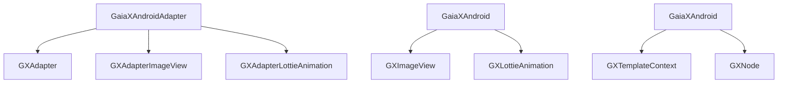
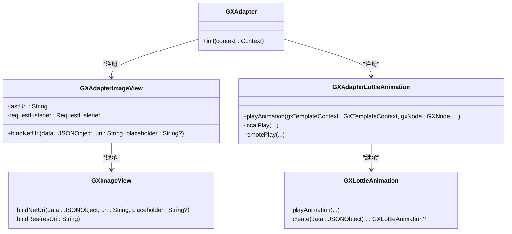
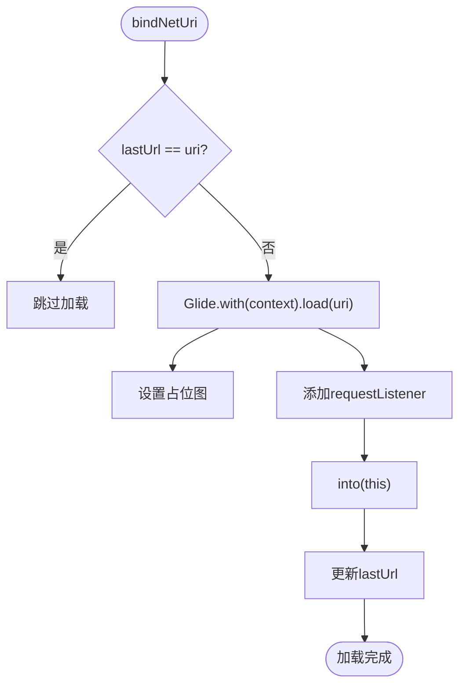
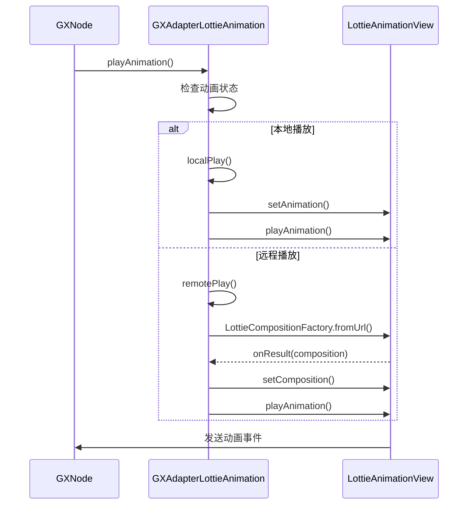
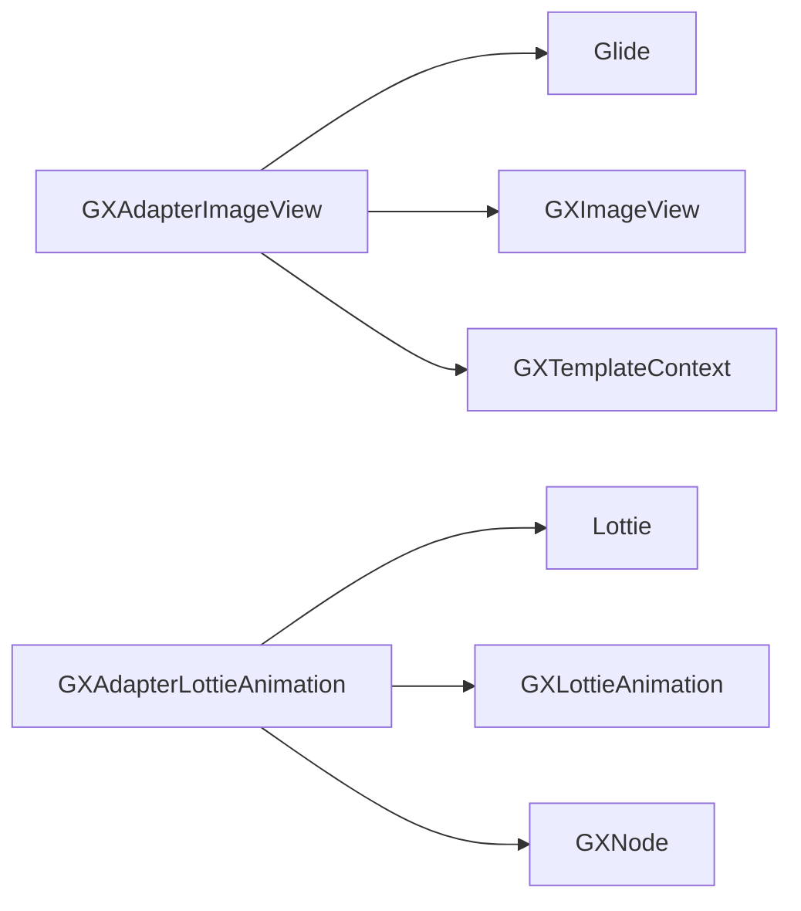

# 具体适配器实现

<cite>
**本文档引用的文件**
- [GXAdapterImageView.kt](file://GaiaXAndroidAdapter/src/main/java/com/alibaba/gaiax/adapter/GXAdapterImageView.kt)
- [GXAdapterLottieAnimation.kt](file://GaiaXAndroidAdapter/src/main/java/com/alibaba/gaiax/adapter/GXAdapterLottieAnimation.kt)
- [GXAdapter.kt](file://GaiaXAndroidAdapter/src/main/java/com/alibaba/gaiax/adapter/GXAdapter.kt)
- [GXImageView.kt](file://GaiaXAndroid/src/main/kotlin/com/alibaba/gaiax/render/view/basic/GXImageView.kt)
- [GXLottieAnimation.kt](file://GaiaXAndroid/src/main/kotlin/com/alibaba/gaiax/template/animation/GXLottieAnimation.kt)
- [GXTemplateContext.kt](file://GaiaXAndroid/src/main/kotlin/com/alibaba/gaiax/context/GXTemplateContext.kt)
- [GXNode.kt](file://GaiaXAndroid/src/main/kotlin/com/alibaba/gaiax/render/node/GXNode.kt)
- [Log.kt](file://GaiaXAndroidAdapter/src/main/java/com/alibaba/gaiax/adapter/Log.kt)
</cite>

## 目录
1. [引言](#引言)
2. [项目结构](#项目结构)
3. [核心组件](#核心组件)
4. [架构概述](#架构概述)
5. [详细组件分析](#详细组件分析)
6. [依赖分析](#依赖分析)
7. [性能考虑](#性能考虑)
8. [故障排除指南](#故障排除指南)
9. [结论](#结论)

## 引言
本文档深入分析 GaiaX Android 框架中两个关键适配器的实现：图片加载适配器（GXAdapterImageView）和 Lottie 动画适配器（GXAdapterLottieAnimation）。文档将详细探讨它们的初始化流程、配置参数、状态管理以及与原生组件的绑定机制，并提供使用示例和性能调优建议。

## 项目结构
GaiaX 是一个跨平台的模板渲染框架，其 Android 实现由多个模块组成。`GaiaXAndroidAdapter` 模块是本分析的核心，它提供了与第三方库（如 Glide 和 Lottie）集成的适配器实现。

**图表来源**
- [GXAdapter.kt](file://GaiaXAndroidAdapter/src/main/java/com/alibaba/gaiax/adapter/GXAdapter.kt)
- [GXAdapterImageView.kt](file://GaiaXAndroidAdapter/src/main/java/com/alibaba/gaiax/adapter/GXAdapterImageView.kt)
- [GXAdapterLottieAnimation.kt](file://GaiaXAndroidAdapter/src/main/java/com/alibaba/gaiax/adapter/GXAdapterLottieAnimation.kt)
- [GXImageView.kt](file://GaiaXAndroid/src/main/kotlin/com/alibaba/gaiax/render/view/basic/GXImageView.kt)
- [GXLottieAnimation.kt](file://GaiaXAndroid/src/main/kotlin/com/alibaba/gaiax/template/animation/GXLottieAnimation.kt)
- [GXTemplateContext.kt](file://GaiaXAndroid/src/main/kotlin/com/alibaba/gaiax/context/GXTemplateContext.kt)
- [GXNode.kt](file://GaiaXAndroid/src/main/kotlin/com/alibaba/gaiax/render/node/GXNode.kt)

**章节来源**
- [GXAdapter.kt](file://GaiaXAndroidAdapter/src/main/java/com/alibaba/gaiax/adapter/GXAdapter.kt)
- [GXAdapterImageView.kt](file://GaiaXAndroidAdapter/src/main/java/com/alibaba/gaiax/adapter/GXAdapterImageView.kt)
- [GXAdapterLottieAnimation.kt](file://GaiaXAndroidAdapter/src/main/java/com/alibaba/gaiax/adapter/GXAdapterLottieAnimation.kt)

## 核心组件
本节分析 `GXAdapterImageView` 和 `GXAdapterLottieAnimation` 两个核心适配器类的实现细节。

**章节来源**
- [GXAdapterImageView.kt](file://GaiaXAndroidAdapter/src/main/java/com/alibaba/gaiax/adapter/GXAdapterImageView.kt)
- [GXAdapterLottieAnimation.kt](file://GaiaXAndroidAdapter/src/main/java/com/alibaba/gaiax/adapter/GXAdapterLottieAnimation.kt)

## 架构概述
GaiaX 的适配器机制通过 `GXAdapter` 类进行注册，将具体的视图创建和动画播放逻辑委托给适配器实现。`GXAdapterImageView` 继承自 `GXImageView` 并重写其方法以集成 Glide，而 `GXAdapterLottieAnimation` 则实现了 `GXLottieAnimation` 以控制 Lottie 动画的播放。

**图表来源**
- [GXAdapter.kt](file://GaiaXAndroidAdapter/src/main/java/com/alibaba/gaiax/adapter/GXAdapter.kt)
- [GXAdapterImageView.kt](file://GaiaXAndroidAdapter/src/main/java/com/alibaba/gaiax/adapter/GXAdapterImageView.kt)
- [GXAdapterLottieAnimation.kt](file://GaiaXAndroidAdapter/src/main/java/com/alibaba/gaiax/adapter/GXAdapterLottieAnimation.kt)
- [GXImageView.kt](file://GaiaXAndroid/src/main/kotlin/com/alibaba/gaiax/render/view/basic/GXImageView.kt)
- [GXLottieAnimation.kt](file://GaiaXAndroid/src/main/kotlin/com/alibaba/gaiax/template/animation/GXLottieAnimation.kt)

## 详细组件分析
本节对两个适配器进行深入分析。

### GXAdapterImageView 分析
`GXAdapterImageView` 是 `GXImageView` 的具体实现，它通过集成 Glide 库来处理网络图片的异步加载、缓存和显示。

#### 图片加载与缓存
`GXAdapterImageView` 通过重写 `bindNetUri` 方法，利用 Glide 进行图片加载。它实现了简单的 URL 缓存机制，通过 `lastUrl` 字段避免重复加载同一张图片。加载时，它会设置占位图（placeholder），并在加载成功或失败时通过 `requestListener` 回调进行处理。

**图表来源**
- [GXAdapterImageView.kt](file://GaiaXAndroidAdapter/src/main/java/com/alibaba/gaiax/adapter/GXAdapterImageView.kt#L59-L77)

**章节来源**
- [GXAdapterImageView.kt](file://GaiaXAndroidAdapter/src/main/java/com/alibaba/gaiax/adapter/GXAdapterImageView.kt)

### GXAdapterLottieAnimation 分析
`GXAdapterLottieAnimation` 负责 Lottie 动画的播放控制，支持从本地或远程加载动画资源。

#### 动画播放流程
`GXAdapterLottieAnimation` 的 `playAnimation` 方法是入口，它根据配置的 `gxLocalUri` 或 `gxRemoteUri` 分别调用 `localPlay` 或 `remotePlay` 方法。

**图表来源**
- [GXAdapterLottieAnimation.kt](file://GaiaXAndroidAdapter/src/main/java/com/alibaba/gaiax/adapter/GXAdapterLottieAnimation.kt#L32-L60)
- [GXAdapterLottieAnimation.kt](file://GaiaXAndroidAdapter/src/main/java/com/alibaba/gaiax/adapter/GXAdapterLottieAnimation.kt#L79-L134)
- [GXAdapterLottieAnimation.kt](file://GaiaXAndroidAdapter/src/main/java/com/alibaba/gaiax/adapter/GXAdapterLottieAnimation.kt#L136-L205)

**章节来源**
- [GXAdapterLottieAnimation.kt](file://GaiaXAndroidAdapter/src/main/java/com/alibaba/gaiax/adapter/GXAdapterLottieAnimation.kt)

## 依赖分析
`GXAdapterImageView` 依赖于 Glide 库进行图片加载，而 `GXAdapterLottieAnimation` 依赖于 Airbnb 的 Lottie 库。这两个适配器都依赖于 GaiaX 框架的核心类，如 `GXTemplateContext` 和 `GXNode`，以获取上下文信息和节点状态。

**图表来源**
- [GXAdapterImageView.kt](file://GaiaXAndroidAdapter/src/main/java/com/alibaba/gaiax/adapter/GXAdapterImageView.kt)
- [GXAdapterLottieAnimation.kt](file://GaiaXAndroidAdapter/src/main/java/com/alibaba/gaiax/adapter/GXAdapterLottieAnimation.kt)
- [GXImageView.kt](file://GaiaXAndroid/src/main/kotlin/com/alibaba/gaiax/render/view/basic/GXImageView.kt)
- [GXLottieAnimation.kt](file://GaiaXAndroid/src/main/kotlin/com/alibaba/gaiax/template/animation/GXLottieAnimation.kt)
- [GXTemplateContext.kt](file://GaiaXAndroid/src/main/kotlin/com/alibaba/gaiax/context/GXTemplateContext.kt)
- [GXNode.kt](file://GaiaXAndroid/src/main/kotlin/com/alibaba/gaiax/render/node/GXNode.kt)

**章节来源**
- [GXAdapterImageView.kt](file://GaiaXAndroidAdapter/src/main/java/com/alibaba/gaiax/adapter/GXAdapterImageView.kt)
- [GXAdapterLottieAnimation.kt](file://GaiaXAndroidAdapter/src/main/java/com/alibaba/gaiax/adapter/GXAdapterLottieAnimation.kt)

## 性能考虑
- **图片加载**：`GXAdapterImageView` 的 URL 缓存机制有效避免了重复请求，但应确保 Glide 的内存和磁盘缓存配置合理。
- **动画播放**：`GXAdapterLottieAnimation` 在播放前会检查 `isAnimating` 状态，防止重复播放。对于远程加载，使用 `LottieCompositionFactory` 可以避免阻塞 UI 线程。
- **资源复用**：在 `remotePlay` 中，成功加载后会移除 `LottieListener`，防止内存泄漏。

## 故障排除指南
- **图片不显示**：检查网络权限、图片 URL 是否正确、占位图资源是否存在。
- **Lottie 动画不播放**：确认 `gxLocalUri` 或 `gxRemoteUri` 配置正确，本地 JSON 文件路径和资源文件夹是否匹配，远程 URL 是否可访问。
- **内存问题**：监控 Glide 和 Lottie 的内存使用情况，确保在 `onResetData` 或 `release` 时正确释放资源。

**章节来源**
- [GXAdapterImageView.kt](file://GaiaXAndroidAdapter/src/main/java/com/alibaba/gaiax/adapter/GXAdapterImageView.kt)
- [GXAdapterLottieAnimation.kt](file://GaiaXAndroidAdapter/src/main/java/com/alibaba/gaiax/adapter/GXAdapterLottieAnimation.kt)
- [GXImageView.kt](file://GaiaXAndroid/src/main/kotlin/com/alibaba/gaiax/render/view/basic/GXImageView.kt)

## 结论
`GXAdapterImageView` 和 `GXAdapterLottieAnimation` 是 GaiaX Android 框架中实现图片和动画功能的关键组件。它们通过清晰的适配器模式，将框架核心逻辑与第三方库的实现解耦，提供了高性能、可复用的解决方案。开发者可以通过理解其内部机制，更好地进行性能调优和问题排查。