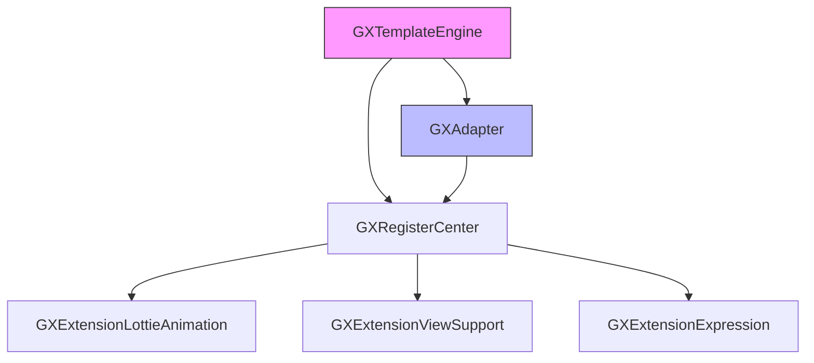
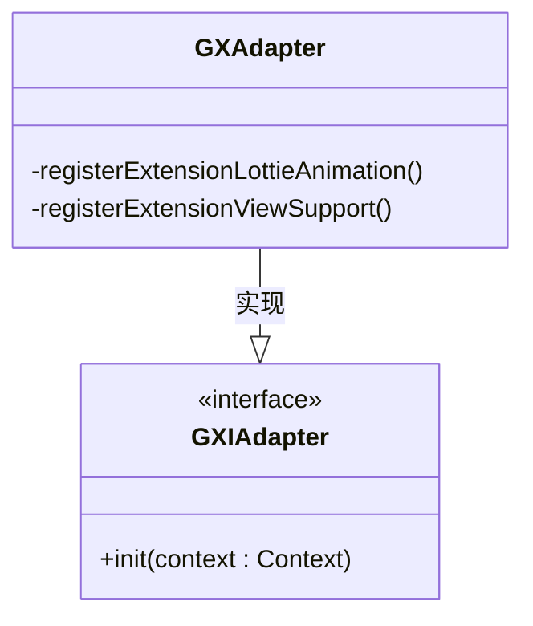
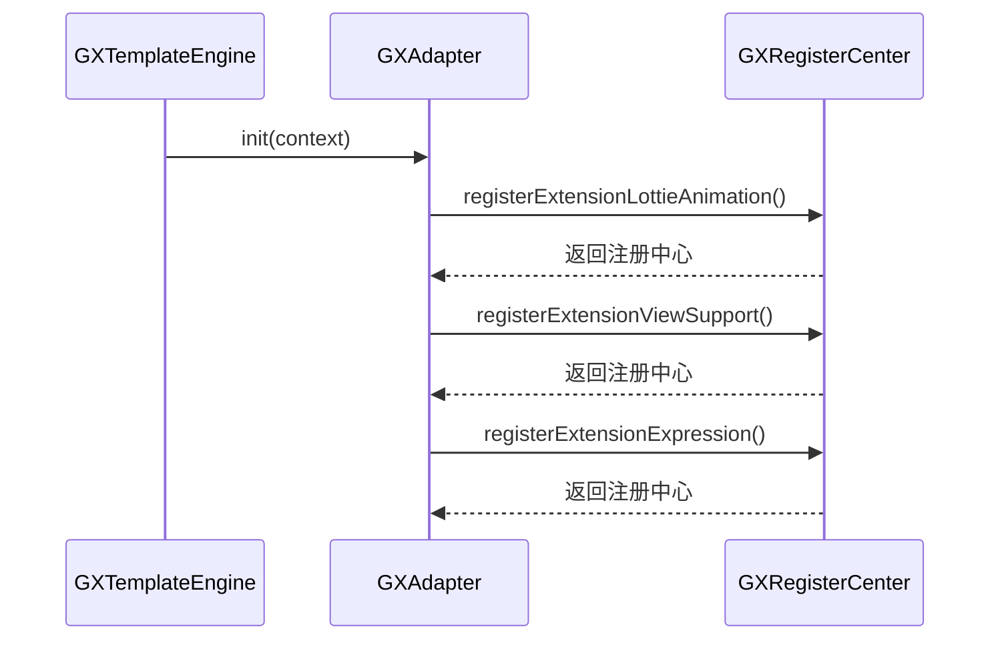
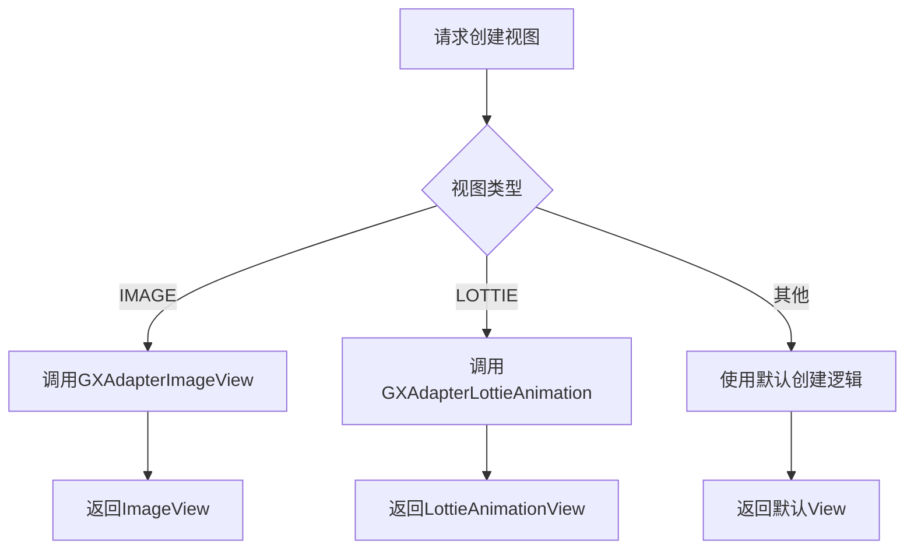
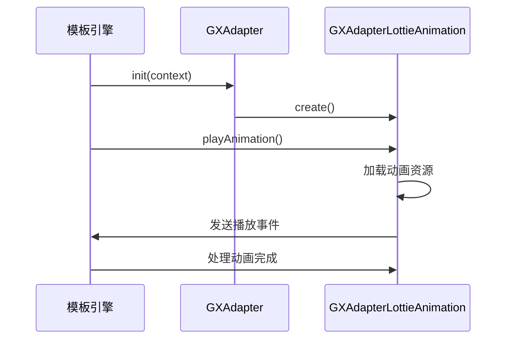

# 适配器基础

<cite>
**本文档引用文件**   
- [GXAdapter.kt](file://GaiaXAndroidAdapter/src/main/java/com/alibaba/gaiax/adapter/GXAdapter.kt)
- [GXAdapterImageView.kt](file://GaiaXAndroidAdapter/src/main/java/com/alibaba/gaiax/adapter/GXAdapterImageView.kt)
- [GXAdapterLottieAnimation.kt](file://GaiaXAndroidAdapter/src/main/java/com/alibaba/gaiax/adapter/GXAdapterLottieAnimation.kt)
- [Log.kt](file://GaiaXAndroidAdapter/src/main/java/com/alibaba/gaiax/adapter/Log.kt)
- [GXTemplateEngine.kt](file://GaiaXAndroid/src/main/kotlin/com/alibaba/gaiax/GXTemplateEngine.kt)
- [GXRegisterCenter.kt](file://GaiaXAndroid/src/main/kotlin/com/alibaba/gaiax/GXRegisterCenter.kt)
- [GXViewKey.kt](file://GaiaXAndroid/src/main/kotlin/com/alibaba/gaiax/render/view/GXViewKey.kt)
</cite>

## 目录
1. [引言](#引言)
2. [适配器架构概览](#适配器架构概览)
3. [GXAdapter抽象基类设计](#gxadapter抽象基类设计)
4. [适配器注册机制](#适配器注册机制)
5. [核心接口与生命周期管理](#核心接口与生命周期管理)
6. [类型匹配与视图支持](#类型匹配与视图支持)
7. [与核心引擎的交互协议](#与核心引擎的交互协议)
8. [自定义适配器开发指南](#自定义适配器开发指南)
9. [最佳实践与错误处理](#最佳实践与错误处理)
10. [总结](#总结)

## 引言
GaiaX Android适配器是框架扩展能力的核心组件，通过适配器模式实现了框架功能的灵活扩展。本文档深入解析适配器基础架构，重点介绍`GXAdapter`抽象基类的设计原理和核心接口。适配器机制允许开发者注册自定义功能，如Lottie动画支持、表达式解析和特定视图类型支持，从而满足多样化的业务需求。通过理解适配器的注册机制、生命周期管理和与核心引擎的交互协议，开发者可以快速扩展框架功能，实现自定义视图和动画效果。

**Section sources**
- [GXAdapter.kt](file://GaiaXAndroidAdapter/src/main/java/com/alibaba/gaiax/adapter/GXAdapter.kt#L1-L62)

## 适配器架构概览
GaiaX的适配器架构基于注册中心模式，通过`GXRegisterCenter`统一管理所有扩展功能。`GXAdapter`作为适配器基类，负责在框架初始化时向注册中心注册各种扩展功能。适配器模式的应用使得框架核心与具体实现解耦，提高了系统的可扩展性和可维护性。适配器在`GXTemplateEngine`初始化过程中被自动加载和初始化，通过反射机制创建实例并调用`init`方法。整个架构分为三个主要部分：适配器基类、注册中心和核心引擎，它们协同工作以实现功能扩展。

**Diagram sources **
- [GXTemplateEngine.kt](file://GaiaXAndroid/src/main/kotlin/com/alibaba/gaiax/GXTemplateEngine.kt#L876-L927)
- [GXAdapter.kt](file://GaiaXAndroidAdapter/src/main/java/com/alibaba/gaiax/adapter/GXAdapter.kt#L1-L62)
- [GXRegisterCenter.kt](file://GaiaXAndroid/src/main/kotlin/com/alibaba/gaiax/GXRegisterCenter.kt#L47-L513)

**Section sources**
- [GXTemplateEngine.kt](file://GaiaXAndroid/src/main/kotlin/com/alibaba/gaiax/GXTemplateEngine.kt#L1-L927)
- [GXRegisterCenter.kt](file://GaiaXAndroid/src/main/kotlin/com/alibaba/gaiax/GXRegisterCenter.kt#L1-L514)

## GXAdapter抽象基类设计
`GXAdapter`类实现了`GXTemplateEngine.GXIAdapter`接口，是所有适配器的基类。其核心设计原则是单一职责和开闭原则，通过`init`方法集中注册所有扩展功能。该类采用链式调用模式，通过`GXRegisterCenter`实例连续注册不同类型的功能扩展。设计上使用了依赖注入模式，将上下文`Context`作为参数传递，确保适配器能够访问必要的系统资源。类的结构简洁明了，专注于功能注册，不包含复杂的业务逻辑，体现了高内聚低耦合的设计思想。

**Diagram sources **
- [GXAdapter.kt](file://GaiaXAndroidAdapter/src/main/java/com/alibaba/gaiax/adapter/GXAdapter.kt#L33-L62)
- [GXTemplateEngine.kt](file://GaiaXAndroid/src/main/kotlin/com/alibaba/gaiax/GXTemplateEngine.kt#L95-L97)

**Section sources**
- [GXAdapter.kt](file://GaiaXAndroidAdapter/src/main/java/com/alibaba/gaiax/adapter/GXAdapter.kt#L1-L62)

## 适配器注册机制
适配器注册机制是通过`GXRegisterCenter`实现的中心化注册模式。当`GXTemplateEngine`初始化时，会通过反射创建`GXAdapter`实例并调用其`init`方法。在`init`方法中，适配器通过`GXRegisterCenter.instance`获取注册中心实例，然后链式调用注册方法。注册过程是线程安全的，采用懒加载单例模式确保注册中心的唯一性。每种扩展功能都有对应的注册方法，如`registerExtensionLottieAnimation`用于注册Lottie动画支持，`registerExtensionViewSupport`用于注册自定义视图支持。

**Diagram sources **
- [GXTemplateEngine.kt](file://GaiaXAndroid/src/main/kotlin/com/alibaba/gaiax/GXTemplateEngine.kt#L876-L927)
- [GXAdapter.kt](file://GaiaXAndroidAdapter/src/main/java/com/alibaba/gaiax/adapter/GXAdapter.kt#L36-L61)
- [GXRegisterCenter.kt](file://GaiaXAndroid/src/main/kotlin/com/alibaba/gaiax/GXRegisterCenter.kt#L454-L457)

**Section sources**
- [GXAdapter.kt](file://GaiaXAndroidAdapter/src/main/java/com/alibaba/gaiax/adapter/GXAdapter.kt#L36-L61)
- [GXRegisterCenter.kt](file://GaiaXAndroid/src/main/kotlin/com/alibaba/gaiax/GXRegisterCenter.kt#L427-L432)

## 核心接口与生命周期管理
`GXAdapter`的核心接口是`GXIAdapter`中的`init`方法，该方法定义了适配器的生命周期起点。生命周期管理遵循创建-初始化-使用的标准模式，适配器在框架初始化时被创建和初始化，之后在整个应用生命周期内提供服务。`init`方法接收`Context`参数，确保适配器能够正确初始化所需的系统资源。错误处理机制内置于注册过程中，如果注册失败，系统会记录错误日志但不会中断主流程，保证了框架的健壮性。日志记录通过`Log`类实现，支持不同级别的日志输出，便于问题排查和调试。

**Section sources**
- [GXAdapter.kt](file://GaiaXAndroidAdapter/src/main/java/com/alibaba/gaiax/adapter/GXAdapter.kt#L36-L61)
- [Log.kt](file://GaiaXAndroidAdapter/src/main/java/com/alibaba/gaiax/adapter/Log.kt#L1-L121)

## 类型匹配与视图支持
类型匹配策略通过`GXViewKey`常量类实现，定义了所有支持的视图类型。`GXAdapter`通过`registerExtensionViewSupport`方法注册特定类型的视图支持，使用视图类型字符串作为键，视图创建函数作为值存储在`GXViewFactory.viewCreatorSupport`映射中。当需要创建特定类型的视图时，`GXViewFactory`会查找对应的创建函数并实例化视图。这种策略实现了类型与实现的解耦，新增视图类型只需注册新的创建函数，无需修改核心代码。Lottie动画视图的注册示例展示了如何通过`LayoutInflater`创建复杂视图并设置布局参数。

**Diagram sources **
- [GXAdapter.kt](file://GaiaXAndroidAdapter/src/main/java/com/alibaba/gaiax/adapter/GXAdapter.kt#L46-L59)
- [GXViewKey.kt](file://GaiaXAndroid/src/main/kotlin/com/alibaba/gaiax/render/view/GXViewKey.kt#L22-L49)
- [GXViewFactory.kt](file://GaiaXAndroid/src/main/kotlin/com/alibaba/gaiax/render/view/GXViewFactory.kt#L29-L74)

**Section sources**
- [GXAdapter.kt](file://GaiaXAndroidAdapter/src/main/java/com/alibaba/gaiax/adapter/GXAdapter.kt#L46-L59)
- [GXViewKey.kt](file://GaiaXAndroid/src/main/kotlin/com/alibaba/gaiax/render/view/GXViewKey.kt#L1-L49)

## 与核心引擎的交互协议
适配器与核心引擎的交互通过`GXRegisterCenter`作为中介实现。核心引擎在初始化时调用`initGXAdapter`方法，通过反射创建适配器实例并调用`init`方法。适配器通过注册中心注册各种扩展功能，这些功能在模板渲染过程中被核心引擎调用。交互协议基于接口编程，核心引擎只依赖`GXIAdapter`接口，不关心具体实现，实现了松耦合。数据流转遵循单向数据流原则，从模板数据到视图渲染，适配器在关键节点提供扩展能力。Lottie动画的播放流程展示了完整的交互时序：模板数据绑定→动画参数解析→播放控制→事件回调。

**Diagram sources **
- [GXTemplateEngine.kt](file://GaiaXAndroid/src/main/kotlin/com/alibaba/gaiax/GXTemplateEngine.kt#L876-L927)
- [GXAdapterLottieAnimation.kt](file://GaiaXAndroidAdapter/src/main/java/com/alibaba/gaiax/adapter/GXAdapterLottieAnimation.kt#L31-L207)
- [GXAdapter.kt](file://GaiaXAndroidAdapter/src/main/java/com/alibaba/gaiax/adapter/GXAdapter.kt#L39-L44)

**Section sources**
- [GXTemplateEngine.kt](file://GaiaXAndroid/src/main/kotlin/com/alibaba/gaiax/GXTemplateEngine.kt#L876-L927)
- [GXAdapterLottieAnimation.kt](file://GaiaXAndroidAdapter/src/main/java/com/alibaba/gaiax/adapter/GXAdapterLottieAnimation.kt#L31-L207)

## 自定义适配器开发指南
开发自定义适配器需要继承`GXAdapter`类或直接实现`GXIAdapter`接口。标准化流程包括：定义适配器类、实现`init`方法、注册所需扩展功能。对于图像处理适配器，可以继承`GXAdapterImageView`并重写`bindNetUri`方法，添加自定义的图片加载逻辑和错误处理。开发模板应包含必要的日志记录，使用`Log.runE`方法输出调试信息。错误处理应遵循框架规范，捕获异常并提供默认行为，避免导致应用崩溃。配置文件中需确保适配器类路径正确，以便框架能够通过反射加载。

**Section sources**
- [GXAdapterImageView.kt](file://GaiaXAndroidAdapter/src/main/java/com/alibaba/gaiax/adapter/GXAdapterImageView.kt#L31-L79)
- [GXAdapter.kt](file://GaiaXAndroidAdapter/src/main/java/com/alibaba/gaiax/adapter/GXAdapter.kt#L33-L62)

## 最佳实践与错误处理
最佳实践包括：保持适配器轻量级，避免在`init`方法中执行耗时操作；使用常量定义视图类型，避免字符串硬编码；提供详细的日志记录，便于问题排查。错误处理策略应包含：空值检查、异常捕获、默认值返回。日志记录应分级管理，通过`SystemProp`控制日志开关，避免在生产环境输出过多调试信息。性能优化方面，建议对频繁调用的方法进行缓存，如`GXAdapterImageView`中的URL缓存机制。安全考虑包括：验证输入参数、防止内存泄漏、正确管理资源。

**Section sources**
- [GXAdapterImageView.kt](file://GaiaXAndroidAdapter/src/main/java/com/alibaba/gaiax/adapter/GXAdapterImageView.kt#L63-L68)
- [Log.kt](file://GaiaXAndroidAdapter/src/main/java/com/alibaba/gaiax/adapter/Log.kt#L56-L64)

## 总结
GaiaX Android适配器基础架构通过精心设计的适配器模式，实现了框架功能的灵活扩展。`GXAdapter`抽象基类作为扩展点，通过`GXRegisterCenter`注册中心与核心引擎交互，形成了清晰的分层架构。类型匹配策略和视图支持机制使得新增视图类型变得简单高效。开发者遵循标准化流程，可以快速开发自定义适配器，扩展框架功能。完善的错误处理和日志记录机制保证了系统的稳定性和可维护性。整体架构体现了高内聚、低耦合的设计原则，为构建复杂动态模板系统提供了坚实的基础。