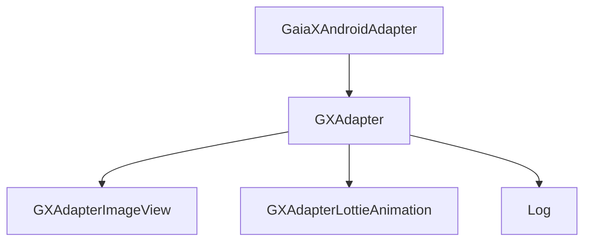
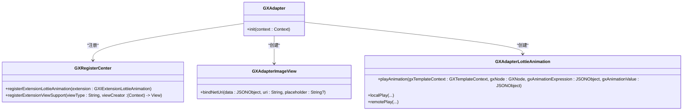
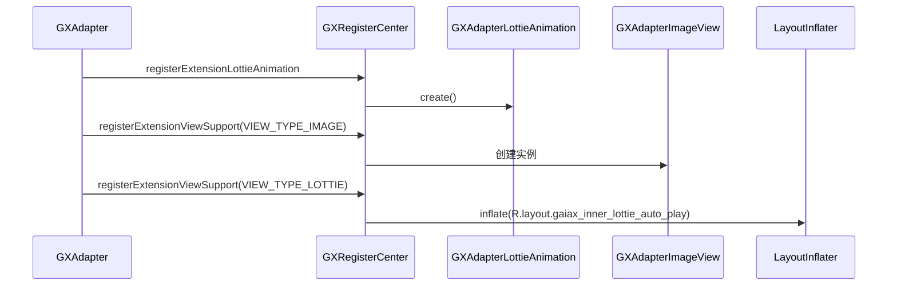
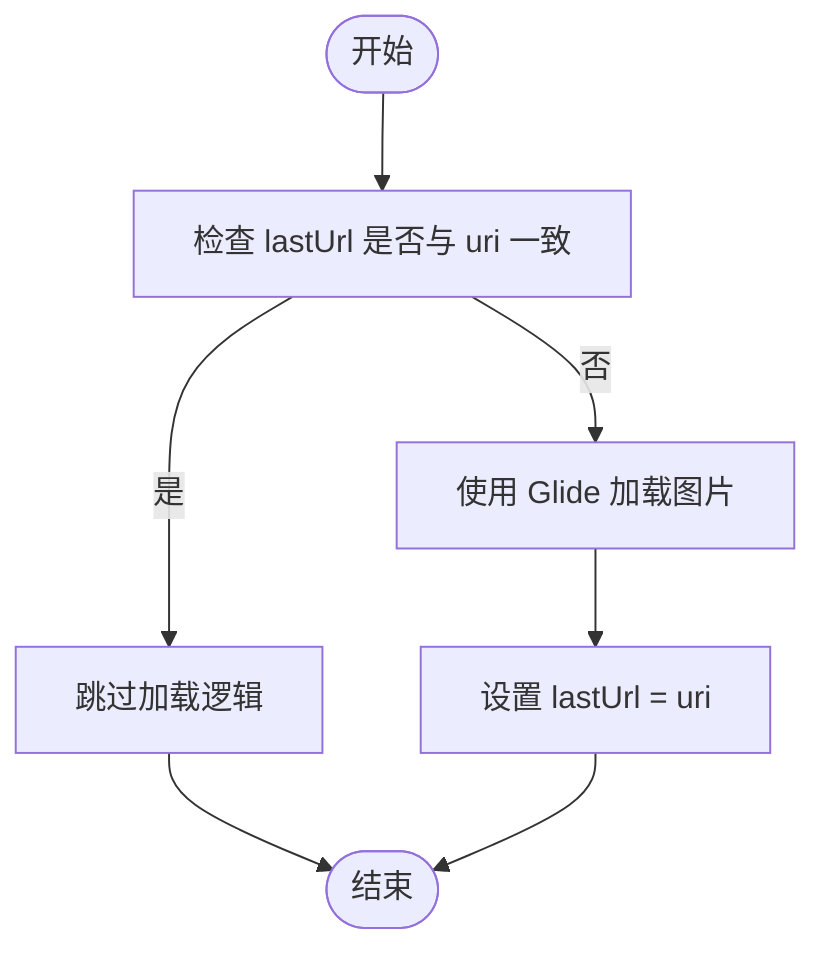
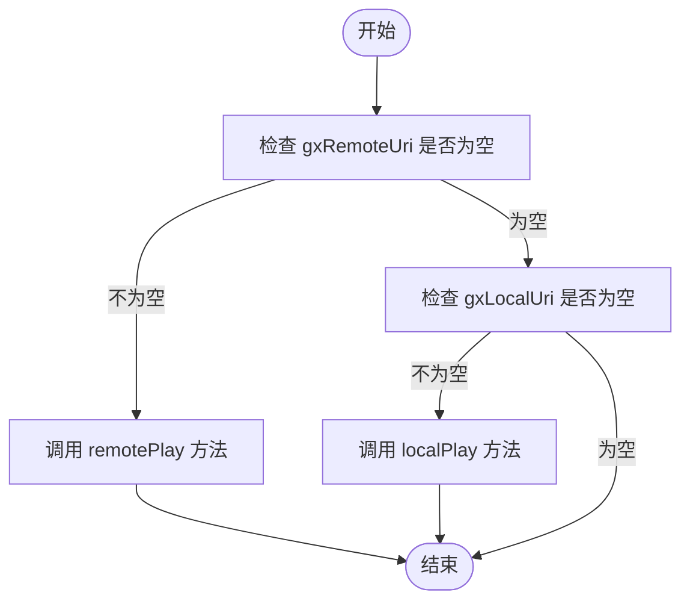
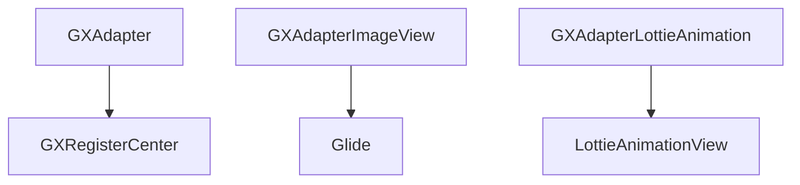

# 适配器实现

<cite>
**本文档中引用的文件**  
- [GXAdapter.kt](file://GaiaXAndroidAdapter/src/main/java/com/alibaba/gaiax/adapter/GXAdapter.kt)
- [GXAdapterImageView.kt](file://GaiaXAndroidAdapter/src/main/java/com/alibaba/gaiax/adapter/GXAdapterImageView.kt)
- [GXAdapterLottieAnimation.kt](file://GaiaXAndroidAdapter/src/main/java/com/alibaba/gaiax/adapter/GXAdapterLottieAnimation.kt)
- [Log.kt](file://GaiaXAndroidAdapter/src/main/java/com/alibaba/gaiax/adapter/Log.kt)
- [GXTemplateEngine.kt](file://GaiaXAndroid/src/main/kotlin/com/alibaba/gaiax/GXTemplateEngine.kt)
- [GXRegisterCenter.kt](file://GaiaXAndroid/src/main/kotlin/com/alibaba/gaiax/GXRegisterCenter.kt)
- [GXImageView.kt](file://GaiaXAndroid/src/main/kotlin/com/alibaba/gaiax/render/view/basic/GXImageView.kt)
- [GXLottieAnimation.kt](file://GaiaXAndroid/src/main/kotlin/com/alibaba/gaiax/template/animation/GXLottieAnimation.kt)
- [GXTemplateContext.kt](file://GaiaXAndroid/src/main/kotlin/com/alibaba/gaiax/context/GXTemplateContext.kt)
- [GXNode.kt](file://GaiaXAndroid/src/main/kotlin/com/alibaba/gaiax/render/node/GXNode.kt)
</cite>

## 目录
1. [简介](#简介)
2. [项目结构](#项目结构)
3. [核心组件](#核心组件)
4. [架构概述](#架构概述)
5. [详细组件分析](#详细组件分析)
6. [依赖分析](#依赖分析)
7. [性能考虑](#性能考虑)
8. [故障排除指南](#故障排除指南)
9. [结论](#结论)

## 简介
本文档全面介绍 GaiaX Android 适配器系统，重点阐述 GXAdapter 及其子类的实现机制。文档详细描述适配器模式在图片加载、Lottie 动画播放等场景中的应用，以及如何通过适配器扩展框架功能。为初学者提供自定义适配器的开发指南和集成步骤；为高级开发者深入剖析适配器生命周期管理、资源复用机制和性能优化策略。包含实际代码示例，展示图片加载适配器、动画播放适配器的实现，并说明适配器与核心引擎的交互协议及最佳实践。

## 项目结构
GaiaX Android 适配器系统位于 `GaiaXAndroidAdapter` 模块中，其主要结构如下：

```
GaiaXAndroidAdapter/
├── src/main/
│   ├── java/com/alibaba/gaiax/adapter/
│   │   ├── GXAdapter.kt
│   │   ├── GXAdapterImageView.kt
│   │   ├── GXAdapterLottieAnimation.kt
│   │   └── Log.kt
│   ├── res/
│   │   ├── layout/
│   │   │   └── gaiax_inner_lottie_auto_play.xml
│   │   └── values/
│   │       └── strings.xml
│   └── AndroidManifest.xml
```

该模块的核心是 `GXAdapter` 类，它实现了 `GXTemplateEngine.GXIAdapter` 接口，负责注册各种扩展功能，如 Lottie 动画和自定义视图支持。



**图示来源**
- [GXAdapter.kt](file://GaiaXAndroidAdapter/src/main/java/com/alibaba/gaiax/adapter/GXAdapter.kt)
- [GXAdapterImageView.kt](file://GaiaXAndroidAdapter/src/main/java/com/alibaba/gaiax/adapter/GXAdapterImageView.kt)
- [GXAdapterLottieAnimation.kt](file://GaiaXAndroidAdapter/src/main/java/com/alibaba/gaiax/adapter/GXAdapterLottieAnimation.kt)
- [Log.kt](file://GaiaXAndroidAdapter/src/main/java/com/alibaba/gaiax/adapter/Log.kt)

**章节来源**
- [GXAdapter.kt](file://GaiaXAndroidAdapter/src/main/java/com/alibaba/gaiax/adapter/GXAdapter.kt#L1-L61)

## 核心组件
核心组件包括 `GXAdapter`、`GXAdapterImageView` 和 `GXAdapterLottieAnimation`。`GXAdapter` 是适配器的入口点，负责初始化和注册各种扩展功能。`GXAdapterImageView` 负责处理图片加载逻辑，而 `GXAdapterLottieAnimation` 则负责处理 Lottie 动画的播放。

**章节来源**
- [GXAdapter.kt](file://GaiaXAndroidAdapter/src/main/java/com/alibaba/gaiax/adapter/GXAdapter.kt#L31-L61)
- [GXAdapterImageView.kt](file://GaiaXAndroidAdapter/src/main/java/com/alibaba/gaiax/adapter/GXAdapterImageView.kt#L31-L79)
- [GXAdapterLottieAnimation.kt](file://GaiaXAndroidAdapter/src/main/java/com/alibaba/gaiax/adapter/GXAdapterLottieAnimation.kt#L31-L207)

## 架构概述
GaiaX Android 适配器系统的架构基于适配器模式，通过 `GXAdapter` 类注册各种扩展功能，从而实现对框架功能的扩展。`GXAdapter` 通过 `GXRegisterCenter` 注册 Lottie 动画和自定义视图支持，使得框架能够动态加载和播放 Lottie 动画，以及支持自定义视图。



**图示来源**
- [GXAdapter.kt](file://GaiaXAndroidAdapter/src/main/java/com/alibaba/gaiax/adapter/GXAdapter.kt#L31-L61)
- [GXAdapterImageView.kt](file://GaiaXAndroidAdapter/src/main/java/com/alibaba/gaiax/adapter/GXAdapterImageView.kt#L31-L79)
- [GXAdapterLottieAnimation.kt](file://GaiaXAndroidAdapter/src/main/java/com/alibaba/gaiax/adapter/GXAdapterLottieAnimation.kt#L31-L207)
- [GXRegisterCenter.kt](file://GaiaXAndroid/src/main/kotlin/com/alibaba/gaiax/GXRegisterCenter.kt#L47-L513)

## 详细组件分析

### GXAdapter 分析
`GXAdapter` 类实现了 `GXTemplateEngine.GXIAdapter` 接口，其主要职责是在 `init` 方法中注册各种扩展功能。通过 `GXRegisterCenter`，`GXAdapter` 注册了 Lottie 动画和自定义视图支持，使得框架能够动态加载和播放 Lottie 动画，以及支持自定义视图。



**图示来源**
- [GXAdapter.kt](file://GaiaXAndroidAdapter/src/main/java/com/alibaba/gaiax/adapter/GXAdapter.kt#L34-L60)
- [GXRegisterCenter.kt](file://GaiaXAndroid/src/main/kotlin/com/alibaba/gaiax/GXRegisterCenter.kt#L47-L513)

**章节来源**
- [GXAdapter.kt](file://GaiaXAndroidAdapter/src/main/java/com/alibaba/gaiax/adapter/GXAdapter.kt#L31-L61)

### GXAdapterImageView 分析
`GXAdapterImageView` 类继承自 `GXImageView`，负责处理图片加载逻辑。它通过 `Glide` 库加载网络图片，并在加载成功或失败时进行相应的处理。`bindNetUri` 方法是其核心方法，负责加载网络图片并设置占位图。



**图示来源**
- [GXAdapterImageView.kt](file://GaiaXAndroidAdapter/src/main/java/com/alibaba/gaiax/adapter/GXAdapterImageView.kt#L60-L79)
- [GXImageView.kt](file://GaiaXAndroid/src/main/kotlin/com/alibaba/gaiax/render/view/basic/GXImageView.kt#L1-L250)

**章节来源**
- [GXAdapterImageView.kt](file://GaiaXAndroidAdapter/src/main/java/com/alibaba/gaiax/adapter/GXAdapterImageView.kt#L31-L79)

### GXAdapterLottieAnimation 分析
`GXAdapterLottieAnimation` 类继承自 `GXLottieAnimation`，负责处理 Lottie 动画的播放。它支持本地和远程 Lottie 动画的播放，并通过 `LottieAnimationView` 进行播放。`playAnimation` 方法是其核心方法，根据 `gxRemoteUri` 和 `gxLocalUri` 的值决定播放本地或远程动画。



**图示来源**
- [GXAdapterLottieAnimation.kt](file://GaiaXAndroidAdapter/src/main/java/com/alibaba/gaiax/adapter/GXAdapterLottieAnimation.kt#L33-L207)
- [GXLottieAnimation.kt](file://GaiaXAndroid/src/main/kotlin/com/alibaba/gaiax/template/animation/GXLottieAnimation.kt#L26-L70)

**章节来源**
- [GXAdapterLottieAnimation.kt](file://GaiaXAndroidAdapter/src/main/java/com/alibaba/gaiax/adapter/GXAdapterLottieAnimation.kt#L31-L207)

## 依赖分析
`GXAdapter` 依赖于 `GXRegisterCenter` 来注册扩展功能，`GXAdapterImageView` 依赖于 `Glide` 库来加载图片，`GXAdapterLottieAnimation` 依赖于 `LottieAnimationView` 来播放动画。这些依赖关系通过 `GXRegisterCenter` 的注册机制进行管理。



**图示来源**
- [GXAdapter.kt](file://GaiaXAndroidAdapter/src/main/java/com/alibaba/gaiax/adapter/GXAdapter.kt#L31-L61)
- [GXAdapterImageView.kt](file://GaiaXAndroidAdapter/src/main/java/com/alibaba/gaiax/adapter/GXAdapterImageView.kt#L31-L79)
- [GXAdapterLottieAnimation.kt](file://GaiaXAndroidAdapter/src/main/java/com/alibaba/gaiax/adapter/GXAdapterLottieAnimation.kt#L31-L207)

**章节来源**
- [GXAdapter.kt](file://GaiaXAndroidAdapter/src/main/java/com/alibaba/gaiax/adapter/GXAdapter.kt#L31-L61)
- [GXAdapterImageView.kt](file://GaiaXAndroidAdapter/src/main/java/com/alibaba/gaiax/adapter/GXAdapterImageView.kt#L31-L79)
- [GXAdapterLottieAnimation.kt](file://GaiaXAndroidAdapter/src/main/java/com/alibaba/gaiax/adapter/GXAdapterLottieAnimation.kt#L31-L207)

## 性能考虑
在性能方面，`GXAdapterImageView` 通过缓存 `lastUrl` 来避免重复加载相同的图片，`GXAdapterLottieAnimation` 通过 `LottieCompositionFactory` 的缓存机制来提高远程 Lottie 动画的加载速度。此外，`GXAdapter` 的初始化过程应尽量轻量，以减少启动时间。

## 故障排除指南
在使用 GaiaX Android 适配器系统时，常见的问题包括图片加载失败、Lottie 动画无法播放等。对于图片加载失败，应检查网络连接和图片 URL 是否正确；对于 Lottie 动画无法播放，应检查 Lottie 文件是否正确加载，并确保 `LottieAnimationView` 的配置正确。

**章节来源**
- [GXAdapterImageView.kt](file://GaiaXAndroidAdapter/src/main/java/com/alibaba/gaiax/adapter/GXAdapterImageView.kt#L53-L57)
- [GXAdapterLottieAnimation.kt](file://GaiaXAndroidAdapter/src/main/java/com/alibaba/gaiax/adapter/GXAdapterLottieAnimation.kt#L163-L205)

## 结论
GaiaX Android 适配器系统通过 `GXAdapter` 类实现了对框架功能的扩展，支持图片加载和 Lottie 动画播放。通过适配器模式，开发者可以轻松地扩展框架功能，实现自定义视图和动画效果。本文档详细介绍了适配器的实现机制、架构设计和性能优化策略，为开发者提供了全面的指导。