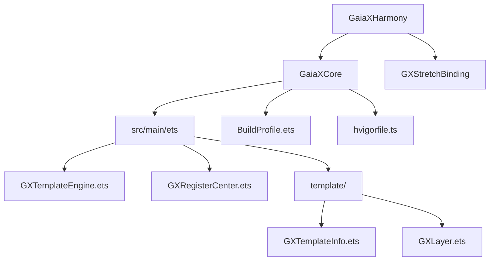
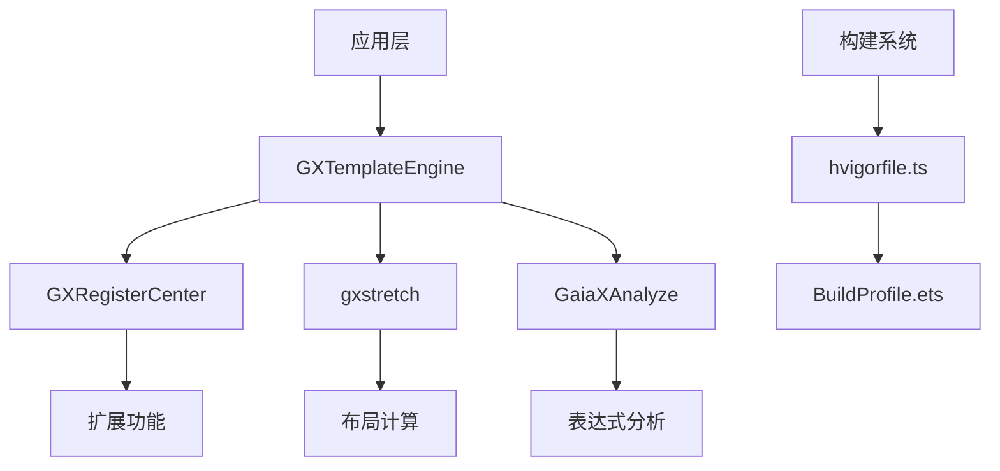
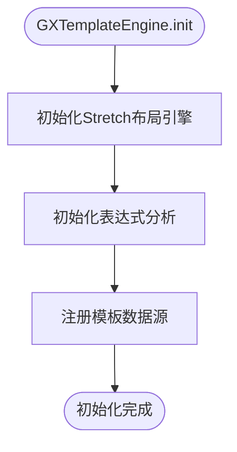
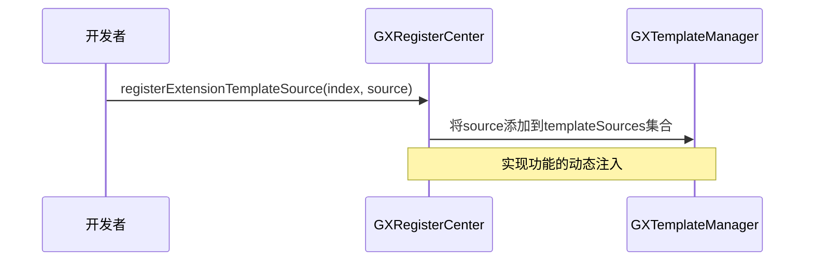
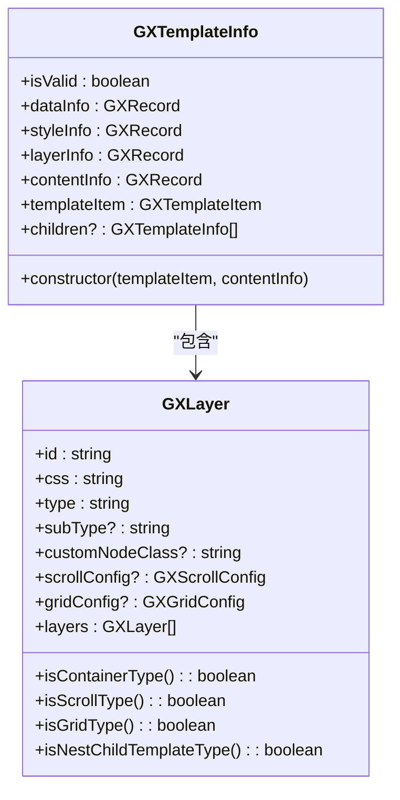
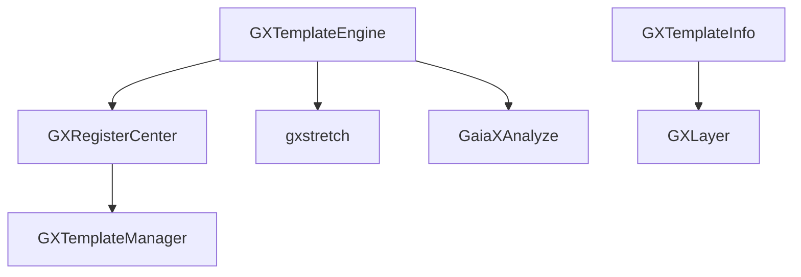

# HarmonyOS实现

<cite>
**本文档引用的文件**   
- [GXTemplateEngine.ets](file://GaiaXHarmony/GaiaXCore/GaiaX/src/main/ets/GXTemplateEngine.ets)
- [GXRegisterCenter.ets](file://GaiaXHarmony/GaiaXCore/GaiaX/src/main/ets/GXRegisterCenter.ets)
- [GXTemplateInfo.ets](file://GaiaXHarmony/GaiaXCore/GaiaX/src/main/ets/template/GXTemplateInfo.ets)
- [GXLayer.ets](file://GaiaXHarmony/GaiaXCore/GaiaX/src/main/ets/template/GXLayer.ets)
- [hvigorfile.ts](file://GaiaXHarmony/GaiaXCore/GaiaX/hvigorfile.ts)
- [BuildProfile.ets](file://GaiaXHarmony/GaiaXCore/GaiaX/BuildProfile.ets)
</cite>

## 目录
1. [简介](#简介)
2. [项目结构](#项目结构)
3. [核心组件](#核心组件)
4. [架构概述](#架构概述)
5. [详细组件分析](#详细组件分析)
6. [依赖分析](#依赖分析)
7. [性能考虑](#性能考虑)
8. [故障排除指南](#故障排除指南)
9. [结论](#结论)

## 简介
本文档全面介绍了GaiaX在HarmonyOS平台上的实现，重点阐述了基于ArkTS的适配机制。文档详细解析了`GXTemplateEngine.ets`作为主入口的初始化流程，`GXRegisterCenter.ets`提供的功能扩展注册中心，以及`GXTemplateInfo.ets`和`GXLayer.ets`在模板信息解析与层级结构构建中的核心作用。同时，文档说明了`hvigorfile.ts`和`BuildProfile.ets`在HarmonyOS项目构建与配置中的关键角色。为开发者提供了从集成步骤到高级特性的完整指南。

## 项目结构
GaiaX的HarmonyOS实现位于`GaiaXHarmony`目录下，其核心逻辑由`GaiaXCore`模块承载。该模块采用HarmonyOS推荐的模块化结构，主要包含`src/main/ets`目录存放ArkTS源码，`resources`目录存放资源文件。构建配置由`hvigorfile.ts`和`BuildProfile.ets`共同管理，确保项目能够顺利编译和打包。

**图表来源**
- [GXTemplateEngine.ets](file://GaiaXHarmony/GaiaXCore/GaiaX/src/main/ets/GXTemplateEngine.ets)
- [GXRegisterCenter.ets](file://GaiaXHarmony/GaiaXCore/GaiaX/src/main/ets/GXRegisterCenter.ets)
- [GXTemplateInfo.ets](file://GaiaXHarmony/GaiaXCore/GaiaX/src/main/ets/template/GXTemplateInfo.ets)
- [GXLayer.ets](file://GaiaXHarmony/GaiaXCore/GaiaX/src/main/ets/template/GXLayer.ets)
- [BuildProfile.ets](file://GaiaXHarmony/GaiaXCore/GaiaX/BuildProfile.ets)
- [hvigorfile.ts](file://GaiaXHarmony/GaiaXCore/GaiaX/hvigorfile.ts)

**章节来源**
- [GXTemplateEngine.ets](file://GaiaXHarmony/GaiaXCore/GaiaX/src/main/ets/GXTemplateEngine.ets)
- [GXRegisterCenter.ets](file://GaiaXHarmony/GaiaXCore/GaiaX/src/main/ets/GXRegisterCenter.ets)

## 核心组件
`GXTemplateEngine.ets`是整个GaiaX引擎在HarmonyOS上的启动入口，负责初始化核心依赖。`GXRegisterCenter.ets`作为注册中心，允许业务方注入自定义功能。`GXTemplateInfo.ets`和`GXLayer.ets`共同协作，将JSON格式的模板数据解析为内存中的结构化对象，为后续的渲染提供数据基础。

**章节来源**
- [GXTemplateEngine.ets](file://GaiaXHarmony/GaiaXCore/GaiaX/src/main/ets/GXTemplateEngine.ets#L24-L44)
- [GXRegisterCenter.ets](file://GaiaXHarmony/GaiaXCore/GaiaX/src/main/ets/GXRegisterCenter.ets#L20-L26)
- [GXTemplateInfo.ets](file://GaiaXHarmony/GaiaXCore/GaiaX/src/main/ets/template/GXTemplateInfo.ets#L21-L61)

## 架构概述
GaiaX for HarmonyOS的架构遵循分层设计原则。最上层是`GXTemplateEngine`，作为统一的API入口。其下是`GXRegisterCenter`，提供可扩展的插件机制。核心数据处理层由`GXTemplateInfo`和`GXLayer`构成，负责模板的解析与管理。底层则依赖于`gxstretch`（Rust布局引擎）进行精确的布局计算，并通过Hvigor构建系统进行项目管理。

**图表来源**
- [GXTemplateEngine.ets](file://GaiaXHarmony/GaiaXCore/GaiaX/src/main/ets/GXTemplateEngine.ets#L24-L44)
- [GXRegisterCenter.ets](file://GaiaXHarmony/GaiaXCore/GaiaX/src/main/ets/GXRegisterCenter.ets#L20-L26)
- [hvigorfile.ts](file://GaiaXHarmony/GaiaXCore/GaiaX/hvigorfile.ts#L1-L7)
- [BuildProfile.ets](file://GaiaXHarmony/GaiaXCore/GaiaX/BuildProfile.ets#L1-L6)

## 详细组件分析
### GXTemplateEngine分析
`GXTemplateEngine`是一个单例类，通过`instance`静态属性提供全局访问点。其`init`方法是引擎启动的关键，负责初始化布局引擎`Stretch`、表达式分析模块`GaiaXAnalyze`，并注册默认的模板数据源。

#### 初始化流程

**图表来源**
- [GXTemplateEngine.ets](file://GaiaXHarmony/GaiaXCore/GaiaX/src/main/ets/GXTemplateEngine.ets#L28-L38)

**章节来源**
- [GXTemplateEngine.ets](file://GaiaXHarmony/GaiaXCore/GaiaX/src/main/ets/GXTemplateEngine.ets#L24-L44)

### GXRegisterCenter分析
`GXRegisterCenter`是GaiaX的扩展点注册中心，采用单例模式。它允许开发者通过`registerExtensionTemplateSource`等方法注册自定义的数据源、表达式处理器或UI组件，从而实现框架的功能扩展。

#### 功能扩展机制

**图表来源**
- [GXRegisterCenter.ets](file://GaiaXHarmony/GaiaXCore/GaiaX/src/main/ets/GXRegisterCenter.ets#L23-L25)
- [GXTemplateManager](file://GaiaXHarmony/GaiaXCore/GaiaX/src/main/ets/template/GXTemplateManager.ets)

**章节来源**
- [GXRegisterCenter.ets](file://GaiaXHarmony/GaiaXCore/GaiaX/src/main/ets/GXRegisterCenter.ets#L20-L26)

### GXTemplateInfo与GXLayer分析
`GXTemplateInfo`是模板信息的顶层容器，它持有一个`GXLayer`对象，该对象代表了模板的根节点。`GXLayer`是一个递归数据结构，通过`layers`字段形成树状层级，精确地描述了模板的UI结构。

#### 模板信息与层级结构

**图表来源**
- [GXTemplateInfo.ets](file://GaiaXHarmony/GaiaXCore/GaiaX/src/main/ets/template/GXTemplateInfo.ets#L21-L61)
- [GXLayer.ets](file://GaiaXHarmony/GaiaXCore/GaiaX/src/main/ets/template/GXLayer.ets)

**章节来源**
- [GXTemplateInfo.ets](file://GaiaXHarmony/GaiaXCore/GaiaX/src/main/ets/template/GXTemplateInfo.ets#L21-L61)
- [GXLayer.ets](file://GaiaXHarmony/GaiaXCore/GaiaX/src/main/ets/template/GXLayer.ets)

### 构建与配置分析
HarmonyOS项目的构建由Hvigor系统驱动。`hvigorfile.ts`定义了构建任务和插件，而`BuildProfile.ets`则包含了构建的元数据，如版本号、构建模式等。

#### 构建配置
| 配置项 | 描述 | 来源 |
| :--- | :--- | :--- |
| HAR_VERSION | HAR包的版本号 | [BuildProfile.ets](file://GaiaXHarmony/GaiaXCore/GaiaX/BuildProfile.ets#L2) |
| BUILD_MODE_NAME | 构建模式 (debug/release) | [BuildProfile.ets](file://GaiaXHarmony/GaiaXCore/GaiaX/BuildProfile.ets#L3) |
| DEBUG | 是否为调试模式 | [BuildProfile.ets](file://GaiaXHarmony/GaiaXCore/GaiaX/BuildProfile.ets#L4) |
| TARGET_NAME | 构建目标名称 | [BuildProfile.ets](file://GaiaXHarmony/GaiaXCore/GaiaX/BuildProfile.ets#L5) |
| system | 内置的Hvigor构建任务 | [hvigorfile.ts](file://GaiaXHarmony/GaiaXCore/GaiaX/hvigorfile.ts#L4) |

**章节来源**
- [hvigorfile.ts](file://GaiaXHarmony/GaiaXCore/GaiaX/hvigorfile.ts#L1-L7)
- [BuildProfile.ets](file://GaiaXHarmony/GaiaXCore/GaiaX/BuildProfile.ets#L1-L6)

## 依赖分析
GaiaX for HarmonyOS的依赖关系清晰。`GXTemplateEngine`直接依赖`GXRegisterCenter`、`gxstretch`和`GaiaXAnalyze`。`GXRegisterCenter`又依赖`GXTemplateManager`来管理扩展。`GXTemplateInfo`和`GXLayer`是紧密耦合的核心数据模型。

**图表来源**
- [GXTemplateEngine.ets](file://GaiaXHarmony/GaiaXCore/GaiaX/src/main/ets/GXTemplateEngine.ets#L17-L23)
- [GXRegisterCenter.ets](file://GaiaXHarmony/GaiaXCore/GaiaX/src/main/ets/GXRegisterCenter.ets#L18)
- [GXTemplateInfo.ets](file://GaiaXHarmony/GaiaXCore/GaiaX/src/main/ets/template/GXTemplateInfo.ets)

**章节来源**
- [GXTemplateEngine.ets](file://GaiaXHarmony/GaiaXCore/GaiaX/src/main/ets/GXTemplateEngine.ets)
- [GXRegisterCenter.ets](file://GaiaXHarmony/GaiaXCore/GaiaX/src/main/ets/GXRegisterCenter.ets)
- [GXTemplateInfo.ets](file://GaiaXHarmony/GaiaXCore/GaiaX/src/main/ets/template/GXTemplateInfo.ets)

## 性能考虑
为了优化性能，GaiaX在HarmonyOS上采取了多项措施。首先，通过`GXGlobalCache`缓存已解析的模板信息和布局结果，避免重复计算。其次，`GXTemplateEngine`的`init`方法确保了核心依赖的单次初始化。最后，`GXLayer`的递归结构设计使得模板的遍历和操作非常高效。

## 故障排除指南
在集成过程中，如果遇到模板无法渲染的问题，请检查以下几点：
1.  **引擎初始化**：确保在使用`GXTemplateEngine`前已调用`init()`方法。
2.  **数据源注册**：确认`GXRegisterCenter`已正确注册了模板数据源。
3.  **构建配置**：检查`hvigorfile.ts`和`BuildProfile.ets`是否配置正确，确保项目能成功构建。
4.  **模板格式**：验证传入的模板JSON数据是否符合规范，特别是`layer`和`style`字段不能为空。

**章节来源**
- [GXTemplateEngine.ets](file://GaiaXHarmony/GaiaXCore/GaiaX/src/main/ets/GXTemplateEngine.ets#L28-L38)
- [GXRegisterCenter.ets](file://GaiaXHarmony/GaiaXCore/GaiaX/src/main/ets/GXRegisterCenter.ets#L23-L25)
- [GXTemplateInfo.ets](file://GaiaXHarmony/GaiaXCore/GaiaX/src/main/ets/template/GXTemplateInfo.ets#L47-L57)
- [hvigorfile.ts](file://GaiaXHarmony/GaiaXCore/GaiaX/hvigorfile.ts)
- [BuildProfile.ets](file://GaiaXHarmony/GaiaXCore/GaiaX/BuildProfile.ets)

## 结论
GaiaX在HarmonyOS平台上的实现充分利用了ArkTS语言特性和HarmonyOS的UI框架，通过清晰的架构设计和高效的组件协作，实现了高性能的跨平台模板渲染。`GXTemplateEngine`作为核心入口，`GXRegisterCenter`提供灵活的扩展机制，而`GXTemplateInfo`和`GXLayer`则确保了模板数据的准确解析。结合Hvigor构建系统，为开发者提供了一套完整的、易于集成的解决方案。