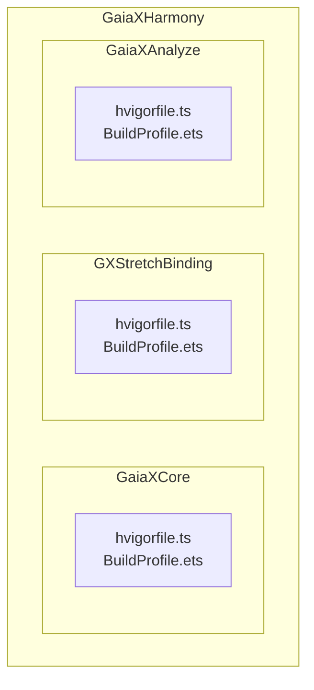
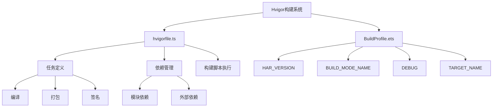
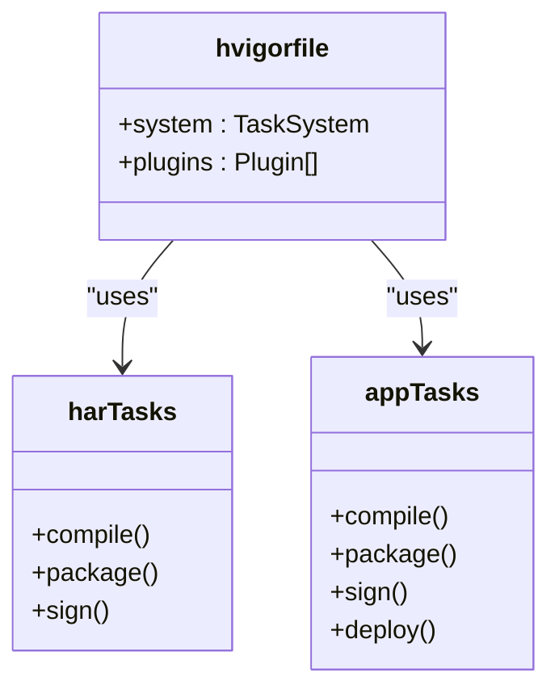
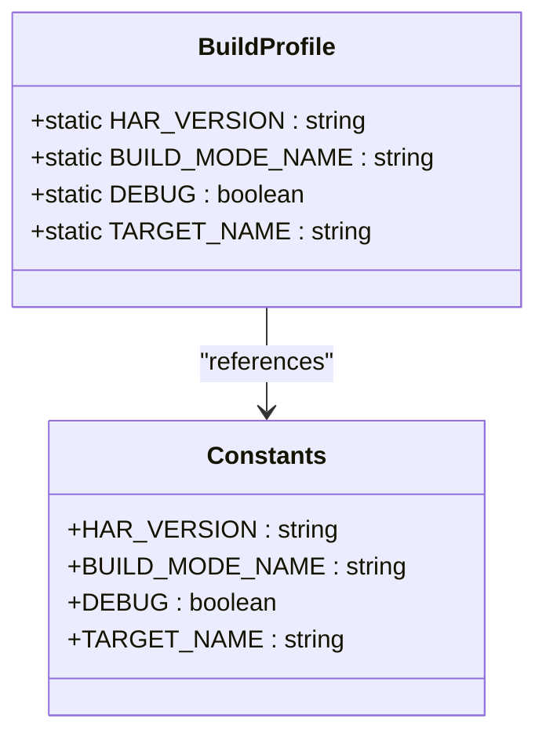
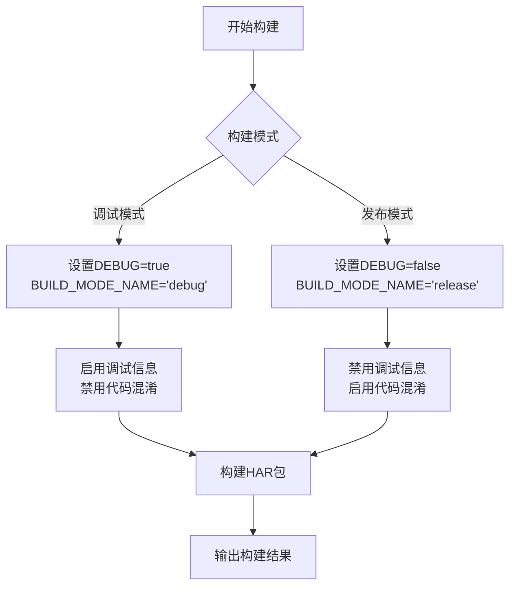

# 构建配置

<cite>
**Referenced Files in This Document**   
- [hvigorfile.ts](file://GaiaXHarmony/GaiaXCore/GaiaX/hvigorfile.ts)
- [BuildProfile.ets](file://GaiaXHarmony/GaiaXCore/GaiaX/BuildProfile.ets)
- [hvigorfile.ts](file://GaiaXHarmony/GXStretchBinding/GXStretch/hvigorfile.ts)
- [BuildProfile.ets](file://GaiaXHarmony/GXStretchBinding/GXStretch/BuildProfile.ets)
</cite>

## 目录
1. [简介](#简介)
2. [项目结构](#项目结构)
3. [核心组件](#核心组件)
4. [架构概述](#架构概述)
5. [详细组件分析](#详细组件分析)
6. [依赖分析](#依赖分析)
7. [性能考虑](#性能考虑)
8. [故障排除指南](#故障排除指南)
9. [结论](#结论)

## 简介
本文档详细介绍了GaiaX HarmonyOS项目的构建配置机制，重点阐述了hvigorfile.ts和BuildProfile.ets两个核心配置文件在项目构建流程中的作用。文档将深入分析构建任务定义、依赖管理、构建脚本执行等关键环节，并解释HAR_VERSION、BUILD_MODE_NAME等常量的用途及其在不同构建模式下的行为差异。通过实际配置示例，展示如何进行项目定制化构建，包括调试模式与发布模式的切换、目标设备配置和版本管理。

## 项目结构
GaiaX HarmonyOS项目的构建配置主要分布在多个模块中，每个模块都有其特定的构建需求和配置文件。核心的构建配置文件位于各个功能模块的根目录下，主要包括hvigorfile.ts和BuildProfile.ets两个文件。这些文件共同定义了项目的构建行为、任务流程和环境常量。



**Diagram sources**
- [hvigorfile.ts](file://GaiaXHarmony/GaiaXCore/GaiaX/hvigorfile.ts)
- [BuildProfile.ets](file://GaiaXHarmony/GaiaXCore/GaiaX/BuildProfile.ets)
- [hvigorfile.ts](file://GaiaXHarmony/GXStretchBinding/GXStretch/hvigorfile.ts)
- [BuildProfile.ets](file://GaiaXHarmony/GXStretchBinding/GXStretch/BuildProfile.ets)

**Section sources**
- [hvigorfile.ts](file://GaiaXHarmony/GaiaXCore/GaiaX/hvigorfile.ts)
- [BuildProfile.ets](file://GaiaXHarmony/GaiaXCore/GaiaX/BuildProfile.ets)

## 核心组件
本项目的核心构建组件包括hvigorfile.ts和BuildProfile.ets两个文件。hvigorfile.ts是HarmonyOS项目的构建任务配置文件，负责定义构建流程中的各种任务及其依赖关系。BuildProfile.ets则是构建配置文件，包含了一系列在构建过程中使用的常量，如版本号、构建模式等。这两个文件协同工作，确保项目能够按照预设的配置进行正确构建。

**Section sources**
- [hvigorfile.ts](file://GaiaXHarmony/GaiaXCore/GaiaX/hvigorfile.ts)
- [BuildProfile.ets](file://GaiaXHarmony/GaiaXCore/GaiaX/BuildProfile.ets)

## 架构概述
GaiaX HarmonyOS的构建架构基于Hvigor构建系统，采用模块化的配置方式。每个功能模块都有独立的hvigorfile.ts文件来定义其构建任务，同时通过BuildProfile.ets文件统一管理构建常量。这种架构设计使得各个模块可以独立配置构建流程，同时又能保持构建常量的一致性。



**Diagram sources**
- [hvigorfile.ts](file://GaiaXHarmony/GaiaXCore/GaiaX/hvigorfile.ts)
- [BuildProfile.ets](file://GaiaXHarmony/GaiaXCore/GaiaX/BuildProfile.ets)

## 详细组件分析

### hvigorfile.ts 分析
hvigorfile.ts是HarmonyOS项目的构建配置文件，它定义了项目的构建任务和插件配置。文件通过导入@ohos/hvigor-ohos-plugin提供的任务系统，并将其赋值给system字段来配置内置的构建任务。plugins字段则用于配置自定义插件，以扩展Hvigor的功能。

在GaiaX项目中，不同的模块使用了不同的任务系统：GaiaXCore和GXStretchBinding模块使用harTasks，这表明它们是Harmony Archive (HAR) 模块；而其他一些模块使用appTasks，表明它们是应用程序模块。这种差异化的配置反映了不同模块在构建过程中的不同需求。



**Diagram sources**
- [hvigorfile.ts](file://GaiaXHarmony/GaiaXCore/GaiaX/hvigorfile.ts)
- [hvigorfile.ts](file://GaiaXHarmony/GXStretchBinding/GXStretch/hvigorfile.ts)

**Section sources**
- [hvigorfile.ts](file://GaiaXHarmony/GaiaXCore/GaiaX/hvigorfile.ts)
- [hvigorfile.ts](file://GaiaXHarmony/GXStretchBinding/GXStretch/hvigorfile.ts)

### BuildProfile.ets 分析
BuildProfile.ets文件定义了构建过程中使用的常量，这些常量可以在ArkTS代码中被引用，以实现条件编译和环境适配。文件中定义了四个主要常量：HAR_VERSION表示模块版本号，BUILD_MODE_NAME表示构建模式名称，DEBUG表示是否为调试模式，TARGET_NAME表示目标设备名称。

值得注意的是，存在两种形式的BuildProfile.ets文件：一种是仅包含静态常量的简洁版本，另一种是同时包含独立常量和静态类属性的兼容版本。后者通过将独立常量赋值给类的静态属性，实现了向后兼容，使得旧代码可以继续通过类属性的方式访问这些常量。



**Diagram sources**
- [BuildProfile.ets](file://GaiaXHarmony/GaiaXCore/GaiaX/BuildProfile.ets)
- [BuildProfile.ets](file://GaiaXHarmony/GXStretchBinding/GXStretch/BuildProfile.ets)

**Section sources**
- [BuildProfile.ets](file://GaiaXHarmony/GaiaXCore/GaiaX/BuildProfile.ets)
- [BuildProfile.ets](file://GaiaXHarmony/GXStretchBinding/GXStretch/BuildProfile.ets)

### 构建配置示例
以下是一个典型的构建配置示例，展示了如何通过修改配置文件来适应不同场景的需求：



**Diagram sources**
- [BuildProfile.ets](file://GaiaXHarmony/GaiaXCore/GaiaX/BuildProfile.ets)

## 依赖分析
通过分析项目结构，可以看出GaiaX HarmonyOS的构建配置具有清晰的模块化依赖关系。每个功能模块独立维护自己的构建配置，减少了模块间的耦合。同时，通过统一的常量命名规范，确保了构建配置的一致性。

```mermaid
graph TD
A[GaiaXCore] --> B[hvigorfile.ts]
A --> C[BuildProfile.ets]
D[GXStretchBinding] --> E[hvigorfile.ts]
D --> F[BuildProfile.ets]
B --> G[harTasks]
E --> G
C --> H[版本管理]
F --> H
G --> I[@ohos/hvigor-ohos-plugin]
H --> J[构建模式切换]
```

**Diagram sources**
- [hvigorfile.ts](file://GaiaXHarmony/GaiaXCore/GaiaX/hvigorfile.ts)
- [BuildProfile.ets](file://GaiaXHarmony/GaiaXCore/GaiaX/BuildProfile.ets)
- [hvigorfile.ts](file://GaiaXHarmony/GXStretchBinding/GXStretch/hvigorfile.ts)
- [BuildProfile.ets](file://GaiaXHarmony/GXStretchBinding/GXStretch/BuildProfile.ets)

**Section sources**
- [hvigorfile.ts](file://GaiaXHarmony/GaiaXCore/GaiaX/hvigorfile.ts)
- [BuildProfile.ets](file://GaiaXHarmony/GaiaXCore/GaiaX/BuildProfile.ets)

## 性能考虑
合理的构建配置对项目性能有重要影响。通过正确配置构建任务和优化构建流程，可以显著减少构建时间。建议在开发阶段使用调试模式以获得更好的调试体验，在发布阶段切换到发布模式以优化应用性能和安全性。

## 故障排除指南
在构建过程中可能遇到的常见问题包括：构建任务执行失败、依赖解析错误、常量引用问题等。解决这些问题的关键是检查hvigorfile.ts中的任务配置是否正确，以及BuildProfile.ets中的常量定义是否符合预期。同时，确保Hvigor构建系统的版本与项目要求相匹配。

**Section sources**
- [hvigorfile.ts](file://GaiaXHarmony/GaiaXCore/GaiaX/hvigorfile.ts)
- [BuildProfile.ets](file://GaiaXHarmony/GaiaXCore/GaiaX/BuildProfile.ets)

## 结论
GaiaX HarmonyOS的构建配置体系通过hvigorfile.ts和BuildProfile.ets两个核心文件，实现了灵活而可靠的构建管理。开发者可以通过修改这些配置文件来适应不同的构建需求，包括模式切换、版本管理和目标设备配置。理解这些配置文件的作用和相互关系，对于高效开发和维护GaiaX项目至关重要。