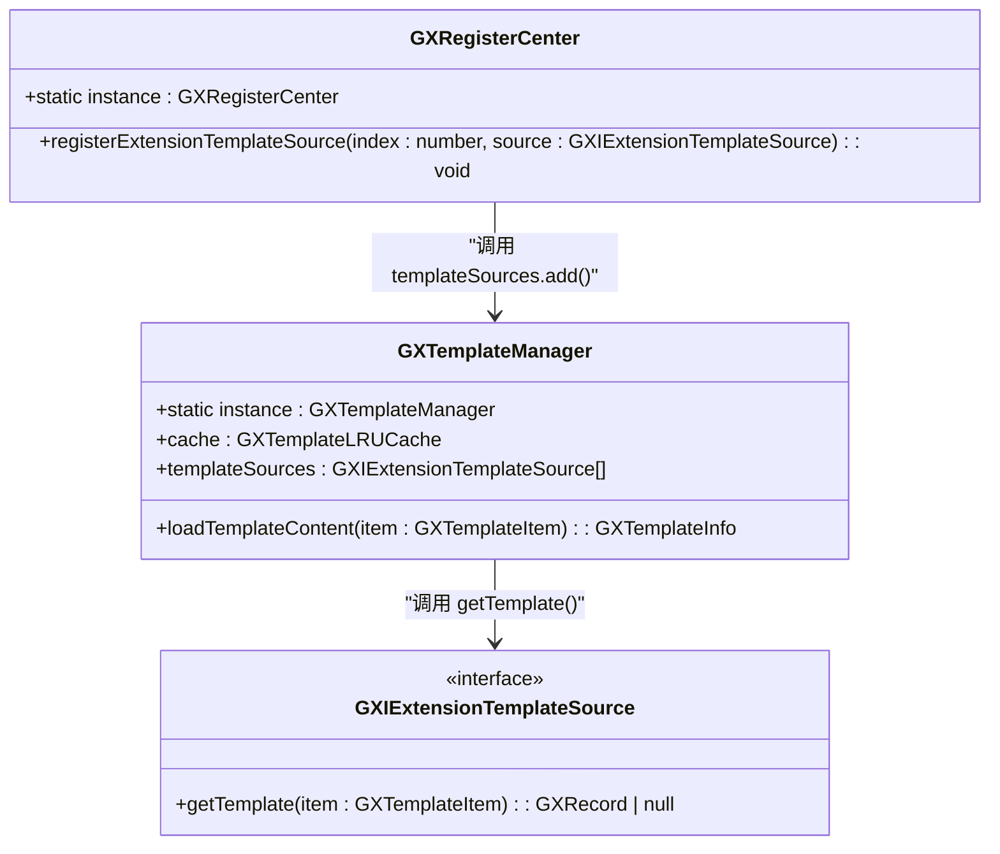
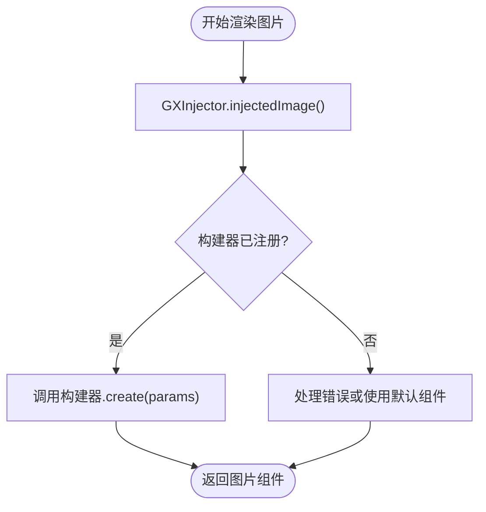
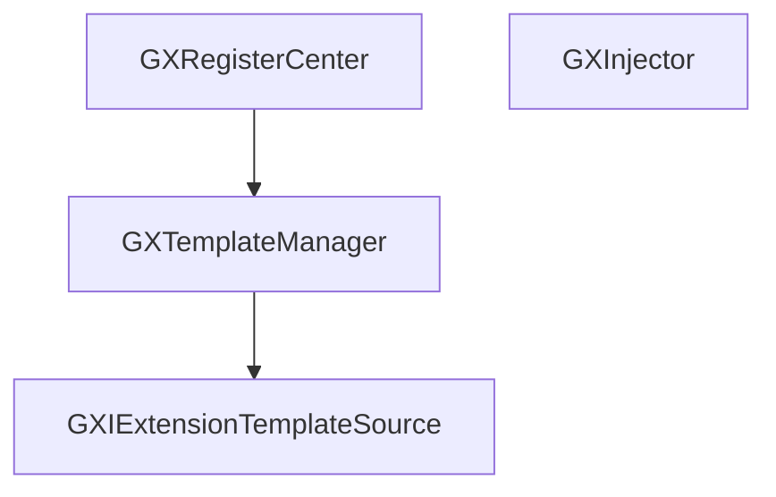

# 扩展中心

<cite>
**本文档引用文件**  
- [GXRegisterCenter.ets](file://GaiaXHarmony/GaiaXCore/GaiaX/src/main/ets/GXRegisterCenter.ets)
- [GXExtensionTemplateSource.ets](file://GaiaXHarmony/GaiaXCore/GaiaX/src/main/ets/source/GXExtensionTemplateSource.ets)
- [GXInjector.ets](file://GaiaXHarmony/GaiaXCore/GaiaX/src/main/ets/components/injector/GXInjector.ets)
- [GXTemplateManager.ets](file://GaiaXHarmony/GaiaXCore/GaiaX/src/main/ets/template/GXTemplateManager.ets)
</cite>

## 目录
1. [简介](#简介)
2. [项目结构](#项目结构)
3. [核心组件](#核心组件)
4. [架构概览](#架构概览)
5. [详细组件分析](#详细组件分析)
6. [依赖分析](#依赖分析)
7. [性能考量](#性能考量)
8. [故障排除指南](#故障排除指南)
9. [结论](#结论)

## 简介
本文档深入解析 GaiaX HarmonyOS 扩展中心的核心机制，重点阐述 `GXRegisterCenter.ets` 提供的扩展注册体系。涵盖自定义组件、适配器、功能模块的注册方式与调用流程，包括组件注入、模板源扩展和功能服务注册等关键功能。详细说明 `GXExtensionTemplateSource.ets` 对扩展模板源的支持机制以及 `GXInjector.ets` 的依赖注入实现原理。为初学者提供扩展注册的简单示例；为高级开发者剖析注册中心的内部数据结构、线程安全处理和扩展点设计原则。包含实际代码示例，展示如何注册自定义组件和扩展模板加载方式，并说明扩展机制的最佳实践和常见问题解决方案。

## 项目结构
GaiaX HarmonyOS 扩展中心主要位于 `GaiaXHarmony/GaiaXCore/GaiaX/src/main/ets/` 目录下，其核心模块包括注册中心、模板管理、扩展源接口和依赖注入器。项目采用分层结构，清晰划分功能模块，便于扩展和维护。

```mermaid
graph TB
subgraph "扩展中心核心模块"
GXRegisterCenter["GXRegisterCenter.ets<br/>注册中心主入口"]
GXExtensionTemplateSource["GXExtensionTemplateSource.ets<br/>模板源扩展接口"]
GXInjector["GXInjector.ets<br/>依赖注入器"]
GXTemplateManager["GXTemplateManager.ets<br/>模板管理器"]
end
GXRegisterCenter --> GXTemplateManager : "调用"
GXRegisterCenter --> GXExtensionTemplateSource : "注册"
GXInjector --> GXRegisterCenter : "被注册"
GXTemplateManager --> GXExtensionTemplateSource : "查询模板"
```

**图示来源**
- [GXRegisterCenter.ets](file://GaiaXHarmony/GaiaXCore/GaiaX/src/main/ets/GXRegisterCenter.ets)
- [GXExtensionTemplateSource.ets](file://GaiaXHarmony/GaiaXCore/GaiaX/src/main/ets/source/GXExtensionTemplateSource.ets)
- [GXInjector.ets](file://GaiaXHarmony/GaiaXCore/GaiaX/src/main/ets/components/injector/GXInjector.ets)
- [GXTemplateManager.ets](file://GaiaXHarmony/GaiaXCore/GaiaX/src/main/ets/template/GXTemplateManager.ets)

**本节来源**
- [GXRegisterCenter.ets](file://GaiaXHarmony/GaiaXCore/GaiaX/src/main/ets/GXRegisterCenter.ets)
- [GXExtensionTemplateSource.ets](file://GaiaXHarmony/GaiaXCore/GaiaX/src/main/ets/source/GXExtensionTemplateSource.ets)

## 核心组件
本节深入分析扩展中心的三大核心组件：`GXRegisterCenter`（注册中心）、`GXExtensionTemplateSource`（模板源扩展接口）和 `GXInjector`（依赖注入器）。这些组件共同构成了 GaiaX 在 HarmonyOS 上的可扩展性基础。

**本节来源**
- [GXRegisterCenter.ets](file://GaiaXHarmony/GaiaXCore/GaiaX/src/main/ets/GXRegisterCenter.ets#L20-L26)
- [GXExtensionTemplateSource.ets](file://GaiaXHarmony/GaiaXCore/GaiaX/src/main/ets/source/GXExtensionTemplateSource.ets#L20-L22)
- [GXInjector.ets](file://GaiaXHarmony/GaiaXCore/GaiaX/src/main/ets/components/injector/GXInjector.ets#L45-L70)

## 架构概览
GaiaX 扩展中心采用中心化注册与分层查询的架构。`GXRegisterCenter` 作为全局单例，提供统一的注册入口。开发者通过该中心注册各种扩展，如模板源、自定义组件等。`GXTemplateManager` 负责模板的加载与缓存，它会从 `GXRegisterCenter` 注册的多个 `GXExtensionTemplateSource` 中按优先级查询模板内容。

```mermaid
sequenceDiagram
participant 开发者 as "开发者"
participant GXRegisterCenter as "GXRegisterCenter"
participant GXTemplateManager as "GXTemplateManager"
participant GXExtensionTemplateSource as "GXExtensionTemplateSource"
开发者->>GXRegisterCenter : registerExtensionTemplateSource()
GXRegisterCenter->>GXTemplateManager : 将源添加到 templateSources 列表
Note over GXRegisterCenter,GXTemplateManager : 模板源注册
开发者->>GXTemplateManager : loadTemplateContent(templateItem)
GXTemplateManager->>GXTemplateManager : 尝试从缓存获取
alt 缓存命中
GXTemplateManager-->>开发者 : 返回缓存的模板
else 缓存未命中
loop 遍历所有模板源 (从高优先级到低优先级)
GXTemplateManager->>GXExtensionTemplateSource : getTemplate(templateItem)
alt 源返回模板
GXTemplateManager->>GXTemplateManager : 创建 GXTemplateInfo 并缓存
GXTemplateManager-->>开发者 : 返回模板
break 查询成功
end
end
alt 所有源均未返回
GXTemplateManager-->>开发者 : 抛出异常
end
end
```

**图示来源**
- [GXRegisterCenter.ets](file://GaiaXHarmony/GaiaXCore/GaiaX/src/main/ets/GXRegisterCenter.ets#L23-L25)
- [GXTemplateManager.ets](file://GaiaXHarmony/GaiaXCore/GaiaX/src/main/ets/template/GXTemplateManager.ets#L37-L47)
- [GXExtensionTemplateSource.ets](file://GaiaXHarmony/GaiaXCore/GaiaX/src/main/ets/source/GXExtensionTemplateSource.ets#L21)

## 详细组件分析

### GXRegisterCenter 分析
`GXRegisterCenter` 是整个扩展机制的中枢。它采用单例模式（`static instance = new GXRegisterCenter()`），确保全局只有一个注册中心实例。其主要职责是接收来自开发者的扩展注册请求，并将这些扩展分发到相应的管理器中。

在 HarmonyOS 版本中，`GXRegisterCenter` 当前主要负责注册 `GXExtensionTemplateSource`。通过 `registerExtensionTemplateSource` 方法，开发者可以将自定义的模板源添加到 `GXTemplateManager` 的 `templateSources` 列表中。该列表是一个 `List`，新的源被直接添加，查询时从列表末尾开始遍历，实现了简单的优先级机制（后注册的优先级更高）。



**图示来源**
- [GXRegisterCenter.ets](file://GaiaXHarmony/GaiaXCore/GaiaX/src/main/ets/GXRegisterCenter.ets#L20-L25)
- [GXTemplateManager.ets](file://GaiaXHarmony/GaiaXCore/GaiaX/src/main/ets/template/GXTemplateManager.ets#L24-L27)
- [GXExtensionTemplateSource.ets](file://GaiaXHarmony/GaiaXCore/GaiaX/src/main/ets/source/GXExtensionTemplateSource.ets#L20-L22)

**本节来源**
- [GXRegisterCenter.ets](file://GaiaXHarmony/GaiaXCore/GaiaX/src/main/ets/GXRegisterCenter.ets#L20-L26)
- [GXTemplateManager.ets](file://GaiaXHarmony/GaiaXCore/GaiaX/src/main/ets/template/GXTemplateManager.ets#L24-L74)

### GXExtensionTemplateSource 分析
`GXExtensionTemplateSource` 是一个接口（`interface`），定义了模板源扩展的标准契约。任何想要提供模板内容的模块都必须实现此接口，并实现 `getTemplate` 方法。

`getTemplate` 方法接收一个 `GXTemplateItem` 对象作为参数，该对象包含了模板的标识信息（如模板 ID、版本等）。实现者需要根据这些信息，从其数据源（可能是本地文件、网络、数据库等）获取模板内容，并以 `GXRecord`（一个键值对集合）的形式返回。如果未找到对应的模板，则返回 `null`。

这种设计使得模板的加载逻辑完全可插拔。开发者可以轻松地集成自己的模板分发系统，例如从 CDN 动态加载模板，或从应用的私有存储中读取加密模板。

**本节来源**
- [GXExtensionTemplateSource.ets](file://GaiaXHarmony/GaiaXCore/GaiaX/src/main/ets/source/GXExtensionTemplateSource.ets#L20-L22)

### GXInjector 分析
`GXInjector` 是一个专门用于组件依赖注入的工具类，当前主要负责图片组件的注入。它同样采用单例模式（`static instance = new GXInjector()`）。

其核心是一个 `injectorMap`，一个以 `InjectType` 为键、`WrappedBuilder` 为值的映射表。`GXInjector` 定义了一个 `GXImageBuilderParams` 类，用于封装构建图片组件所需的所有参数，如图片 URL、占位图、缩放模式、尺寸和回调函数等。

通过 `registerImage` 方法，开发者可以注册一个 `WrappedBuilder`，该构建器能够根据 `GXImageBuilderParams` 创建出实际的图片 UI 组件。当框架需要渲染一个图片时，会通过 `injectedImage` 方法从 `injectorMap` 中获取已注册的构建器，然后使用它来创建具体的图片实例。



**图示来源**
- [GXInjector.ets](file://GaiaXHarmony/GaiaXCore/GaiaX/src/main/ets/components/injector/GXInjector.ets#L45-L68)

**本节来源**
- [GXInjector.ets](file://GaiaXHarmony/GaiaXCore/GaiaX/src/main/ets/components/injector/GXInjector.ets#L17-L70)

## 依赖分析
扩展中心各组件之间的依赖关系清晰且松耦合。`GXRegisterCenter` 依赖于 `GXTemplateManager` 来管理模板源，但不直接依赖于具体的 `GXExtensionTemplateSource` 实现。`GXTemplateManager` 依赖于 `GXIExtensionTemplateSource` 接口进行模板查询，实现了面向接口编程。

`GXInjector` 作为一个独立的注入工具，与 `GXRegisterCenter` 和 `GXTemplateManager` 无直接依赖，但其注册的组件最终会被模板渲染引擎所使用。



**图示来源**
- [GXRegisterCenter.ets](file://GaiaXHarmony/GaiaXCore/GaiaX/src/main/ets/GXRegisterCenter.ets#L24)
- [GXTemplateManager.ets](file://GaiaXHarmony/GaiaXCore/GaiaX/src/main/ets/template/GXTemplateManager.ets#L27)
- [GXExtensionTemplateSource.ets](file://GaiaXHarmony/GaiaXCore/GaiaX/src/main/ets/source/GXExtensionTemplateSource.ets#L20)

**本节来源**
- [GXRegisterCenter.ets](file://GaiaXHarmony/GaiaXCore/GaiaX/src/main/ets/GXRegisterCenter.ets)
- [GXTemplateManager.ets](file://GaiaXHarmony/GaiaXCore/GaiaX/src/main/ets/template/GXTemplateManager.ets)
- [GXExtensionTemplateSource.ets](file://GaiaXHarmony/GaiaXCore/GaiaX/src/main/ets/source/GXExtensionTemplateSource.ets)

## 性能考量
扩展中心的设计考虑了性能因素。`GXTemplateManager` 内置了 `GXTemplateLRUCache`，对已加载的模板进行 LRU 缓存，避免了重复的 I/O 操作，显著提升了模板加载速度。

在模板源查询方面，采用从列表末尾向前遍历的方式，允许开发者通过注册顺序控制优先级，避免了不必要的查询开销。然而，当前实现中未对 `templateSources` 列表的访问进行显式的线程安全控制，在多线程环境下注册或查询模板可能存在风险，建议在初始化阶段完成所有注册操作。

## 故障排除指南
- **问题：注册的模板源未生效**
  - **检查点**：确认 `registerExtensionTemplateSource` 方法已被调用。
  - **检查点**：确认 `GXExtensionTemplateSource` 的 `getTemplate` 方法实现正确，能根据 `GXTemplateItem` 返回有效的 `GXRecord`。
  - **检查点**：检查 `GXTemplateItem` 的信息是否与模板源期望的匹配。

- **问题：图片无法显示**
  - **检查点**：确认已通过 `GXInjector.registerImage` 注册了图片构建器。
  - **检查点**：检查 `WrappedBuilder` 的实现是否正确处理了 `GXImageBuilderParams` 中的所有参数，特别是 URL 和回调函数。

- **问题：应用启动慢**
  - **检查点**：检查是否有过多的模板源注册，导致 `loadTemplateContent` 方法需要遍历大量源。
  - **建议**：优化模板源的查询逻辑，或确保高频使用的模板源后注册（高优先级）。

**本节来源**
- [GXRegisterCenter.ets](file://GaiaXHarmony/GaiaXCore/GaiaX/src/main/ets/GXRegisterCenter.ets)
- [GXTemplateManager.ets](file://GaiaXHarmony/GaiaXCore/GaiaX/src/main/ets/template/GXTemplateManager.ets)
- [GXInjector.ets](file://GaiaXHarmony/GaiaXCore/GaiaX/src/main/ets/components/injector/GXInjector.ets)

## 结论
GaiaX HarmonyOS 扩展中心通过 `GXRegisterCenter`、`GXExtensionTemplateSource` 和 `GXInjector` 等核心组件，提供了一套灵活、可扩展的机制。它允许开发者无缝集成自定义功能，如动态模板加载和自定义组件渲染。其清晰的架构和接口设计，使得系统易于维护和二次开发。对于希望深度定制 GaiaX 行为的开发者而言，理解并掌握这套扩展机制至关重要。