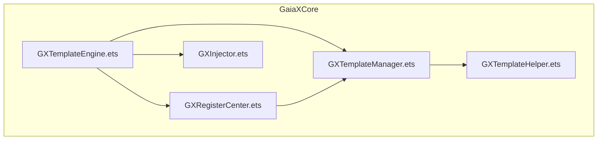
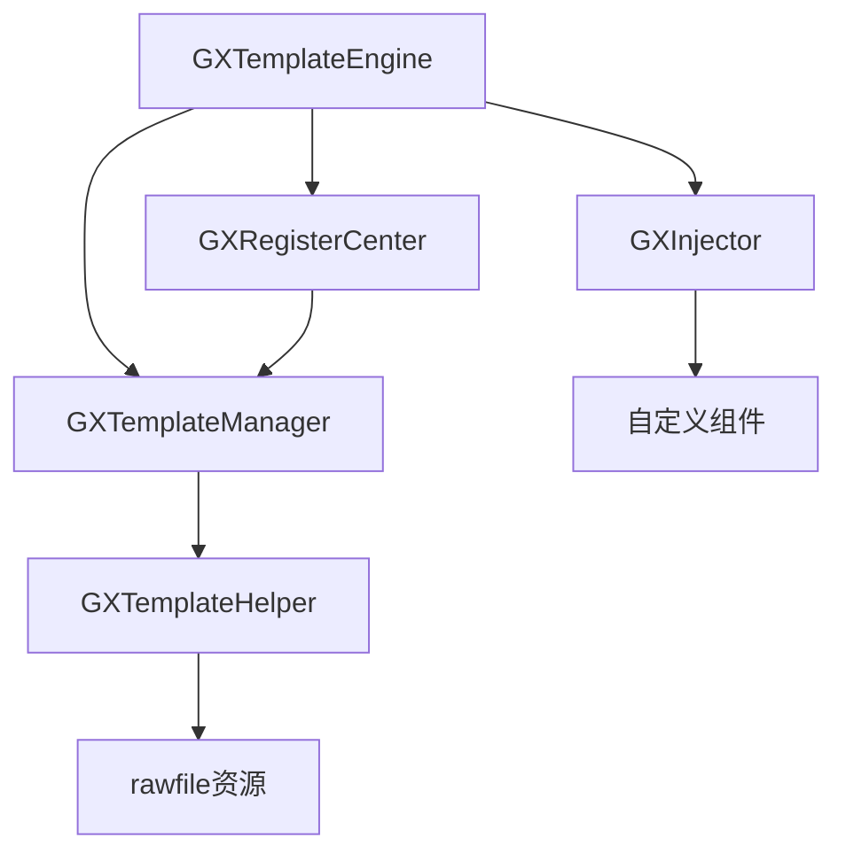
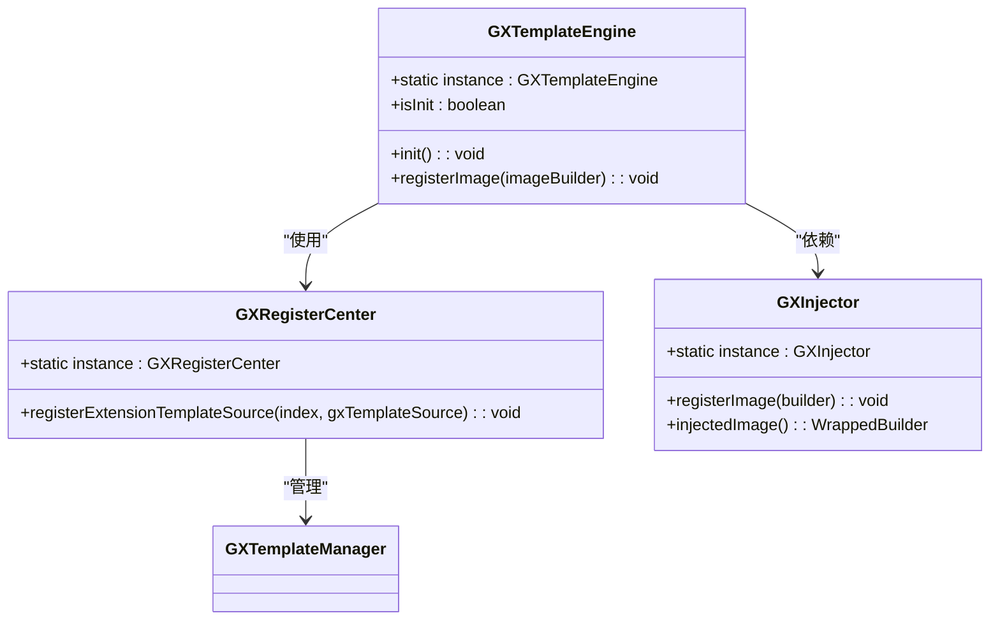
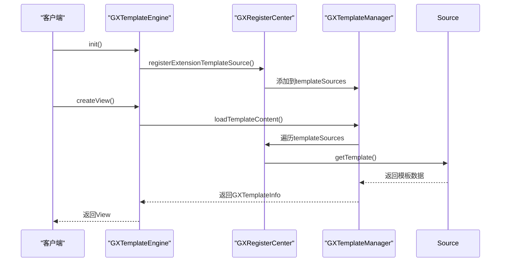
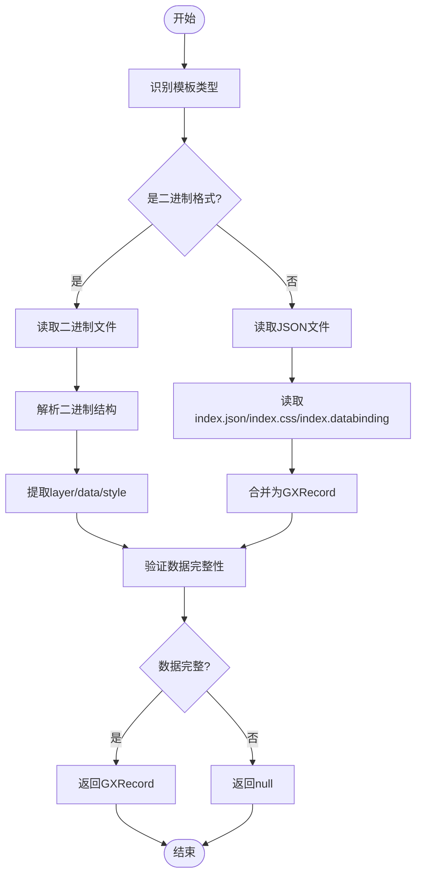
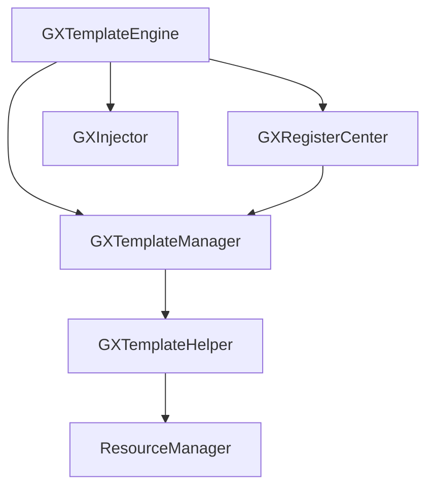

# 核心引擎

<cite>
**本文档引用文件**  
- [GXTemplateEngine.ets](file://GaiaXHarmony/GaiaXCore/GaiaX/src/main/ets/GXTemplateEngine.ets)
- [GXRegisterCenter.ets](file://GaiaXHarmony/GaiaXCore/GaiaX/src/main/ets/GXRegisterCenter.ets)
- [GXRawBinaryWithouSuffixTemplateSource.ets](file://GaiaXHarmony/GaiaXCore/GaiaX/src/main/ets/source/GXRawBinaryWithouSuffixTemplateSource.ets)
- [GXRawFileTemplateSource.ets](file://GaiaXHarmony/GaiaXCore/GaiaX/src/main/ets/source/GXRawFileTemplateSource.ets)
- [GXTemplateManager.ets](file://GaiaXHarmony/GaiaXCore/GaiaX/src/main/ets/template/GXTemplateManager.ets)
- [GXInjector.ets](file://GaiaXHarmony/GaiaXCore/GaiaX/src/main/ets/components/injector/GXInjector.ets)
- [GXTemplateHelper.ets](file://GaiaXHarmony/GaiaXCore/GaiaX/src/main/ets/template/GXTemplateHelper.ets)
</cite>

## 目录
1. [引言](#引言)
2. [项目结构](#项目结构)
3. [核心组件](#核心组件)
4. [架构概述](#架构概述)
5. [详细组件分析](#详细组件分析)
6. [依赖分析](#依赖分析)
7. [性能考虑](#性能考虑)
8. [故障排除指南](#故障排除指南)
9. [结论](#结论)

## 引言
GaiaX HarmonyOS核心引擎是跨平台高性能模板渲染系统的核心实现，基于ArkTS语言构建，支持纯Native渲染。该引擎通过GXTemplateEngine.ets作为主入口，提供模板初始化、渲染调度、资源管理及生命周期控制等核心功能。通过GXRegisterCenter.ets实现扩展注册机制，支持自定义组件、适配器和功能模块的灵活集成。本文档深入解析引擎的实现机制，为开发者提供从入门到高级的全面指导。

## 项目结构
GaiaX HarmonyOS核心引擎的项目结构遵循HarmonyOS应用开发规范，采用模块化设计。核心功能位于GaiaXHarmony/GaiaXCore/GaiaX目录下，主要包含ets源码、资源文件和构建配置。引擎的主入口GXTemplateEngine.ets位于src/main/ets目录，与GXRegisterCenter.ets共同构成核心控制中心。资源管理通过rawfile目录实现，支持二进制和明文模板的加载。

**图表来源**  
- [GXTemplateEngine.ets](file://GaiaXHarmony/GaiaXCore/GaiaX/src/main/ets/GXTemplateEngine.ets)
- [GXRegisterCenter.ets](file://GaiaXHarmony/GaiaXCore/GaiaX/src/main/ets/GXRegisterCenter.ets)
- [GXTemplateManager.ets](file://GaiaXHarmony/GaiaXCore/GaiaX/src/main/ets/template/GXTemplateManager.ets)

**章节来源**  
- [GXTemplateEngine.ets](file://GaiaXHarmony/GaiaXCore/GaiaX/src/main/ets/GXTemplateEngine.ets)
- [GXRegisterCenter.ets](file://GaiaXHarmony/GaiaXCore/GaiaX/src/main/ets/GXRegisterCenter.ets)

## 核心组件
GXTemplateEngine.ets作为框架主入口，采用单例模式实现，通过init()方法完成引擎初始化。初始化过程包括Stretch布局引擎初始化、表达式分析配置及模板源注册。GXRegisterCenter.ets提供扩展注册中心，通过registerExtensionTemplateSource方法注册不同类型的模板源，实现灵活的资源加载策略。引擎支持二进制和明文模板的自动识别与加载，通过GXTemplateHelper.ets封装底层文件操作，确保跨平台一致性。

**章节来源**  
- [GXTemplateEngine.ets](file://GaiaXHarmony/GaiaXCore/GaiaX/src/main/ets/GXTemplateEngine.ets#L24-L44)
- [GXRegisterCenter.ets](file://GaiaXHarmony/GaiaXCore/GaiaX/src/main/ets/GXRegisterCenter.ets#L20-L26)
- [GXTemplateHelper.ets](file://GaiaXHarmony/GaiaXCore/GaiaX/src/main/ets/template/GXTemplateHelper.ets#L43-L73)

## 架构概述
GaiaX核心引擎采用分层架构设计，自上而下分为接口层、控制层、管理层和工具层。接口层提供GXTemplateEngine单例，作为外部调用的统一入口。控制层由GXRegisterCenter构成，管理各类扩展的注册与调用。管理层包括GXTemplateManager，负责模板的缓存、加载和解析。工具层由GXTemplateHelper等工具类组成，封装底层文件操作和数据转换。各层之间通过清晰的接口通信，确保高内聚低耦合。

**图表来源**  
- [GXTemplateEngine.ets](file://GaiaXHarmony/GaiaXCore/GaiaX/src/main/ets/GXTemplateEngine.ets)
- [GXRegisterCenter.ets](file://GaiaXHarmony/GaiaXCore/GaiaX/src/main/ets/GXRegisterCenter.ets)
- [GXTemplateManager.ets](file://GaiaXHarmony/GaiaXCore/GaiaX/src/main/ets/template/GXTemplateManager.ets)

## 详细组件分析

### GXTemplateEngine分析
GXTemplateEngine作为核心引擎的主入口，采用单例模式确保全局唯一实例。其init()方法实现惰性初始化，避免重复初始化开销。引擎通过import引入Stretch布局引擎和表达式分析模块，通过依赖注入方式集成GXInjector实现图片组件的自定义。初始化流程严格遵循特定顺序：先初始化布局引擎，再配置表达式分析，最后注册模板源，确保依赖关系正确。

#### 类图

**图表来源**  
- [GXTemplateEngine.ets](file://GaiaXHarmony/GaiaXCore/GaiaX/src/main/ets/GXTemplateEngine.ets#L24-L44)
- [GXRegisterCenter.ets](file://GaiaXHarmony/GaiaXCore/GaiaX/src/main/ets/GXRegisterCenter.ets#L20-L26)
- [GXInjector.ets](file://GaiaXHarmony/GaiaXCore/GaiaX/src/main/ets/components/injector/GXInjector.ets#L45-L68)

**章节来源**  
- [GXTemplateEngine.ets](file://GaiaXHarmony/GaiaXCore/GaiaX/src/main/ets/GXTemplateEngine.ets#L24-L44)
- [GXRegisterCenter.ets](file://GaiaXHarmony/GaiaXCore/GaiaX/src/main/ets/GXRegisterCenter.ets#L20-L26)

### GXRegisterCenter分析
GXRegisterCenter提供扩展注册机制，采用观察者模式管理各类扩展的注册与调用。通过registerExtensionTemplateSource方法，开发者可以注册自定义的模板源实现，支持多种资源加载策略。注册中心维护一个List容器存储所有注册的模板源，按照注册顺序进行管理。当需要加载模板时，系统从后往前遍历注册的源，确保高优先级的源优先被调用。

#### 序列图

**图表来源**  
- [GXRegisterCenter.ets](file://GaiaXHarmony/GaiaXCore/GaiaX/src/main/ets/GXRegisterCenter.ets#L23-L25)
- [GXTemplateManager.ets](file://GaiaXHarmony/GaiaXCore/GaiaX/src/main/ets/template/GXTemplateManager.ets#L37-L44)
- [GXRawBinaryWithouSuffixTemplateSource.ets](file://GaiaXHarmony/GaiaXCore/GaiaX/src/main/ets/source/GXRawBinaryWithouSuffixTemplateSource.ets#L23-L25)

**章节来源**  
- [GXRegisterCenter.ets](file://GaiaXHarmony/GaiaXCore/GaiaX/src/main/ets/GXRegisterCenter.ets#L20-L26)
- [GXTemplateManager.ets](file://GaiaXHarmony/GaiaXCore/GaiaX/src/main/ets/template/GXTemplateManager.ets#L27-L44)

### 模板加载流程分析
模板加载流程是核心引擎的关键路径，涉及资源识别、文件读取和数据解析等多个环节。系统首先通过loadFileTemplate方法识别模板类型，自动区分二进制和明文格式。对于二进制模板，通过parseBinaryFile方法解析文件结构，提取layer、data和style三个核心部分。对于明文模板，分别读取index.json、index.css和index.databinding文件，合并为统一的数据结构。

#### 流程图

**图表来源**  
- [GXTemplateHelper.ets](file://GaiaXHarmony/GaiaXCore/GaiaX/src/main/ets/template/GXTemplateHelper.ets#L43-L73)
- [GXTemplateHelper.ets](file://GaiaXHarmony/GaiaXCore/GaiaX/src/main/ets/template/GXTemplateHelper.ets#L77-L92)
- [GXTemplateHelper.ets](file://GaiaXHarmony/GaiaXCore/GaiaX/src/main/ets/template/GXTemplateHelper.ets#L135-L156)

**章节来源**  
- [GXTemplateHelper.ets](file://GaiaXHarmony/GaiaXCore/GaiaX/src/main/ets/template/GXTemplateHelper.ets#L43-L156)

## 依赖分析
核心引擎的依赖关系清晰明确，形成稳定的调用链。GXTemplateEngine作为顶层组件，直接依赖GXRegisterCenter、GXTemplateManager和GXInjector。GXRegisterCenter通过组合模式管理GXTemplateManager，实现扩展注册功能。GXTemplateManager依赖GXTemplateHelper进行底层文件操作，形成完整的模板管理闭环。所有依赖均通过import语句声明，确保编译时检查和类型安全。

**图表来源**  
- [GXTemplateEngine.ets](file://GaiaXHarmony/GaiaXCore/GaiaX/src/main/ets/GXTemplateEngine.ets#L17-L23)
- [GXRegisterCenter.ets](file://GaiaXHarmony/GaiaXCore/GaiaX/src/main/ets/GXRegisterCenter.ets#L17-L18)
- [GXTemplateManager.ets](file://GaiaXHarmony/GaiaXCore/GaiaX/src/main/ets/template/GXTemplateManager.ets#L22)

**章节来源**  
- [GXTemplateEngine.ets](file://GaiaXHarmony/GaiaXCore/GaiaX/src/main/ets/GXTemplateEngine.ets#L17-L23)
- [GXRegisterCenter.ets](file://GaiaXHarmony/GaiaXCore/GaiaX/src/main/ets/GXRegisterCenter.ets#L17-L18)

## 性能考虑
核心引擎在设计时充分考虑性能优化，采用多种策略确保高效运行。通过LRU缓存机制（GXTemplateLRUCache）缓存已加载的模板，避免重复解析开销。模板加载过程采用惰性初始化，仅在首次使用时完成初始化操作。资源读取使用同步API，确保调用时序的确定性。二进制模板格式通过预编译减少运行时解析成本，提升加载速度。错误处理采用防御性编程，确保异常情况下的稳定性。

## 故障排除指南
在使用核心引擎时可能遇到的常见问题包括模板加载失败、资源路径错误和初始化异常。模板加载失败通常由资源文件缺失或格式错误引起，需检查rawfile目录下的文件结构。资源路径错误可通过验证bizId和templateId的正确性来解决。初始化异常多由依赖缺失导致，确保所有必要的模块已正确导入。调试时可启用GXLogger输出详细日志，定位问题根源。

**章节来源**  
- [GXTemplateHelper.ets](file://GaiaXHarmony/GaiaXCore/GaiaX/src/main/ets/template/GXTemplateHelper.ets#L63-L64)
- [GXTemplateInfo.ets](file://GaiaXHarmony/GaiaXCore/GaiaX/src/main/ets/template/GXTemplateInfo.ets#L47-L48)
- [GXLogger.ets](file://GaiaXHarmony/GaiaXCore/GaiaX/src/main/ets/utils/GXLogger.ets#L1-L49)

## 结论
GaiaX HarmonyOS核心引擎通过精心设计的架构和高效的实现，提供了稳定可靠的模板渲染能力。GXTemplateEngine.ets作为主入口，通过单例模式和惰性初始化确保资源的高效利用。GXRegisterCenter.ets提供的扩展注册机制，支持灵活的功能扩展和定制。引擎充分运用ArkTS语言特性，结合HarmonyOS平台能力，实现了高性能的跨平台渲染。开发者可基于本文档深入理解引擎机制，有效集成和扩展核心功能。