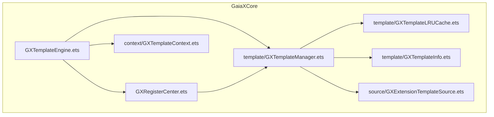
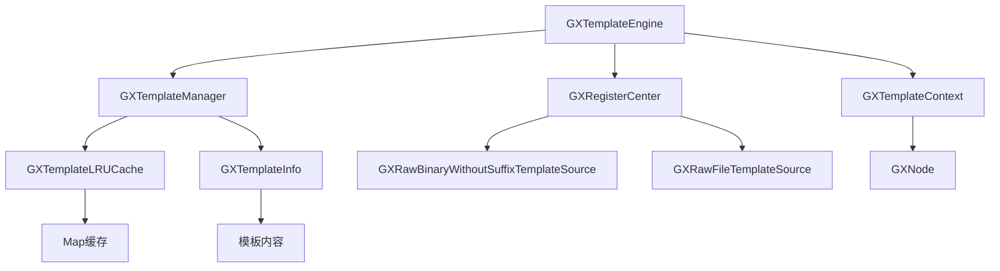
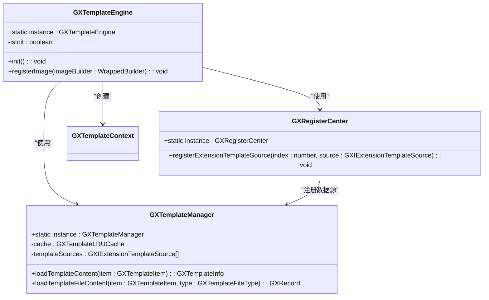
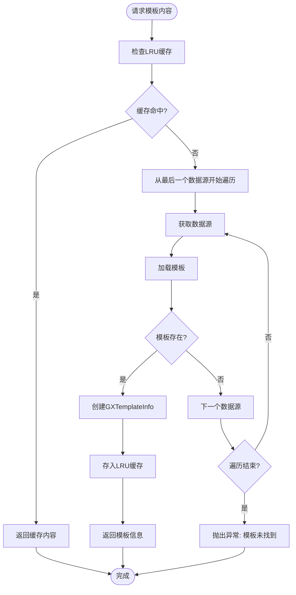
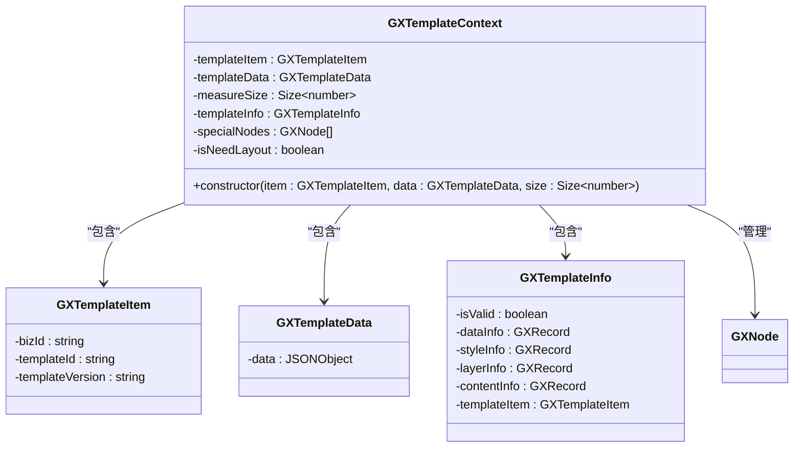
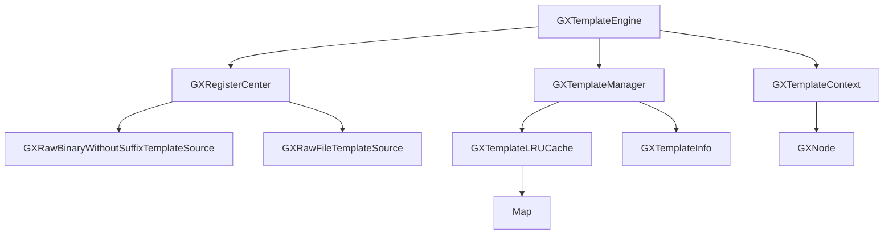

# 模板引擎

<cite>
**本文档引用的文件**
- [GXTemplateEngine.ets](file://GaiaXHarmony/GaiaXCore/GaiaX/src/main/ets/GXTemplateEngine.ets)
- [GXTemplateManager.ets](file://GaiaXHarmony/GaiaXCore/GaiaX/src/main/ets/template/GXTemplateManager.ets)
- [GXTemplateContext.ets](file://GaiaXHarmony/GaiaXCore/GaiaX/src/main/ets/context/GXTemplateContext.ets)
- [GXRegisterCenter.ets](file://GaiaXHarmony/GaiaXCore/GaiaX/src/main/ets/GXRegisterCenter.ets)
- [GXRawBinaryWithouSuffixTemplateSource.ets](file://GaiaXHarmony/GaiaXCore/GaiaX/src/main/ets/source/GXRawBinaryWithouSuffixTemplateSource.ets)
- [GXRawFileTemplateSource.ets](file://GaiaXHarmony/GaiaXCore/GaiaX/src/main/ets/source/GXRawFileTemplateSource.ets)
- [GXTemplateLRUCache.ets](file://GaiaXHarmony/GaiaXCore/GaiaX/src/main/ets/template/GXTemplateLRUCache.ets)
- [GXTemplateInfo.ets](file://GaiaXHarmony/GaiaXCore/GaiaX/src/main/ets/template/GXTemplateInfo.ets)
</cite>

## 目录
1. [简介](#简介)
2. [项目结构](#项目结构)
3. [核心组件](#核心组件)
4. [架构概述](#架构概述)
5. [详细组件分析](#详细组件分析)
6. [依赖分析](#依赖分析)
7. [性能考虑](#性能考虑)
8. [故障排除指南](#故障排除指南)
9. [结论](#结论)

## 简介
GaiaX HarmonyOS模板引擎是一个高性能、跨平台的动态模板渲染解决方案，专为纯原生渲染设计。该引擎通过GXTemplateEngine.ets作为主入口，实现了模板的初始化、渲染调度、资源管理和生命周期控制等核心功能。本文档深入解析了模板引擎的实现机制，重点介绍GXTemplateManager.ets的缓存管理机制和GXTemplateContext.ets的上下文构建过程，为开发者提供从入门到高级的全面指导。

## 项目结构
GaiaX HarmonyOS模板引擎的项目结构遵循模块化设计原则，核心功能集中在GaiaXHarmony/GaiaXCore/GaiaX目录下。主要模块包括模板引擎、模板管理、上下文构建、资源加载等，通过清晰的目录划分实现了高内聚低耦合的设计目标。

**图示来源**
- [GXTemplateEngine.ets](file://GaiaXHarmony/GaiaXCore/GaiaX/src/main/ets/GXTemplateEngine.ets)
- [GXTemplateManager.ets](file://GaiaXHarmony/GaiaXCore/GaiaX/src/main/ets/template/GXTemplateManager.ets)
- [GXTemplateContext.ets](file://GaiaXHarmony/GaiaXCore/GaiaX/src/main/ets/context/GXTemplateContext.ets)

**本节来源**
- [GXTemplateEngine.ets](file://GaiaXHarmony/GaiaXCore/GaiaX/src/main/ets/GXTemplateEngine.ets)
- [README.md](file://README.md)

## 核心组件
GaiaX HarmonyOS模板引擎的核心组件包括GXTemplateEngine.ets（模板引擎主入口）、GXTemplateManager.ets（模板缓存管理器）和GXTemplateContext.ets（模板上下文）。这些组件协同工作，实现了模板的加载、解析、渲染和管理功能。GXTemplateEngine采用单例模式确保全局唯一实例，通过init方法完成引擎的初始化配置，包括stretch布局引擎初始化、表达式分析配置以及模板数据源注册等关键步骤。

**本节来源**
- [GXTemplateEngine.ets](file://GaiaXHarmony/GaiaXCore/GaiaX/src/main/ets/GXTemplateEngine.ets)
- [GXTemplateManager.ets](file://GaiaXHarmony/GaiaXCore/GaiaX/src/main/ets/template/GXTemplateManager.ets)
- [GXTemplateContext.ets](file://GaiaXHarmony/GaiaXCore/GaiaX/src/main/ets/context/GXTemplateContext.ets)

## 架构概述
GaiaX HarmonyOS模板引擎采用分层架构设计，从上至下分为接口层、管理层、核心层和扩展层。接口层提供GXTemplateEngine作为统一入口；管理层包含GXTemplateManager负责模板缓存和生命周期管理；核心层由GXTemplateContext构成，管理模板渲染所需的上下文环境；扩展层通过注册中心机制支持多种模板数据源。这种架构设计实现了关注点分离，提高了系统的可维护性和可扩展性。

**图示来源**
- [GXTemplateEngine.ets](file://GaiaXHarmony/GaiaXCore/GaiaX/src/main/ets/GXTemplateEngine.ets)
- [GXRegisterCenter.ets](file://GaiaXHarmony/GaiaXCore/GaiaX/src/main/ets/GXRegisterCenter.ets)
- [GXTemplateManager.ets](file://GaiaXHarmony/GaiaXCore/GaiaX/src/main/ets/template/GXTemplateManager.ets)

## 详细组件分析

### GXTemplateEngine分析
GXTemplateEngine作为模板引擎的主入口，采用单例模式实现，通过静态instance属性确保全局唯一实例。引擎的初始化过程通过init方法完成，该方法实现了线程安全的初始化检查，确保初始化逻辑只执行一次。初始化过程包括三个关键步骤：stretch布局引擎初始化、表达式分析配置初始化以及模板数据源注册。

**图示来源**
- [GXTemplateEngine.ets](file://GaiaXHarmony/GaiaXCore/GaiaX/src/main/ets/GXTemplateEngine.ets)
- [GXRegisterCenter.ets](file://GaiaXHarmony/GaiaXCore/GaiaX/src/main/ets/GXRegisterCenter.ets)
- [GXTemplateManager.ets](file://GaiaXHarmony/GaiaXCore/GaiaX/src/main/ets/template/GXTemplateManager.ets)

**本节来源**
- [GXTemplateEngine.ets](file://GaiaXHarmony/GaiaXCore/GaiaX/src/main/ets/GXTemplateEngine.ets)
- [GXRegisterCenter.ets](file://GaiaXHarmony/GaiaXCore/GaiaX/src/main/ets/GXRegisterCenter.ets)

### GXTemplateManager分析
GXTemplateManager负责模板的缓存管理和加载调度，采用LRU（最近最少使用）缓存策略管理模板资源。通过templateSources列表维护注册的模板数据源，支持多种模板加载方式。当请求模板内容时，系统优先从LRU缓存中查找，若缓存未命中则遍历数据源列表进行加载，并将结果存入缓存以提高后续访问效率。

**图示来源**
- [GXTemplateManager.ets](file://GaiaXHarmony/GaiaXCore/GaiaX/src/main/ets/template/GXTemplateManager.ets)
- [GXTemplateLRUCache.ets](file://GaiaXHarmony/GaiaXCore/GaiaX/src/main/ets/template/GXTemplateLRUCache.ets)
- [GXTemplateInfo.ets](file://GaiaXHarmony/GaiaXCore/GaiaX/src/main/ets/template/GXTemplateInfo.ets)

**本节来源**
- [GXTemplateManager.ets](file://GaiaXHarmony/GaiaXCore/GaiaX/src/main/ets/template/GXTemplateManager.ets)
- [GXTemplateLRUCache.ets](file://GaiaXHarmony/GaiaXCore/GaiaX/src/main/ets/template/GXTemplateLRUCache.ets)

### GXTemplateContext分析
GXTemplateContext作为模板渲染的上下文环境，封装了模板渲染所需的所有信息，包括模板项、模板数据、测量尺寸以及模板信息等。通过@Observed装饰器实现数据观察，支持响应式更新。上下文对象在模板生命周期中扮演核心角色，连接模板定义与实际渲染，确保数据与视图的同步。

**图示来源**
- [GXTemplateContext.ets](file://GaiaXHarmony/GaiaXCore/GaiaX/src/main/ets/context/GXTemplateContext.ets)
- [GXTemplateItem.ets](file://GaiaXHarmony/GaiaXCore/GaiaX/src/main/ets/context/GXTemplateItem.ets)
- [GXTemplateData.ets](file://GaiaXHarmony/GaiaXCore/GaiaX/src/main/ets/context/GXTemplateData.ets)

**本节来源**
- [GXTemplateContext.ets](file://GaiaXHarmony/GaiaXCore/GaiaX/src/main/ets/context/GXTemplateContext.ets)

## 依赖分析
GaiaX HarmonyOS模板引擎通过清晰的依赖关系实现了模块化设计。GXTemplateEngine作为核心入口依赖于GXRegisterCenter和GXTemplateManager，前者负责管理扩展组件的注册，后者负责模板资源的加载和缓存。GXTemplateManager又依赖于GXTemplateLRUCache进行缓存管理，并通过GXIExtensionTemplateSource接口与具体的数据源实现解耦。这种依赖设计实现了高内聚低耦合，便于系统的维护和扩展。

**图示来源**
- [GXTemplateEngine.ets](file://GaiaXHarmony/GaiaXCore/GaiaX/src/main/ets/GXTemplateEngine.ets)
- [GXRegisterCenter.ets](file://GaiaXHarmony/GaiaXCore/GaiaX/src/main/ets/GXRegisterCenter.ets)
- [GXTemplateManager.ets](file://GaiaXHarmony/GaiaXCore/GaiaX/src/main/ets/template/GXTemplateManager.ets)

**本节来源**
- [GXTemplateEngine.ets](file://GaiaXHarmony/GaiaXCore/GaiaX/src/main/ets/GXTemplateEngine.ets)
- [GXRegisterCenter.ets](file://GaiaXHarmony/GaiaXCore/GaiaX/src/main/ets/GXRegisterCenter.ets)
- [GXTemplateManager.ets](file://GaiaXHarmony/GaiaXCore/GaiaX/src/main/ets/template/GXTemplateManager.ets)

## 性能考虑
GaiaX HarmonyOS模板引擎在设计时充分考虑了性能优化。通过LRU缓存机制减少重复的模板加载和解析开销，利用单例模式避免不必要的对象创建。引擎初始化采用懒加载策略，仅在首次使用时完成必要的配置。模板数据源采用优先级注册机制，确保高效的资源查找。此外，通过ArkTS语言特性如@Observed装饰器实现高效的响应式更新，减少不必要的重渲染。

## 故障排除指南
在使用GaiaX HarmonyOS模板引擎时，可能遇到模板加载失败、渲染异常等问题。常见问题包括模板资源路径错误、数据格式不匹配、初始化未完成等。建议首先检查模板资源是否正确放置在rawfile目录下，确认模板项的bizId和templateId是否正确。若遇到缓存相关问题，可尝试清理LRU缓存。对于渲染异常，应检查模板数据是否符合预期结构，并确保引擎已正确初始化。

**本节来源**
- [GXTemplateEngine.ets](file://GaiaXHarmony/GaiaXCore/GaiaX/src/main/ets/GXTemplateEngine.ets)
- [GXTemplateManager.ets](file://GaiaXHarmony/GaiaXCore/GaiaX/src/main/ets/template/GXTemplateManager.ets)
- [README.md](file://README.md)

## 结论
GaiaX HarmonyOS模板引擎通过精心设计的架构和高效的实现机制，为开发者提供了强大的模板渲染能力。GXTemplateEngine作为主入口，通过单例模式确保全局一致性；GXTemplateManager采用LRU缓存策略优化性能；GXTemplateContext构建完整的渲染上下文。这些组件协同工作，实现了高性能、可扩展的模板渲染解决方案。开发者可基于此引擎快速构建动态化界面，同时利用其开放的扩展机制满足特定业务需求。