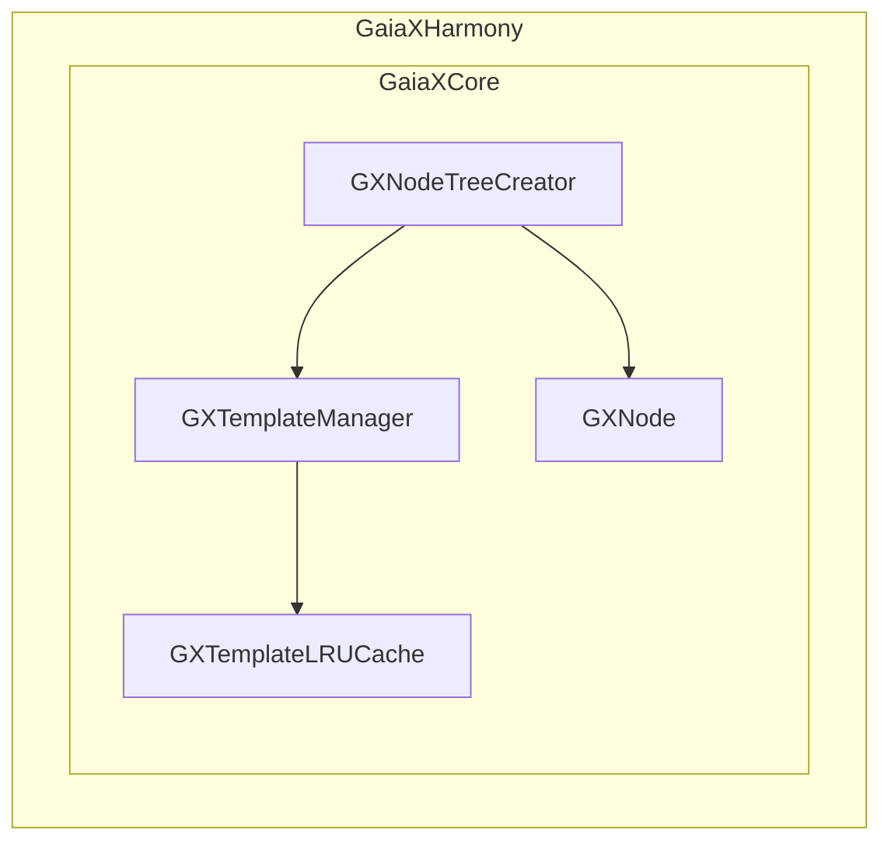
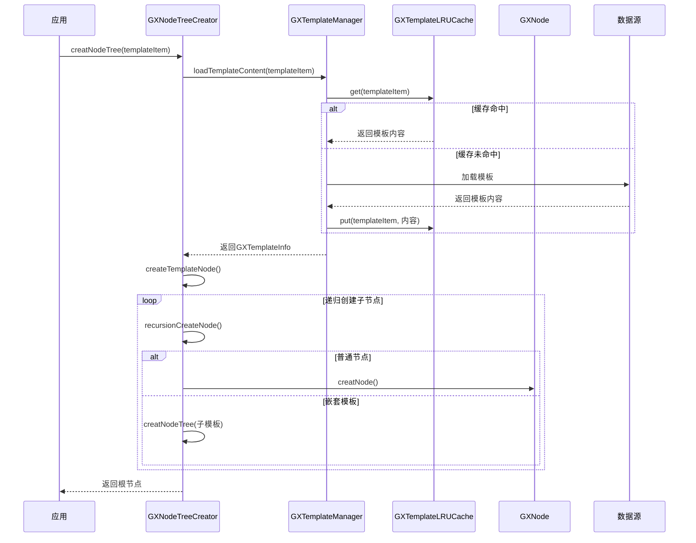
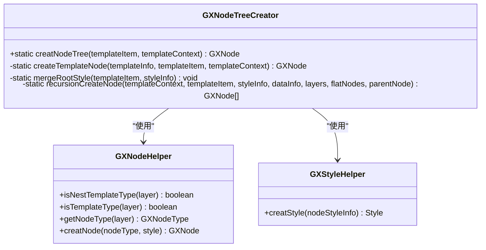
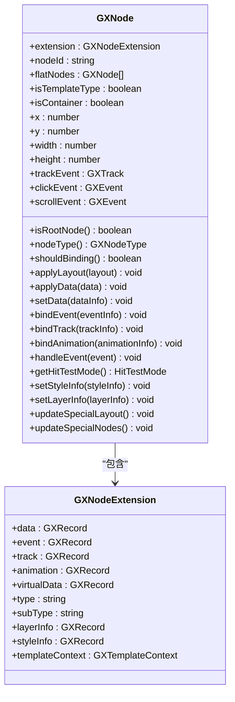
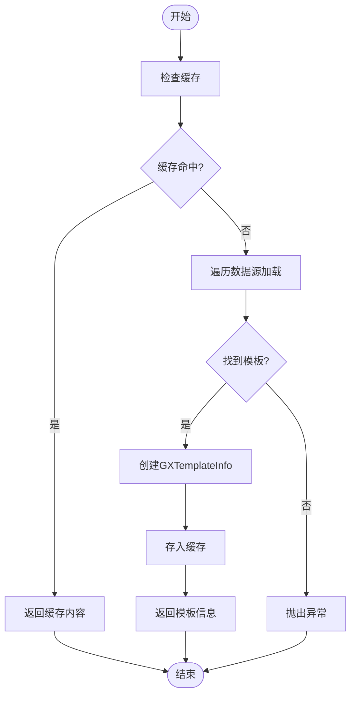
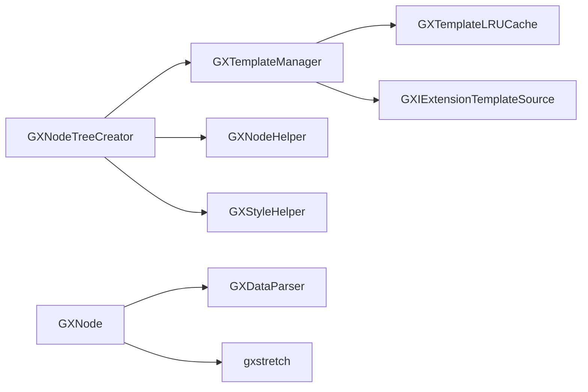

# 层级结构

<cite>
**本文档引用文件**  
- [GXNodeTreeCreator.ets](file://GaiaXHarmony/GaiaXCore/GaiaX/src/main/ets/creator/GXNodeTreeCreator.ets)
- [GXNode.ets](file://GaiaXHarmony/GaiaXCore/GaiaX/src/main/ets/creator/GXNode.ets)
- [GXTemplateManager.ets](file://GaiaXHarmony/GaiaXCore/GaiaX/src/main/ets/template/GXTemplateManager.ets)
- [GXTemplateLRUCache.ets](file://GaiaXHarmony/GaiaXCore/GaiaX/src/main/ets/template/GXTemplateLRUCache.ets)
</cite>

## 目录
1. [简介](#简介)
2. [项目结构](#项目结构)
3. [核心组件](#核心组件)
4. [架构概述](#架构概述)
5. [详细组件分析](#详细组件分析)
6. [依赖分析](#依赖分析)
7. [性能考量](#性能考量)
8. [故障排除指南](#故障排除指南)
9. [结论](#结论)

## 简介
本技术文档深入解析HarmonyOS平台中GaiaX框架的模板层级结构（GXLayer.ets）实现机制。文档全面阐述了GXLayer如何构建和管理模板节点树，涵盖节点创建、父子关系维护、遍历算法及事件分发机制。同时，详细说明了层级结构与GXTemplateLRUCache的交互方式，以及如何通过节点复用和内存优化提升性能。为开发者提供从基础操作到高级特性的完整知识体系。

## 项目结构
GaiaX框架在HarmonyOS平台的实现位于`GaiaXHarmony`目录下，其核心逻辑集中在`GaiaXCore`模块中。该模块采用分层架构设计，主要包含模板管理、节点创建、数据绑定和渲染等子系统。`GXNodeTreeCreator.ets`负责节点树的构建，`GXNode.ets`定义了节点的核心属性和行为，`GXTemplateManager.ets`管理模板的加载与缓存，而`GXTemplateLRUCache.ets`则实现了模板内容的LRU缓存策略。

**图示来源**
- [GXNodeTreeCreator.ets](file://GaiaXHarmony/GaiaXCore/GaiaX/src/main/ets/creator/GXNodeTreeCreator.ets)
- [GXNode.ets](file://GaiaXHarmony/GaiaXCore/GaiaX/src/main/ets/creator/GXNode.ets)
- [GXTemplateManager.ets](file://GaiaXHarmony/GaiaXCore/GaiaX/src/main/ets/template/GXTemplateManager.ets)
- [GXTemplateLRUCache.ets](file://GaiaXHarmony/GaiaXCore/GaiaX/src/main/ets/template/GXTemplateLRUCache.ets)

**本节来源**
- [GXNodeTreeCreator.ets](file://GaiaXHarmony/GaiaXCore/GaiaX/src/main/ets/creator/GXNodeTreeCreator.ets)
- [GXNode.ets](file://GaiaXHarmony/GaiaXCore/GaiaX/src/main/ets/creator/GXNode.ets)

## 核心组件
本节分析构成模板层级结构的核心组件。`GXNodeTreeCreator`是节点树的构建引擎，它负责从模板定义中解析出层级信息，并递归地创建`GXNode`实例。`GXNode`类继承自`gxstretch`布局库的`Node`，并扩展了模板特有的属性和方法，如数据绑定、事件处理和样式管理。`GXTemplateManager`作为模板资源的统一入口，协调模板的加载、解析和缓存。`GXTemplateLRUCache`则通过LRU算法确保频繁使用的模板内容能被快速访问。

**本节来源**
- [GXNodeTreeCreator.ets](file://GaiaXHarmony/GaiaXCore/GaiaX/src/main/ets/creator/GXNodeTreeCreator.ets)
- [GXNode.ets](file://GaiaXHarmony/GaiaXCore/GaiaX/src/main/ets/creator/GXNode.ets)
- [GXTemplateManager.ets](file://GaiaXHarmony/GaiaXCore/GaiaX/src/main/ets/template/GXTemplateManager.ets)
- [GXTemplateLRUCache.ets](file://GaiaXHarmony/GaiaXCore/GaiaX/src/main/ets/template/GXTemplateLRUCache.ets)

## 架构概述
GaiaX的模板层级结构采用树形数据结构，由`GXNode`实例构成。整个构建流程始于`GXNodeTreeCreator.creatNodeTree`方法，该方法通过`GXTemplateManager`获取模板内容，并调用`createTemplateNode`创建根节点。随后，`recursionCreateNode`方法被递归调用，根据模板的`layers`数组创建子节点。对于嵌套模板，会再次调用`creatNodeTree`创建独立的子树。最终形成的节点树不仅包含了布局信息，还集成了数据、事件和动画等元数据。

**图示来源**
- [GXNodeTreeCreator.ets](file://GaiaXHarmony/GaiaXCore/GaiaX/src/main/ets/creator/GXNodeTreeCreator.ets)
- [GXTemplateManager.ets](file://GaiaXHarmony/GaiaXCore/GaiaX/src/main/ets/template/GXTemplateManager.ets)
- [GXTemplateLRUCache.ets](file://GaiaXHarmony/GaiaXCore/GaiaX/src/main/ets/template/GXTemplateLRUCache.ets)

## 详细组件分析
### GXNodeTreeCreator分析
`GXNodeTreeCreator`是构建节点树的核心类。其`creatNodeTree`方法是外部调用的入口点，它首先通过`GXTemplateManager`加载模板内容，然后创建根节点。`createTemplateNode`方法负责初始化根节点，并调用`recursionCreateNode`进行递归构建。`recursionCreateNode`方法遍历`layers`数组，为每个`layer`创建对应的`GXNode`。它通过`GXNodeHelper.isNestTemplateType`判断是否为嵌套模板，若是，则递归调用`creatNodeTree`创建子树；否则，创建普通节点并设置其样式、数据和事件。

**图示来源**
- [GXNodeTreeCreator.ets](file://GaiaXHarmony/GaiaXCore/GaiaX/src/main/ets/creator/GXNodeTreeCreator.ets)

**本节来源**
- [GXNodeTreeCreator.ets](file://GaiaXHarmony/GaiaXCore/GaiaX/src/main/ets/creator/GXNodeTreeCreator.ets)

### GXNode分析
`GXNode`类是层级结构中的基本单元，它继承自布局库的`Node`类，从而具备了布局计算能力。其核心属性包括`nodeId`（节点ID）、`extension`（扩展信息，存储数据、事件等）、`isTemplateType`（是否为模板类型）和`isContainer`（是否为容器）。`applyLayout`方法用于递归应用布局信息，`applyData`方法用于递归绑定数据。`updateSpecialNodes`方法允许子类实现特定的节点更新逻辑。

**图示来源**
- [GXNode.ets](file://GaiaXHarmony/GaiaXCore/GaiaX/src/main/ets/creator/GXNode.ets)

**本节来源**
- [GXNode.ets](file://GaiaXHarmony/GaiaXCore/GaiaX/src/main/ets/creator/GXNode.ets)

### GXTemplateManager与GXTemplateLRUCache分析
`GXTemplateManager`是模板资源的管理中心，采用单例模式。其`loadTemplateContent`方法是获取模板内容的主要入口，该方法首先尝试从`GXTemplateLRUCache`中获取缓存的`GXTemplateInfo`，若未命中，则遍历`templateSources`列表加载模板，并将结果存入缓存。`GXTemplateLRUCache`实现了标准的LRU缓存，使用`Map`存储键值对，`get`操作会将访问的键移动到末尾，`put`操作在容量满时会移除最久未使用的键。

**图示来源**
- [GXTemplateManager.ets](file://GaiaXHarmony/GaiaXCore/GaiaX/src/main/ets/template/GXTemplateManager.ets)
- [GXTemplateLRUCache.ets](file://GaiaXHarmony/GaiaXCore/GaiaX/src/main/ets/template/GXTemplateLRUCache.ets)

**本节来源**
- [GXTemplateManager.ets](file://GaiaXHarmony/GaiaXCore/GaiaX/src/main/ets/template/GXTemplateManager.ets)
- [GXTemplateLRUCache.ets](file://GaiaXHarmony/GaiaXCore/GaiaX/src/main/ets/template/GXTemplateLRUCache.ets)

## 依赖分析
层级结构的实现依赖于多个内部和外部组件。`GXNodeTreeCreator`依赖`GXTemplateManager`获取模板内容，依赖`GXNodeHelper`和`GXStyleHelper`创建和配置节点。`GXNode`依赖`GXDataParser`进行数据绑定，依赖`gxstretch`库进行布局计算。`GXTemplateManager`依赖`GXTemplateLRUCache`进行缓存管理，并依赖`GXIExtensionTemplateSource`接口从不同来源加载模板。这种清晰的依赖关系确保了各组件的职责单一和可测试性。

**图示来源**
- [GXNodeTreeCreator.ets](file://GaiaXHarmony/GaiaXCore/GaiaX/src/main/ets/creator/GXNodeTreeCreator.ets)
- [GXNode.ets](file://GaiaXHarmony/GaiaXCore/GaiaX/src/main/ets/creator/GXNode.ets)
- [GXTemplateManager.ets](file://GaiaXHarmony/GaiaXCore/GaiaX/src/main/ets/template/GXTemplateManager.ets)
- [GXTemplateLRUCache.ets](file://GaiaXHarmony/GaiaXCore/GaiaX/src/main/ets/template/GXTemplateLRUCache.ets)

**本节来源**
- [GXNodeTreeCreator.ets](file://GaiaXHarmony/GaiaXCore/GaiaX/src/main/ets/creator/GXNodeTreeCreator.ets)
- [GXNode.ets](file://GaiaXHarmony/GaiaXCore/GaiaX/src/main/ets/creator/GXNode.ets)
- [GXTemplateManager.ets](file://GaiaXHarmony/GaiaXCore/GaiaX/src/main/ets/template/GXTemplateManager.ets)
- [GXTemplateLRUCache.ets](file://GaiaXHarmony/GaiaXCore/GaiaX/src/main/ets/template/GXTemplateLRUCache.ets)

## 性能考量
为了优化性能，GaiaX框架在多个层面进行了设计。首先，`GXTemplateLRUCache`通过缓存避免了重复的模板解析开销。其次，节点树的构建过程是递归且高效的，利用了`flatNodes`数组来扁平化节点，便于后续的快速访问。此外，`GXNode`的`applyLayout`和`applyData`方法都采用了递归模式，确保了布局和数据更新的原子性。对于大规模数据渲染，建议合理设置`GXTemplateLRUCache`的容量，并利用虚拟滚动等技术减少DOM节点数量。

## 故障排除指南
在使用层级结构时，可能遇到以下常见问题：
1.  **节点树构建失败**：检查`templateItem`的`bizId`和`templateId`是否正确，确认模板资源已正确放置在`rawfile`目录下。
2.  **数据绑定无效**：确保`GXTemplateData`中的数据结构与模板定义中的`data`字段匹配。
3.  **样式不生效**：检查`GXTemplateItem`中的`virtualStyleInfo`是否正确合并，确认样式属性名拼写无误。
4.  **事件未触发**：验证`GXTemplateData`中的`clickEventCallback`是否已正确设置。

**本节来源**
- [GXNodeTreeCreator.ets](file://GaiaXHarmony/GaiaXCore/GaiaX/src/main/ets/creator/GXNodeTreeCreator.ets)
- [GXNode.ets](file://GaiaXHarmony/GaiaXCore/GaiaX/src/main/ets/creator/GXNode.ets)
- [README.md](file://README.md#L157-L203)

## 结论
本文档全面解析了HarmonyOS平台中GaiaX框架的模板层级结构。通过分析`GXNodeTreeCreator`、`GXNode`、`GXTemplateManager`和`GXTemplateLRUCache`等核心组件，揭示了从模板解析到节点树构建的完整流程。该设计通过清晰的职责划分和高效的缓存机制，实现了高性能的模板渲染。开发者可以基于此文档深入理解底层原理，并进行定制化开发和性能优化。