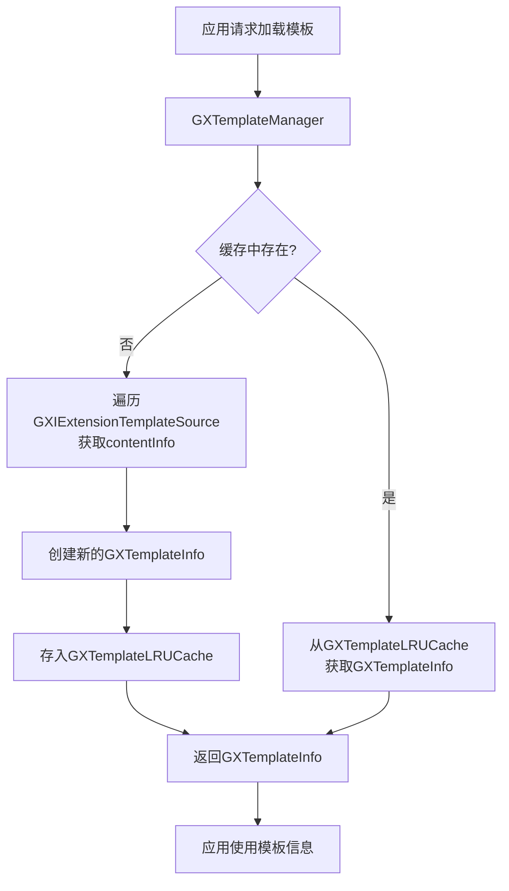
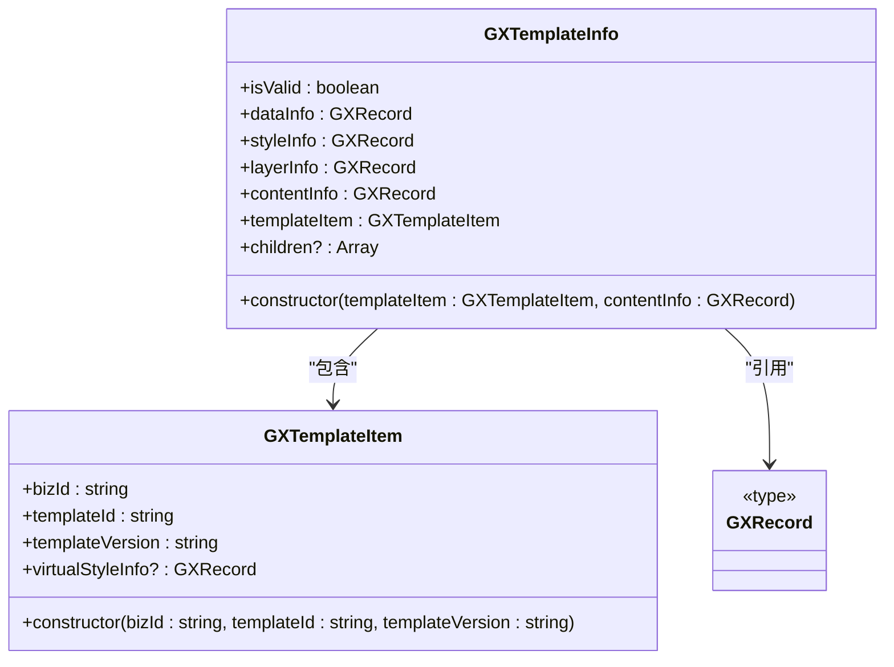
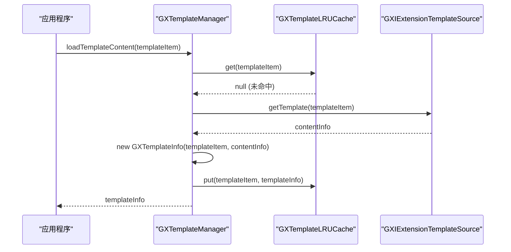
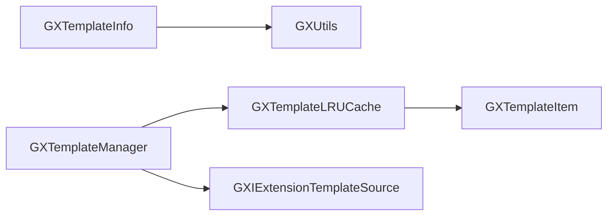

# 模板信息

<cite>
**Referenced Files in This Document**   
- [GXTemplateInfo.ets](file://GaiaXHarmony/GaiaXCore/GaiaX/src/main/ets/template/GXTemplateInfo.ets)
- [GXTemplateManager.ets](file://GaiaXHarmony/GaiaXCore/GaiaX/src/main/ets/template/GXTemplateManager.ets)
- [GXTemplateLRUCache.ets](file://GaiaXHarmony/GaiaXCore/GaiaX/src/main/ets/template/GXTemplateLRUCache.ets)
- [GXTemplateItem.ets](file://GaiaXHarmony/GaiaXCore/GaiaX/src/main/ets/context/GXTemplateItem.ets)
- [GXCommon.ets](file://GaiaXHarmony/GaiaXCore/GaiaX/src/main/ets/common/GXCommon.ets)
- [GXUtils.ets](file://GaiaXHarmony/GaiaXCore/GaiaX/src/main/ets/utils/GXUtils.ets)
</cite>

## 目录
1. [简介](#简介)
2. [核心组件](#核心组件)
3. [架构概述](#架构概述)
4. [详细组件分析](#详细组件分析)
5. [依赖分析](#依赖分析)
6. [性能考虑](#性能考虑)
7. [故障排除指南](#故障排除指南)
8. [结论](#结论)

## 简介
本文档详细阐述了HarmonyOS平台中GaiaX框架的模板信息（GXTemplateInfo）的核心作用。GXTemplateInfo是GaiaX模板系统中的关键数据结构，负责封装和管理模板的元数据，包括模板的业务标识（bizId）、模板标识（templateId）和模板版本（templateVersion）等核心属性。这些属性共同构成了模板的唯一标识，确保了在多业务、多模板场景下的精确加载与隔离。文档将深入分析GXTemplateInfo如何与GXTemplateManager协同工作，实现模板元数据的高效管理与生命周期控制，并为开发者提供从基础到高级的实践指导。

## 核心组件
GXTemplateInfo.ets是定义模板信息的核心文件，它封装了模板的元数据和内容信息。该类通过构造函数接收GXTemplateItem和contentInfo，从中提取并验证数据绑定、样式和层级信息，确保模板的有效性。GXTemplateManager.ets作为模板管理的中枢，负责协调模板的加载、缓存和分发，它依赖于GXTemplateInfo来表示已加载的模板实例。GXTemplateLRUCache.ets则实现了基于LRU（最近最少使用）算法的缓存机制，用于存储和快速检索GXTemplateInfo实例，显著提升模板加载性能。

**Section sources**
- [GXTemplateInfo.ets](file://GaiaXHarmony/GaiaXCore/GaiaX/src/main/ets/template/GXTemplateInfo.ets#L21-L62)
- [GXTemplateManager.ets](file://GaiaXHarmony/GaiaXCore/GaiaX/src/main/ets/template/GXTemplateManager.ets#L24-L71)
- [GXTemplateLRUCache.ets](file://GaiaXHarmony/GaiaXCore/GaiaX/src/main/ets/template/GXTemplateLRUCache.ets#L20-L71)

## 架构概述
GaiaX框架的模板加载与管理架构围绕GXTemplateManager、GXTemplateInfo和GXTemplateLRUCache三个核心组件构建。当需要加载一个模板时，GXTemplateManager首先根据传入的GXTemplateItem生成一个缓存键，然后查询GXTemplateLRUCache。如果缓存命中，则直接返回已存在的GXTemplateInfo实例；如果未命中，则会遍历注册的模板数据源（GXIExtensionTemplateSource），获取原始的模板内容（contentInfo），并使用该内容创建一个新的GXTemplateInfo实例，随后将其存入缓存并返回。

**Diagram sources**
- [GXTemplateManager.ets](file://GaiaXHarmony/GaiaXCore/GaiaX/src/main/ets/template/GXTemplateManager.ets#L30-L48)
- [GXTemplateLRUCache.ets](file://GaiaXHarmony/GaiaXCore/GaiaX/src/main/ets/template/GXTemplateLRUCache.ets#L29-L49)

## 详细组件分析

### GXTemplateInfo 分析
GXTemplateInfo类是模板元数据的载体。其核心属性包括`dataInfo`（数据绑定信息）、`styleInfo`（样式信息）和`layerInfo`（层级信息），这些信息均从传入的`contentInfo`中解析而来。构造函数在创建实例时会进行严格的验证，确保`layerInfo`和`styleInfo`不为空，从而保证模板的完整性。`isValid`属性反映了模板的有效性状态。

#### GXTemplateInfo 类图

**Diagram sources**
- [GXTemplateInfo.ets](file://GaiaXHarmony/GaiaXCore/GaiaX/src/main/ets/template/GXTemplateInfo.ets#L21-L62)
- [GXTemplateItem.ets](file://GaiaXHarmony/GaiaXCore/GaiaX/src/main/ets/context/GXTemplateItem.ets#L19-L34)

### GXTemplateManager 分析
GXTemplateManager是单例模式的模板管理器，它通过`loadTemplateContent`方法提供模板加载服务。该方法实现了“先缓存，后源”的加载策略，优先从LRU缓存中查找，未找到则从数据源获取并创建新实例。`loadTemplateFileContent`方法则允许根据文件类型（如CSS、JSON）从已加载的GXTemplateInfo中提取特定部分的数据。

#### GXTemplateManager 调用流程

**Diagram sources**
- [GXTemplateManager.ets](file://GaiaXHarmony/GaiaXCore/GaiaX/src/main/ets/template/GXTemplateManager.ets#L30-L48)
- [GXTemplateLRUCache.ets](file://GaiaXHarmony/GaiaXCore/GaiaX/src/main/ets/template/GXTemplateLRUCache.ets#L30-L49)

## 依赖分析
GXTemplateInfo的创建和验证过程依赖于GXUtils工具类中的`isNullOrUndefined`方法来检查关键字段的完整性。GXTemplateManager依赖于GXTemplateLRUCache进行缓存管理，并依赖于GXIExtensionTemplateSource接口来获取模板的原始内容。GXTemplateLRUCache在生成缓存键时，直接依赖于GXTemplateItem中的`bizId`、`templateId`和`templateVersion`属性。

**Diagram sources**
- [GXTemplateInfo.ets](file://GaiaXHarmony/GaiaXCore/GaiaX/src/main/ets/template/GXTemplateInfo.ets#L47-L55)
- [GXTemplateManager.ets](file://GaiaXHarmony/GaiaXCore/GaiaX/src/main/ets/template/GXTemplateManager.ets#L27-L48)
- [GXTemplateLRUCache.ets](file://GaiaXHarmony/GaiaXCore/GaiaX/src/main/ets/template/GXTemplateLRUCache.ets#L32-L35)

## 性能考虑
使用GXTemplateLRUCache进行缓存是提升性能的关键。通过将已解析的GXTemplateInfo实例存储在内存中，避免了重复的I/O操作和解析开销。建议根据应用的内存预算和模板使用频率合理设置缓存容量。此外，确保`GXTemplateItem`的`bizId`、`templateId`和`templateVersion`属性被正确设置，可以保证缓存键的唯一性，防止不同模板的缓存冲突。

## 故障排除指南
常见的错误包括模板加载失败和缓存未命中。如果`loadTemplateContent`方法抛出"not found template"异常，应检查`GXIExtensionTemplateSource`的实现是否正确返回了模板内容。如果发现频繁的缓存未命中，应检查`GXTemplateItem`的属性是否一致，以及缓存容量是否过小。在创建GXTemplateInfo时，如果`layer`或`style`信息为空，构造函数会抛出错误，这通常意味着传入的`contentInfo`数据不完整或格式有误。

**Section sources**
- [GXTemplateManager.ets](file://GaiaXHarmony/GaiaXCore/GaiaX/src/main/ets/template/GXTemplateManager.ets#L47-L48)
- [GXTemplateInfo.ets](file://GaiaXHarmony/GaiaXCore/GaiaX/src/main/ets/template/GXTemplateInfo.ets#L47-L55)

## 结论
GXTemplateInfo是GaiaX框架中管理模板元数据的核心类，它与GXTemplateManager和GXTemplateLRUCache协同工作，构成了一个高效、可靠的模板加载与管理系统。通过理解其属性定义、创建流程和与管理器的交互方式，开发者可以更好地利用GaiaX框架进行高性能的模板化开发。遵循最佳实践，如合理配置缓存和确保模板标识的唯一性，将有助于构建稳定且响应迅速的应用。