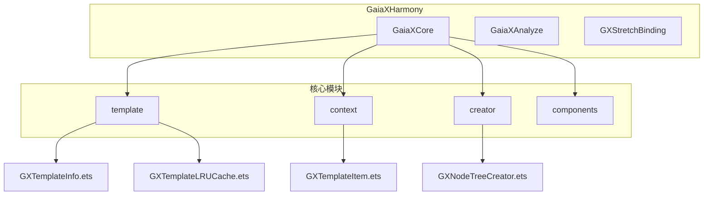
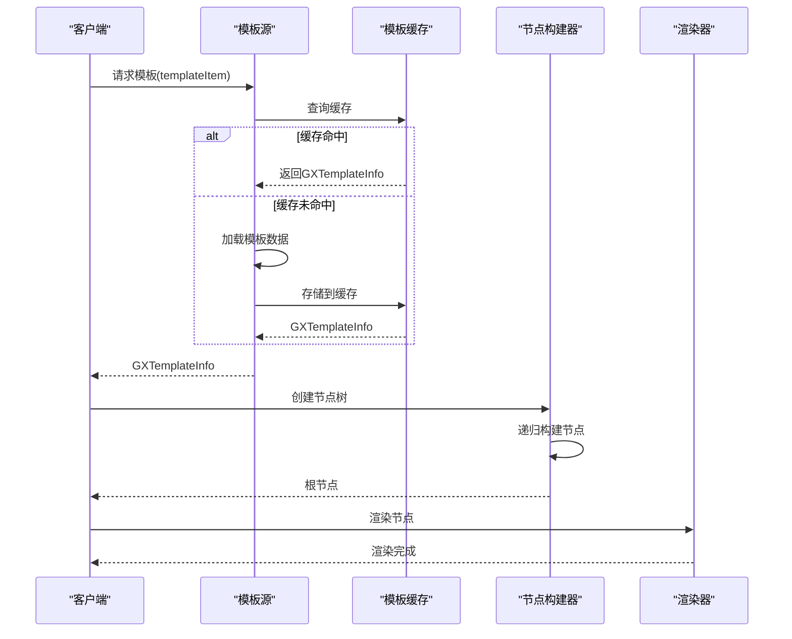
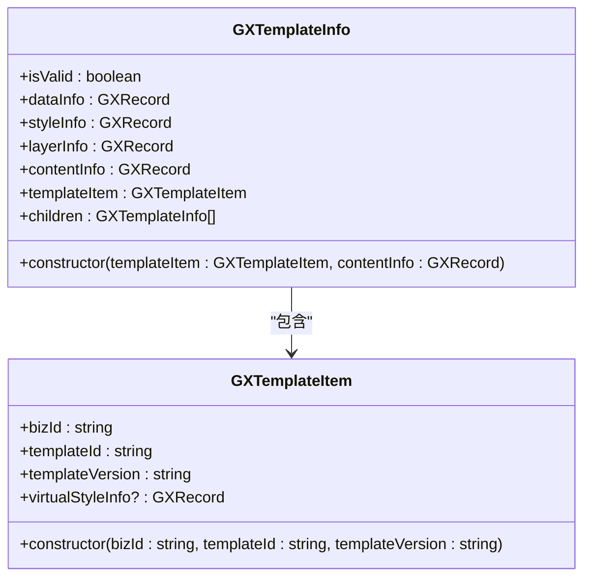
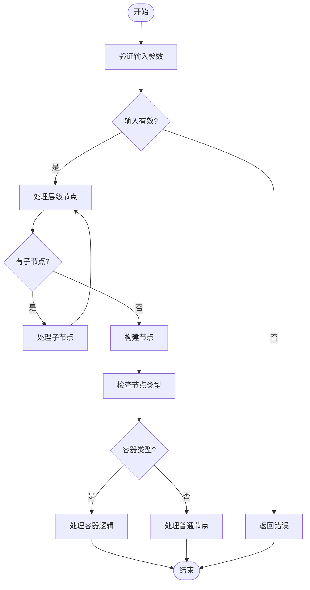
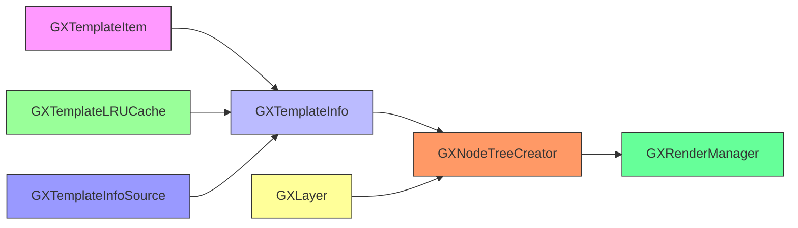
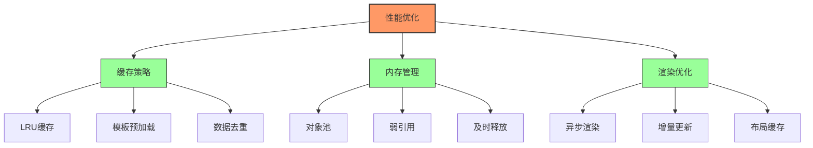

# 模板系统

<cite>
**本文档引用文件**  
- [GXTemplateInfo.ets](file://GaiaXHarmony/GaiaXCore/GaiaX/src/main/ets/template/GXTemplateInfo.ets)
- [GXTemplateLRUCache.ets](file://GaiaXHarmony/GaiaXCore/GaiaX/src/main/ets/template/GXTemplateLRUCache.ets)
- [GXTemplateItem.ets](file://GaiaXHarmony/GaiaXCore/GaiaX/src/main/ets/context/GXTemplateItem.ets)
- [GXNodeTreeCreator.ets](file://GaiaXHarmony/GaiaXCore/GaiaX/src/main/ets/creator/GXNodeTreeCreator.ets)
- [GXLayer.kt](file://GaiaXAndroid/src/main/kotlin/com/alibaba/gaiax/template/GXLayer.kt)
- [GXTemplateInfo.kt](file://GaiaXAndroid/src/main/kotlin/com/alibaba/gaiax/template/GXTemplateInfo.kt)
- [GXTemplateInfoSource.kt](file://GaiaXAndroid/src/main/kotlin/com/alibaba/gaiax/data/cache/GXTemplateInfoSource.kt)
</cite>

## 目录
1. [简介](#简介)
2. [项目结构](#项目结构)
3. [核心组件](#核心组件)
4. [架构概述](#架构概述)
5. [详细组件分析](#详细组件分析)
6. [依赖分析](#依赖分析)
7. [性能考虑](#性能考虑)
8. [故障排除指南](#故障排除指南)
9. [结论](#结论)

## 简介
GaiaX HarmonyOS模板系统是一个高性能、跨平台的UI渲染引擎，专为动态模板渲染设计。该系统通过GXTemplateInfo.ets和GXLayer.ets等核心组件，实现了模板元数据管理与层级结构构建的高效处理。本文档深入分析模板信息管理、节点树生成、缓存策略及性能优化机制，为开发者提供从基础使用到高级优化的全面指导。

## 项目结构
GaiaX项目采用模块化设计，核心功能集中在GaiaXHarmony和GaiaXAndroid模块中。模板系统相关代码位于`GaiaXHarmony/GaiaXCore/GaiaX/src/main/ets/`目录下，主要包括template、context、creator等子模块。Android平台的实现位于`GaiaXAndroid/src/main/kotlin/com/alibaba/gaiax/`路径中，通过Kotlin语言实现核心逻辑。

**Diagram sources**
- [GXTemplateInfo.ets](file://GaiaXHarmony/GaiaXCore/GaiaX/src/main/ets/template/GXTemplateInfo.ets)
- [GXTemplateLRUCache.ets](file://GaiaXHarmony/GaiaXCore/GaiaX/src/main/ets/template/GXTemplateLRUCache.ets)
- [GXTemplateItem.ets](file://GaiaXHarmony/GaiaXCore/GaiaX/src/main/ets/context/GXTemplateItem.ets)
- [GXNodeTreeCreator.ets](file://GaiaXHarmony/GaiaXCore/GaiaX/src/main/ets/creator/GXNodeTreeCreator.ets)

**Section sources**
- [GXTemplateInfo.ets](file://GaiaXHarmony/GaiaXCore/GaiaX/src/main/ets/template/GXTemplateInfo.ets)
- [GXTemplateLRUCache.ets](file://GaiaXHarmony/GaiaXCore/GaiaX/src/main/ets/template/GXTemplateLRUCache.ets)

## 核心组件
模板系统的核心组件包括GXTemplateInfo、GXTemplateItem和GXLayer，它们共同构成了模板数据管理的基础架构。GXTemplateInfo负责存储模板的完整元数据，包括样式、数据绑定和层级信息；GXTemplateItem作为模板的唯一标识，包含bizId、templateId和templateVersion等关键属性；GXLayer则定义了模板的层级结构和节点类型。

**Section sources**
- [GXTemplateInfo.ets](file://GaiaXHarmony/GaiaXCore/GaiaX/src/main/ets/template/GXTemplateInfo.ets)
- [GXTemplateItem.ets](file://GaiaXHarmony/GaiaXCore/GaiaX/src/main/ets/context/GXTemplateItem.ets)
- [GXLayer.kt](file://GaiaXAndroid/src/main/kotlin/com/alibaba/gaiax/template/GXLayer.kt)

## 架构概述
GaiaX模板系统采用分层架构设计，从模板加载到渲染完成经历多个关键阶段：模板信息获取、节点树构建、布局计算和数据绑定。系统通过GXTemplateInfoSource实现模板缓存，避免重复加载；利用GXNodeTreeCreator进行节点树的递归构建；最后通过GXRenderManager完成最终的渲染流程。

**Diagram sources**
- [GXTemplateInfoSource.kt](file://GaiaXAndroid/src/main/kotlin/com/alibaba/gaiax/data/cache/GXTemplateInfoSource.kt)
- [GXNodeTreeCreator.ets](file://GaiaXHarmony/GaiaXCore/GaiaX/src/main/ets/creator/GXNodeTreeCreator.ets)
- [GXTemplateInfo.ets](file://GaiaXHarmony/GaiaXCore/GaiaX/src/main/ets/template/GXTemplateInfo.ets)

## 详细组件分析

### GXTemplateInfo分析
GXTemplateInfo是模板元数据的核心容器，负责管理模板的所有相关信息。它通过构造函数接收GXTemplateItem和contentInfo，初始化模板的有效性状态和各项数据信息。

**Diagram sources**
- [GXTemplateInfo.ets](file://GaiaXHarmony/GaiaXCore/GaiaX/src/main/ets/template/GXTemplateInfo.ets)
- [GXTemplateItem.ets](file://GaiaXHarmony/GaiaXCore/GaiaX/src/main/ets/context/GXTemplateItem.ets)

**Section sources**
- [GXTemplateInfo.ets](file://GaiaXHarmony/GaiaXCore/GaiaX/src/main/ets/template/GXTemplateInfo.ets)
- [GXTemplateItem.ets](file://GaiaXHarmony/GaiaXCore/GaiaX/src/main/ets/context/GXTemplateItem.ets)

### GXLayer分析
GXLayer组件负责构建和管理模板的层级结构，通过递归方式解析节点树。每个GXLayer实例代表一个UI节点，包含id、css、type等属性，并通过layers数组维护子节点关系。

**Diagram sources**
- [GXLayer.kt](file://GaiaXAndroid/src/main/kotlin/com/alibaba/gaiax/template/GXLayer.kt)
- [GXNodeTreeCreator.ets](file://GaiaXHarmony/GaiaXCore/GaiaX/src/main/ets/creator/GXNodeTreeCreator.ets)

**Section sources**
- [GXLayer.kt](file://GaiaXAndroid/src/main/kotlin/com/alibaba/gaiax/template/GXLayer.kt)
- [GXNodeTreeCreator.ets](file://GaiaXHarmony/GaiaXCore/GaiaX/src/main/ets/creator/GXNodeTreeCreator.ets)

## 依赖分析
模板系统各组件之间存在紧密的依赖关系，形成了完整的数据处理链条。GXTemplateInfo依赖GXTemplateItem进行实例化，而GXNodeTreeCreator则依赖GXTemplateInfo来构建节点树。缓存系统GXTemplateLRUCache为整个系统提供了性能优化支持。

**Diagram sources**
- [GXTemplateInfo.ets](file://GaiaXHarmony/GaiaXCore/GaiaX/src/main/ets/template/GXTemplateInfo.ets)
- [GXNodeTreeCreator.ets](file://GaiaXHarmony/GaiaXCore/GaiaX/src/main/ets/creator/GXNodeTreeCreator.ets)
- [GXTemplateLRUCache.ets](file://GaiaXHarmony/GaiaXCore/GaiaX/src/main/ets/template/GXTemplateLRUCache.ets)
- [GXLayer.kt](file://GaiaXAndroid/src/main/kotlin/com/alibaba/gaiax/template/GXLayer.kt)
- [GXTemplateInfoSource.kt](file://GaiaXAndroid/src/main/kotlin/com/alibaba/gaiax/data/cache/GXTemplateInfoSource.kt)

**Section sources**
- [GXTemplateInfo.ets](file://GaiaXHarmony/GaiaXCore/GaiaX/src/main/ets/template/GXTemplateInfo.ets)
- [GXNodeTreeCreator.ets](file://GaiaXHarmony/GaiaXCore/GaiaX/src/main/ets/creator/GXNodeTreeCreator.ets)
- [GXTemplateLRUCache.ets](file://GaiaXHarmony/GaiaXCore/GaiaX/src/main/ets/template/GXTemplateLRUCache.ets)

## 性能考虑
模板系统在性能优化方面采用了多项关键技术，包括LRU缓存策略、节点复用机制和高效的内存管理。通过GXTemplateLRUCache实现模板信息的缓存，避免重复解析；利用节点树的递归构建机制，确保层级结构的高效生成。

**Diagram sources**
- [GXTemplateLRUCache.ets](file://GaiaXHarmony/GaiaXCore/GaiaX/src/main/ets/template/GXTemplateLRUCache.ets)
- [GXTemplateInfoSource.kt](file://GaiaXAndroid/src/main/kotlin/com/alibaba/gaiax/data/cache/GXTemplateInfoSource.kt)

**Section sources**
- [GXTemplateLRUCache.ets](file://GaiaXHarmony/GaiaXCore/GaiaX/src/main/ets/template/GXTemplateLRUCache.ets)
- [GXTemplateInfoSource.kt](file://GaiaXAndroid/src/main/kotlin/com/alibaba/gaiax/data/cache/GXTemplateInfoSource.kt)

## 故障排除指南
在使用模板系统时可能遇到的常见问题包括模板加载失败、节点树构建异常和渲染性能问题。通过检查模板文件完整性、验证缓存状态和监控内存使用情况，可以有效诊断和解决这些问题。

**Section sources**
- [GXTemplateInfo.ets](file://GaiaXHarmony/GaiaXCore/GaiaX/src/main/ets/template/GXTemplateInfo.ets)
- [GXNodeTreeCreator.ets](file://GaiaXHarmony/GaiaXCore/GaiaX/src/main/ets/creator/GXNodeTreeCreator.ets)

## 结论
GaiaX HarmonyOS模板系统通过GXTemplateInfo和GXLayer等核心组件，实现了高效、灵活的模板管理与渲染。系统采用先进的缓存策略和优化技术，确保了高性能的用户体验。开发者可以基于本文档提供的信息，快速掌握模板系统的使用方法，并进行深度定制和优化。