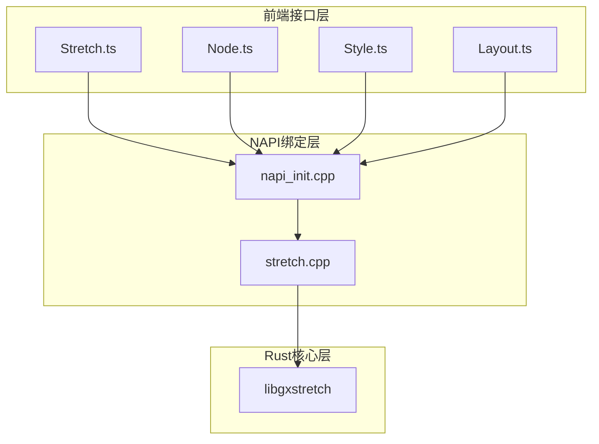
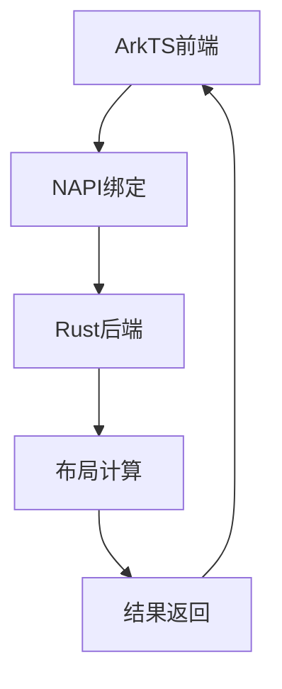
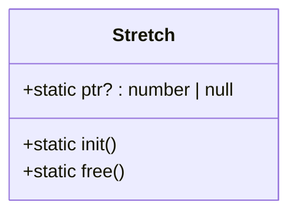
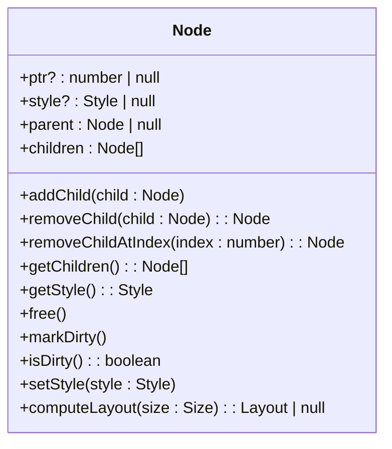
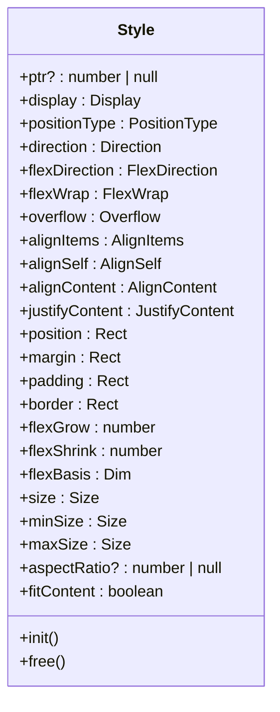
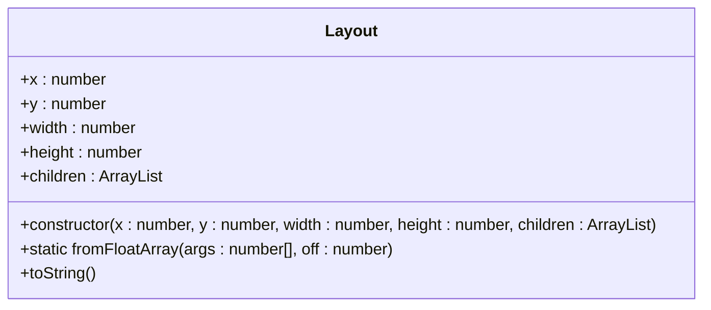
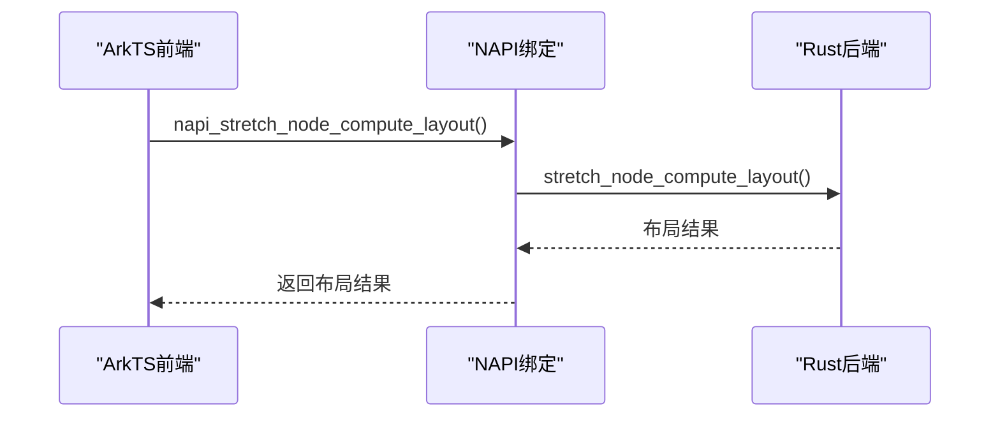
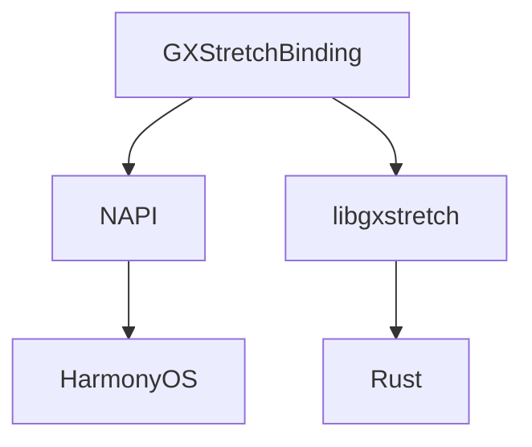

# 跨平台集成

<cite>
**Referenced Files in This Document**   
- [Stretch.ts](file://GaiaXHarmony/GXStretchBinding/GXStretch/src/main/ets/stretch/Stretch.ts)
- [Node.ts](file://GaiaXHarmony/GXStretchBinding/GXStretch/src/main/ets/stretch/Node.ts)
- [Style.ts](file://GaiaXHarmony/GXStretchBinding/GXStretch/src/main/ets/stretch/Style.ts)
- [Layout.ts](file://GaiaXHarmony/GXStretchBinding/GXStretch/src/main/ets/stretch/Layout.ts)
- [napi_init.cpp](file://GaiaXHarmony/GXStretchBinding/GXStretch/src/main/cpp/napi_init.cpp)
- [stretch.cpp](file://GaiaXStretch/bindings/harmony_stretch/GXStretch/src/main/cpp/stretch.cpp)
</cite>

## 目录
1. [简介](#简介)
2. [项目结构](#项目结构)
3. [核心组件](#核心组件)
4. [架构概述](#架构概述)
5. [详细组件分析](#详细组件分析)
6. [依赖分析](#依赖分析)
7. [性能考虑](#性能考虑)
8. [故障排除指南](#故障排除指南)
9. [结论](#结论)

## 简介
本文档详细介绍了GaiaX HarmonyOS跨平台集成中GXStretchBinding模块的实现，重点阐述了如何将Rust实现的GaiaXStretch布局引擎集成到HarmonyOS平台。文档涵盖了Stretch.ts文件中提供的布局计算接口、尺寸测量方法和约束传递机制，解释了ArkTS与Rust之间的交互方式，包括数据类型转换、内存管理和异步调用处理。为初学者提供了布局引擎集成的基本步骤和调用示例，为高级开发者深入剖析了跨语言调用的性能开销、错误传播机制以及线程同步策略。

## 项目结构
GXStretchBinding模块是GaiaX在HarmonyOS平台上的布局引擎集成实现，位于`GaiaXHarmony/GXStretchBinding`目录下。该模块主要由ArkTS前端接口和C++/Rust后端实现组成，通过NAPI（Node-API）实现跨语言调用。项目结构清晰地分为前端接口层、NAPI绑定层和Rust核心计算层。

**Diagram sources**
- [Stretch.ts](file://GaiaXHarmony/GXStretchBinding/GXStretch/src/main/ets/stretch/Stretch.ts)
- [Node.ts](file://GaiaXHarmony/GXStretchBinding/GXStretch/src/main/ets/stretch/Node.ts)
- [Style.ts](file://GaiaXHarmony/GXStretchBinding/GXStretch/src/main/ets/stretch/Style.ts)
- [Layout.ts](file://GaiaXHarmony/GXStretchBinding/GXStretch/src/main/ets/stretch/Layout.ts)
- [napi_init.cpp](file://GaiaXHarmony/GXStretchBinding/GXStretch/src/main/cpp/napi_init.cpp)
- [stretch.cpp](file://GaiaXStretch/bindings/harmony_stretch/GXStretch/src/main/cpp/stretch.cpp)

**Section sources**
- [Stretch.ts](file://GaiaXHarmony/GXStretchBinding/GXStretch/src/main/ets/stretch/Stretch.ts)
- [Node.ts](file://GaiaXHarmony/GXStretchBinding/GXStretch/src/main/ets/stretch/Node.ts)
- [Style.ts](file://GaiaXHarmony/GXStretchBinding/GXStretch/src/main/ets/stretch/Style.ts)
- [Layout.ts](file://GaiaXHarmony/GXStretchBinding/GXStretch/src/main/ets/stretch/Layout.ts)
- [napi_init.cpp](file://GaiaXHarmony/GXStretchBinding/GXStretch/src/main/cpp/napi_init.cpp)
- [stretch.cpp](file://GaiaXStretch/bindings/harmony_stretch/GXStretch/src/main/cpp/stretch.cpp)

## 核心组件
GXStretchBinding模块的核心组件包括Stretch、Node、Style和Layout四个主要类。Stretch类负责初始化和释放布局引擎实例，Node类表示布局树中的节点，Style类定义了节点的样式属性，Layout类则封装了布局计算的结果。这些组件共同构成了一个完整的布局计算系统，能够处理复杂的UI布局需求。

**Section sources**
- [Stretch.ts](file://GaiaXHarmony/GXStretchBinding/GXStretch/src/main/ets/stretch/Stretch.ts)
- [Node.ts](file://GaiaXHarmony/GXStretchBinding/GXStretch/src/main/ets/stretch/Node.ts)
- [Style.ts](file://GaiaXHarmony/GXStretchBinding/GXStretch/src/main/ets/stretch/Style.ts)
- [Layout.ts](file://GaiaXHarmony/GXStretchBinding/GXStretch/src/main/ets/stretch/Layout.ts)

## 架构概述
GXStretchBinding模块采用分层架构设计，将前端接口与后端计算逻辑分离。前端使用ArkTS语言提供简洁易用的API，后端使用Rust语言实现高性能的布局计算。通过NAPI实现跨语言调用，确保了前后端之间的高效通信。这种架构设计不仅提高了代码的可维护性，还充分发挥了不同编程语言的优势。

**Diagram sources**
- [Stretch.ts](file://GaiaXHarmony/GXStretchBinding/GXStretch/src/main/ets/stretch/Stretch.ts)
- [napi_init.cpp](file://GaiaXHarmony/GXStretchBinding/GXStretch/src/main/cpp/napi_init.cpp)
- [stretch.cpp](file://GaiaXStretch/bindings/harmony_stretch/GXStretch/src/main/cpp/stretch.cpp)

## 详细组件分析

### Stretch类分析
Stretch类是布局引擎的入口点，负责管理布局引擎的生命周期。它提供了初始化和释放布局引擎实例的方法，确保资源的正确分配和回收。

**Diagram sources**
- [Stretch.ts](file://GaiaXHarmony/GXStretchBinding/GXStretch/src/main/ets/stretch/Stretch.ts)

**Section sources**
- [Stretch.ts](file://GaiaXHarmony/GXStretchBinding/GXStretch/src/main/ets/stretch/Stretch.ts)

### Node类分析
Node类表示布局树中的节点，支持添加和移除子节点、设置样式、标记脏状态等操作。它是构建复杂UI布局的基础。

**Diagram sources**
- [Node.ts](file://GaiaXHarmony/GXStretchBinding/GXStretch/src/main/ets/stretch/Node.ts)

**Section sources**
- [Node.ts](file://GaiaXHarmony/GXStretchBinding/GXStretch/src/main/ets/stretch/Node.ts)

### Style类分析
Style类定义了节点的样式属性，包括对齐方式、方向、显示类型等。它通过枚举类型提供了丰富的样式选项，满足各种布局需求。

**Diagram sources**
- [Style.ts](file://GaiaXHarmony/GXStretchBinding/GXStretch/src/main/ets/stretch/Style.ts)

**Section sources**
- [Style.ts](file://GaiaXHarmony/GXStretchBinding/GXStretch/src/main/ets/stretch/Style.ts)

### Layout类分析
Layout类封装了布局计算的结果，包括节点的位置、大小和子节点布局信息。它通过静态方法从浮点数组中解析布局数据，实现了高效的序列化和反序列化。

**Diagram sources**
- [Layout.ts](file://GaiaXHarmony/GXStretchBinding/GXStretch/src/main/ets/stretch/Layout.ts)

**Section sources**
- [Layout.ts](file://GaiaXHarmony/GXStretchBinding/GXStretch/src/main/ets/stretch/Layout.ts)

### NAPI绑定分析
NAPI绑定层是连接ArkTS前端和Rust后端的关键，它通过C++代码实现了跨语言调用。`napi_init.cpp`文件定义了所有NAPI函数，将ArkTS的调用转换为对Rust函数的调用。

**Diagram sources**
- [napi_init.cpp](file://GaiaXHarmony/GXStretchBinding/GXStretch/src/main/cpp/napi_init.cpp)
- [stretch.cpp](file://GaiaXStretch/bindings/harmony_stretch/GXStretch/src/main/cpp/stretch.cpp)

**Section sources**
- [napi_init.cpp](file://GaiaXHarmony/GXStretchBinding/GXStretch/src/main/cpp/napi_init.cpp)
- [stretch.cpp](file://GaiaXStretch/bindings/harmony_stretch/GXStretch/src/main/cpp/stretch.cpp)

## 依赖分析
GXStretchBinding模块依赖于HarmonyOS的NAPI框架和Rust的libgxstretch库。NAPI框架提供了跨语言调用的能力，libgxstretch库则实现了核心的布局计算逻辑。这种依赖关系确保了模块的高性能和跨平台兼容性。

**Diagram sources**
- [napi_init.cpp](file://GaiaXHarmony/GXStretchBinding/GXStretch/src/main/cpp/napi_init.cpp)
- [stretch.cpp](file://GaiaXStretch/bindings/harmony_stretch/GXStretch/src/main/cpp/stretch.cpp)

**Section sources**
- [napi_init.cpp](file://GaiaXHarmony/GXStretchBinding/GXStretch/src/main/cpp/napi_init.cpp)
- [stretch.cpp](file://GaiaXStretch/bindings/harmony_stretch/GXStretch/src/main/cpp/stretch.cpp)

## 性能考虑
GXStretchBinding模块在设计时充分考虑了性能因素。通过使用Rust语言实现核心计算逻辑，确保了布局计算的高效性。同时，NAPI绑定层的优化减少了跨语言调用的开销，提高了整体性能。对于复杂的布局计算，建议使用异步调用以避免阻塞主线程。

## 故障排除指南
在使用GXStretchBinding模块时，可能会遇到一些常见问题。例如，布局计算结果不正确可能是由于样式设置错误或节点树结构问题。内存泄漏问题通常与未正确释放布局引擎实例有关。建议在开发过程中使用日志工具跟踪布局计算过程，及时发现和解决问题。

**Section sources**
- [Stretch.ts](file://GaiaXHarmony/GXStretchBinding/GXStretch/src/main/ets/stretch/Stretch.ts)
- [Node.ts](file://GaiaXHarmony/GXStretchBinding/GXStretch/src/main/ets/stretch/Node.ts)
- [Style.ts](file://GaiaXHarmony/GXStretchBinding/GXStretch/src/main/ets/stretch/Style.ts)
- [Layout.ts](file://GaiaXHarmony/GXStretchBinding/GXStretch/src/main/ets/stretch/Layout.ts)
- [napi_init.cpp](file://GaiaXHarmony/GXStretchBinding/GXStretch/src/main/cpp/napi_init.cpp)
- [stretch.cpp](file://GaiaXStretch/bindings/harmony_stretch/GXStretch/src/main/cpp/stretch.cpp)

## 结论
GXStretchBinding模块成功地将Rust实现的GaiaXStretch布局引擎集成到HarmonyOS平台，通过NAPI实现了高效的跨语言调用。该模块不仅提供了简洁易用的API，还确保了高性能的布局计算能力。未来可以进一步优化跨语言调用的性能，增加更多的布局算法支持，提升模块的适用性和灵活性。