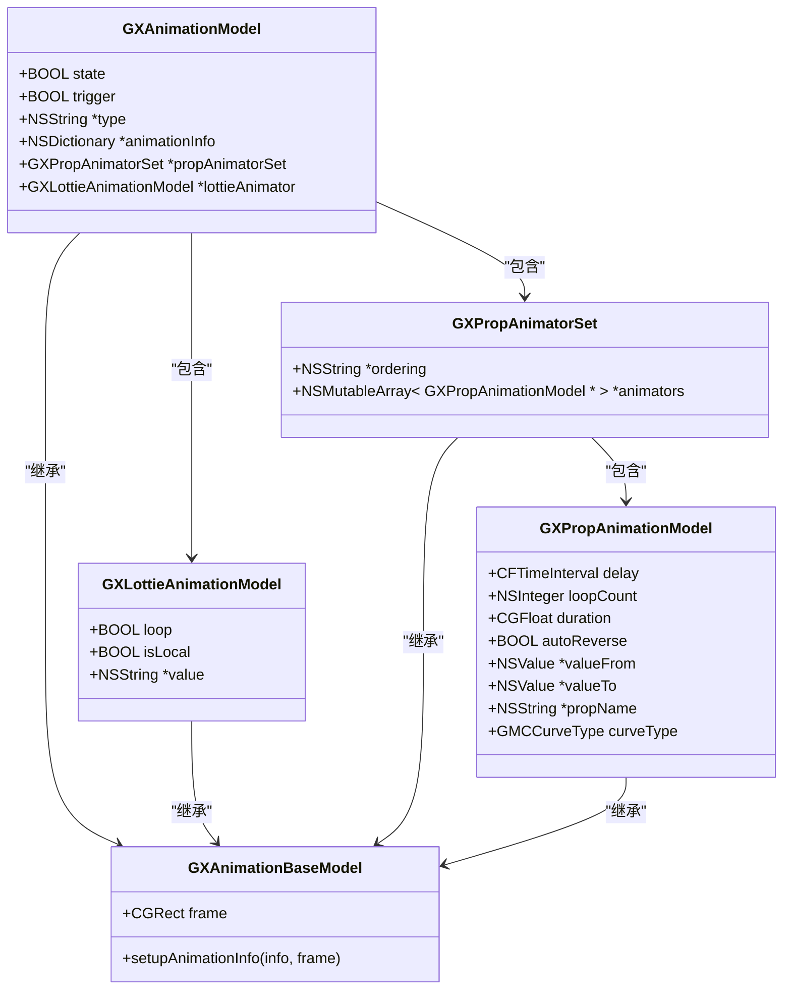
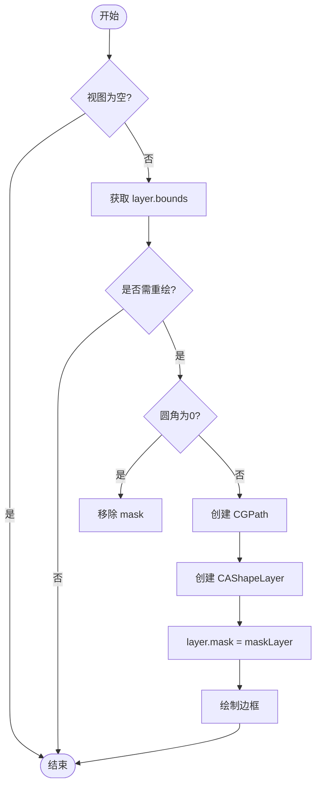
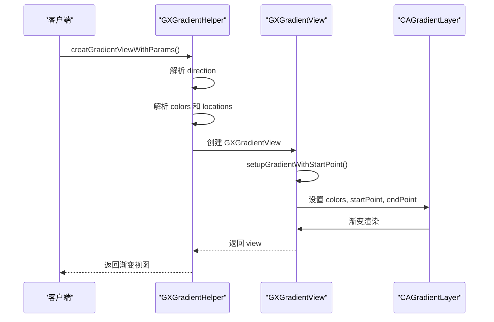

# UI组件

<cite>
**本文档引用文件**  
- [GXAnimationModel.h](file://GaiaXiOS/GaiaXiOS/Component/Animation/GXAnimationModel.h)
- [GXAnimationModel.m](file://GaiaXiOS/GaiaXiOS/Component/Animation/GXAnimationModel.m)
- [GXCornerRadiusHelper.h](file://GaiaXiOS/GaiaXiOS/Utilities/GXCornerRadiusHelper.h)
- [GXCornerRadiusHelper.m](file://GaiaXiOS/GaiaXiOS/Utilities/GXCornerRadiusHelper.m)
- [GXGradientHelper.h](file://GaiaXiOS/GaiaXiOS/Utilities/GXGradientHelper.h)
- [GXGradientHelper.m](file://GaiaXiOS/GaiaXiOS/Utilities/GXGradientHelper.m)
- [GXViewNode.m](file://GaiaXiOS/GaiaXiOS/Component/Node/GXViewNode.m)
- [GXBaseNode.h](file://GaiaXiOS/GaiaXiOS/Component/Node/GXBaseNode.h)
- [GXView.h](file://GaiaXiOS/GaiaXiOS/Component/View/Basic/GXView.h)
</cite>

## 目录
1. [简介](#简介)
2. [基本视图与容器组件](#基本视图与容器组件)
3. [动画模型设计与集成](#动画模型设计与集成)
4. [视觉效果实现原理](#视觉效果实现原理)
5. [UI组件使用示例与样式配置](#ui组件使用示例与样式配置)
6. [高级开发：性能优化与扩展](#高级开发性能优化与扩展)
7. [响应式设计与屏幕适配](#响应式设计与屏幕适配)
8. [总结](#总结)

## 简介
GaiaX 是一个跨平台的 UI 框架，支持在 iOS 平台上构建高性能、可扩展的动态 UI 组件。本文档重点介绍 GaiaX iOS 中的 UI 组件体系，涵盖基本视图、容器组件、动画系统、视觉效果（如圆角、渐变）的实现机制。同时为初学者提供使用示例，为高级开发者分析性能优化与扩展方式。

## 基本视图与容器组件

GaiaX 的基本视图组件以 `GXView` 为基础，继承自 `UIView`，作为所有 UI 节点的容器载体。`GXViewNode` 是核心节点类，负责管理视图的创建、渲染、样式绑定与事件处理。

容器组件通过 `GXBaseNode` 提供通用属性支持，包括透明度、边框、圆角、背景色、阴影和毛玻璃效果。这些属性通过 `updateLayoutStyle:` 和 `updateNormalStyle:` 方法区分是否影响布局计算。

**组件结构关系：**
- `GXView`：基础视图容器
- `GXBaseNode`：提供通用 UI 属性
- `GXViewNode`：实现视图创建与渲染逻辑
- `GXNode`：抽象节点基类

**视图创建流程：**
1. 调用 `creatView` 创建 `GXView` 实例
2. 绑定节点 ID、业务 ID 等上下文信息
3. 设置是否支持渐变背景与阴影
4. 通过 `renderView:` 方法更新视图属性

**视觉属性支持：**
- 透明度 (`opacity`)
- 裁剪子视图 (`clipsToBounds`)
- 边框与边框颜色
- 线性渐变背景 (`linearGradient`)
- 阴影 (`boxShadow`)
- 毛玻璃 (`backdropFilter`)

**Section sources**
- [GXView.h](file://GaiaXiOS/GaiaXiOS/Component/View/Basic/GXView.h#L1-L28)
- [GXBaseNode.h](file://GaiaXiOS/GaiaXiOS/Component/Node/GXBaseNode.h#L1-L83)
- [GXViewNode.m](file://GaiaXiOS/GaiaXiOS/Component/Node/GXViewNode.m#L49-L67)

## 动画模型设计与集成

GaiaX 的动画系统通过 `GXAnimationModel` 类实现，支持 Lottie 动画与属性动画两种类型，并可通过 `trigger` 和 `state` 控制手动触发。

### 动画模型结构



**Diagram sources**
- [GXAnimationModel.h](file://GaiaXiOS/GaiaXiOS/Component/Animation/GXAnimationModel.h#L29-L117)
- [GXAnimationModel.m](file://GaiaXiOS/GaiaXiOS/Component/Animation/GXAnimationModel.m#L25-L248)

### 动画集成流程

1. **数据绑定**：通过 `bindAnimation:` 方法接收动画配置
2. **模型初始化**：调用 `setupGaiaXAnimation:` 创建 `GXAnimationModel`
3. **动画执行**：
   - Lottie 动画：创建 `lottieViewClass` 实例并播放
   - 属性动画：使用 `GaiaMotionCurve` 框架生成 `GMCModel` 并执行
4. **回调通知**：动画结束后通过 `gx_animationDidFinished:` 通知监听器

动画支持并行（`together`）与串行（`sequentially`）执行模式，插值器支持线性、标准、加速、减速、弹性等多种曲线类型。

**Section sources**
- [GXAnimationModel.h](file://GaiaXiOS/GaiaXiOS/Component/Animation/GXAnimationModel.h#L1-L117)
- [GXAnimationModel.m](file://GaiaXiOS/GaiaXiOS/Component/Animation/GXAnimationModel.m#L1-L248)
- [GXViewNode.m](file://GaiaXiOS/GaiaXiOS/Component/Node/GXViewNode.m#L194-L403)

## 视觉效果实现原理

### 圆角实现（GXCornerRadiusHelper）

圆角功能通过 `GXCornerRadiusHelper` 类实现，利用 `CAShapeLayer` 作为 `mask` 来绘制非对称圆角。

**实现步骤：**
1. 定义 `GXCornerRadius` 结构体，支持四个角独立设置
2. 通过 `GXCreatePath()` 函数创建 `CGPathRef` 路径
3. 使用 `CGPathAddArc` 分别绘制四个圆角弧线
4. 将路径赋值给 `layer.mask` 实现裁剪
5. 支持边框绘制，通过额外 `CAShapeLayer` 实现描边

**性能优化：**
- 缓存路径与圆角值，避免重复绘制
- 当圆角为 0 时移除 `mask` 提升性能
- 仅在 `bounds` 或圆角值变化时重新生成路径



**Diagram sources**
- [GXCornerRadiusHelper.h](file://GaiaXiOS/GaiaXiOS/Utilities/GXCornerRadiusHelper.h#L1-L38)
- [GXCornerRadiusHelper.m](file://GaiaXiOS/GaiaXiOS/Utilities/GXCornerRadiusHelper.m#L1-L154)

### 渐变实现（GXGradientHelper）

渐变效果通过 `GXGradientHelper` 类实现，支持生成 `UIView`、`CAGradientLayer` 和 `UIImage` 三种形式。

**核心类：**
- `GXGradientView`：继承自 `UIView`，其 `layerClass` 返回 `CAGradientLayer`
- `GXGradientHelper`：提供工厂方法创建渐变对象

**方向映射：**
- `toright` → (0,0) → (1,0)
- `tobottom` → (0,0) → (0,1)
- `tobottomright` → (0,0) → (1,1)
- 支持百分比位置与颜色停靠点

**暗黑模式适配：**
通过 `traitCollectionDidChange:` 监听界面样式变化，动态更新渐变颜色。

**线性渐变解析：**
支持 `linear-gradient(to right, #ff0000, #00ff00 50%)` 格式字符串，通过正则表达式解析方向、颜色与位置。



**Diagram sources**
- [GXGradientHelper.h](file://GaiaXiOS/GaiaXiOS/Utilities/GXGradientHelper.h#L1-L63)
- [GXGradientHelper.m](file://GaiaXiOS/GaiaXiOS/Utilities/GXGradientHelper.m#L1-L337)

## UI组件使用示例与样式配置

### 基本视图使用

```objc
// 创建 GXView
GXView *view = [[GXView alloc] initWithFrame:CGRectMake(0, 0, 100, 100)];
view.backgroundColor = [UIColor blueColor];
[self.view addSubview:view];
```

### 圆角设置

```objc
// 设置非对称圆角
GXCornerRadius radius = GXCornerRadiusMake(10, 20, 0, 5);
[GXCornerRadiusHelper setCornerRadius:radius 
                           borderWidth:2.0 
                           borderColor:[UIColor grayColor] 
                            targetView:view];
```

### 渐变背景

```objc
// 方式1：通过参数字典
NSDictionary *params = @{
    @"direction": @"tobottom",
    @"colors": @[@"#FF0000", @"#0000FF"],
    @"locations": @[@0.0, @1.0]
};
[view gx_setBackgroundGradient:params];

// 方式2：通过 CSS 字符串
NSString *gradient = @"linear-gradient(to bottom, #FF0000, #0000FF)";
NSDictionary *parsed = [GXGradientHelper parserLinearGradient:gradient];
[view gx_setBackgroundGradient:parsed];
```

### 动画配置

```json
{
  "type": "prop",
  "trigger": true,
  "state": false,
  "propAnimatorSet": {
    "ordering": "together",
    "animators": [
      {
        "propName": "opacity",
        "duration": 1000,
        "valueFrom": 0,
        "valueTo": 1,
        "interpolator": "standard"
      },
      {
        "propName": "scale",
        "duration": 1000,
        "valueFrom": 0.5,
        "valueTo": 1.0
      }
    ]
  }
}
```

**Section sources**
- [GXView.h](file://GaiaXiOS/GaiaXiOS/Component/View/Basic/GXView.h#L1-L28)
- [GXCornerRadiusHelper.h](file://GaiaXiOS/GaiaXiOS/Utilities/GXCornerRadiusHelper.h#L1-L38)
- [GXGradientHelper.h](file://GaiaXiOS/GaiaXiOS/Utilities/GXGradientHelper.h#L1-L63)
- [GXAnimationModel.h](file://GaiaXiOS/GaiaXiOS/Component/Animation/GXAnimationModel.h#L1-L117)

## 高级开发：性能优化与扩展

### UI渲染性能优化

1. **圆角优化**：避免使用 `cornerRadius + clipsToBounds` 组合，改用 `CAShapeLayer` mask
2. **渐变优化**：复用 `CAGradientLayer`，避免频繁创建
3. **动画优化**：
   - 使用 `drawsAsynchronously = YES` 异步绘制
   - 动画结束及时调用 `gmc_cancelAllAnimations`
   - 避免在主线程执行复杂路径计算
4. **缓存机制**：`GXGradientHelper` 使用 `NSRegularExpression` 缓存正则表达式

### 复杂动画实现

- 支持属性动画组合（`GXPropAnimatorSet`）
- 支持 Lottie 动画嵌入
- 支持手动触发与自动播放切换
- 支持动画完成回调与事件通知

### 自定义视觉效果扩展

1. **注册自定义组件**：通过 `GXRegisterCenter` 注册新视图类
2. **扩展动画类型**：继承 `GXAnimationModel` 实现新动画类型
3. **自定义渐变算法**：继承 `GXGradientView` 重写 `setupGradientWithStartPoint:`
4. **支持新 CSS 函数**：扩展 `parserLinearGradient:` 支持 `radial-gradient`

**Section sources**
- [GXCornerRadiusHelper.m](file://GaiaXiOS/GaiaXiOS/Utilities/GXCornerRadiusHelper.m#L80-L154)
- [GXGradientHelper.m](file://GaiaXiOS/GaiaXiOS/Utilities/GXGradientHelper.m#L99-L151)
- [GXViewNode.m](file://GaiaXiOS/GaiaXiOS/Component/Node/GXViewNode.m#L336-L363)

## 响应式设计与屏幕适配

GaiaX 支持基于 Flex 布局的响应式设计，结合以下策略实现多屏幕适配：

1. **相对单位**：支持 `dp`、`sp`、`%` 等相对单位
2. **布局引擎**：基于 Yoga/Flexbox 实现弹性布局
3. **动态样式更新**：通过 `updateLayoutStyle:` 动态调整布局属性
4. **暗黑模式适配**：通过 `traitCollectionDidChange:` 响应界面样式变化
5. **字体缩放**：支持动态字体大小调整

建议使用约束布局而非固定坐标，确保在不同屏幕尺寸下保持良好显示效果。

**Section sources**
- [GXBaseNode.h](file://GaiaXiOS/GaiaXiOS/Component/Node/GXBaseNode.h#L56-L60)
- [GXGradientHelper.m](file://GaiaXiOS/GaiaXiOS/Utilities/GXGradientHelper.m#L41-L53)

## 总结
GaiaX iOS 的 UI 组件体系设计清晰，通过 `GXViewNode` 统一管理视图生命周期，`GXAnimationModel` 实现灵活动画控制，`GXCornerRadiusHelper` 和 `GXGradientHelper` 提供高性能视觉效果。开发者可基于此体系快速构建动态 UI，同时通过扩展机制满足复杂业务需求。建议在实际开发中注重性能优化，合理使用缓存与异步处理，提升用户体验。