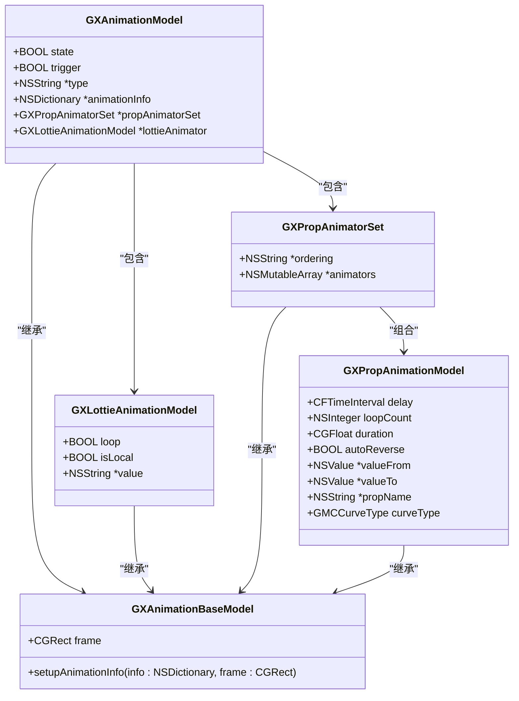
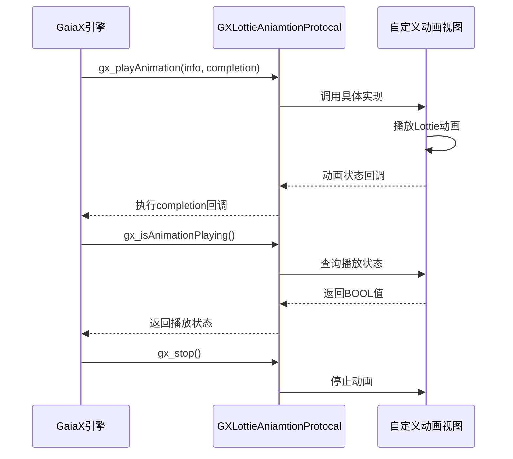
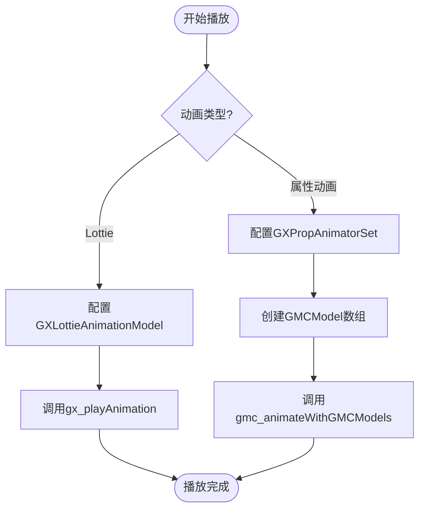

# 动画系统

<cite>
**本文档引用文件**  
- [GXAnimationModel.h](file://GaiaXiOS/GaiaXiOS/Component/Animation/GXAnimationModel.h)
- [GXAnimationModel.m](file://GaiaXiOS/GaiaXiOS/Component/Animation/GXAnimationModel.m)
- [GXLottieAniamtionProtocal.h](file://GaiaXiOS/GaiaXiOS/Component/Animation/GXLottieAniamtionProtocal.h)
</cite>

## 目录
1. [简介](#简介)
2. [GXAnimationModel 设计与实现](#gxanimationmodel-设计与实现)
3. [GXLottieAniamtionProtocal 协议集成](#gxlottieaniamtionprotocal-协议集成)
4. [动画数据结构与状态管理](#动画数据结构与状态管理)
5. [播放控制与性能优化](#播放控制与性能优化)
6. [Lottie 动画集成示例](#lottie-动画集成示例)
7. [高级功能分析](#高级功能分析)
8. [网络加载策略与用户体验优化](#网络加载策略与用户体验优化)

## 简介
GaiaX iOS 动画系统为开发者提供了灵活且高效的动画能力，支持属性动画和 Lottie 动画两种核心类型。系统通过 `GXAnimationModel` 统一管理动画配置，并通过 `GXLottieAniamtionProtocal` 协议实现 Lottie 动画的可扩展集成。本系统兼顾初学者的易用性与高级开发者的可定制性，支持复杂动画序列、状态同步、性能监控等高级功能。

## GXAnimationModel 设计与实现

`GXAnimationModel` 是 GaiaX 动画系统的核心数据模型，负责解析和封装动画配置信息。该模型采用继承结构，以 `GXAnimationBaseModel` 为基类，派生出多种具体动画类型。



**图示来源**
- [GXAnimationModel.h](file://GaiaXiOS/GaiaXiOS/Component/Animation/GXAnimationModel.h#L29-L116)

**本节来源**
- [GXAnimationModel.h](file://GaiaXiOS/GaiaXiOS/Component/Animation/GXAnimationModel.h#L29-L116)
- [GXAnimationModel.m](file://GaiaXiOS/GaiaXiOS/Component/Animation/GXAnimationModel.m#L25-L248)

## GXLottieAniamtionProtocal 协议集成

`GXLottieAniamtionProtocal` 是 Lottie 动画播放器的抽象协议，允许业务方自定义 Lottie 渲染组件。通过该协议，GaiaX 实现了与具体 Lottie 实现的解耦，支持灵活替换底层动画引擎。



**图示来源**
- [GXLottieAniamtionProtocal.h](file://GaiaXiOS/GaiaXiOS/Component/Animation/GXLottieAniamtionProtocal.h#L12-L36)

**本节来源**
- [GXLottieAniamtionProtocal.h](file://GaiaXiOS/GaiaXiOS/Component/Animation/GXLottieAniamtionProtocal.h#L12-L36)

## 动画数据结构与状态管理

### 核心数据结构
| 属性 | 类型 | 描述 |
|------|------|------|
| `type` | NSString | 动画类型（lottie \| prop） |
| `trigger` | BOOL | 是否为手动触发动画 |
| `state` | BOOL | 动画状态（仅 trigger=YES 时生效） |
| `animationInfo` | NSDictionary | 原始动画配置字典 |
| `loop` | BOOL | Lottie动画是否循环播放 |
| `value` | NSString | Lottie资源路径或URL |
| `ordering` | NSString | 属性动画组合执行顺序（together \| sequentially） |
| `propName` | NSString | 属性动画目标属性 |
| `curveType` | GMCCurveType | 插值器类型 |

### 状态管理机制
系统通过 `setupAnimationInfo:frame:` 方法统一初始化所有动画模型，根据配置自动构建对应的 `lottieAnimator` 或 `propAnimatorSet`。状态变更通过 `state` 属性控制，结合 `trigger` 标志位实现手动/自动触发逻辑。

**本节来源**
- [GXAnimationModel.h](file://GaiaXiOS/GaiaXiOS/Component/Animation/GXAnimationModel.h#L43-L110)
- [GXAnimationModel.m](file://GaiaXiOS/GaiaXiOS/Component/Animation/GXAnimationModel.m#L36-L63)

## 播放控制与性能优化

### 播放控制流程


### 性能优化策略
1. **对象复用**：动画模型在 `setupAnimationInfo` 中优先复用已有实例，避免频繁创建销毁
2. **内存管理**：使用 `NSMutableArray` 动态管理动画序列，支持按需增删
3. **渲染优化**：基于 `GaiaMotionCurve` 框架实现高性能属性动画，减少主线程压力
4. **资源预加载**：本地 Lottie 资源提前解析，减少运行时开销

**图示来源**
- [GXAnimationModel.m](file://GaiaXiOS/GaiaXiOS/Component/Animation/GXAnimationModel.m#L36-L63)
- [GXViewNode.m](file://GaiaXiOS/GaiaXiOS/Component/Node/GXViewNode.m#L348-L373)

**本节来源**
- [GXAnimationModel.m](file://GaiaXiOS/GaiaXiOS/Component/Animation/GXAnimationModel.m#L36-L63)
- [GXViewNode.m](file://GaiaXiOS/GaiaXiOS/Component/Node/GXViewNode.m#L348-L373)

## Lottie 动画集成示例

### 基础配置方法
```objc
// 1. 创建符合协议的动画视图
CompatibleAnimationView *animationView = [[CompatibleAnimationView alloc] initWithFrame:self.bounds];
animationView.compatibleBackgroundBehavior = 2;

// 2. 配置动画参数
NSDictionary *animationInfo = @{
    @"isLocal": @YES,
    @"value": @"animation.json",
    @"loop": @YES
};

// 3. 播放动画
[animationView gx_playAnimation:animationInfo completion:^(BOOL finished) {
    if (finished) {
        NSLog(@"Animation completed");
    }
}];
```

### 初学者注意事项
- 确保 `CompatibleAnimationView` 正确实现了 `GXLottieAniamtionProtocal`
- 本地资源需放置在 Bundle 中并正确设置路径
- 网络资源需处理加载失败的异常情况

**本节来源**
- [GXLottieAniamtionProtocal.h](file://GaiaXiOS/GaiaXiOS/Component/Animation/GXLottieAniamtionProtocal.h#L16-L25)

## 高级功能分析

### 复杂动画序列同步
通过 `GXPropAnimatorSet` 的 `ordering` 属性控制动画执行顺序：
- `together`：所有子动画同时执行（默认）
- `sequentially`：子动画按顺序串行执行

系统在 `setupAnimationInfo` 中动态调整 `animators` 数组长度，确保内存高效利用。

### 自定义动画扩展
开发者可通过实现 `GXLottieAniamtionProtocal` 协议，集成自定义 Lottie 播放器：
1. 继承协议并实现三个必需方法
2. 在 `gx_playAnimation` 中解析 `animationInfo` 参数
3. 调用底层播放器 API 执行动画
4. 通过 `completion` 回调通知动画完成状态

**本节来源**
- [GXAnimationModel.h](file://GaiaXiOS/GaiaXiOS/Component/Animation/GXAnimationModel.h#L77-L80)
- [GXAnimationModel.m](file://GaiaXiOS/GaiaXiOS/Component/Animation/GXAnimationModel.m#L98-L131)

## 网络加载策略与用户体验优化

### 加载策略
| 条件 | 处理方式 |
|------|----------|
| URL 以 http/https 开头 | 作为远程资源加载 |
| URL 不含协议头 | 视为本地资源，拼接 bundle 路径 |
| 同时提供 bundle 和 value | 组合为 `bundle/value` 路径 |

### 用户体验优化建议
1. **预加载机制**：在页面初始化时预加载常用动画资源
2. **占位图**：网络动画加载期间显示占位图避免白屏
3. **缓存策略**：对远程 Lottie 资源进行本地缓存
4. **降级方案**：网络异常时切换到本地备用动画或静态图
5. **性能监控**：监控动画加载耗时，及时发现性能瓶颈

**本节来源**
- [GXAnimationModel.m](file://GaiaXiOS/GaiaXiOS/Component/Animation/GXAnimationModel.m#L77-L89)