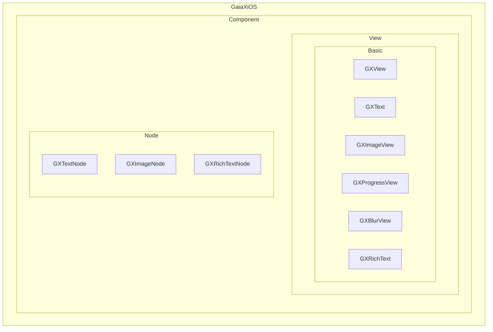
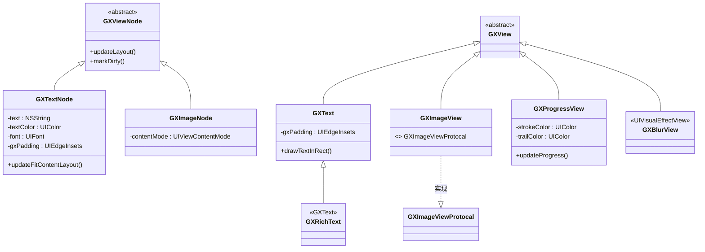
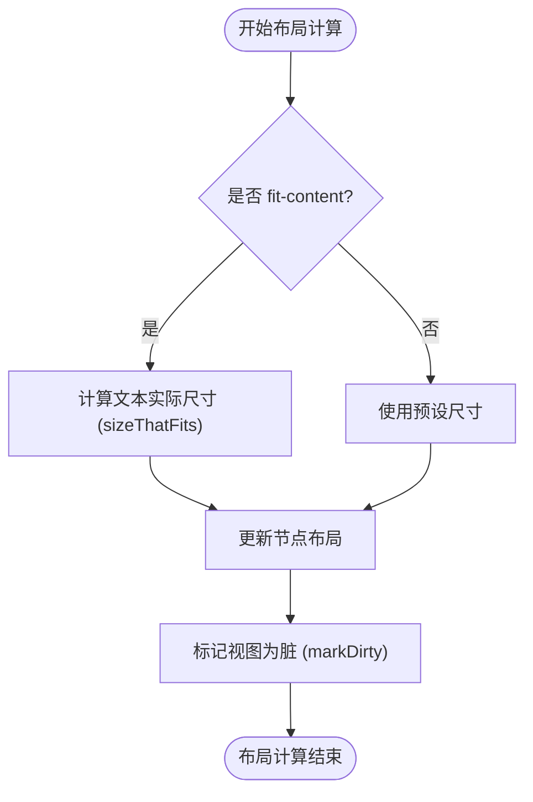
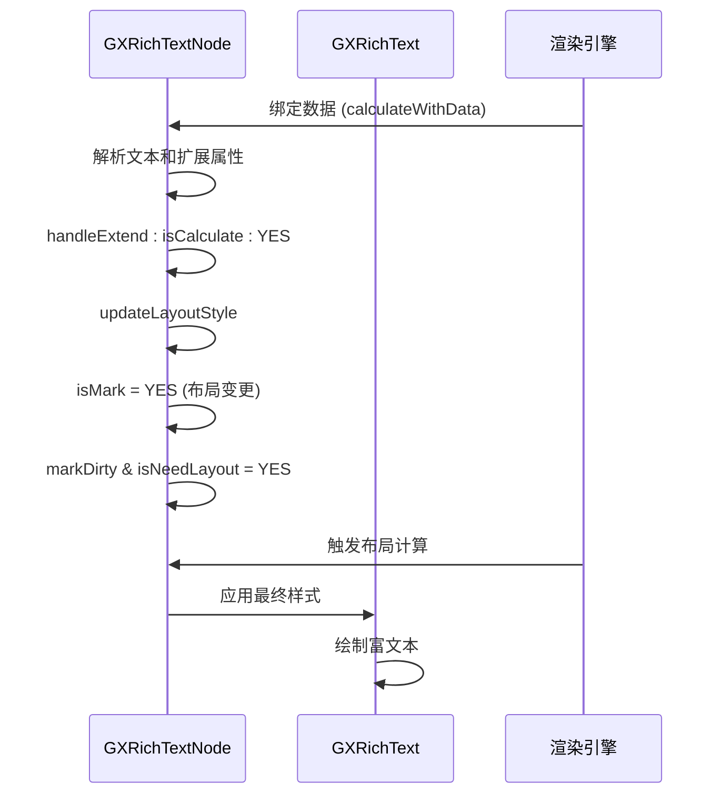
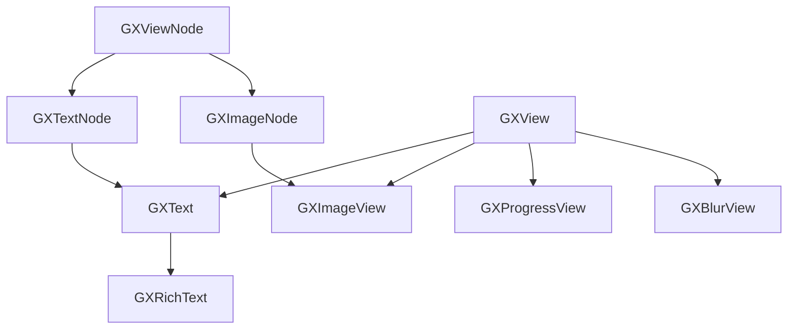

# 基础组件

<cite>
**本文档中引用的文件**  
- [GXView.h](file://GaiaXiOS/GaiaXiOS/Component/View/Basic/GXView.h)
- [GXView.m](file://GaiaXiOS/GaiaXiOS/Component/View/Basic/GXView.m)
- [GXText.h](file://GaiaXiOS/GaiaXiOS/Component/View/Basic/GXText.h)
- [GXText.m](file://GaiaXiOS/GaiaXiOS/Component/View/Basic/GXText.m)
- [GXRichText.h](file://GaiaXiOS/GaiaXiOS/Component/View/Basic/GXRichText.h)
- [GXImageView.h](file://GaiaXiOS/GaiaXiOS/Component/View/Basic/GXImageView.h)
- [GXProgressView.h](file://GaiaXiOS/GaiaXiOS/Component/View/Basic/GXProgressView.h)
- [GXBlurView.h](file://GaiaXiOS/GaiaXiOS/Component/View/Basic/GXBlurView.h)
- [GXTextNode.h](file://GaiaXiOS/GaiaXiOS/Component/Node/GXTextNode.h)
- [GXImageNode.h](file://GaiaXiOS/GaiaXiOS/Component/Node/GXImageNode.h)
- [GXRichTextNode.m](file://GaiaXiOS/GaiaXiOS/Component/Node/GXRichTextNode.m)
</cite>

## 目录
1. [简介](#简介)
2. [项目结构](#项目结构)
3. [核心组件](#核心组件)
4. [架构概览](#架构概览)
5. [详细组件分析](#详细组件分析)
6. [依赖分析](#依赖分析)
7. [性能考量](#性能考量)
8. [故障排除指南](#故障排除指南)
9. [结论](#结论)

## 简介
本文档详细介绍了 GaiaX iOS 框架中的基础 UI 组件，包括 GXText、GXImageView、GXProgressView、GXBlurView、GXRichText 和 GXView。文档面向初学者和高级开发者，提供组件使用示例、属性配置说明、布局行为分析、渲染性能优化建议以及跨设备和系统版本的兼容性处理策略。

## 项目结构
GaiaX iOS 项目位于 `GaiaXiOS/GaiaXiOS` 目录下，基础 UI 组件主要集中在 `Component/View/Basic` 子目录中。组件的逻辑处理和节点管理则分布在 `Component/Node` 目录下。

**图示来源**
- [GXView.h](file://GaiaXiOS/GaiaXiOS/Component/View/Basic/GXView.h)
- [GXText.h](file://GaiaXiOS/GaiaXiOS/Component/View/Basic/GXText.h)
- [GXImageView.h](file://GaiaXiOS/GaiaXiOS/Component/View/Basic/GXImageView.h)
- [GXProgressView.h](file://GaiaXiOS/GaiaXiOS/Component/View/Basic/GXProgressView.h)
- [GXBlurView.h](file://GaiaXiOS/GaiaXiOS/Component/View/Basic/GXBlurView.h)
- [GXRichText.h](file://GaiaXiOS/GaiaXiOS/Component/View/Basic/GXRichText.h)
- [GXTextNode.h](file://GaiaXiOS/GaiaXiOS/Component/Node/GXTextNode.h)
- [GXImageNode.h](file://GaiaXiOS/GaiaXiOS/Component/Node/GXImageNode.h)

**章节来源**
- [GXView.h](file://GaiaXiOS/GaiaXiOS/Component/View/Basic/GXView.h)
- [GXText.h](file://GaiaXiOS/GaiaXiOS/Component/View/Basic/GXText.h)
- [GXImageView.h](file://GaiaXiOS/GaiaXiOS/Component/View/Basic/GXImageView.h)
- [GXProgressView.h](file://GaiaXiOS/GaiaXiOS/Component/View/Basic/GXProgressView.h)
- [GXBlurView.h](file://GaiaXiOS/GaiaXiOS/Component/View/Basic/GXBlurView.h)
- [GXRichText.h](file://GaiaXiOS/GaiaXiOS/Component/View/Basic/GXRichText.h)

## 核心组件
本文档涵盖的核心 UI 组件是 GaiaX 渲染系统的基础构建块。它们继承自标准的 iOS UIKit 组件，并扩展了特定于 GaiaX 的功能，如数据绑定、样式处理和布局计算。

**章节来源**
- [GXView.h](file://GaiaXiOS/GaiaXiOS/Component/View/Basic/GXView.h)
- [GXText.h](file://GaiaXiOS/GaiaXiOS/Component/View/Basic/GXText.h)
- [GXImageView.h](file://GaiaXiOS/GaiaXiOS/Component/View/Basic/GXImageView.h)
- [GXProgressView.h](file://GaiaXiOS/GaiaXiOS/Component/View/Basic/GXProgressView.h)
- [GXBlurView.h](file://GaiaXiOS/GaiaXiOS/Component/View/Basic/GXBlurView.h)
- [GXRichText.h](file://GaiaXiOS/GaiaXiOS/Component/View/Basic/GXRichText.h)

## 架构概览
GaiaX 的基础 UI 组件遵循典型的 MVC（Model-View-Controller）模式。`GXViewNode` 及其子类（如 `GXTextNode`, `GXImageNode`）作为模型（Model），负责管理组件的数据、样式和布局信息。`GXView` 及其子类（如 `GXText`, `GXImageView`）作为视图（View），负责实际的 UI 渲染。渲染引擎作为控制器（Controller），协调数据更新、布局计算和视图刷新。

**图示来源**
- [GXView.h](file://GaiaXiOS/GaiaXiOS/Component/View/Basic/GXView.h)
- [GXText.h](file://GaiaXiOS/GaiaXiOS/Component/View/Basic/GXText.h)
- [GXImageView.h](file://GaiaXiOS/GaiaXiOS/Component/View/Basic/GXImageView.h)
- [GXProgressView.h](file://GaiaXiOS/GaiaXiOS/Component/View/Basic/GXProgressView.h)
- [GXBlurView.h](file://GaiaXiOS/GaiaXiOS/Component/View/Basic/GXBlurView.h)
- [GXRichText.h](file://GaiaXiOS/GaiaXiOS/Component/View/Basic/GXRichText.h)
- [GXTextNode.h](file://GaiaXiOS/GaiaXiOS/Component/Node/GXTextNode.h)
- [GXImageNode.h](file://GaiaXiOS/GaiaXiOS/Component/Node/GXImageNode.h)

## 详细组件分析
本节将深入分析每个基础 UI 组件的实现细节、属性配置和使用方法。

### GXView 分析
`GXView` 是所有 GaiaX UI 组件的基类，直接继承自 `UIView`。它本身没有添加额外的属性或方法，主要作为一个统一的基类，确保所有组件都遵循相同的基础行为。

**章节来源**
- [GXView.h](file://GaiaXiOS/GaiaXiOS/Component/View/Basic/GXView.h)
- [GXView.m](file://GaiaXiOS/GaiaXiOS/Component/View/Basic/GXView.m)

### GXText 分析
`GXText` 组件用于显示单一样式或简单样式的文本内容，继承自 `UILabel`。

#### 属性与样式
- **文字内边距 (gxPadding)**：通过重写 `drawTextInRect:` 方法实现，允许在文本周围添加自定义内边距。
- **字体 (font)**：通过 `GXTextNode` 的 `font` 属性进行配置。
- **文字颜色 (textColor)**：通过 `GXTextNode` 的 `textColor` 属性进行配置。
- **行数限制 (numberOfLines)**：通过 `GXTextNode` 的 `numberOfLines` 属性进行配置，0 表示无限制。
- **文本对齐 (textAlignment)**：通过 `GXTextNode` 的 `textAlignment` 属性进行配置。
- **截断模式 (lineBreakMode)**：通过 `GXTextNode` 的 `lineBreakMode` 属性进行配置。

#### 布局行为
`GXText` 的布局由其对应的 `GXTextNode` 控制。`GXTextNode` 负责计算文本的实际尺寸，并根据 `fit-content` 等策略调整布局。

**图示来源**
- [GXText.h](file://GaiaXiOS/GaiaXiOS/Component/View/Basic/GXText.h)
- [GXText.m](file://GaiaXiOS/GaiaXiOS/Component/View/Basic/GXText.m)
- [GXTextNode.h](file://GaiaXiOS/GaiaXiOS/Component/Node/GXTextNode.h)

**章节来源**
- [GXText.h](file://GaiaXiOS/GaiaXiOS/Component/View/Basic/GXText.h)
- [GXText.m](file://GaiaXiOS/GaiaXiOS/Component/View/Basic/GXText.m)
- [GXTextNode.h](file://GaiaXiOS/GaiaXiOS/Component/Node/GXTextNode.h)

### GXImageView 分析
`GXImageView` 组件用于显示图像，继承自 `UIImageView`。

#### 属性与样式
- **拉伸方式 (contentMode)**：通过 `GXImageNode` 的 `contentMode` 属性进行配置，控制图像在视图内的缩放和对齐方式。
- **图片加载**：具体的图片加载策略（如缓存、占位图）由上层渲染逻辑或适配器处理。

#### 布局行为
`GXImageView` 的布局同样由 `GXImageNode` 管理。其尺寸可以是固定的，也可以根据图片的原始尺寸或 `fit-content` 策略动态调整。

**章节来源**
- [GXImageView.h](file://GaiaXiOS/GaiaXiOS/Component/View/Basic/GXImageView.h)
- [GXImageNode.h](file://GaiaXiOS/GaiaXiOS/Component/Node/GXImageNode.h)

### GXProgressView 分析
`GXProgressView` 是一个自定义的进度条组件，继承自 `UIView`。

#### 属性与样式
- **进度颜色 (strokeColor)**：通过 `strokeColor` 属性设置已完成部分的颜色。
- **背景颜色 (trailColor)**：通过 `trailColor` 属性设置未完成部分的颜色。
- **更新进度**：通过 `updateProgress:animated:` 方法更新进度值，并可选择是否启用动画。

#### 布局行为
通常需要一个固定的宽度和高度，其内部的进度条绘制逻辑由组件自身实现。

**章节来源**
- [GXProgressView.h](file://GaiaXiOS/GaiaXiOS/Component/View/Basic/GXProgressView.h)

### GXBlurView 分析
`GXBlurView` 组件用于创建模糊视觉效果，直接继承自 `UIVisualEffectView`。

#### 属性与样式
- **模糊效果**：通过配置 `UIVisualEffect`（如 `UIBlurEffect`）来实现，具体的模糊样式（如 `light`, `dark`, `extraLight`）在创建实例时指定。

#### 布局行为
其布局行为与普通 `UIView` 一致，可以作为容器承载其他子视图。

**章节来源**
- [GXBlurView.h](file://GaiaXiOS/GaiaXiOS/Component/View/Basic/GXBlurView.h)

### GXRichText 分析
`GXRichText` 组件用于显示具有复杂样式的富文本内容，继承自 `GXText`。

#### 属性与样式
- **富文本支持**：通过 `GXTextNode` 的 `attributedText` 属性支持 `NSAttributedString`，可以实现不同字体、颜色、链接等混合样式。
- **动态属性**：通过 `attributes` 字典管理富文本的动态属性。
- **渐变色**：通过 `setupTextGradientColor:` 方法支持文字渐变色效果。

#### 布局行为
`GXRichText` 的布局计算更为复杂，需要处理多行、换行、不同字体大小等。`GXRichTextNode` 中的 `handleExtend:isCalculate:` 方法负责处理扩展属性并标记布局是否需要更新。

**图示来源**
- [GXRichText.h](file://GaiaXiOS/GaiaXiOS/Component/View/Basic/GXRichText.h)
- [GXRichTextNode.m](file://GaiaXiOS/GaiaXiOS/Component/Node/GXRichTextNode.m)
- [GXTextNode.h](file://GaiaXiOS/GaiaXiOS/Component/Node/GXTextNode.h)

**章节来源**
- [GXRichText.h](file://GaiaXiOS/GaiaXiOS/Component/View/Basic/GXRichText.h)
- [GXRichTextNode.m](file://GaiaXiOS/GaiaXiOS/Component/Node/GXRichTextNode.m)
- [GXTextNode.h](file://GaiaXiOS/GaiaXiOS/Component/Node/GXTextNode.h)

## 依赖分析
GaiaX iOS 基础组件的依赖关系清晰，遵循了良好的分层设计。

**图示来源**
- [GXView.h](file://GaiaXiOS/GaiaXiOS/Component/View/Basic/GXView.h)
- [GXViewNode.h](file://GaiaXiOS/GaiaXiOS/Component/Node/GXViewNode.h)
- [GXText.h](file://GaiaXiOS/GaiaXiOS/Component/View/Basic/GXText.h)
- [GXTextNode.h](file://GaiaXiOS/GaiaXiOS/Component/Node/GXTextNode.h)
- [GXImageView.h](file://GaiaXiOS/GaiaXiOS/Component/View/Basic/GXImageView.h)
- [GXImageNode.h](file://GaiaXiOS/GaiaXiOS/Component/Node/GXImageNode.h)
- [GXRichText.h](file://GaiaXiOS/GaiaXiOS/Component/View/Basic/GXRichText.h)

**章节来源**
- [GXView.h](file://GaiaXiOS/GaiaXiOS/Component/View/Basic/GXView.h)
- [GXViewNode.h](file://GaiaXiOS/GaiaXiOS/Component/Node/GXViewNode.h)
- [GXText.h](file://GaiaXiOS/GaiaXiOS/Component/View/Basic/GXText.h)
- [GXTextNode.h](file://GaiaXiOS/GaiaXiOS/Component/Node/GXTextNode.h)
- [GXImageView.h](file://GaiaXiOS/GaiaXiOS/Component/View/Basic/GXImageView.h)
- [GXImageNode.h](file://GaiaXiOS/GaiaXiOS/Component/Node/GXImageNode.h)
- [GXRichText.h](file://GaiaXiOS/GaiaXiOS/Component/View/Basic/GXRichText.h)

## 性能考量
- **GXText/GXRichText**：避免在 `drawRect:` 中进行复杂的计算。`GXText` 通过 `gxPadding` 重写 `drawTextInRect:` 是高效的。对于 `GXRichText`，应尽量复用 `NSAttributedString` 对象。
- **GXImageView**：图片加载和解码是性能瓶颈，应使用高效的图片加载库并合理配置缓存。
- **布局计算**：频繁的 `markDirty` 和 `isNeedLayout` 会触发昂贵的布局计算，应确保只有在必要时才更新这些标志位。
- **跨版本兼容性**：`UIVisualEffectView` 在较老的 iOS 版本上可能表现不同，需进行充分测试。

## 故障排除指南
- **文本不显示**：检查 `GXTextNode` 的 `text` 或 `attributedText` 是否正确设置，以及 `font` 和 `textColor` 是否有效。
- **图片不显示**：检查 `GXImageNode` 的 `contentMode` 是否合适，以及图片资源路径是否正确。
- **布局错乱**：检查 `fit-content` 相关逻辑，确保 `markDirty` 和 `isNeedLayout` 标志位被正确设置。
- **性能低下**：使用 Instruments 工具分析 CPU 和内存占用，重点关注 `drawRect:` 和布局计算的调用频率。

## 结论
GaiaX iOS 的基础 UI 组件设计精良，通过清晰的继承和分层结构，为开发者提供了灵活且高效的 UI 构建能力。理解这些组件的内部机制对于开发高性能、高兼容性的 GaiaX 模板至关重要。