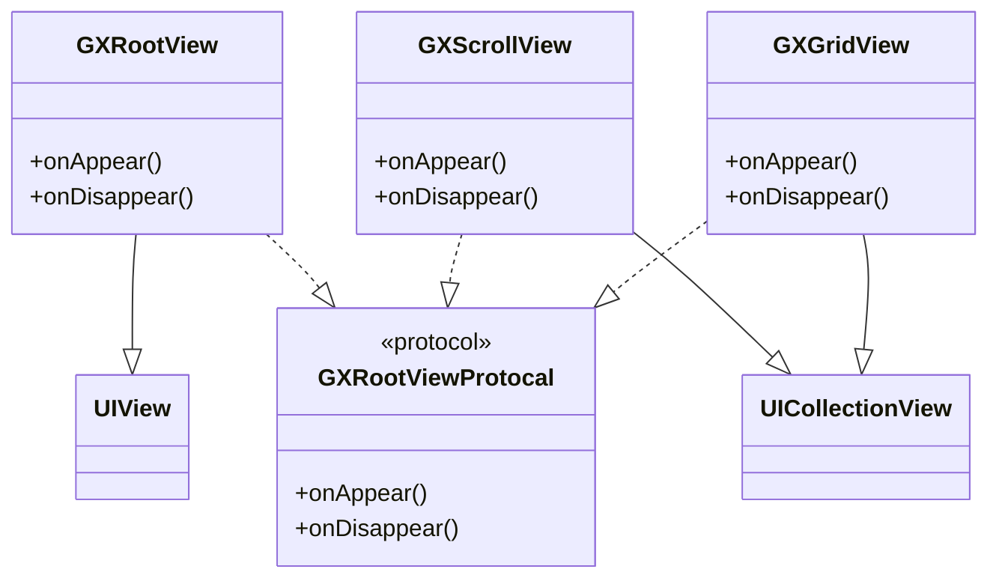
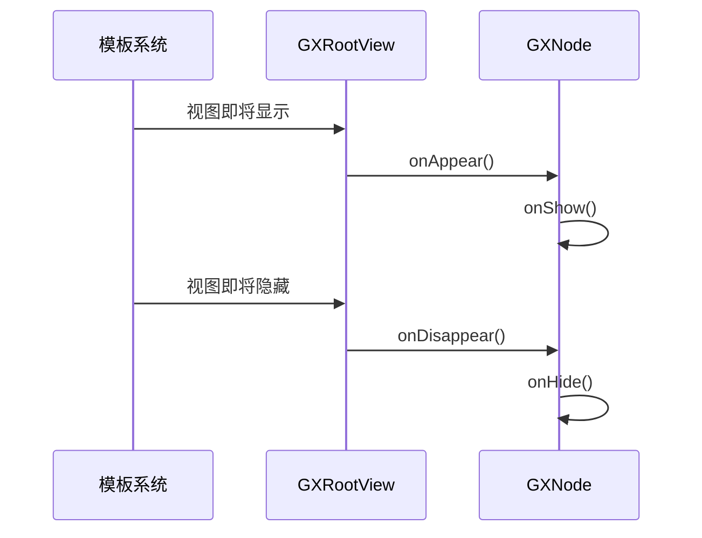
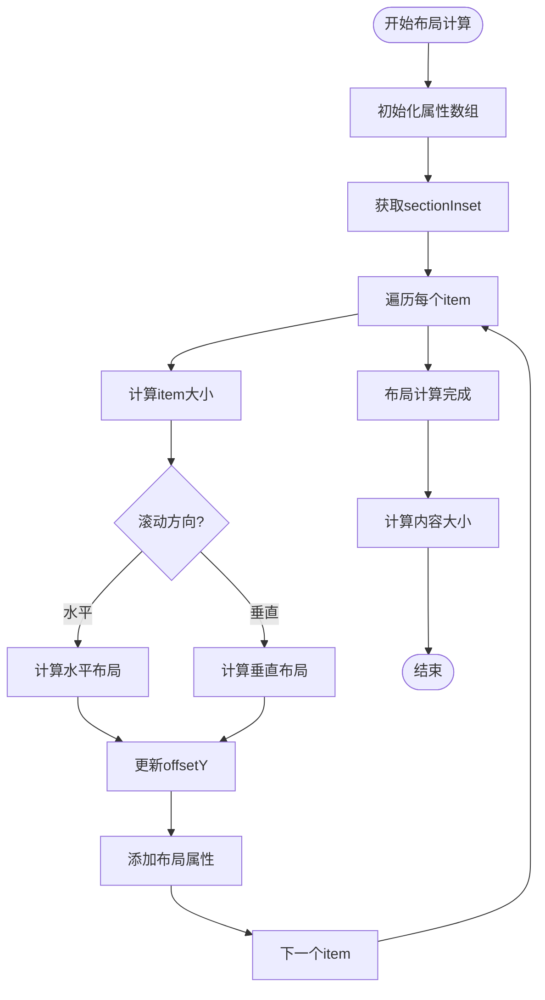
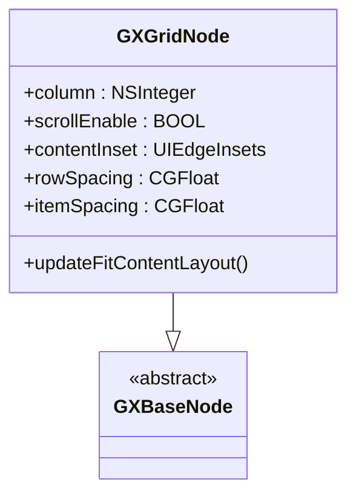
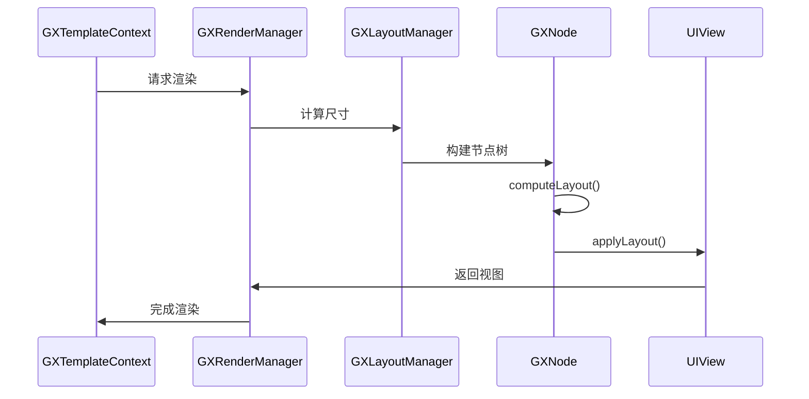
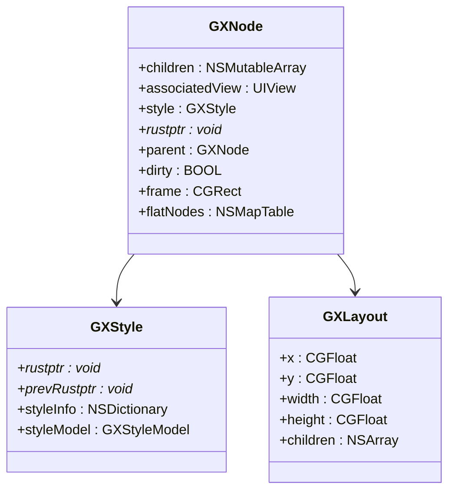
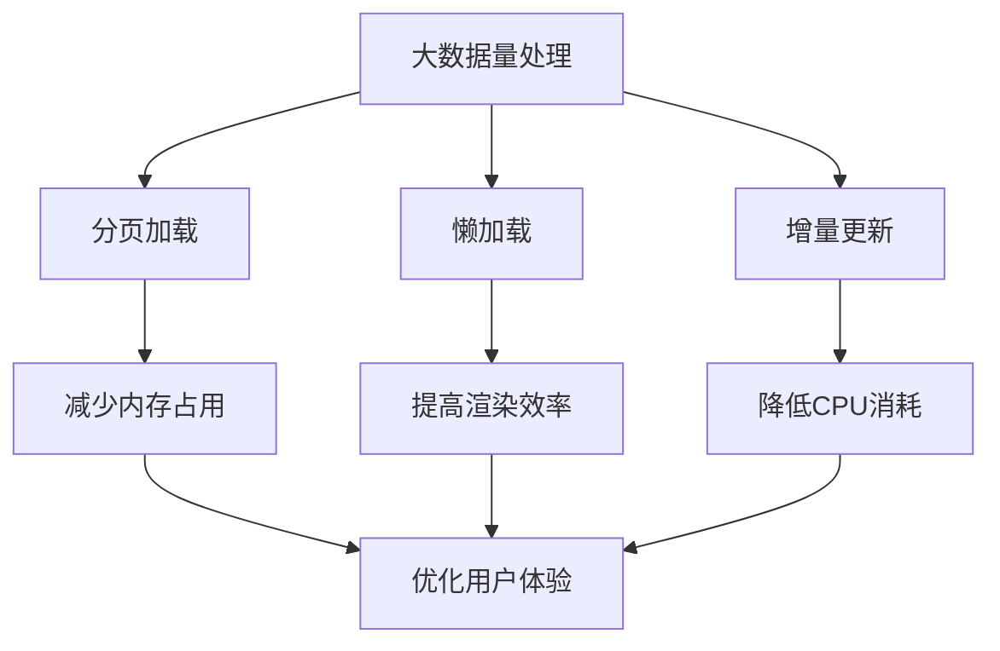

# 容器组件

<cite>
**本文档引用文件**  
- [GXRootView.h](file://GaiaXiOS/GaiaXiOS/Component/View/Container/GXRootView.h)
- [GXRootView.m](file://GaiaXiOS/GaiaXiOS/Component/View/Container/GXRootView.m)
- [GXScrollView.h](file://GaiaXiOS/GaiaXiOS/Component/View/Container/GXScrollView.h)
- [GXScrollView.m](file://GaiaXiOS/GaiaXiOS/Component/View/Container/GXScrollView.m)
- [GXGridView.h](file://GaiaXiOS/GaiaXiOS/Component/View/Container/GXGridView.h)
- [GXGridView.m](file://GaiaXiOS/GaiaXiOS/Component/View/Container/GXGridView.m)
- [GXRootViewNode.h](file://GaiaXiOS/GaiaXiOS/Component/Node/GXRootViewNode.h)
- [GXScrollNode.h](file://GaiaXiOS/GaiaXiOS/Component/Node/GXScrollNode.h)
- [GXGridNode.h](file://GaiaXiOS/GaiaXiOS/Component/Node/GXGridNode.h)
- [GXNode.h](file://GaiaXiOS/GaiaXiOS/Core/StretchKit/Classes/GXNode.h)
- [GXStyle.h](file://GaiaXiOS/GaiaXiOS/Core/StretchKit/Classes/GXStyle.h)
- [GXLayout.h](file://GaiaXiOS/GaiaXiOS/Core/StretchKit/Classes/GXLayout.h)
- [GXLayoutManager.h](file://GaiaXiOS/GaiaXiOS/Core/Render/GXLayoutManager.h)
- [GXRenderManager.h](file://GaiaXiOS/GaiaXiOS/Core/Render/GXRenderManager.h)
</cite>

## 目录
1. [简介](#简介)
2. [核心容器组件概述](#核心容器组件概述)
3. [GXRootView 实现与使用](#gxrootview-实现与使用)
4. [GXScrollView 滚动容器详解](#gxscrollview-滚动容器详解)
5. [GXGridView 网格容器详解](#gxgridview-网格容器详解)
6. [嵌套规则与布局机制](#嵌套规则与布局机制)
7. [子视图管理与事件传递](#子视图管理与事件传递)
8. [性能优化与大数据量处理](#性能优化与大数据量处理)
9. [使用示例与配置方法](#使用示例与配置方法)
10. [高级最佳实践](#高级最佳实践)

## 简介
GaiaX iOS 容器组件是 GaiaX 跨平台动态模板引擎的核心布局单元，提供灵活的 UI 组织能力。本文档深入解析 GXRootView、GXScrollView 和 GXGridView 三大容器组件的实现原理与使用方式，涵盖从基础用法到高级性能调优的完整知识体系。

## 核心容器组件概述

GaiaX iOS 的容器组件基于 UIKit 构建，通过 GXNode 节点树与 Stretch 布局引擎协同工作，实现高性能的动态布局渲染。三大核心容器组件具有明确的职责划分：

- **GXRootView**：所有模板的根视图容器，继承自 UIView，负责承载整个模板的渲染树
- **GXScrollView**：支持水平或垂直滚动的列表容器，基于 UICollectionView 实现
- **GXGridView**：二维网格布局容器，同样基于 UICollectionView，适用于宫格类布局

这些容器均遵循 GXRootViewProtocal 协议，确保统一的生命周期管理和数据绑定机制。



**图示来源**
- [GXRootView.h](file://GaiaXiOS/GaiaXiOS/Component/View/Container/GXRootView.h#L24)
- [GXScrollView.h](file://GaiaXiOS/GaiaXiOS/Component/View/Container/GXScrollView.h#L25)
- [GXGridView.h](file://GaiaXiOS/GaiaXiOS/Component/View/Container/GXGridView.h#L25)

**本节来源**
- [GXRootView.h](file://GaiaXiOS/GaiaXiOS/Component/View/Container/GXRootView.h#L1-L29)
- [GXScrollView.h](file://GaiaXiOS/GaiaXiOS/Component/View/Container/GXScrollView.h#L1-L54)
- [GXGridView.h](file://GaiaXiOS/GaiaXiOS/Component/View/Container/GXGridView.h#L1-L38)

## GXRootView 实现与使用

GXRootView 是 GaiaX 模板的根容器，作为所有视图的承载基类。它继承自 UIView 并实现 GXRootViewProtocal 协议，提供模板生命周期回调。

### 核心功能
- 作为模板渲染的根节点，关联 GXNode 节点树
- 提供 onAppear 和 onDisappear 生命周期方法，用于处理模板显示和隐藏时的逻辑
- 通过 associatedView 属性与 GXNode 建立双向关联

### 生命周期管理
当模板进入可视区域时，调用 onAppear 方法，触发 GXNode 的 onShow 逻辑；当模板离开可视区域时，调用 onDisappear 方法，触发 onHide 逻辑。这种机制确保了模板资源的合理管理。



**图示来源**
- [GXRootView.m](file://GaiaXiOS/GaiaXiOS/Component/View/Container/GXRootView.m#L25-L35)

**本节来源**
- [GXRootView.h](file://GaiaXiOS/GaiaXiOS/Component/View/Container/GXRootView.h#L24)
- [GXRootView.m](file://GaiaXiOS/GaiaXiOS/Component/View/Container/GXRootView.m#L23-L37)
- [GXNode.h](file://GaiaXiOS/GaiaXiOS/Core/StretchKit/Classes/GXNode.h#L188-L190)

## GXScrollView 滚动容器详解

GXScrollView 是基于 UICollectionView 实现的滚动容器，支持水平和垂直两种滚动方向，适用于列表、轮播等场景。

### 核心特性
- 继承自 UICollectionView，充分利用 iOS 原生滚动性能
- 通过 GXFlowLayout 自定义布局管理器实现灵活的布局控制
- 支持 gravity 属性控制内容对齐方式（center、bottom）
- 提供 containerHeight 属性控制容器高度

### 滚动行为实现
GXScrollView 使用自定义的 GXFlowLayout 布局管理器，在 prepareLayout 方法中计算每个 cell 的位置和大小。布局计算考虑了滚动方向、间距、内边距等因素。



**图示来源**
- [GXScrollView.m](file://GaiaXiOS/GaiaXiOS/Component/View/Container/GXScrollView.m#L63-L135)

**本节来源**
- [GXScrollView.h](file://GaiaXiOS/GaiaXiOS/Component/View/Container/GXScrollView.h#L25)
- [GXScrollView.m](file://GaiaXiOS/GaiaXiOS/Component/View/Container/GXScrollView.m#L23-L136)
- [GXScrollNode.h](file://GaiaXiOS/GaiaXiOS/Component/Node/GXScrollNode.h#L23)

## GXGridView 网格容器详解

GXGridView 是专门用于网格布局的容器组件，基于 UICollectionView 实现，适用于宫格、瀑布流等布局场景。

### 核心特性
- 支持指定列数（column）的网格布局
- 可配置行间距（rowSpacing）和项间距（itemSpacing）
- 支持滚动和非滚动模式
- 提供 contentInset 控制内边距

### 网格布局算法
GXGridView 的布局计算主要在 GXGridNode 中完成，根据指定的列数和间距计算每个单元格的大小和位置。布局过程考虑了容器宽度、列数、间距等因素，确保网格的均匀分布。



**图示来源**
- [GXGridNode.h](file://GaiaXiOS/GaiaXiOS/Component/Node/GXGridNode.h#L23)

**本节来源**
- [GXGridView.h](file://GaiaXiOS/GaiaXiOS/Component/View/Container/GXGridView.h#L25)
- [GXGridView.m](file://GaiaXiOS/GaiaXiOS/Component/View/Container/GXGridView.m#L23-L43)
- [GXGridNode.h](file://GaiaXiOS/GaiaXiOS/Component/Node/GXGridNode.h#L23-L41)

## 嵌套规则与布局机制

GaiaX 容器组件支持灵活的嵌套使用，通过 GXNode 节点树和 Stretch 布局引擎实现复杂的布局结构。

### 嵌套规则
- GXRootView 可以包含任意数量的 GXScrollView 和 GXGridView
- GXScrollView 和 GXGridView 可以相互嵌套，但需注意性能影响
- 嵌套层级不宜过深，建议控制在 3-5 层以内
- 父容器的布局属性会影响子容器的可用空间

### 布局计算流程
1. 通过 GXNode 树构建视图层级结构
2. 使用 GXStyle 解析 CSS 样式信息
3. 通过 GXLayout 计算每个节点的布局位置和大小
4. 将布局结果应用到对应的 UIView



**图示来源**
- [GXRenderManager.h](file://GaiaXiOS/GaiaXiOS/Core/Render/GXRenderManager.h#L35)
- [GXLayoutManager.h](file://GaiaXiOS/GaiaXiOS/Core/Render/GXLayoutManager.h#L34)

**本节来源**
- [GXNode.h](file://GaiaXiOS/GaiaXiOS/Core/StretchKit/Classes/GXNode.h#L72)
- [GXStyle.h](file://GaiaXiOS/GaiaXiOS/Core/StretchKit/Classes/GXStyle.h#L56)
- [GXLayout.h](file://GaiaXiOS/GaiaXiOS/Core/StretchKit/Classes/GXLayout.h#L26)

## 子视图管理与事件传递

容器组件通过 GXNode 节点树管理子视图，实现高效的视图创建、更新和销毁。

### 子视图管理机制
- 通过 children 数组维护子节点列表
- 支持动态添加、删除和替换子节点
- 使用 dirty 标记优化布局重计算
- 通过 flatNodes 表格实现扁平化节点管理

### 事件传递机制
- 所有容器均实现 GXRootViewProtocal 协议
- 生命周期事件通过 onAppear/onDisappear 方法传递
- 数据绑定事件通过 bindData 方法处理
- 用户交互事件通过 UIKit 事件系统传递



**图示来源**
- [GXNode.h](file://GaiaXiOS/GaiaXiOS/Core/StretchKit/Classes/GXNode.h#L39)
- [GXStyle.h](file://GaiaXiOS/GaiaXiOS/Core/StretchKit/Classes/GXStyle.h#L30)
- [GXLayout.h](file://GaiaXiOS/GaiaXiOS/Core/StretchKit/Classes/GXLayout.h#L30)

**本节来源**
- [GXNode.h](file://GaiaXiOS/GaiaXiOS/Core/StretchKit/Classes/GXNode.h#L38-L198)
- [GXStyle.h](file://GaiaXiOS/GaiaXiOS/Core/StretchKit/Classes/GXStyle.h#L27-L101)
- [GXLayout.h](file://GaiaXiOS/GaiaXiOS/Core/StretchKit/Classes/GXLayout.h#L26-L44)

## 性能优化与大数据量处理

针对大数据量场景，GaiaX 容器组件提供了多种性能优化策略。

### 内存管理
- 使用 UICollectionView 的 cell 复用机制减少内存占用
- 通过 dirty 标记避免不必要的布局重计算
- 及时释放不再使用的 GXNode 节点

### 渲染效率优化
- 预计算布局信息，减少运行时计算开销
- 使用异步渲染避免主线程阻塞
- 对复杂布局进行分步渲染

### 大数据量处理策略
- 分页加载数据，避免一次性加载过多内容
- 使用懒加载机制，只渲染可视区域的内容
- 对频繁更新的数据使用增量更新策略



**图示来源**
- [GXScrollView.m](file://GaiaXiOS/GaiaXiOS/Component/View/Container/GXScrollView.m#L75)
- [GXGridView.m](file://GaiaXiOS/GaiaXiOS/Component/View/Container/GXGridView.m#L23)

**本节来源**
- [GXScrollView.m](file://GaiaXiOS/GaiaXiOS/Component/View/Container/GXScrollView.m#L63-L135)
- [GXGridView.m](file://GaiaXiOS/GaiaXiOS/Component/View/Container/GXGridView.m#L23-L43)
- [GXRenderManager.h](file://GaiaXiOS/GaiaXiOS/Core/Render/GXRenderManager.h#L56)

## 使用示例与配置方法

### 基础使用示例
```objc
// 创建根视图
GXRootView *rootView = [[GXRootView alloc] init];

// 创建滚动视图
GXScrollView *scrollView = [[GXScrollView alloc] init];
scrollView.scrollDirection = UICollectionViewScrollDirectionVertical;
scrollView.itemSpacing = 10;

// 创建网格视图
GXGridView *gridView = [[GXGridView alloc] init];
gridView.column = 3;
gridView.itemSpacing = 8;
gridView.rowSpacing = 8;
```

### 布局配置方法
- 通过 style 属性配置 CSS 样式
- 使用 contentInset 设置内边距
- 通过 itemSpacing 和 rowSpacing 控制间距
- 利用 flex 属性实现弹性布局

**本节来源**
- [GXRootView.h](file://GaiaXiOS/GaiaXiOS/Component/View/Container/GXRootView.h#L24)
- [GXScrollView.h](file://GaiaXiOS/GaiaXiOS/Component/View/Container/GXScrollView.h#L25)
- [GXGridView.h](file://GaiaXiOS/GaiaXiOS/Component/View/Container/GXGridView.h#L25)

## 高级最佳实践

### 性能调优策略
1. **合理使用嵌套**：避免过深的嵌套层级，减少布局计算复杂度
2. **优化数据绑定**：使用增量更新而非全量刷新
3. **预加载机制**：提前加载即将显示的内容
4. **资源复用**：充分利用 UICollectionView 的 cell 复用机制

### 复杂场景处理
- **混合布局**：结合使用 ScrollView 和 GridView 实现复杂界面
- **动态更新**：通过 markDirty 标记实现局部更新
- **事件拦截**：合理处理嵌套容器的事件传递

### 最佳实践建议
- 优先使用 GXGridView 而非多个 GXScrollView 实现网格布局
- 对于固定高度的列表，预先计算内容大小
- 在滚动容器中避免使用复杂的自定义布局
- 合理设置 contentInset 和 spacing 参数，确保良好的视觉效果

**本节来源**
- [GXNode.h](file://GaiaXiOS/GaiaXiOS/Core/StretchKit/Classes/GXNode.h#L78)
- [GXScrollView.h](file://GaiaXiOS/GaiaXiOS/Component/View/Container/GXScrollView.h#L44)
- [GXGridView.h](file://GaiaXiOS/GaiaXiOS/Component/View/Container/GXGridView.h#L25)