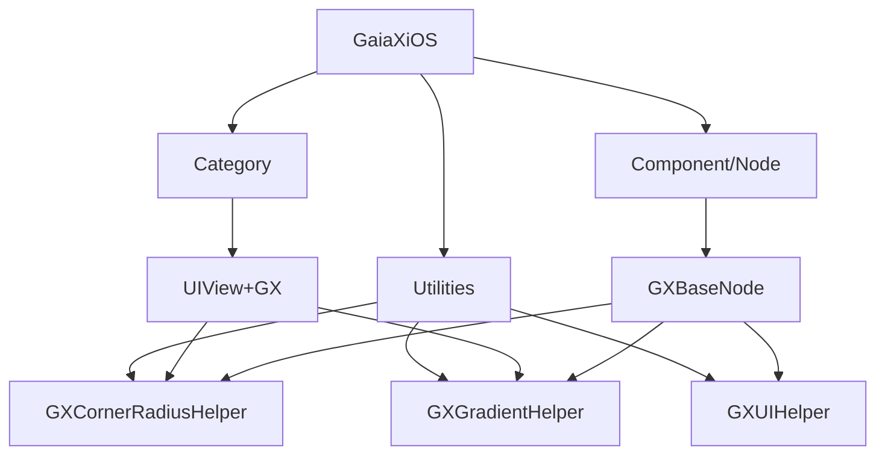
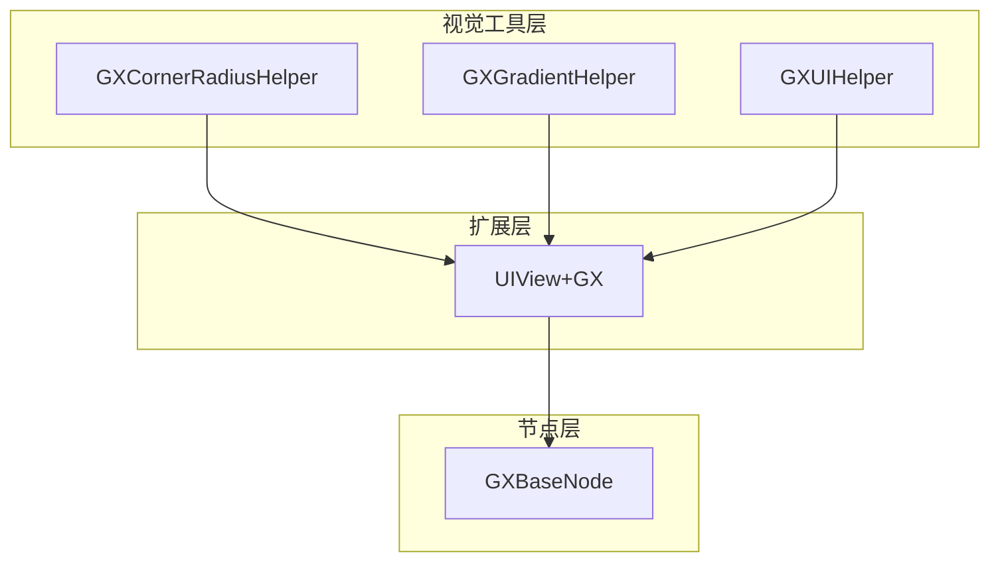
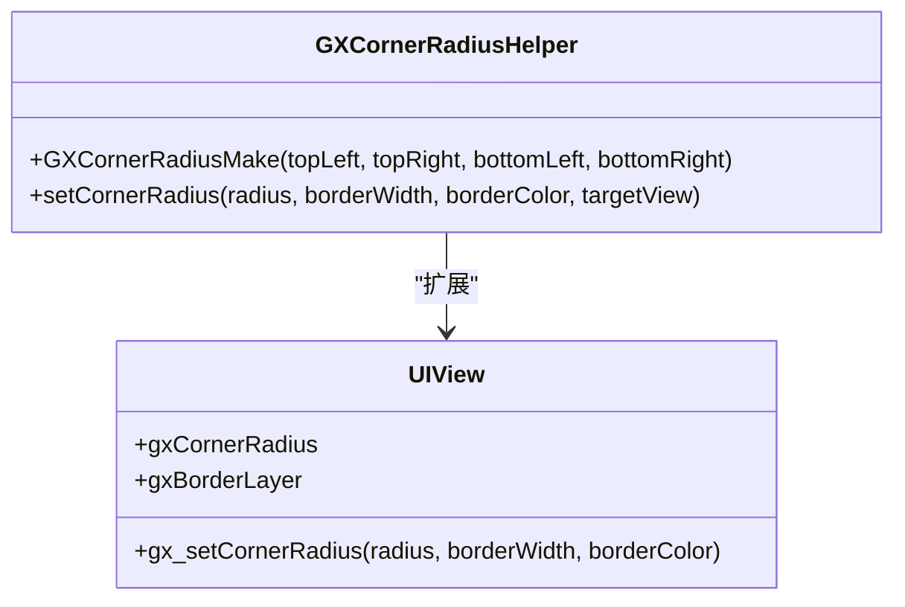
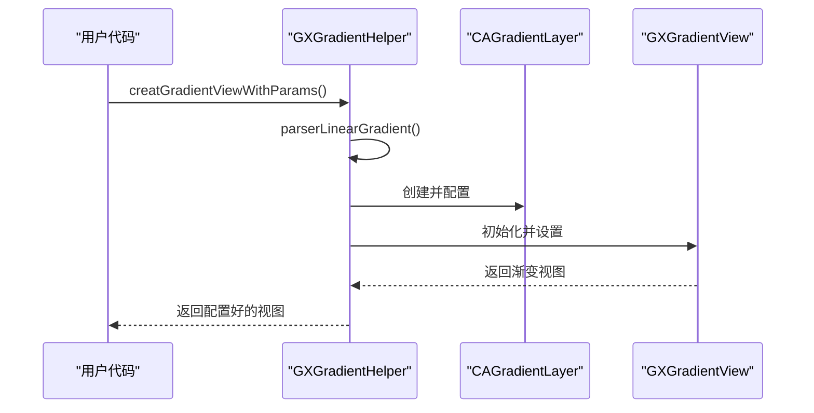
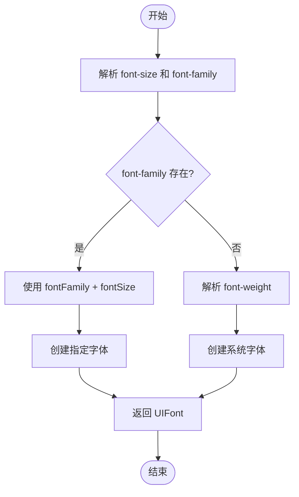
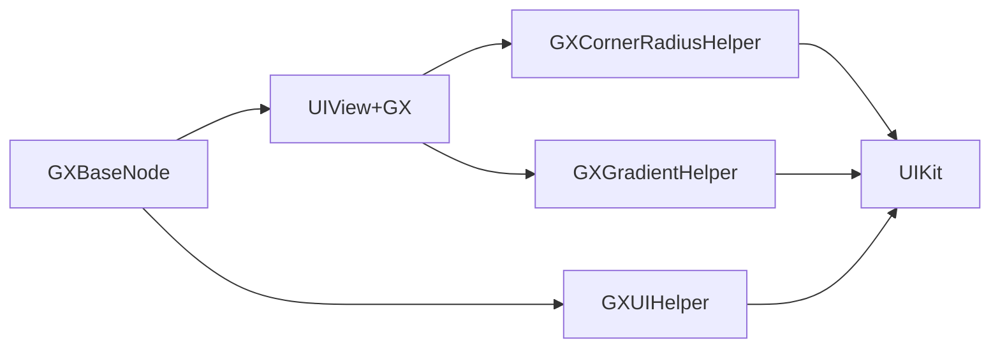

# 视觉工具

<cite>
**本文档引用文件**  
- [GXCornerRadiusHelper.h](file://GaiaXiOS/GaiaXiOS/Utilities/GXCornerRadiusHelper.h)
- [GXCornerRadiusHelper.m](file://GaiaXiOS/GaiaXiOS/Utilities/GXCornerRadiusHelper.m)
- [GXGradientHelper.h](file://GaiaXiOS/GaiaXiOS/Utilities/GXGradientHelper.h)
- [GXGradientHelper.m](file://GaiaXiOS/GaiaXiOS/Utilities/GXGradientHelper.m)
- [GXUIHelper.h](file://GaiaXiOS/GaiaXiOS/Utilities/GXUIHelper.h)
- [GXUIHelper.m](file://GaiaXiOS/GaiaXiOS/Utilities/GXUIHelper.m)
- [UIView+GX.m](file://GaiaXiOS/GaiaXiOS/Category/UIView+GX.m)
- [GXBaseNode.m](file://GaiaXiOS/GaiaXiOS/Component/Node/GXBaseNode.m)
</cite>

## 目录
1. [简介](#简介)
2. [项目结构](#项目结构)
3. [核心组件](#核心组件)
4. [架构概览](#架构概览)
5. [详细组件分析](#详细组件分析)
6. [依赖分析](#依赖分析)
7. [性能考量](#性能考量)
8. [故障排除指南](#故障排除指南)
9. [结论](#结论)

## 简介
本文档详细介绍了 GaiaX iOS 视觉工具的核心功能，重点涵盖圆角（GXCornerRadiusHelper）、渐变（GXGradientHelper）和通用 UI 工具（GXUIHelper）的实现原理与使用方法。文档深入解析了视觉效果的渲染机制、性能影响以及跨平台一致性处理策略。为初学者提供配置示例和常见用法，为高级开发者分析 GPU 渲染优化、离屏渲染避免、复杂渐变实现和自定义扩展方式。同时包含不同设备上的性能表现与内存优化策略。

## 项目结构
GaiaX iOS 视觉工具主要位于 `GaiaXiOS/Utilities` 目录下，包含三个核心工具类：`GXCornerRadiusHelper`、`GXGradientHelper` 和 `GXUIHelper`。这些工具通过分类（Category）方式扩展了 `UIView` 的功能，并在基础节点 `GXBaseNode` 中集成应用。

**图示来源**
- [GXCornerRadiusHelper.h](file://GaiaXiOS/GaiaXiOS/Utilities/GXCornerRadiusHelper.h)
- [GXGradientHelper.h](file://GaiaXiOS/GaiaXiOS/Utilities/GXGradientHelper.h)
- [GXUIHelper.h](file://GaiaXiOS/GaiaXiOS/Utilities/GXUIHelper.h)
- [UIView+GX.m](file://GaiaXiOS/GaiaXiOS/Category/UIView+GX.m)
- [GXBaseNode.m](file://GaiaXiOS/GaiaXiOS/Component/Node/GXBaseNode.m)

**章节来源**
- [GXCornerRadiusHelper.h](file://GaiaXiOS/GaiaXiOS/Utilities/GXCornerRadiusHelper.h)
- [GXGradientHelper.h](file://GaiaXiOS/GaiaXiOS/Utilities/GXGradientHelper.h)
- [GXUIHelper.h](file://GaiaXiOS/GaiaXiOS/Utilities/GXUIHelper.h)

## 核心组件
核心视觉工具包括圆角处理、渐变渲染和通用 UI 属性转换三大模块。`GXCornerRadiusHelper` 通过 `CAShapeLayer` 实现精确的圆角和边框绘制；`GXGradientHelper` 利用 `CAGradientLayer` 提供多种渐变效果支持；`GXUIHelper` 则封装了字体、对齐方式等常用 UI 属性的解析与转换逻辑。

**章节来源**
- [GXCornerRadiusHelper.m](file://GaiaXiOS/GaiaXiOS/Utilities/GXCornerRadiusHelper.m)
- [GXGradientHelper.m](file://GaiaXiOS/GaiaXiOS/Utilities/GXGradientHelper.m)
- [GXUIHelper.m](file://GaiaXiOS/GaiaXiOS/Utilities/GXUIHelper.m)

## 架构概览
视觉工具采用分层架构设计，上层 API 封装具体实现细节，底层通过 Core Graphics 和 Core Animation 实现高性能渲染。工具类之间职责分离，通过统一的接口与视图系统交互，确保跨组件的一致性和可维护性。

**图示来源**
- [GXCornerRadiusHelper.h](file://GaiaXiOS/GaiaXiOS/Utilities/GXCornerRadiusHelper.h)
- [GXGradientHelper.h](file://GaiaXiOS/GaiaXiOS/Utilities/GXGradientHelper.h)
- [GXUIHelper.h](file://GaiaXiOS/GaiaXiOS/Utilities/GXUIHelper.h)
- [UIView+GX.m](file://GaiaXiOS/GaiaXiOS/Category/UIView+GX.m)
- [GXBaseNode.m](file://GaiaXiOS/GaiaXiOS/Component/Node/GXBaseNode.m)

## 详细组件分析

### 圆角工具分析
`GXCornerRadiusHelper` 提供了灵活的圆角和边框绘制能力，支持独立设置四个角的半径值。

#### 类图

**图示来源**
- [GXCornerRadiusHelper.h](file://GaiaXiOS/GaiaXiOS/Utilities/GXCornerRadiusHelper.h)
- [UIView+GX.m](file://GaiaXiOS/GaiaXiOS/Category/UIView+GX.m)

**章节来源**
- [GXCornerRadiusHelper.m](file://GaiaXiOS/GaiaXiOS/Utilities/GXCornerRadiusHelper.m)
- [UIView+GX.m](file://GaiaXiOS/GaiaXiOS/Category/UIView+GX.m)

### 渐变工具分析
`GXGradientHelper` 支持多种渐变方向和复杂的颜色停靠点配置，可生成视图、图层或图像形式的渐变效果。

#### 序列图

**图示来源**
- [GXGradientHelper.m](file://GaiaXiOS/GaiaXiOS/Utilities/GXGradientHelper.m)
- [GXGradientView](file://GaiaXiOS/GaiaXiOS/Utilities/GXGradientHelper.m#L35-L92)

**章节来源**
- [GXGradientHelper.m](file://GaiaXiOS/GaiaXiOS/Utilities/GXGradientHelper.m)

### 通用UI工具分析
`GXUIHelper` 提供了一系列静态方法，用于将样式字符串转换为对应的 UIKit 对象。

#### 流程图

**图示来源**
- [GXUIHelper.m](file://GaiaXiOS/GaiaXiOS/Utilities/GXUIHelper.m#L29-L89)

**章节来源**
- [GXUIHelper.m](file://GaiaXiOS/GaiaXiOS/Utilities/GXUIHelper.m)

## 依赖分析
视觉工具主要依赖 UIKit 框架的核心类（UIView、CALayer、CAGradientLayer），并通过关联对象（Associated Object）技术扩展 UIView 的功能。各工具类之间无直接依赖，通过统一的接口规范协同工作。

**图示来源**
- [GXCornerRadiusHelper.m](file://GaiaXiOS/GaiaXiOS/Utilities/GXCornerRadiusHelper.m)
- [GXGradientHelper.m](file://GaiaXiOS/GaiaXiOS/Utilities/GXGradientHelper.m)
- [GXUIHelper.m](file://GaiaXiOS/GaiaXiOS/Utilities/GXUIHelper.m)

**章节来源**
- [GXCornerRadiusHelper.m](file://GaiaXiOS/GaiaXiOS/Utilities/GXCornerRadiusHelper.m)
- [GXGradientHelper.m](file://GaiaXiOS/GaiaXiOS/Utilities/GXGradientHelper.m)
- [GXUIHelper.m](file://GaiaXiOS/GaiaXiOS/Utilities/GXUIHelper.m)

## 性能考量
视觉工具在设计时充分考虑了性能因素。圆角处理采用 `CAShapeLayer.mask` 方式避免离屏渲染；渐变效果优先使用 `CAGradientLayer` 而非位图渲染；所有计算密集型操作都进行了缓存优化。建议在列表滚动场景中谨慎使用复杂渐变，以避免帧率下降。

## 故障排除指南
常见问题包括圆角不显示、渐变颜色异常等。检查要点：确保视图尺寸已正确设置；验证样式字符串格式是否符合规范；确认设备是否支持相关特性（如深色模式适配）。调试时可启用 GaiaX 的日志功能追踪渲染过程。

**章节来源**
- [GXCornerRadiusHelper.m](file://GaiaXiOS/GaiaXiOS/Utilities/GXCornerRadiusHelper.m)
- [GXGradientHelper.m](file://GaiaXiOS/GaiaXiOS/Utilities/GXGradientHelper.m)

## 结论
GaiaX iOS 视觉工具提供了一套完整、高效且易于使用的视觉效果解决方案。通过合理的架构设计和性能优化，能够在保证视觉质量的同时维持流畅的用户体验。建议开发者根据具体场景选择合适的工具组合，并注意在复杂场景下的性能监控。