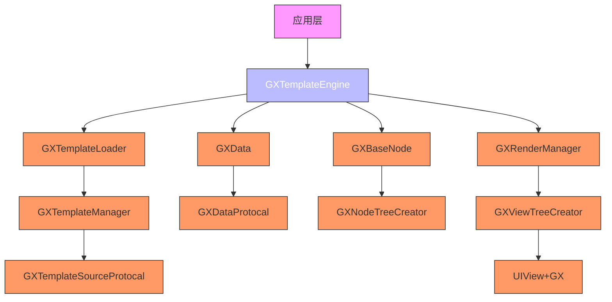
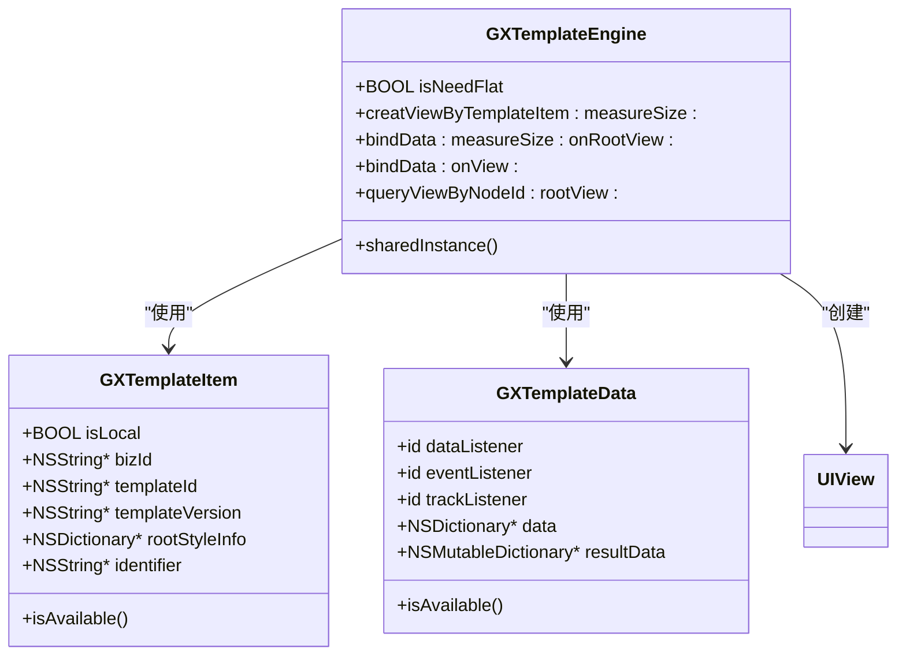
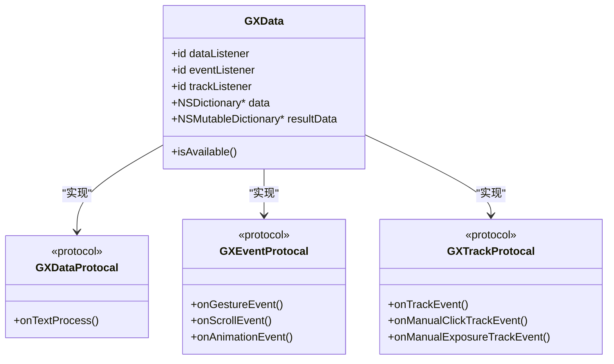
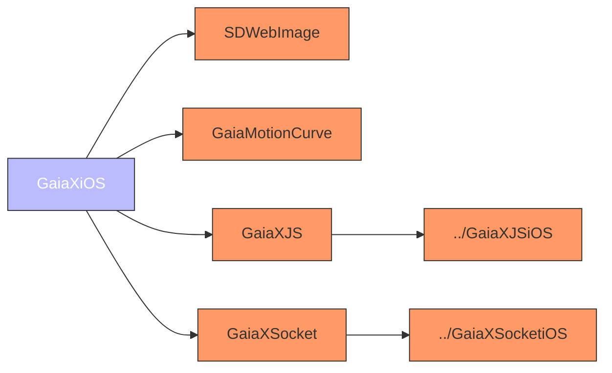
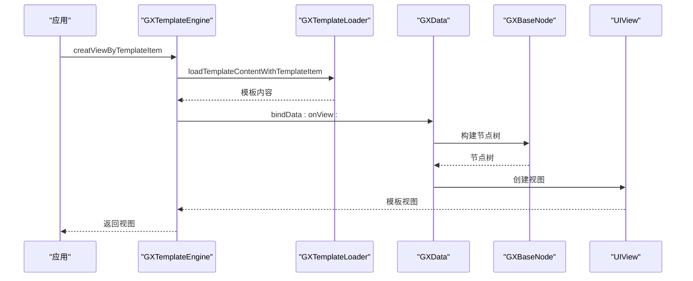
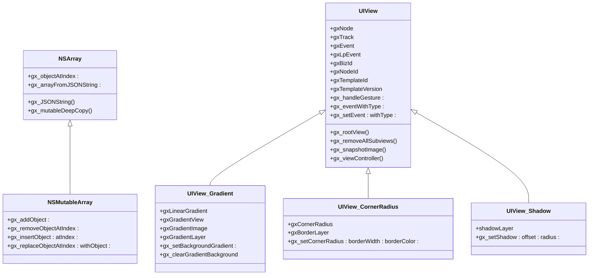

# iOS实现

<cite>
**本文档引用文件**  
- [GXTemplateEngine.h](file://GaiaXiOS/GaiaXiOS/Engine/GXTemplateEngine.h)
- [GXTemplateData.h](file://GaiaXiOS/GaiaXiOS/Engine/GXTemplateData.h)
- [GXTemplateItem.h](file://GaiaXiOS/GaiaXiOS/Engine/GXTemplateItem.h)
- [GaiaXiOS.h](file://GaiaXiOS/GaiaXiOS/GaiaXiOS.h)
- [NSArray+GX.h](file://GaiaXiOS/GaiaXiOS/Category/NSArray+GX.h)
- [UIView+GX.h](file://GaiaXiOS/GaiaXiOS/Category/UIView+GX.h)
- [Podfile](file://GaiaXiOS/Podfile)
</cite>

## 目录
1. [简介](#简介)
2. [项目结构](#项目结构)
3. [核心组件](#核心组件)
4. [架构概览](#架构概览)
5. [详细组件分析](#详细组件分析)
6. [依赖分析](#依赖分析)
7. [性能考量](#性能考量)
8. [集成指南](#集成指南)
9. [高级特性分析](#高级特性分析)
10. [结论](#结论)

## 简介
GaiaX iOS平台实现提供了一套完整的跨平台模板渲染解决方案，基于Objective-C实现，支持动态化UI渲染。本文档深入分析其核心引擎架构，重点介绍模板引擎、数据绑定、节点树构建等关键机制，并为开发者提供从入门到高级的完整技术指导。

## 项目结构
GaiaX iOS项目采用模块化设计，主要包含引擎、模板、绑定、组件、核心、实现、工具等目录，通过清晰的职责划分实现高内聚低耦合的架构设计。

```mermaid
graph TB
subgraph "核心模块"
GXTemplateEngine["GXTemplateEngine.h/m"]
GXTemplateLoader["GXTemplateLoader"]
GXData["GXData"]
GXBaseNode["GXBaseNode"]
end
subgraph "扩展模块"
Category["Category"]
Component["Component"]
Utilities["Utilities"]
end
subgraph "接口定义"
Protocols["Protocols"]
Macros["Macro"]
end
GXTemplateEngine --> GXTemplateLoader : "模板加载"
GXTemplateLoader --> GXData : "数据解析"
GXData --> GXBaseNode : "节点构建"
GXBaseNode --> Component : "视图渲染"
GXTemplateEngine --> Protocols : "协议定义"
Category --> GXTemplateEngine : "功能扩展"
Utilities --> GXTemplateEngine : "工具支持"
```

**图表来源**  
- [GXTemplateEngine.h](file://GaiaXiOS/GaiaXiOS/Engine/GXTemplateEngine.h#L1-L103)
- [GXTemplateData.h](file://GaiaXiOS/GaiaXiOS/Engine/GXTemplateData.h#L1-L47)
- [GXTemplateItem.h](file://GaiaXiOS/GaiaXiOS/Engine/GXTemplateItem.h#L1-L47)

**章节来源**  
- [GaiaXiOS](file://GaiaXiOS/GaiaXiOS)

## 核心组件
GaiaX iOS的核心组件包括模板引擎、模板数据、模板项等，共同构成了动态UI渲染的基础架构。GXTemplateEngine作为主入口，负责协调模板加载、数据绑定和视图创建等核心流程。

**章节来源**  
- [GXTemplateEngine.h](file://GaiaXiOS/GaiaXiOS/Engine/GXTemplateEngine.h#L1-L103)
- [GXTemplateData.h](file://GaiaXiOS/GaiaXiOS/Engine/GXTemplateData.h#L1-L47)
- [GXTemplateItem.h](file://GaiaXiOS/GaiaXiOS/Engine/GXTemplateItem.h#L1-L47)

## 架构概览
GaiaX iOS采用分层架构设计，从上至下分为接口层、引擎层、模板层、绑定层和组件层。引擎层作为核心中枢，通过协议定义与各层交互，实现灵活的扩展性和可维护性。



**图表来源**  
- [GXTemplateEngine.h](file://GaiaXiOS/GaiaXiOS/Engine/GXTemplateEngine.h#L1-L103)
- [GaiaXiOS.h](file://GaiaXiOS/GaiaXiOS/GaiaXiOS.h#L1-L56)

## 详细组件分析
### GXTemplateEngine分析
GXTemplateEngine是GaiaX iOS的核心引擎类，作为主入口负责协调整个模板渲染流程。它采用单例模式设计，通过creatViewByTemplateItem方法创建模板视图，bindData方法进行数据绑定，queryViewByNodeId方法查询节点视图。



**图表来源**  
- [GXTemplateEngine.h](file://GaiaXiOS/GaiaXiOS/Engine/GXTemplateEngine.h#L1-L103)
- [GXTemplateData.h](file://GaiaXiOS/GaiaXiOS/Engine/GXTemplateData.h#L1-L47)
- [GXTemplateItem.h](file://GaiaXiOS/GaiaXiOS/Engine/GXTemplateItem.h#L1-L47)

**章节来源**  
- [GXTemplateEngine.h](file://GaiaXiOS/GaiaXiOS/Engine/GXTemplateEngine.h#L1-L103)

### GXTemplateLoader分析
GXTemplateLoader负责模板的加载与解析，通过loadTemplateContentWithTemplateItem方法从GXTemplateEngine的Template分类中获取模板元数据。它与GXTemplateManager协同工作，实现模板资源的管理和加载。

**章节来源**  
- [GXTemplateEngine.h](file://GaiaXiOS/GaiaXiOS/Engine/GXTemplateEngine.h#L92-L102)

### GXData分析
GXData类负责数据绑定的处理逻辑，包含数据监听器、事件监听器和埋点监听器，以及原始数据和结果数据。通过data属性存储原始数据，resultData属性存储处理后的结果数据，实现数据的双向绑定和响应式更新。



**图表来源**  
- [GXTemplateData.h](file://GaiaXiOS/GaiaXiOS/Engine/GXTemplateData.h#L1-L47)

**章节来源**  
- [GXTemplateData.h](file://GaiaXiOS/GaiaXiOS/Engine/GXTemplateData.h#L1-L47)

### GXBaseNode分析
GXBaseNode作为节点树构建的基础类，为所有节点提供统一的基类定义。它与GXNodeTreeCreator配合，实现节点树的创建和管理，为视图渲染提供结构基础。

**章节来源**  
- [GXTemplateEngine.h](file://GaiaXiOS/GaiaXiOS/Engine/GXTemplateEngine.h#L23-L25)

## 依赖分析
GaiaX iOS通过Podfile管理依赖，采用模块化依赖方式，将核心功能与扩展功能分离，提高代码的可维护性和复用性。



**图表来源**  
- [Podfile](file://GaiaXiOS/Podfile#L1-L32)

**章节来源**  
- [Podfile](file://GaiaXiOS/Podfile#L1-L32)

## 性能考量
GaiaX iOS平台在性能优化方面采用了多项技术：
- **异步渲染**：通过异步方式处理模板解析和视图创建，避免主线程阻塞
- **资源缓存**：对模板资源进行缓存管理，减少重复加载开销
- **节点扁平化**：通过isNeedFlat属性控制节点是否需要扁平化，优化视图层级
- **懒加载**：对非关键资源采用懒加载策略，提高初始渲染速度

这些优化措施有效提升了模板渲染的性能和用户体验。

## 集成指南
### Podfile依赖管理
在Podfile中添加GaiaX iOS依赖：

```ruby
source 'https://github.com/CocoaPods/Specs.git'
source 'https://github.com/Artsy/Specs.git'

target 'GaiaXiOS' do
  platform :ios, '9.0'
  
  # SDWebImage
  pod 'SDWebImage'

  # 曲线动画
  pod 'GaiaMotionCurve'

  pod 'GaiaXJS', :path =>'../GaiaXJSiOS'
  pod 'GaiaXSocket', :path => '../GaiaXSocketiOS'
end
```

### 头文件引入
在项目中引入GaiaXiOS.h头文件：

```objective-c
#import <GaiaXiOS/GaiaXiOS.h>
```

### 模板渲染生命周期


**图表来源**  
- [GXTemplateEngine.h](file://GaiaXiOS/GaiaXiOS/Engine/GXTemplateEngine.h#L39-L45)
- [GXTemplateData.h](file://GaiaXiOS/GaiaXiOS/Engine/GXTemplateData.h#L28-L38)
- [GXTemplateEngine.h](file://GaiaXiOS/GaiaXiOS/Engine/GXTemplateEngine.h#L98-L99)

## 高级特性分析
### 运行时特性应用
GaiaX iOS充分利用Objective-C的运行时特性，通过Category扩展机制为系统类添加功能，如NSArray+GX和UIView+GX，实现功能的无缝集成。



**图表来源**  
- [NSArray+GX.h](file://GaiaXiOS/GaiaXiOS/Category/NSArray+GX.h#L1-L56)
- [UIView+GX.h](file://GaiaXiOS/GaiaXiOS/Category/UIView+GX.h#L1-L132)

**章节来源**  
- [NSArray+GX.h](file://GaiaXiOS/GaiaXiOS/Category/NSArray+GX.h#L1-L56)
- [UIView+GX.h](file://GaiaXiOS/GaiaXiOS/Category/UIView+GX.h#L1-L132)

### 内存管理策略
采用ARC（自动引用计数）结合weak属性的方式管理内存，避免循环引用。对于监听器等对象使用weak引用，确保对象生命周期的正确管理。

### 组件化设计模式
通过协议（Protocol）定义接口，实现组件间的松耦合。核心协议包括：
- GXTemplateSourceProtocal：模板源协议
- GXDataProtocal：数据协议
- GXEventProtocal：事件协议
- GXTrackProtocal：埋点协议

这种设计模式提高了代码的可测试性和可扩展性。

## 结论
GaiaX iOS平台通过精心设计的架构和先进的技术实现，提供了一套完整的跨平台模板渲染解决方案。其模块化设计、清晰的职责划分和丰富的扩展机制，使得开发者能够高效地集成和使用。对于初学者，提供了简单的集成方式；对于高级开发者，开放了运行时特性和组件化设计等高级功能，满足不同层次的开发需求。