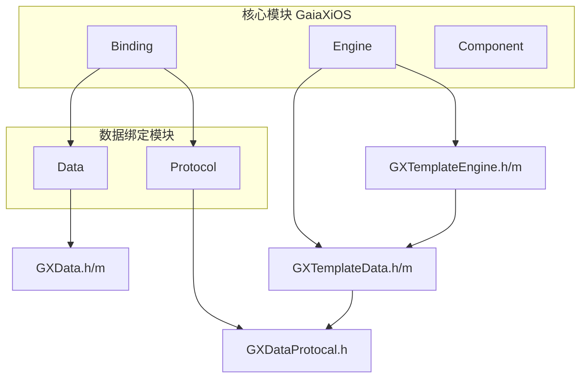
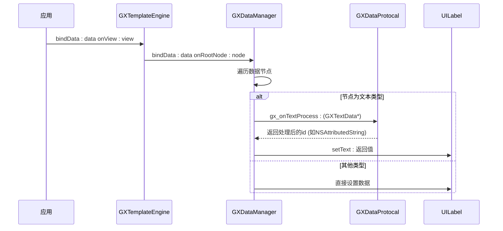
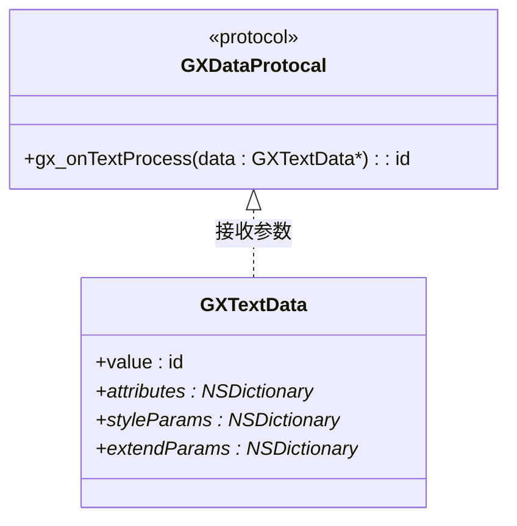
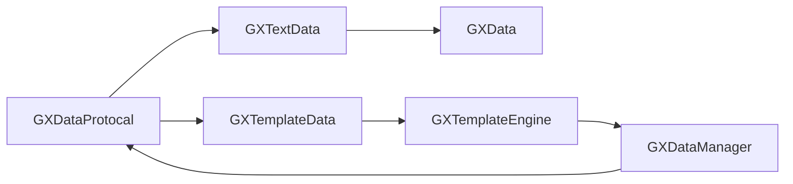

# 协议接口

<cite>
**本文档中引用的文件**  
- [GXDataProtocal.h](file://GaiaXiOS/GaiaXiOS/Binding/Protocol/GXDataProtocal.h)
- [GXData.h](file://GaiaXiOS/GaiaXiOS/Binding/Data/GXData.h)
- [GXData.m](file://GaiaXiOS/GaiaXiOS/Binding/Data/GXData.m)
- [GXTemplateData.h](file://GaiaXiOS/GaiaXiOS/Engine/GXTemplateData.h)
- [GXTemplateData.m](file://GaiaXiOS/GaiaXiOS/Engine/GXTemplateData.m)
- [GXTemplateEngine.h](file://GaiaXiOS/GaiaXiOS/Engine/GXTemplateEngine.h)
- [GXTemplateEngine.m](file://GaiaXiOS/GaiaXiOS/Engine/GXTemplateEngine.m)
- [DataViewController.m](file://GaiaXiOSDemo/GaiaXiOSDemo/Binding/DataViewController.m)
</cite>

## 目录
1. [简介](#简介)
2. [项目结构](#项目结构)
3. [核心组件](#核心组件)
4. [架构概述](#架构概述)
5. [详细组件分析](#详细组件分析)
6. [依赖分析](#依赖分析)
7. [性能考虑](#性能考虑)
8. [故障排除指南](#故障排除指南)
9. [结论](#结论)

## 简介
本文档详细阐述 GaiaX iOS 平台中 `GXDataProtocal` 协议的设计与使用。该协议是 GaiaX 数据绑定系统的核心接口之一，用于实现模板数据的动态处理和自定义逻辑扩展。文档将深入解析协议方法的设计理念、参数规范、回调机制及其在数据绑定流程中的作用，同时为初学者提供实现示例，为高级开发者分析扩展性、兼容性与性能影响。

## 项目结构
GaiaX iOS 项目采用模块化设计，核心功能分布在 `GaiaXiOS` 模块中，而示例代码位于 `GaiaXiOSDemo`。`GXDataProtocal` 属于数据绑定模块，位于 `Binding/Protocol` 目录下，与数据模型、模板引擎紧密协作。



**图示来源**
- [GXDataProtocal.h](file://GaiaXiOS/GaiaXiOS/Binding/Protocol/GXDataProtocal.h#L1-L32)
- [GXData.h](file://GaiaXiOS/GaiaXiOS/Binding/Data/GXData.h#L1-L53)
- [GXTemplateData.h](file://GaiaXiOS/GaiaXiOS/Engine/GXTemplateData.h#L1-L47)
- [GXTemplateEngine.h](file://GaiaXiOS/GaiaXiOS/Engine/GXTemplateEngine.h#L1-L103)

**本节来源**
- [GXDataProtocal.h](file://GaiaXiOS/GaiaXiOS/Binding/Protocol/GXDataProtocal.h#L1-L32)
- [GXData.h](file://GaiaXiOS/GaiaXiOS/Binding/Data/GXData.h#L1-L53)

## 核心组件
`GXDataProtocal` 是一个可选的 Objective-C 协议，允许开发者在数据绑定过程中拦截并处理特定类型的数据（如文本）。其核心是 `gx_onTextProcess:` 方法，该方法在文本数据绑定前被调用，开发者可返回自定义的处理结果（如 `NSAttributedString`），从而实现富文本渲染、数据格式化等高级功能。

该协议通过 `GXTemplateData` 的 `dataListener` 属性与模板引擎关联，在 `GXDataManager` 执行数据绑定时被触发。整个流程体现了高内聚、低耦合的设计原则，确保核心引擎的稳定性同时提供强大的扩展能力。

**本节来源**
- [GXDataProtocal.h](file://GaiaXiOS/GaiaXiOS/Binding/Protocol/GXDataProtocal.h#L24-L30)
- [GXTemplateData.h](file://GaiaXiOS/GaiaXiOS/Engine/GXTemplateData.h#L29)
- [GXTemplateEngine.m](file://GaiaXiOS/GaiaXiOS/Engine/GXTemplateEngine.m#L101)

## 架构概述
`GXDataProtocal` 在 GaiaX 的数据绑定架构中扮演“拦截器”角色。当模板引擎完成视图创建后，`GXTemplateEngine` 调用 `bindData:onView:` 方法，该方法内部通过 `GXDataManager` 遍历数据节点。对于文本节点，在设置 `UILabel` 内容前，会检查 `GXTemplateData` 是否设置了 `dataListener`，若存在且实现了 `gx_onTextProcess:`，则将 `GXTextData` 对象传入，使用其返回值作为最终显示内容。



**图示来源**
- [GXTemplateEngine.m](file://GaiaXiOS/GaiaXiOS/Engine/GXTemplateEngine.m#L101)
- [GXTemplateData.h](file://GaiaXiOS/GaiaXiOS/Engine/GXTemplateData.h#L29)
- [GXDataProtocal.h](file://GaiaXiOS/GaiaXiOS/Binding/Protocol/GXDataProtocal.h#L28)

## 详细组件分析

### GXDataProtocal 分析
`GXDataProtocal` 是一个轻量级协议，目前仅定义了一个可选方法 `gx_onTextProcess:`，用于处理文本数据。

#### 协议定义


**图示来源**
- [GXDataProtocal.h](file://GaiaXiOS/GaiaXiOS/Binding/Protocol/GXDataProtocal.h#L24-L30)
- [GXData.h](file://GaiaXiOS/GaiaXiOS/Binding/Data/GXData.h#L38-L49)

#### 方法设计与参数
- **方法**: `- (nullable id)gx_onTextProcess:(GXTextData *)data;`
- **参数**: `GXTextData` 继承自 `GXData`，包含：
  - `value`: 原始文本内容，通常为 `NSString`。
  - `attributes`: 预设的富文本属性（可选）。
  - `styleParams` 和 `extendParams`: 来自模板的样式配置。
  - `nodeId` 和 `templateId`: 用于精确匹配需要处理的节点。
- **返回值**: 可返回 `NSString` 或 `NSAttributedString`，引擎将直接使用此返回值进行渲染。

#### 调用时序
1. 应用设置 `GXTemplateData.dataListener = self`。
2. 调用 `GXTemplateEngine.bindData:onView:`。
3. 引擎内部触发数据绑定流程。
4. 遇到文本节点时，检查 `dataListener` 并调用 `gx_onTextProcess:`。
5. 使用协议返回值更新 UI。

**本节来源**
- [GXDataProtocal.h](file://GaiaXiOS/GaiaXiOS/Binding/Protocol/GXDataProtocal.h#L28)
- [GXData.h](file://GaiaXiOS/GaiaXiOS/Binding/Data/GXData.h#L38-L49)
- [DataViewController.m](file://GaiaXiOSDemo/GaiaXiOSDemo/Binding/DataViewController.m#L103-L120)

### 初学者实现示例
以下是在 `DataViewController` 中实现 `GXDataProtocal` 的完整示例：

```objectivec
@interface DataViewController () <GXDataProtocal>
@end

@implementation DataViewController

- (void)viewDidLoad {
    [super viewDidLoad];
    // ... 渲染视图
    GXTemplateData *data = [[GXTemplateData alloc] init];
    data.data = [self loadTemplateData];
    data.dataListener = self; // 设置监听器
    [TheGXTemplateEngine bindData:data onView:_view];
}

#pragma mark - GXDataProtocal
- (id)gx_onTextProcess:(GXTextData *)data {
    // 通过 templateId 和 nodeId 精确匹配目标节点
    if ([data.templateId isEqualToString:@"gx-subscribe-item"] && 
        [data.nodeId isEqualToString:@"title"]) {
        // 创建富文本
        NSMutableAttributedString *attributedString = 
            [[NSMutableAttributedString alloc] initWithString:@"自定义标题"];
        [attributedString addAttribute:NSFontAttributeName 
                                value:[UIFont boldSystemFontOfSize:18] 
                                range:NSMakeRange(0, 4)];
        [attributedString addAttribute:NSForegroundColorAttributeName 
                                value:[UIColor redColor] 
                                range:NSMakeRange(4, 6)];
        return attributedString;
    }
    return nil; // 返回 nil 则使用原始数据
}

@end
```

**本节来源**
- [DataViewController.m](file://GaiaXiOSDemo/GaiaXiOSDemo/Binding/DataViewController.m#L23-L124)

### 高级主题分析

#### 扩展性设计
`GXDataProtocal` 采用协议（Protocol）而非继承，提供了极佳的扩展性。开发者无需修改核心代码，只需实现协议方法即可注入自定义逻辑。未来可轻松添加 `gx_onImageProcess:` 等方法处理其他数据类型。

#### 版本兼容性
由于所有方法均为 `@optional`，新增方法不会破坏现有实现。旧版本的监听器在新版本引擎中仍能正常工作，体现了良好的向后兼容性。

#### 性能影响
- **优点**: 按需调用，仅当 `dataListener` 存在时才执行，避免了不必要的开销。
- **注意**: 复杂的处理逻辑（如大量文本解析）应在后台线程完成，避免阻塞主线程影响渲染性能。

**本节来源**
- [GXDataProtocal.h](file://GaiaXiOS/GaiaXiOS/Binding/Protocol/GXDataProtocal.h#L26-L28)
- [GXTemplateData.h](file://GaiaXiOS/GaiaXiOS/Engine/GXTemplateData.h#L29)
- [GXTemplateEngine.m](file://GaiaXiOS/GaiaXiOS/Engine/GXTemplateEngine.m#L101)

## 依赖分析
`GXDataProtocal` 的实现依赖于 GaiaX 框架的多个核心组件，形成清晰的依赖链。



**图示来源**
- [GXDataProtocal.h](file://GaiaXiOS/GaiaXiOS/Binding/Protocol/GXDataProtocal.h#L20)
- [GXData.h](file://GaiaXiOS/GaiaXiOS/Binding/Data/GXData.h#L24)
- [GXTemplateData.h](file://GaiaXiOS/GaiaXiOS/Engine/GXTemplateData.h#L29)
- [GXTemplateEngine.m](file://GaiaXiOS/GaiaXiOS/Engine/GXTemplateEngine.m#L101)

**本节来源**
- [GXDataProtocal.h](file://GaiaXiOS/GaiaXiOS/Binding/Protocol/GXDataProtocal.h#L1-L32)
- [GXTemplateData.h](file://GaiaXiOS/GaiaXiOS/Engine/GXTemplateData.h#L1-L47)
- [GXTemplateEngine.h](file://GaiaXiOS/GaiaXiOS/Engine/GXTemplateEngine.h#L1-L103)

## 性能考虑
使用 `GXDataProtocal` 时，应关注以下性能点：
- **避免阻塞主线程**：数据处理逻辑若较复杂，建议使用 GCD 异步执行，完成后通过主线程更新。
- **精准匹配**：在 `gx_onTextProcess:` 中尽早通过 `templateId` 和 `nodeId` 进行过滤，避免对所有文本节点执行不必要的判断。
- **内存管理**：返回的对象（如 `NSAttributedString`）应确保正确管理内存，避免循环引用。

## 故障排除指南
当 `gx_onTextProcess:` 方法未被调用时，请按以下步骤排查：

1. **检查监听器设置**：确保 `GXTemplateData` 的 `dataListener` 已正确指向实现了协议的对象。
2. **验证对象有效性**：确认 `dataListener` 对象在绑定数据时未被释放（weak 引用）。
3. **核对节点类型**：确认目标节点是文本类型，非文本节点不会触发此回调。
4. **检查协议遵循**：在类声明中确认已添加 `<GXDataProtocal>`。

**本节来源**
- [GXTemplateData.h](file://GaiaXiOS/GaiaXiOS/Engine/GXTemplateData.h#L29)
- [GXTemplateEngine.m](file://GaiaXiOS/GaiaXiOS/Engine/GXTemplateEngine.m#L101)
- [DataViewController.m](file://GaiaXiOSDemo/GaiaXiOSDemo/Binding/DataViewController.m#L95)

## 结论
`GXDataProtocal` 是 GaiaX iOS 数据绑定系统中一个简洁而强大的扩展点。它通过协议方式解耦了数据处理逻辑与核心渲染引擎，既保证了框架的稳定性，又赋予了开发者极大的灵活性。合理使用该协议，可以实现丰富的文本样式定制和数据预处理功能，是构建动态、个性化 UI 的关键工具。