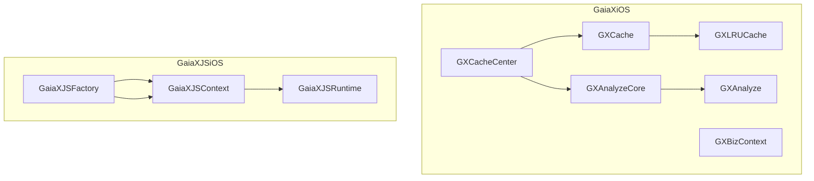
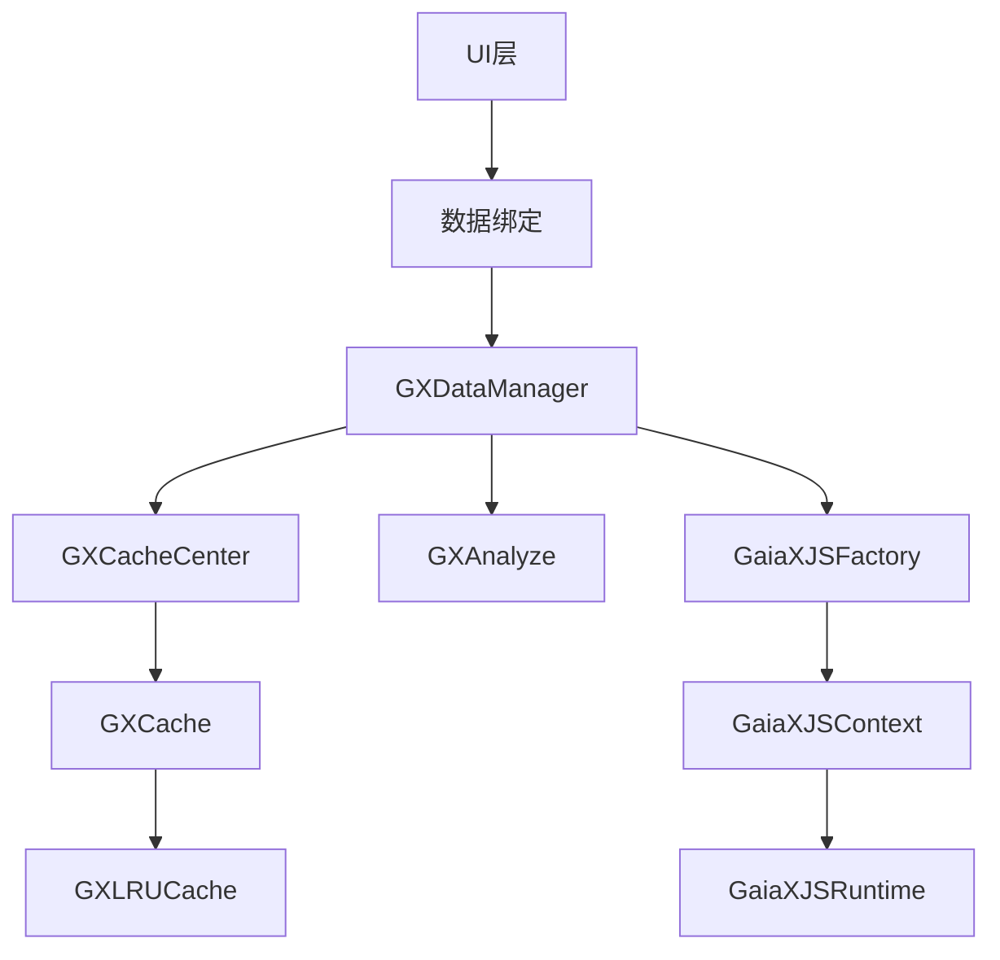
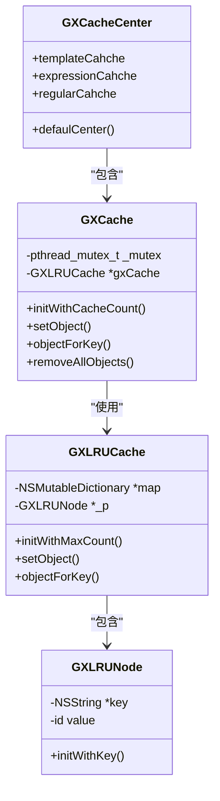
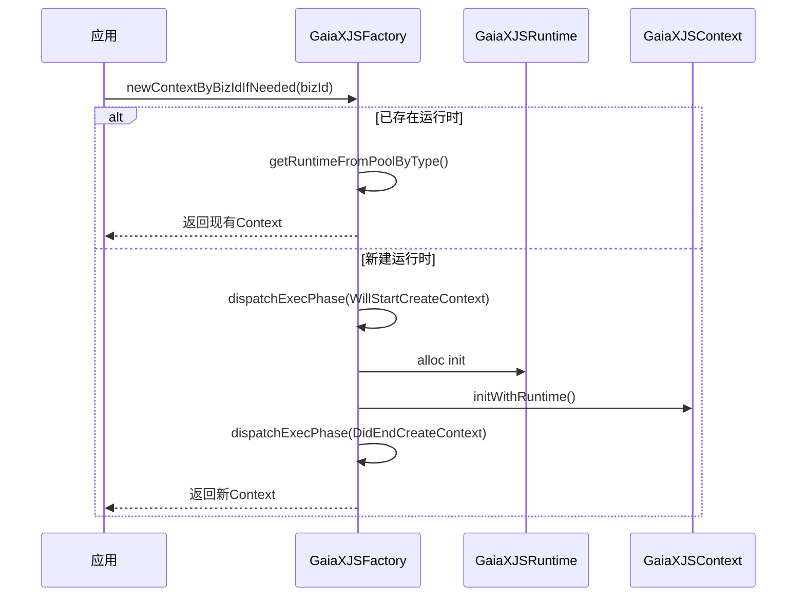
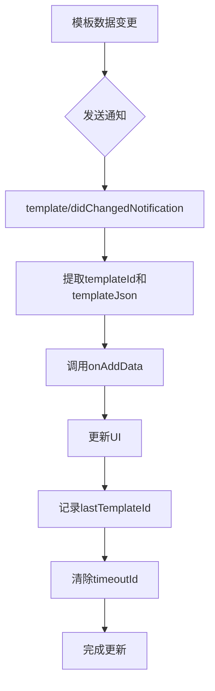
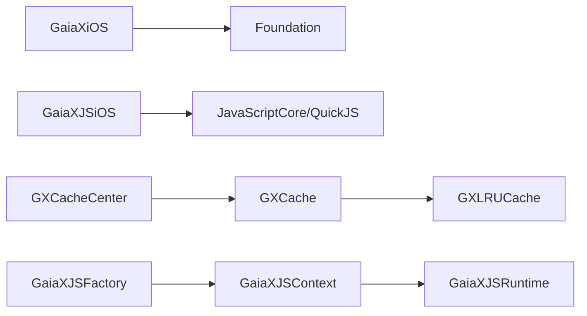

# 数据管理

<cite>
**本文档中引用的文件**  
- [GXCacheCenter.h](file://GaiaXiOS/GaiaXiOS/Template/Cache/GXCacheCenter.h)
- [GXCacheCenter.m](file://GaiaXiOS/GaiaXiOS/Template/Cache/GXCacheCenter.m)
- [GXCache.h](file://GaiaXiOS/GaiaXiOS/Template/Cache/GXCache.h)
- [GXCache.m](file://GaiaXiOS/GaiaXiOS/Template/Cache/GXCache.m)
- [GXLRUCache.m](file://GaiaXiOS/GaiaXiOS/Template/Cache/GXLRUCache.m)
- [GXAnalyze.cpp](file://GaiaXiOS/GaiaXiOS/Binding/Expression/GXAnalyzeCore/GXAnalyze.cpp)
- [DataViewController.m](file://GaiaXiOSDemo/GaiaXiOSDemo/Binding/DataViewController.m)
- [GaiaXJSFactory.h](file://GaiaXJSiOS/GaiaXJS/src/GaiaXJSFactory.h)
- [GaiaXJSFactory.m](file://GaiaXJSiOS/GaiaXJS/src/GaiaXJSFactory.m)
- [GaiaXJSContext.m](file://GaiaXJSiOS/GaiaXJS/src/context/GaiaXJSContext.m)
- [GXBizContext.m](file://GaiaXiOS/GaiaXiOS/Impl/GXBizContext.m)
</cite>

## 目录
1. [简介](#简介)
2. [项目结构](#项目结构)
3. [核心组件](#核心组件)
4. [架构概述](#架构概述)
5. [详细组件分析](#详细组件分析)
6. [依赖分析](#依赖分析)
7. [性能考虑](#性能考虑)
8. [故障排除指南](#故障排除指南)
9. [结论](#结论)

## 简介
本文档深入探讨GaiaX iOS平台中的数据管理系统，重点分析GXDataManager的实现机制。系统通过多层级缓存、表达式解析和上下文管理实现高效的数据绑定与更新。文档涵盖数据生命周期、内存优化、线程安全等关键设计，并为不同层次开发者提供实践指导。

## 项目结构
GaiaX iOS数据管理系统主要分布在`GaiaXiOS`和`GaiaXJSiOS`两个模块中。`GaiaXiOS`负责模板缓存、表达式解析和业务上下文管理，而`GaiaXJSiOS`提供JavaScript执行环境和上下文工厂。数据绑定功能在`GaiaXiOSDemo`示例项目中通过`DataViewController`展示。

**图表来源**
- [GXCacheCenter.h](file://GaiaXiOS/GaiaXiOS/Template/Cache/GXCacheCenter.h#L1-L40)
- [GXCache.h](file://GaiaXiOS/GaiaXiOS/Template/Cache/GXCache.h#L1-L53)
- [GXLRUCache.m](file://GaiaXiOS/GaiaXiOS/Template/Cache/GXLRUCache.m#L1-L50)
- [GXAnalyze.cpp](file://GaiaXiOS/GaiaXiOS/Binding/Expression/GXAnalyzeCore/GXAnalyze.cpp#L1205-L1250)
- [GaiaXJSFactory.h](file://GaiaXJSiOS/GaiaXJS/src/GaiaXJSFactory.h#L1-L41)
- [GaiaXJSContext.m](file://GaiaXJSiOS/GaiaXJS/src/context/GaiaXJSContext.m#L1-L39)

**章节来源**
- [GXCacheCenter.h](file://GaiaXiOS/GaiaXiOS/Template/Cache/GXCacheCenter.h#L1-L40)
- [GaiaXJSFactory.h](file://GaiaXJSiOS/GaiaXJS/src/GaiaXJSFactory.h#L1-L41)

## 核心组件
系统核心组件包括缓存中心（GXCacheCenter）、LRU缓存实现（GXLRUCache）、表达式分析器（GXAnalyze）和JavaScript上下文工厂（GaiaXJSFactory）。这些组件协同工作，实现数据的高效存储、解析和执行。

**章节来源**
- [GXCacheCenter.m](file://GaiaXiOS/GaiaXiOS/Template/Cache/GXCacheCenter.m#L1-L55)
- [GXLRUCache.m](file://GaiaXiOS/GaiaXiOS/Template/Cache/GXLRUCache.m#L1-L50)
- [GXAnalyze.cpp](file://GaiaXiOS/GaiaXiOS/Binding/Expression/GXAnalyzeCore/GXAnalyze.cpp#L1205-L1250)
- [GaiaXJSFactory.m](file://GaiaXJSiOS/GaiaXJS/src/GaiaXJSFactory.m#L101-L157)

## 架构概述
系统采用分层架构，上层为业务逻辑和UI绑定，中层为数据管理和缓存，底层为JavaScript执行引擎。GXCacheCenter作为缓存中枢，管理模板、表达式和正则三种缓存。GaiaXJSFactory负责创建和管理JavaScript执行上下文，实现多实例隔离。

**图表来源**
- [GXCacheCenter.m](file://GaiaXiOS/GaiaXiOS/Template/Cache/GXCacheCenter.m#L1-L55)
- [GXCache.m](file://GaiaXiOS/GaiaXiOS/Template/Cache/GXCache.m#L1-L54)
- [GXAnalyze.cpp](file://GaiaXiOS/GaiaXiOS/Binding/Expression/GXAnalyzeCore/GXAnalyze.cpp#L1205-L1250)
- [GaiaXJSFactory.m](file://GaiaXJSiOS/GaiaXJS/src/GaiaXJSFactory.m#L101-L157)

## 详细组件分析

### 缓存机制分析
系统采用LRU（最近最少使用）算法实现缓存管理，通过GXLRUCache类提供基础缓存功能。GXCache封装了线程安全的互斥锁，确保多线程环境下的数据一致性。GXCacheCenter作为单例中心，提供三种专用缓存：模板缓存（无数量限制）、表达式缓存（200个）和正则缓存（50个）。

**图表来源**
- [GXCacheCenter.h](file://GaiaXiOS/GaiaXiOS/Template/Cache/GXCacheCenter.h#L1-L40)
- [GXCache.h](file://GaiaXiOS/GaiaXiOS/Template/Cache/GXCache.h#L1-L53)
- [GXCache.m](file://GaiaXiOS/GaiaXiOS/Template/Cache/GXCache.m#L1-L54)
- [GXLRUCache.m](file://GaiaXiOS/GaiaXiOS/Template/Cache/GXLRUCache.m#L1-L50)

**章节来源**
- [GXCacheCenter.m](file://GaiaXiOS/GaiaXiOS/Template/Cache/GXCacheCenter.m#L1-L55)
- [GXCache.m](file://GaiaXiOS/GaiaXiOS/Template/Cache/GXCache.m#L1-L54)

### 数据上下文管理
系统通过GaiaXJSFactory和GXBizContext实现数据上下文管理。GaiaXJSFactory作为单例工厂，管理不同业务ID对应的JavaScript运行时实例。每个运行时包含独立的上下文环境，实现业务隔离。GXBizContext用于存储业务相关的上下文信息，在对象释放时输出调试日志。

**图表来源**
- [GaiaXJSFactory.h](file://GaiaXJSiOS/GaiaXJS/src/GaiaXJSFactory.h#L1-L41)
- [GaiaXJSFactory.m](file://GaiaXJSiOS/GaiaXJS/src/GaiaXJSFactory.m#L101-L157)
- [GaiaXJSContext.m](file://GaiaXJSiOS/GaiaXJS/src/context/GaiaXJSContext.m#L1-L39)
- [GXBizContext.m](file://GaiaXiOS/GaiaXiOS/Impl/GXBizContext.m#L1-L30)

**章节来源**
- [GaiaXJSFactory.m](file://GaiaXJSiOS/GaiaXJS/src/GaiaXJSFactory.m#L101-L157)
- [GXBizContext.m](file://GaiaXiOS/GaiaXiOS/Impl/GXBizContext.m#L1-L30)

### 数据更新通知流程
数据更新通过模板变更通知机制实现。当模板数据发生变化时，系统发送`template/didChangedNotification`消息，携带模板ID和更新后的JSON数据。监听器接收到通知后，调用`onAddData`方法更新UI。系统使用`clearTimeout`清除之前的超时任务，确保更新的及时性。

**图表来源**
- [GXFastPreview.ts](file://GaiaXTaro/packages/gaiax-taro-demo/src/gaiax/GXFastPreview.ts#L46-L56)

### 数据生命周期与内存优化
系统通过缓存策略和对象池优化内存使用。模板缓存无数量限制，表达式缓存限制200个，正则缓存限制50个。JavaScript运行时通过对象池复用，减少创建开销。所有缓存操作都通过互斥锁保护，确保线程安全。对象释放时通过`dealloc`方法输出调试信息，便于内存泄漏排查。

**章节来源**
- [GXCacheCenter.m](file://GaiaXiOS/GaiaXiOS/Template/Cache/GXCacheCenter.m#L1-L55)
- [GXBizContext.m](file://GaiaXiOS/GaiaXiOS/Impl/GXBizContext.m#L1-L30)

## 依赖分析
系统依赖关系清晰，GaiaXiOS模块依赖Foundation框架，GaiaXJSiOS模块依赖JavaScriptCore或QuickJS引擎。缓存系统内部采用组合模式，GXCacheCenter组合多个GXCache实例，GXCache使用GXLRUCache作为底层实现。JavaScript执行环境通过工厂模式创建，降低耦合度。

**图表来源**
- [GXCacheCenter.h](file://GaiaXiOS/GaiaXiOS/Template/Cache/GXCacheCenter.h#L1-L40)
- [GXCache.h](file://GaiaXiOS/GaiaXiOS/Template/Cache/GXCache.h#L1-L53)
- [GaiaXJSFactory.h](file://GaiaXJSiOS/GaiaXJS/src/GaiaXJSFactory.h#L1-L41)

**章节来源**
- [GXCacheCenter.m](file://GaiaXiOS/GaiaXiOS/Template/Cache/GXCacheCenter.m#L1-L55)
- [GaiaXJSFactory.m](file://GaiaXJSiOS/GaiaXJS/src/GaiaXJSFactory.m#L101-L157)

## 性能考虑
系统在性能方面采用多项优化策略：使用LRU缓存避免重复计算，通过对象池减少对象创建开销，利用互斥锁保证线程安全。表达式解析结果被缓存，避免重复解析。建议在高频率更新场景下合理设置缓存大小，避免内存过度占用。对于大量数据更新，建议采用批量更新模式，减少UI重绘次数。

## 故障排除指南
常见问题包括内存泄漏和缓存失效。排查内存泄漏时，可检查GXBizContext的dealloc日志，确认对象是否正常释放。若遇到缓存问题，可验证GXCacheCenter中各缓存实例的状态。对于JavaScript执行异常，检查GaiaXJSFactory创建上下文的日志，确认执行阶段是否正常完成。

**章节来源**
- [GXBizContext.m](file://GaiaXiOS/GaiaXiOS/Impl/GXBizContext.m#L1-L30)
- [GaiaXJSFactory.m](file://GaiaXJSiOS/GaiaXJS/src/GaiaXJSFactory.m#L101-L157)

## 结论
GaiaX iOS数据管理系统通过分层架构和模块化设计，实现了高效、安全的数据管理。系统在缓存管理、上下文隔离和线程安全方面表现出色，为复杂UI数据绑定提供了可靠基础。建议开发者充分利用缓存机制，合理管理数据生命周期，以获得最佳性能表现。