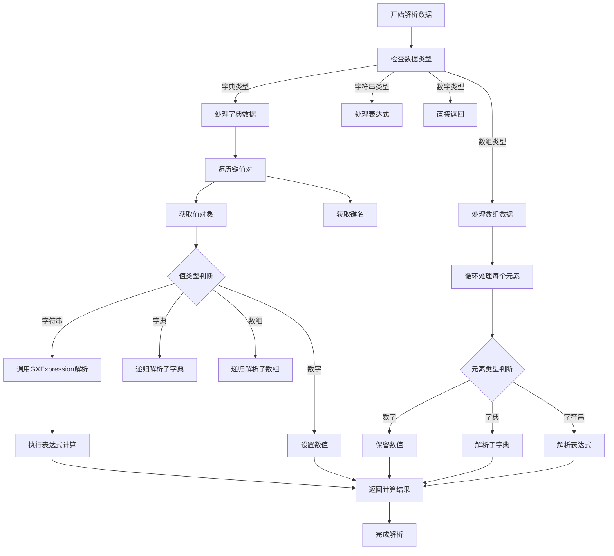
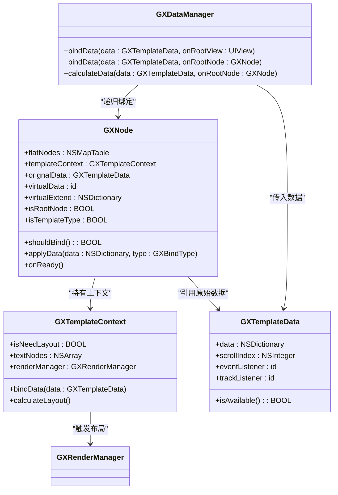
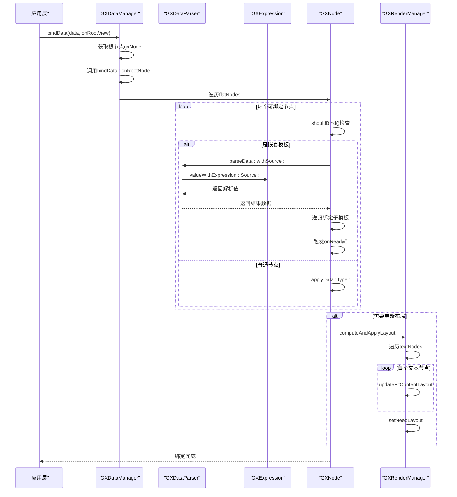
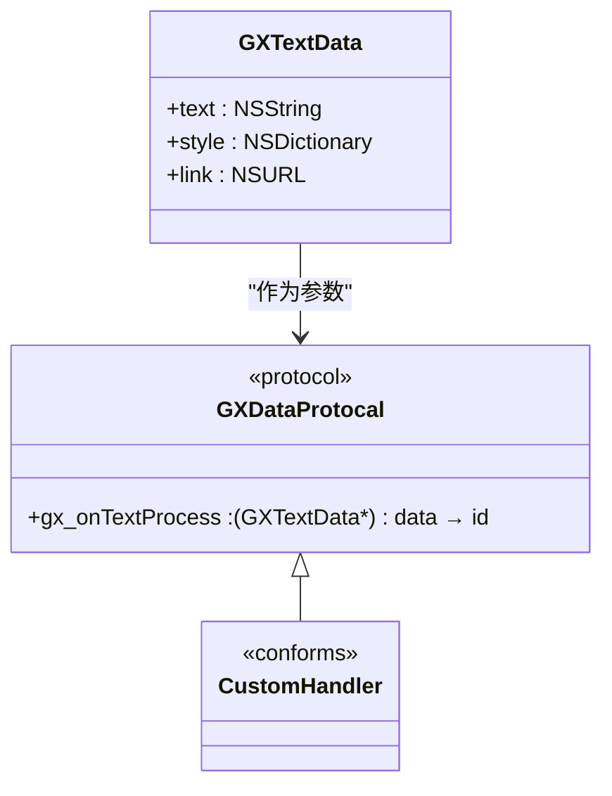

# 数据绑定

<cite>
**本文档中引用的文件**  
- [GXDataProtocal.h](file://GaiaXiOS/GaiaXiOS/Binding/Protocol/GXDataProtocal.h)
- [GXData.h](file://GaiaXiOS/GaiaXiOS/Binding/Data/GXData.h)
- [GXData.m](file://GaiaXiOS/GaiaXiOS/Binding/Data/GXData.m)
- [GXDataParser.h](file://GaiaXiOS/GaiaXiOS/Binding/Data/GXDataParser.h)
- [GXDataParser.m](file://GaiaXiOS/GaiaXiOS/Binding/Data/GXDataParser.m)
- [GXDataManager.h](file://GaiaXiOS/GaiaXiOS/Binding/Data/GXDataManager.h)
- [GXDataManager.m](file://GaiaXiOS/GaiaXiOS/Binding/Data/GXDataManager.m)
- [GXExpression.h](file://GaiaXiOS/GaiaXiOS/Binding/Expression/GXExpression.h)
- [GXExpression.m](file://GaiaXiOS/GaiaXiOS/Binding/Expression/GXExpression.m)
- [GXTemplateData.h](file://GaiaXiOS/GaiaXiOS/Binding/Data/GXTemplateData.h)
- [GXNode.h](file://GaiaXiOS/GaiaXiOS/Core/Node/GXNode.h)
</cite>

## 目录
1. [简介](#简介)
2. [核心组件](#核心组件)
3. [数据解析流程](#数据解析流程)
4. [绑定上下文管理](#绑定上下文管理)
5. [动态更新机制](#动态更新机制)
6. [GXDataProtocal协议详解](#gxdataprotocal协议详解)
7. [初学者示例代码](#初学者示例代码)
8. [高级开发者分析](#高级开发者分析)
9. [常见问题排查](#常见问题排查)
10. [性能优化建议](#性能优化建议)

## 简介
GaiaX iOS数据绑定系统是实现模板与数据解耦的核心机制，通过GXData、GXDataManager和GXDataParser三大组件协同工作，支持复杂的数据表达式解析、动态更新和上下文管理。该系统为开发者提供了灵活的数据驱动UI能力，适用于从简单文本展示到复杂嵌套模板的多种场景。

## 核心组件

### GXData
作为数据绑定的基础模型类，GXData封装了模板节点所需的基本数据信息，包括索引、节点ID和模板ID等元数据。其子类GXTextData专门用于处理文本类型的数据绑定。

**组件来源**
- [GXData.h](file://GaiaXiOS/GaiaXiOS/Binding/Data/GXData.h#L1-L20)
- [GXData.m](file://GaiaXiOS/GaiaXiOS/Binding/Data/GXData.m#L21-L37)

### GXDataManager
负责整个数据绑定流程的协调与执行，提供静态方法统一入口，支持从根视图或根节点开始递归绑定数据，并触发布局计算。该类区分JS调用与原生调用场景，确保生命周期回调的正确性。

**组件来源**
- [GXDataManager.h](file://GaiaXiOS/GaiaXiOS/Binding/Data/GXDataManager.h#L26-L52)
- [GXDataManager.m](file://GaiaXiOS/GaiaXiOS/Binding/Data/GXDataManager.m#L35-L184)

### GXDataParser
核心数据解析器，负责将模板中的数据绑定表达式（databinding）与实际数据源进行匹配计算，生成最终渲染所需的真实数据。支持字典、数组、字符串和数字等多种数据类型的解析。

**组件来源**
- [GXDataParser.h](file://GaiaXiOS/GaiaXiOS/Binding/Data/GXDataParser.h#L24-L33)
- [GXDataParser.m](file://GaiaXiOS/GaiaXiOS/Binding/Data/GXDataParser.m#L29-L112)

## 数据解析流程



**图示来源**
- [GXDataParser.m](file://GaiaXiOS/GaiaXiOS/Binding/Data/GXDataParser.m#L32-L112)

## 绑定上下文管理



**图示来源**
- [GXDataManager.m](file://GaiaXiOS/GaiaXiOS/Binding/Data/GXDataManager.m#L37-L184)
- [GXNode.h](file://GaiaXiOS/GaiaXiOS/Core/Node/GXNode.h#L1-L50)
- [GXTemplateData.h](file://GaiaXiOS/GaiaXiOS/Binding/Data/GXTemplateData.h#L1-L25)

## 动态更新机制



**图示来源**
- [GXDataManager.m](file://GaiaXiOS/GaiaXiOS/Binding/Data/GXDataManager.m#L37-L125)
- [GXDataParser.m](file://GaiaXiOS/GaiaXiOS/Binding/Data/GXDataParser.m#L32-L112)

## GXDataProtocal协议详解

GXDataProtocal协议定义了数据处理的扩展接口，允许开发者自定义特定类型数据的处理逻辑。目前主要支持文本数据的预处理。



**协议来源**
- [GXDataProtocal.h](file://GaiaXiOS/GaiaXiOS/Binding/Protocol/GXDataProtocal.h#L24-L30)

## 初学者示例代码

```objc
// 创建模板数据
GXTemplateData *templateData = [[GXTemplateData alloc] init];
templateData.data = @{
    @"title": @"欢迎使用GaiaX",
    @"count": @42,
    @"user": @{
        @"name": @"张三",
        @"level": @5
    }
};

// 获取根视图并绑定数据
UIView *rootView = [GXTemplateEngine renderWithTemplate:templateItem];
[GXDataManager bindData:templateData onRootView:rootView];
```

**代码路径**
- [GXDataManager.h](file://GaiaXiOS/GaiaXiOS/Binding/Data/GXDataManager.h#L31-L36)
- [GXTemplateData.h](file://GaiaXiOS/GaiaXiOS/Binding/Data/GXTemplateData.h#L3-L15)

## 高级开发者分析

### 数据变更检测算法
系统采用全量数据比对策略，在每次`bindData`调用时重新解析所有绑定表达式，通过GXExpression引擎计算最新值。这种设计避免了复杂的依赖追踪，但在大数据量场景下可能产生性能开销。

### 依赖追踪机制
当前系统未实现细粒度的依赖追踪，而是基于模板节点的扁平化结构（flatNodes）进行批量更新。每个节点通过`applyData:type:`方法接收数据变更通知，并自行决定是否更新UI。

### 性能优化策略
1. **表达式缓存**：GXExpression内部可能缓存已解析的表达式AST，减少重复解析开销
2. **延迟布局计算**：仅在必要时触发`computeAndApplyLayout`，避免频繁重排
3. **扁平化节点管理**：通过`flatNodes`快速访问所有可绑定节点，提升遍历效率

**分析来源**
- [GXDataManager.m](file://GaiaXiOS/GaiaXiOS/Binding/Data/GXDataManager.m#L64-L125)
- [GXDataParser.m](file://GaiaXiOS/GaiaXiOS/Binding/Data/GXDataParser.m#L32-L112)

## 常见问题排查

### 数据更新不生效
**可能原因及解决方案：**
1. **数据源格式错误**：确保传入`GXTemplateData`的data字段为合法NSDictionary
   - 检查路径：[GXDataManager.m#L45](file://GaiaXiOS/GaiaXiOS/Binding/Data/GXDataManager.m#L45)
2. **节点未正确注册**：确认视图已正确关联GXNode
   - 检查路径：[UIView+GX.h](file://GaiaXiOS/GaiaXiOS/Category/UIView+GX.h)
3. **表达式语法错误**：验证databinding表达式是否符合GXExpression语法规范
   - 检查路径：[GXExpression.h](file://GaiaXiOS/GaiaXiOS/Binding/Expression/GXExpression.h)
4. **生命周期问题**：确保在视图完全初始化后调用bindData
   - 检查路径：[GXDataManager.m#L59](file://GaiaXiOS/GaiaXiOS/Binding/Data/GXDataManager.m#L59)

## 性能优化建议

### 大数据量场景优化
1. **分页加载**：对于长列表，采用分页或虚拟滚动策略，避免一次性渲染过多节点
2. **数据预处理**：在传入前对数据进行预处理，减少运行时计算量
3. **避免深层嵌套**：减少模板嵌套层级，降低`flatNodes`遍历开销
4. **批量更新**：合并多次数据更新操作，在合适时机统一调用`bindData`
5. **监控表达式复杂度**：避免使用过于复杂的表达式，影响解析性能

**优化参考**
- [GXDataManager.m#L107-L124](file://GaiaXiOS/GaiaXiOS/Binding/Data/GXDataManager.m#L107-L124)
- [GXDataParser.m#L50-L102](file://GaiaXiOS/GaiaXiOS/Binding/Data/GXDataParser.m#L50-L102)