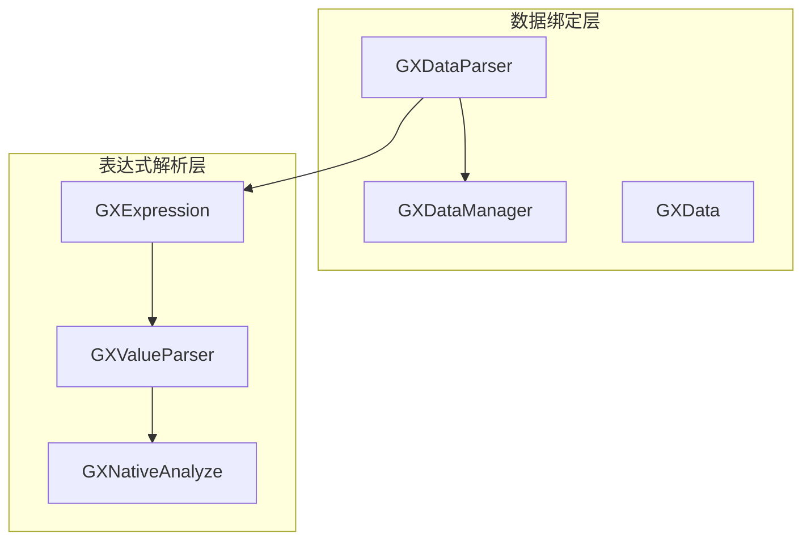
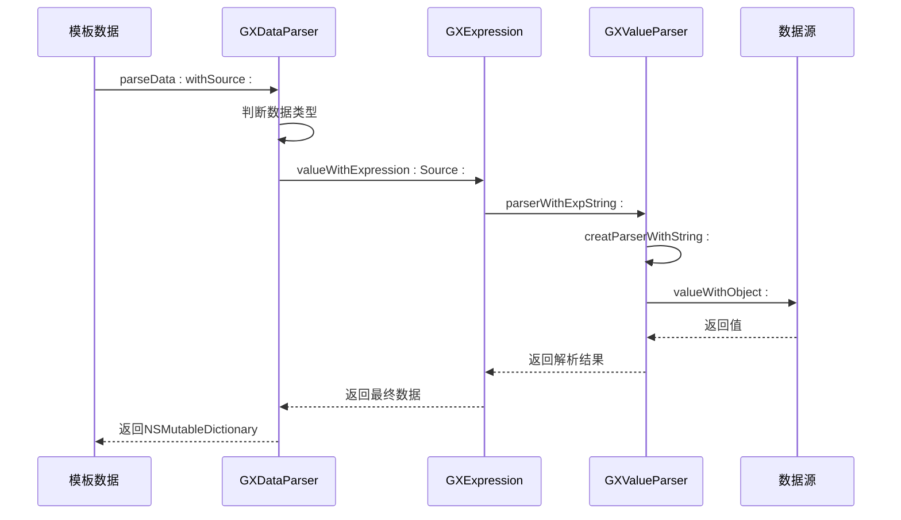
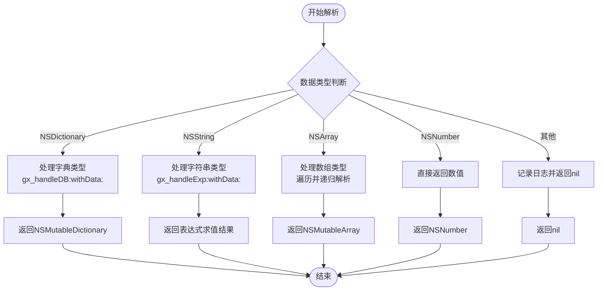
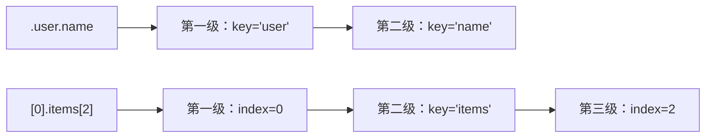
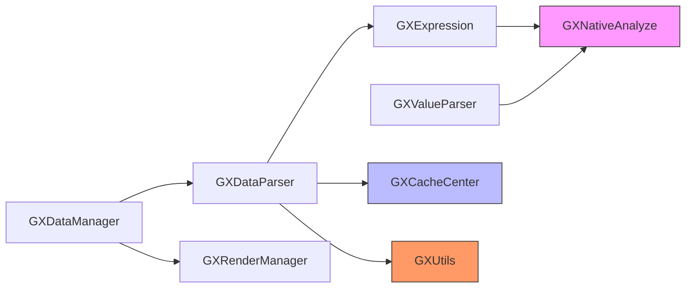

# 数据解析器

<cite>
**本文档引用文件**  
- [GXDataParser.h](file://GaiaXiOS/GaiaXiOS/Binding/Data/GXDataParser.h)
- [GXDataParser.m](file://GaiaXiOS/GaiaXiOS/Binding/Data/GXDataParser.m)
- [GXValueParser.h](file://GaiaXiOS/GaiaXiOS/Binding/Expression/GXValueParser.h)
- [GXValueParser.m](file://GaiaXiOS/GaiaXiOS/Binding/Expression/GXValueParser.m)
- [GXExpression.h](file://GaiaXiOS/GaiaXiOS/Binding/Expression/GXExpression.h)
- [GXExpression.m](file://GaiaXiOS/GaiaXiOS/Binding/Expression/GXExpression.m)
- [GXData.h](file://GaiaXiOS/GaiaXiOS/Binding/Data/GXData.h)
- [GXDataManager.h](file://GaiaXiOS/GaiaXiOS/Binding/Data/GXDataManager.h)
- [GXDataManager.m](file://GaiaXiOS/GaiaXiOS/Binding/Data/GXDataManager.m)
</cite>

## 目录
1. [简介](#简介)
2. [项目结构](#项目结构)
3. [核心组件](#核心组件)
4. [架构概述](#架构概述)
5. [详细组件分析](#详细组件分析)
6. [依赖分析](#依赖分析)
7. [性能考量](#性能考量)
8. [故障排除指南](#故障排除指南)
9. [结论](#结论)

## 简介
本文档深入探讨GaiaX iOS平台中的GXDataParser实现机制，重点阐述其如何将JSON数据转换为原生对象、表达式解析流程、数据类型映射规则以及嵌套结构处理策略。文档面向初学者提供完整示例，同时为高级开发者剖析性能优化与异常处理机制。

## 项目结构
GaiaX iOS数据解析模块主要位于`GaiaXiOS/Binding/Data`和`GaiaXiOS/Binding/Expression`目录下，包含数据解析、表达式处理、缓存管理等核心功能。



**图示来源**  
- [GXDataParser.h](file://GaiaXiOS/GaiaXiOS/Binding/Data/GXDataParser.h#L24-L29)
- [GXExpression.h](file://GaiaXiOS/GaiaXiOS/Binding/Expression/GXExpression.h#L23-L31)
- [GXValueParser.h](file://GaiaXiOS/GaiaXiOS/Binding/Expression/GXValueParser.h#L12-L20)

**章节来源**  
- [GXDataParser.h](file://GaiaXiOS/GaiaXiOS/Binding/Data/GXDataParser.h#L1-L33)
- [GXDataManager.h](file://GaiaXiOS/GaiaXiOS/Binding/Data/GXDataManager.h#L1-L53)

## 核心组件
GXDataParser是GaiaX iOS数据绑定系统的核心类，负责将模板中的数据绑定表达式与实际数据源进行匹配并生成最终渲染数据。其主要功能包括JSON到原生对象的转换、表达式求值、嵌套结构解析和错误恢复。

**章节来源**  
- [GXDataParser.h](file://GaiaXiOS/GaiaXiOS/Binding/Data/GXDataParser.h#L24-L29)
- [GXDataParser.m](file://GaiaXiOS/GaiaXiOS/Binding/Data/GXDataParser.m#L31-L43)

## 架构概述
GXDataParser采用分层架构设计，通过GXExpression和GXValueParser协同完成复杂的数据解析任务。整体流程为：接收模板数据 → 解析表达式 → 访问数据源 → 返回结果。



**图示来源**  
- [GXDataParser.m](file://GaiaXiOS/GaiaXiOS/Binding/Data/GXDataParser.m#L32-L43)
- [GXExpression.m](file://GaiaXiOS/GaiaXiOS/Binding/Expression/GXExpression.m#L29-L31)
- [GXValueParser.m](file://GaiaXiOS/GaiaXiOS/Binding/Expression/GXValueParser.m#L27-L43)

## 详细组件分析

### GXDataParser分析
GXDataParser作为数据解析的入口，提供了静态方法`parseData:withSource:`用于处理数据绑定。它支持字典、数组、字符串和数字等多种数据类型，并能递归处理嵌套结构。

#### 数据类型映射规则


**图示来源**  
- [GXDataParser.m](file://GaiaXiOS/GaiaXiOS/Binding/Data/GXDataParser.m#L50-L99)
- [GXDataParser.m](file://GaiaXiOS/GaiaXiOS/Binding/Data/GXDataParser.m#L107-L109)

**章节来源**  
- [GXDataParser.m](file://GaiaXiOS/GaiaXiOS/Binding/Data/GXDataParser.m#L31-L113)

### 表达式解析机制
GXValueParser负责将字符串形式的表达式（如".user.name"或"[0].items"）转换为可执行的解析链。

#### 表达式解析流程
```mermaid
classDiagram
class GXValueParser {
+NSString *key
+NSInteger index
+GXValueParser *nextParser
+parserWithExpString : (NSString*)
+valueWithObject : (id)
+creatParserWithString : (NSString*)
}
GXValueParser --> GXValueParser : "nextParser<br/>链式结构"
note right of GXValueParser
表达式解析器采用链表结构，
每个节点存储key或index，
通过nextParser连接下一级
end
```

**图示来源**  
- [GXValueParser.h](file://GaiaXiOS/GaiaXiOS/Binding/Expression/GXValueParser.h#L12-L20)
- [GXValueParser.m](file://GaiaXiOS/GaiaXiOS/Binding/Expression/GXValueParser.m#L10-L14)

### 动态属性解析
系统支持通过点号（.）访问字典属性，通过方括号（[]）访问数组元素，实现动态数据访问。



**图示来源**  
- [GXValueParser.m](file://GaiaXiOS/GaiaXiOS/Binding/Expression/GXValueParser.m#L57-L88)

## 依赖分析
GXDataParser与其他核心组件存在紧密依赖关系，形成完整的数据处理链条。



**图示来源**  
- [GXDataParser.m](file://GaiaXiOS/GaiaXiOS/Binding/Data/GXDataParser.m#L19-L26)
- [GXExpression.m](file://GaiaXiOS/GaiaXiOS/Binding/Expression/GXExpression.m#L19-L20)
- [GXDataManager.m](file://GaiaXiOS/GaiaXiOS/Binding/Data/GXDataManager.m#L19-L34)

**章节来源**  
- [GXDataParser.m](file://GaiaXiOS/GaiaXiOS/Binding/Data/GXDataParser.m#L19-L26)
- [GXDataManager.m](file://GaiaXiOS/GaiaXiOS/Binding/Data/GXDataManager.m#L19-L34)

## 性能考量
系统通过以下机制优化数据解析性能：
- **缓存机制**：使用GXCacheCenter缓存常用解析结果
- **惰性求值**：仅在需要时执行表达式解析
- **递归优化**：对嵌套结构进行深度优先遍历
- **类型检查**：提前判断数据类型避免无效操作

对于复杂数据结构，建议：
1. 避免过深层次的嵌套
2. 合理使用extend机制分离静态与动态数据
3. 对频繁访问的数据路径进行预解析

## 故障排除指南
常见解析问题及解决方案：

| 问题现象 | 可能原因 | 解决方案 |
|---------|--------|---------|
| 解析返回nil | 数据源中不存在对应路径 | 检查表达式拼写和数据结构 |
| 数组越界 | 索引超出数组范围 | 添加边界检查或使用安全访问方法 |
| 类型转换失败 | 期望类型与实际类型不符 | 在模板中明确指定数据类型 |
| 性能低下 | 过度嵌套或重复解析 | 使用缓存或优化数据结构 |

**章节来源**  
- [GXDataParser.m](file://GaiaXiOS/GaiaXiOS/Binding/Data/GXDataParser.m#L39-L40)
- [GXValueParser.m](file://GaiaXiOS/GaiaXiOS/Binding/Expression/GXValueParser.m#L126-L127)

## 结论
GXDataParser作为GaiaX iOS的核心数据解析组件，通过高效的表达式解析机制和灵活的数据映射规则，实现了JSON到原生对象的无缝转换。其模块化设计便于扩展和维护，而完善的错误处理机制确保了系统的稳定性。开发者应充分利用其特性，同时注意性能优化和异常处理，以构建高效可靠的动态界面。