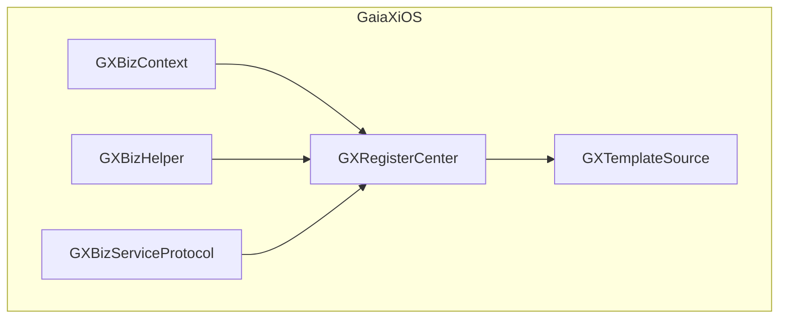
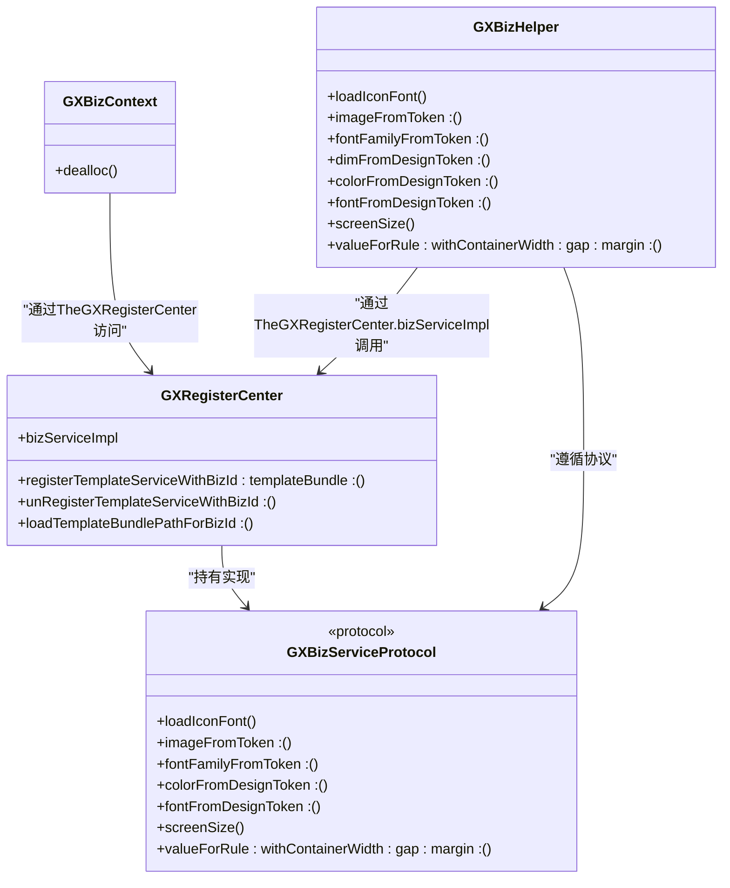
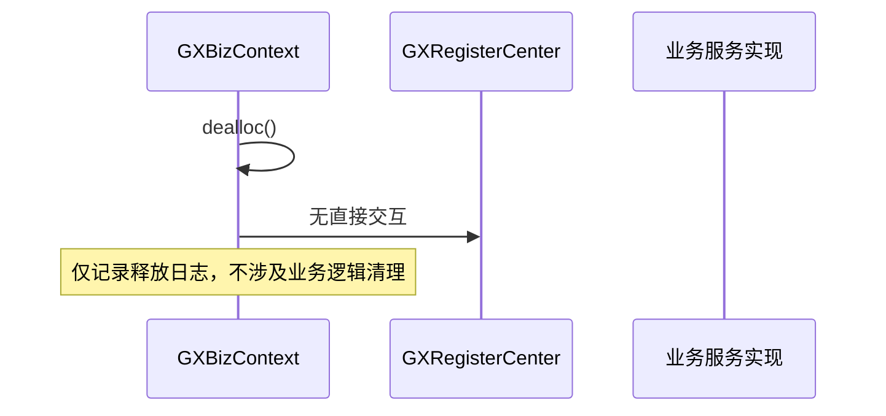
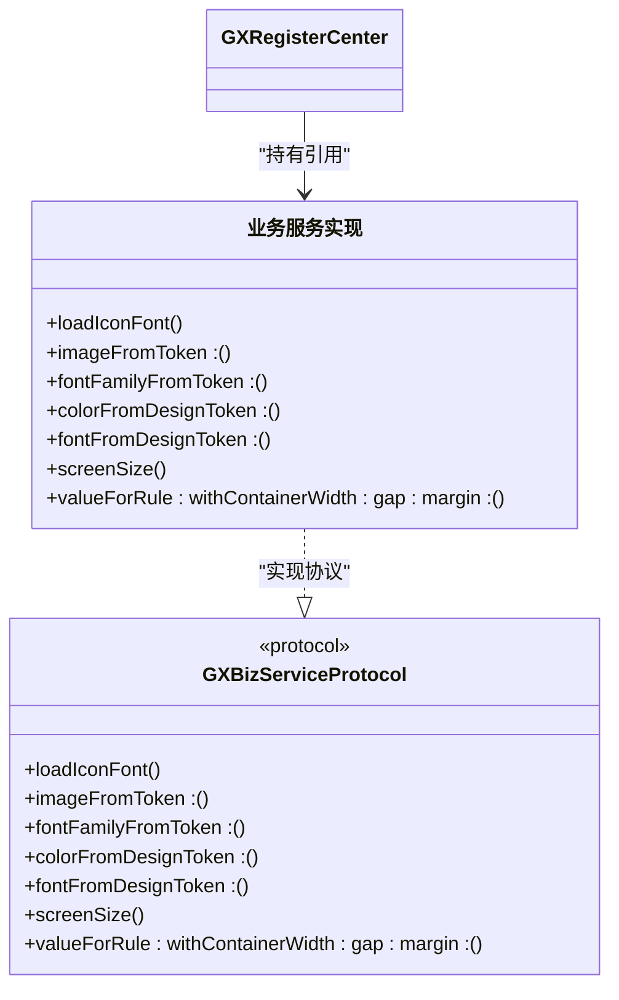
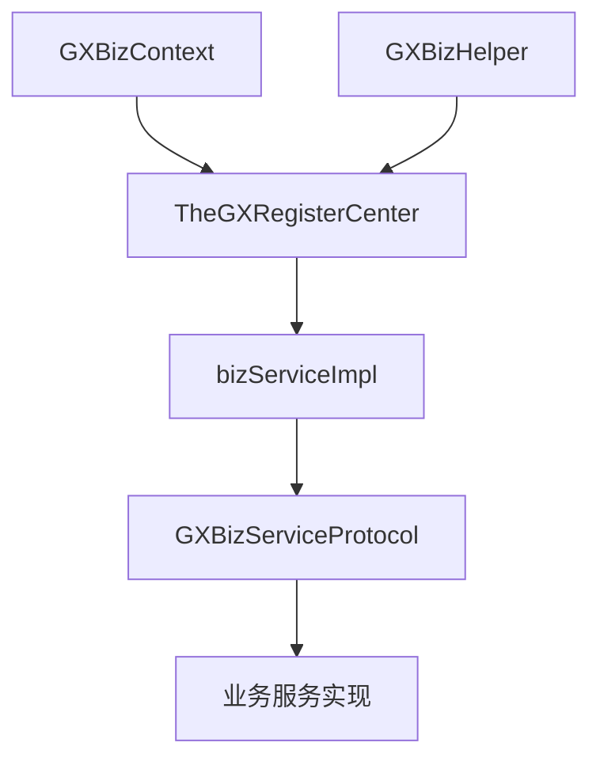

# 业务上下文

<cite>
**本文档引用的文件**
- [GXBizContext.h](file://GaiaXiOS/GaiaXiOS/Impl/GXBizContext.h)
- [GXBizContext.m](file://GaiaXiOS/GaiaXiOS/Impl/GXBizContext.m)
- [GXBizHelper.h](file://GaiaXiOS/GaiaXiOS/Impl/GXBizHelper.h)
- [GXBizHelper.m](file://GaiaXiOS/GaiaXiOS/Impl/GXBizHelper.m)
- [GXBizServiceProtocol.h](file://GaiaXiOS/GaiaXiOS/Impl/Interface/GXBizServiceProtocol.h)
- [GXRegisterCenter.h](file://GaiaXiOS/GaiaXiOS/Template/Register/GXRegisterCenter.h)
- [GXTemplateSource.m](file://GaiaXiOS/GaiaXiOS/Template/Loader/GXTemplateSource.m)
</cite>

## 目录
1. [引言](#引言)
2. [项目结构](#项目结构)
3. [核心组件](#核心组件)
4. [架构概述](#架构概述)
5. [详细组件分析](#详细组件分析)
6. [依赖分析](#依赖分析)
7. [性能考虑](#性能考虑)
8. [故障排除指南](#故障排除指南)
9. [结论](#结论)

## 引言
本文档全面解析GXBizContext和GXBizHelper在业务逻辑集成中的核心作用，详细说明业务上下文的创建、配置和管理机制，以及如何通过GXBizServiceProtocol扩展业务功能。阐述上下文在模板渲染过程中如何提供业务服务、处理事件回调和管理应用状态。分析GXBizHelper提供的工具方法和业务逻辑封装模式。提供自定义业务服务实现的代码示例，包括协议遵循、服务注册和调用流程。探讨上下文隔离、线程安全和内存泄漏预防的最佳实践。

## 项目结构
GaiaX项目是一个跨平台的模板渲染引擎，支持iOS、Android、Harmony等多端运行。项目采用模块化设计，核心功能包括模板加载、渲染、数据绑定、事件处理等。业务上下文相关的核心文件位于GaiaXiOS模块的Impl目录下，主要包括GXBizContext、GXBizHelper和GXBizServiceProtocol等组件。



**图示来源**
- [GXBizContext.h](file://GaiaXiOS/GaiaXiOS/Impl/GXBizContext.h)
- [GXBizHelper.h](file://GaiaXiOS/GaiaXiOS/Impl/GXBizHelper.h)
- [GXBizServiceProtocol.h](file://GaiaXiOS/GaiaXiOS/Impl/Interface/GXBizServiceProtocol.h)
- [GXRegisterCenter.h](file://GaiaXiOS/GaiaXiOS/Template/Register/GXRegisterCenter.h)
- [GXTemplateSource.m](file://GaiaXiOS/GaiaXiOS/Template/Loader/GXTemplateSource.m)

**本节来源**
- [GXBizContext.h](file://GaiaXiOS/GaiaXiOS/Impl/GXBizContext.h)
- [GXBizHelper.h](file://GaiaXiOS/GaiaXiOS/Impl/GXBizHelper.h)
- [GXBizServiceProtocol.h](file://GaiaXiOS/GaiaXiOS/Impl/Interface/GXBizServiceProtocol.h)

## 核心组件
GXBizContext和GXBizHelper是GaiaX框架中业务逻辑集成的核心组件。GXBizContext作为业务上下文的容器，负责管理业务相关的状态和配置；GXBizHelper则提供了一系列静态工具方法，用于封装常见的业务逻辑操作。两者通过GXBizServiceProtocol协议与注册中心GXRegisterCenter进行交互，实现业务功能的扩展和管理。

**本节来源**
- [GXBizContext.h](file://GaiaXiOS/GaiaXiOS/Impl/GXBizContext.h)
- [GXBizHelper.h](file://GaiaXiOS/GaiaXiOS/Impl/GXBizHelper.h)
- [GXBizServiceProtocol.h](file://GaiaXiOS/GaiaXiOS/Impl/Interface/GXBizServiceProtocol.h)

## 架构概述
GaiaX的业务上下文架构采用注册中心模式，通过GXRegisterCenter统一管理业务服务的注册和调用。GXBizContext作为上下文容器，不直接持有业务逻辑，而是通过TheGXRegisterCenter.bizServiceImpl获取具体的业务服务实现。GXBizHelper则作为工具类，通过静态方法调用注册中心中的业务服务，实现业务逻辑的解耦和复用。



**图示来源**
- [GXBizContext.h](file://GaiaXiOS/GaiaXiOS/Impl/GXBizContext.h)
- [GXBizHelper.h](file://GaiaXiOS/GaiaXiOS/Impl/GXBizHelper.h)
- [GXBizServiceProtocol.h](file://GaiaXiOS/GaiaXiOS/Impl/Interface/GXBizServiceProtocol.h)
- [GXRegisterCenter.h](file://GaiaXiOS/GaiaXiOS/Template/Register/GXRegisterCenter.h)

## 详细组件分析
### GXBizContext分析
GXBizContext是业务上下文的核心容器类，目前主要实现了内存释放时的日志记录功能。其设计遵循轻量级原则，不直接包含业务逻辑，而是通过注册中心间接访问业务服务。这种设计有利于上下文的隔离和管理，避免业务逻辑的耦合。

#### 对象生命周期管理


**图示来源**
- [GXBizContext.m](file://GaiaXiOS/GaiaXiOS/Impl/GXBizContext.m)

**本节来源**
- [GXBizContext.h](file://GaiaXiOS/GaiaXiOS/Impl/GXBizContext.h)
- [GXBizContext.m](file://GaiaXiOS/GaiaXiOS/Impl/GXBizContext.m)

### GXBizHelper分析
GXBizHelper是业务逻辑的工具类，通过Objective-C的分类(Category)机制分为DesignToken和ResponsiveLayout两个功能模块。它通过静态方法调用注册中心中的业务服务实现，提供了从设计令牌到实际UI元素的转换功能。

#### DesignToken模块
```mermaid
classDiagram
class GXBizHelper(DesignToken) {
+imageFromToken : ()
+fontFamilyFromToken : ()
+dimFromDesignToken : ()
+colorFromDesignToken : ()
+fontFromDesignToken : ()
}
class GXBizServiceProtocol {
<<protocol>>
+imageFromToken : ()
+fontFamilyFromToken : ()
+dimFromDesignToken : ()
+colorFromDesignToken : ()
+fontFromDesignToken : ()
}
GXBizHelper(DesignToken) --> GXBizServiceProtocol : "通过TheGXRegisterCenter.bizServiceImpl调用"
GXBizHelper(DesignToken) --> UIImage : "默认回退"
```

**图示来源**
- [GXBizHelper.h](file://GaiaXiOS/GaiaXiOS/Impl/GXBizHelper.h)
- [GXBizHelper.m](file://GaiaXiOS/GaiaXiOS/Impl/GXBizHelper.m)
- [GXBizServiceProtocol.h](file://GaiaXiOS/GaiaXiOS/Impl/Interface/GXBizServiceProtocol.h)

#### ResponsiveLayout模块
```mermaid
classDiagram
class GXBizHelper(ResponsiveLayout) {
+screenSize()
+valueForRule : withContainerWidth : gap : margin : ()
}
class GXBizServiceProtocol {
<<protocol>>
+screenSize()
+valueForRule : withContainerWidth : gap : margin : ()
}
GXBizHelper(ResponsiveLayout) --> GXBizServiceProtocol : "通过TheGXRegisterCenter.bizServiceImpl调用"
```

**图示来源**
- [GXBizHelper.h](file://GaiaXiOS/GaiaXiOS/Impl/GXBizHelper.h)
- [GXBizHelper.m](file://GaiaXiOS/GaiaXiOS/Impl/GXBizHelper.m)
- [GXBizServiceProtocol.h](file://GaiaXiOS/GaiaXiOS/Impl/Interface/GXBizServiceProtocol.h)

**本节来源**
- [GXBizHelper.h](file://GaiaXiOS/GaiaXiOS/Impl/GXBizHelper.h)
- [GXBizHelper.m](file://GaiaXiOS/GaiaXiOS/Impl/GXBizHelper.m)
- [GXBizServiceProtocol.h](file://GaiaXiOS/GaiaXiOS/Impl/Interface/GXBizServiceProtocol.h)

### GXBizServiceProtocol分析
GXBizServiceProtocol定义了业务服务的标准接口，包括iconfont加载、设计令牌解析和响应式布局计算等功能。任何业务服务实现都必须遵循此协议，以便被GXBizHelper和框架其他部分正确调用。



**图示来源**
- [GXBizServiceProtocol.h](file://GaiaXiOS/GaiaXiOS/Impl/Interface/GXBizServiceProtocol.h)
- [GXRegisterCenter.h](file://GaiaXiOS/GaiaXiOS/Template/Register/GXRegisterCenter.h)

**本节来源**
- [GXBizServiceProtocol.h](file://GaiaXiOS/GaiaXiOS/Impl/Interface/GXBizServiceProtocol.h)

## 依赖分析
GaiaX的业务上下文组件依赖于注册中心模式实现松耦合。GXBizContext和GXBizHelper都不直接依赖具体的业务服务实现，而是通过GXRegisterCenter间接访问。这种设计使得业务逻辑可以灵活替换和扩展，同时保证了核心组件的稳定性。



**图示来源**
- [GXBizContext.h](file://GaiaXiOS/GaiaXiOS/Impl/GXBizContext.h)
- [GXBizHelper.h](file://GaiaXiOS/GaiaXiOS/Impl/GXBizHelper.h)
- [GXRegisterCenter.h](file://GaiaXiOS/GaiaXiOS/Template/Register/GXRegisterCenter.h)
- [GXBizServiceProtocol.h](file://GaiaXiOS/GaiaXiOS/Impl/Interface/GXBizServiceProtocol.h)

**本节来源**
- [GXBizContext.h](file://GaiaXiOS/GaiaXiOS/Impl/GXBizContext.h)
- [GXBizHelper.h](file://GaiaXiOS/GaiaXiOS/Impl/GXBizHelper.h)
- [GXRegisterCenter.h](file://GaiaXiOS/GaiaXiOS/Template/Register/GXRegisterCenter.h)
- [GXBizServiceProtocol.h](file://GaiaXiOS/GaiaXiOS/Impl/Interface/GXBizServiceProtocol.h)

## 性能考虑
业务上下文的设计充分考虑了性能因素。GXBizContext采用轻量级设计，避免不必要的资源占用；GXBizHelper的静态方法调用避免了对象创建的开销；注册中心模式通过单例管理业务服务实例，减少了重复创建的成本。此外，GXBizHelper中的方法都包含了对业务服务实现的空值检查，避免了无效的反射调用。

## 故障排除指南
在使用业务上下文时，常见的问题包括业务服务未正确注册、方法调用失败等。建议检查GXRegisterCenter的bizServiceImpl是否已正确设置，确保业务服务类遵循GXBizServiceProtocol协议并实现了所需方法。同时，注意GXBizHelper的静态方法调用是线程安全的，可以在任何线程中使用。

**本节来源**
- [GXBizHelper.m](file://GaiaXiOS/GaiaXiOS/Impl/GXBizHelper.m)
- [GXRegisterCenter.h](file://GaiaXiOS/GaiaXiOS/Template/Register/GXRegisterCenter.h)

## 结论
GXBizContext和GXBizHelper通过注册中心模式实现了业务逻辑的解耦和扩展。GXBizContext作为上下文容器保持轻量，GXBizHelper提供便捷的工具方法，GXBizServiceProtocol定义标准接口，三者协同工作，构成了灵活可靠的业务集成方案。这种设计既保证了核心框架的稳定性，又为业务定制提供了充分的自由度。