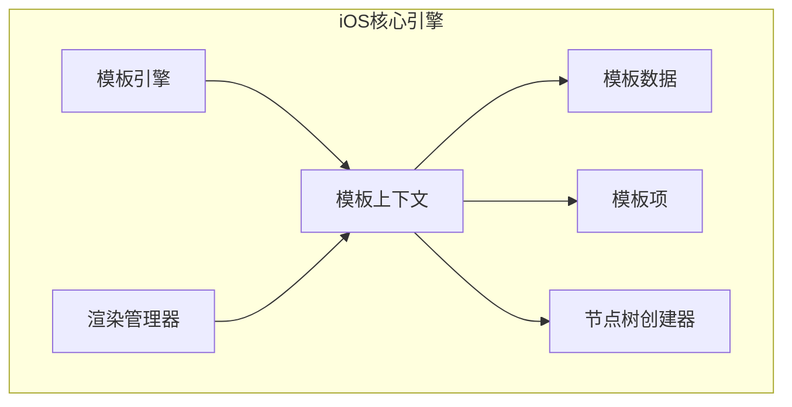
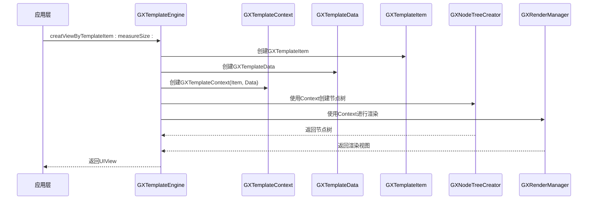
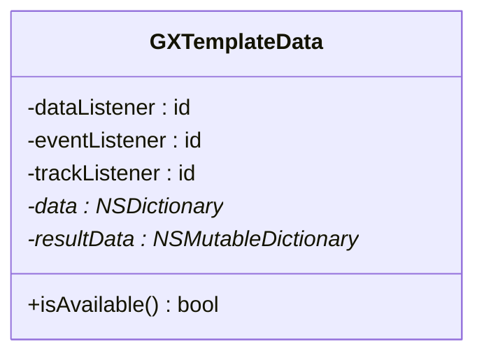
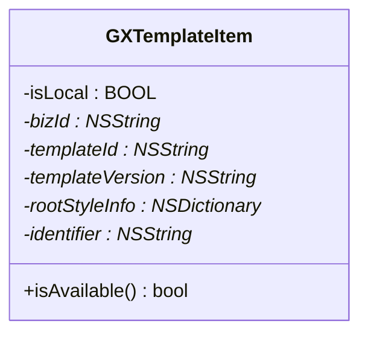
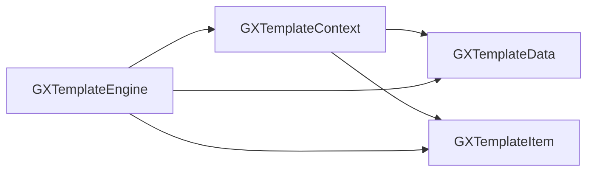

# 数据模型

<cite>
**本文档中引用的文件**  
- [GXTemplateData.h](file://GaiaXiOS/GaiaXiOS/Engine/GXTemplateData.h)
- [GXTemplateItem.h](file://GaiaXiOS/GaiaXiOS/Engine/GXTemplateItem.h)
- [GXTemplateContext.h](file://GaiaXiOS/GaiaXiOS/Core/Context/GXTemplateContext.h)
- [GXTemplateEngine.h](file://GaiaXiOS/GaiaXiOS/Engine/GXTemplateEngine.h)
</cite>

## 目录
1. [引言](#引言)
2. [项目结构](#项目结构)
3. [核心组件](#核心组件)
4. [架构概述](#架构概述)
5. [详细组件分析](#详细组件分析)
6. [依赖分析](#依赖分析)
7. [性能考虑](#性能考虑)
8. [故障排除指南](#故障排除指南)
9. [结论](#结论)

## 引言
本文档详细阐述了在iOS核心引擎中，GXTemplateData和GXTemplateItem在数据建模中的关键作用。重点分析了GXTemplateData如何封装模板配置、样式信息和初始数据，以及GXTemplateItem如何管理模板实例的状态和生命周期。同时探讨了数据绑定机制、动态数据更新流程和变更传播策略，并提供了数据模型创建、配置和使用的代码示例。

## 项目结构
GaiaX项目是一个跨平台的模板渲染引擎，支持iOS、Android、HarmonyOS等多个平台。iOS核心引擎位于`GaiaXiOS`目录下，其主要结构包括引擎层、核心渲染层、绑定层和模板管理层。`GXTemplateData`和`GXTemplateItem`作为核心数据模型，位于引擎层和核心上下文层，是模板渲染流程的起点。

**图表来源**
- [GXTemplateEngine.h](file://GaiaXiOS/GaiaXiOS/Engine/GXTemplateEngine.h)
- [GXTemplateContext.h](file://GaiaXiOS/GaiaXiOS/Core/Context/GXTemplateContext.h)

**章节来源**
- [GXTemplateEngine.h](file://GaiaXiOS/GaiaXiOS/Engine/GXTemplateEngine.h)
- [GXTemplateContext.h](file://GaiaXiOS/GaiaXiOS/Core/Context/GXTemplateContext.h)

## 核心组件
`GXTemplateData`和`GXTemplateItem`是GaiaX iOS引擎中两个最核心的数据模型类。`GXTemplateData`负责承载模板渲染所需的所有数据，包括原始数据、结果数据以及数据、事件和追踪的监听器。`GXTemplateItem`则负责标识一个唯一的模板实例，包含业务ID、模板ID、是否为本地模板等元信息。

**章节来源**
- [GXTemplateData.h](file://GaiaXiOS/GaiaXiOS/Engine/GXTemplateData.h)
- [GXTemplateItem.h](file://GaiaXiOS/GaiaXiOS/Engine/GXTemplateItem.h)

## 架构概述
在GaiaX的渲染流程中，`GXTemplateItem`和`GXTemplateData`共同构成了`GXTemplateContext`（模板上下文）的核心。`GXTemplateContext`是模板渲染过程中的“环境”，它将模板的元信息（`GXTemplateItem`）和具体数据（`GXTemplateData`）与渲染引擎的其他组件（如`GXNodeTreeCreator`和`GXRenderManager`）连接起来。

**图表来源**
- [GXTemplateEngine.h](file://GaiaXiOS/GaiaXiOS/Engine/GXTemplateEngine.h)
- [GXTemplateContext.h](file://GaiaXiOS/GaiaXiOS/Core/Context/GXTemplateContext.h)

## 详细组件分析

### GXTemplateData 分析
`GXTemplateData`类是模板数据的载体，其主要职责是封装和管理模板渲染所需的数据。

**图表来源**
- [GXTemplateData.h](file://GaiaXiOS/GaiaXiOS/Engine/GXTemplateData.h)

#### 属性说明
- **dataListener**: 数据监听器，用于监听数据变化。
- **eventListener**: 事件监听器，用于处理用户交互事件。
- **trackListener**: 追踪监听器，用于上报埋点数据。
- **data**: 原始数据，通常是一个JSON字典，由外部传入。
- **resultData**: 结果数据，是经过数据绑定和表达式计算后的最终数据，供渲染引擎使用。

**章节来源**
- [GXTemplateData.h](file://GaiaXiOS/GaiaXiOS/Engine/GXTemplateData.h)

### GXTemplateItem 分析
`GXTemplateItem`类用于唯一标识一个模板实例，它不包含具体的数据，而是包含模板的元信息。

**图表来源**
- [GXTemplateItem.h](file://GaiaXiOS/GaiaXiOS/Engine/GXTemplateItem.h)

#### 属性说明
- **isLocal**: 标识是否为本地模板。
- **bizId**: 业务ID，用于区分不同业务场景下的模板。
- **templateId**: 模板ID，与`bizId`共同唯一确定一个模板。
- **templateVersion**: 模板版本号。
- **rootStyleInfo**: 用于覆盖嵌套模板根节点样式的字典。
- **identifier**: 模板标识符。

**章节来源**
- [GXTemplateItem.h](file://GaiaXiOS/GaiaXiOS/Engine/GXTemplateItem.h)

## 依赖分析
`GXTemplateData`和`GXTemplateItem`是整个渲染流程的输入，它们被`GXTemplateContext`所持有，并被`GXTemplateEngine`在创建视图和计算尺寸时使用。`GXTemplateEngine`通过`loadTemplateContentWithTemplateItem:`方法加载模板元数据，通过`bindData:onView:`方法将`GXTemplateData`绑定到视图上。

**图表来源**
- [GXTemplateEngine.h](file://GaiaXiOS/GaiaXiOS/Engine/GXTemplateEngine.h)
- [GXTemplateContext.h](file://GaiaXiOS/GaiaXiOS/Core/Context/GXTemplateContext.h)

**章节来源**
- [GXTemplateEngine.h](file://GaiaXiOS/GaiaXiOS/Engine/GXTemplateEngine.h)

## 性能考虑
在大规模数据更新场景下，应避免频繁创建`GXTemplateData`和`GXTemplateItem`对象。可以考虑对`GXTemplateContext`进行缓存，或者利用`GXTemplateEngine`提供的`sizeWithTemplateItem:measureSize:data:`方法预先计算尺寸，以减少重复的布局计算。

## 故障排除指南
当模板无法正常渲染时，应首先检查`GXTemplateItem`的`bizId`和`templateId`是否正确，以及`GXTemplateData`的`data`字典是否为空或格式错误。同时，确保`GXTemplateContext`中的`measureSize`设置合理，避免因尺寸为0导致布局失败。

**章节来源**
- [GXTemplateData.h](file://GaiaXiOS/GaiaXiOS/Engine/GXTemplateData.h)
- [GXTemplateItem.h](file://GaiaXiOS/GaiaXiOS/Engine/GXTemplateItem.h)

## 结论
`GXTemplateData`和`GXTemplateItem`是GaiaX iOS引擎中至关重要的数据模型。`GXTemplateData`负责承载和管理模板数据，而`GXTemplateItem`则负责标识模板实例。两者通过`GXTemplateContext`被引擎使用，共同驱动了整个模板的渲染流程。理解这两个类的职责和交互方式，是掌握GaiaX核心机制的关键。