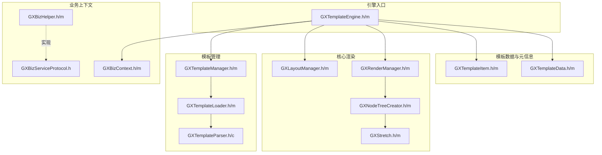
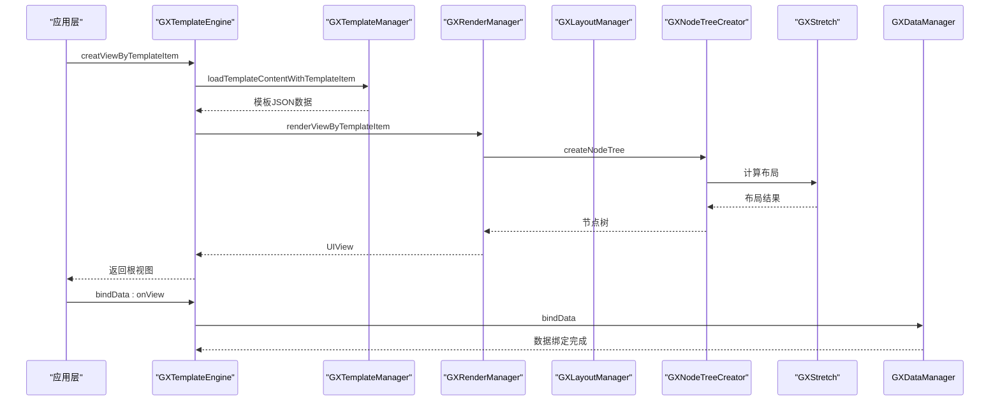
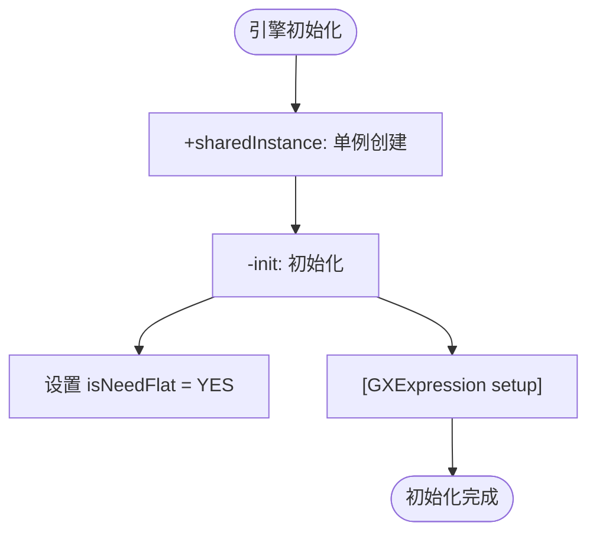
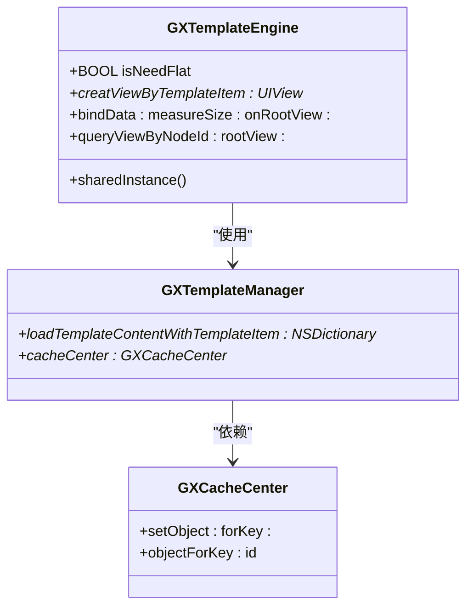
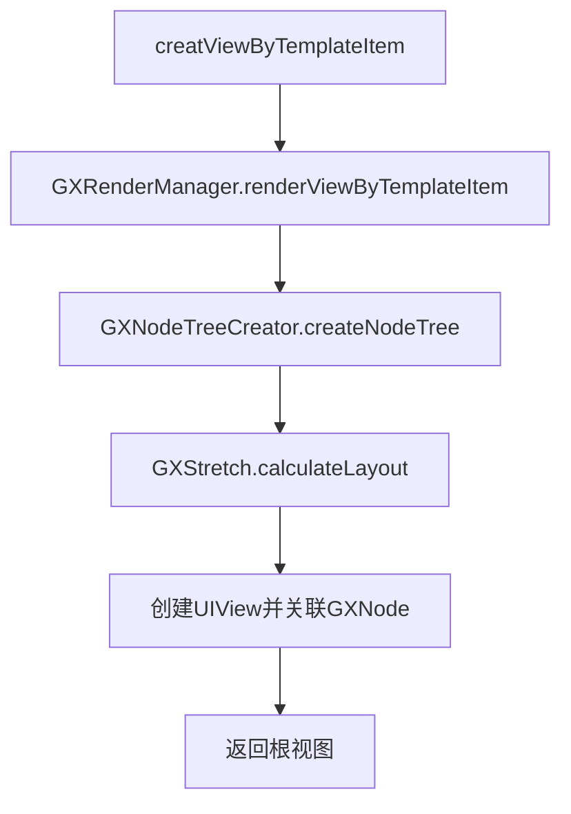
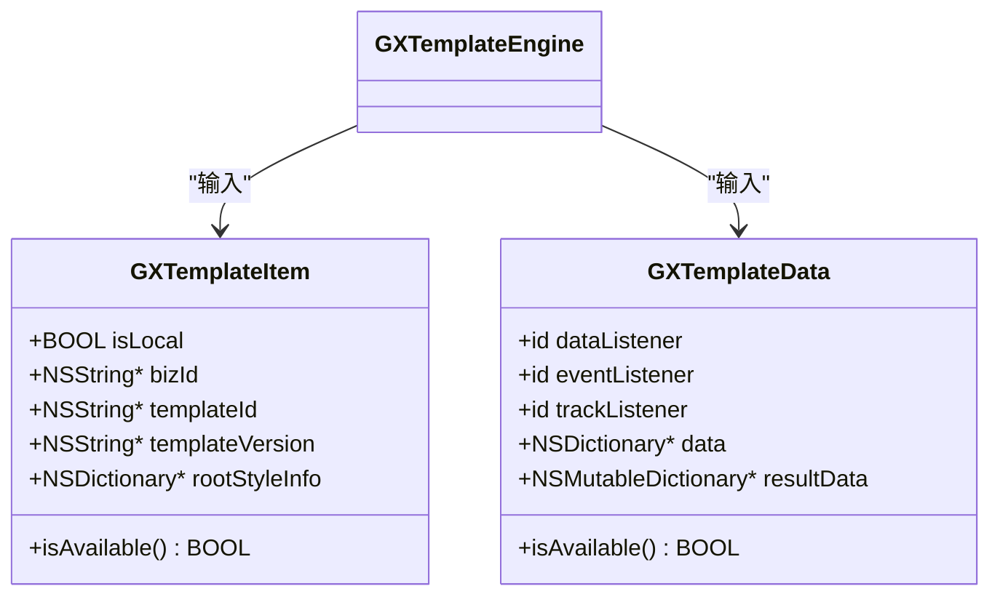
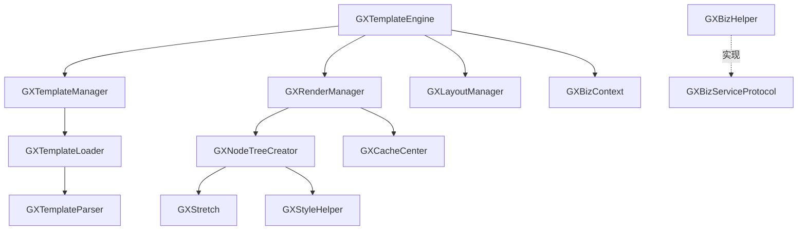

# 核心引擎

<cite>
**本文档中引用的文件**  
- [GXTemplateEngine.h](file://GaiaXiOS/GaiaXiOS/Engine/GXTemplateEngine.h)
- [GXTemplateEngine.m](file://GaiaXiOS/GaiaXiOS/Engine/GXTemplateEngine.m)
- [GXTemplateData.h](file://GaiaXiOS/GaiaXiOS/Engine/GXTemplateData.h)
- [GXTemplateItem.h](file://GaiaXiOS/GaiaXiOS/Engine/GXTemplateItem.h)
- [GXBizContext.h](file://GaiaXiOS/GaiaXiOS/Impl/GXBizContext.h)
- [GXBizHelper.h](file://GaiaXiOS/GaiaXiOS/Impl/GXBizHelper.h)
- [GXBizServiceProtocol.h](file://GaiaXiOS/GaiaXiOS/Impl/Interface/GXBizServiceProtocol.h)
- [GXTemplateManager.h](file://GaiaXiOS/GaiaXiOS/Template/Loader/GXTemplateManager.h)
- [GXRenderManager.h](file://GaiaXiOS/GaiaXiOS/Core/Render/GXRenderManager.h)
- [GXLayoutManager.h](file://GaiaXiOS/GaiaXiOS/Core/Render/GXLayoutManager.h)
- [GXTemplateContext.h](file://GaiaXiOS/GaiaXiOS/Core/Context/GXTemplateContext.h)
</cite>

## 目录
1. [引言](#引言)
2. [项目结构](#项目结构)
3. [核心组件](#核心组件)
4. [架构概览](#架构概览)
5. [详细组件分析](#详细组件分析)
6. [依赖分析](#依赖分析)
7. [性能考量](#性能考量)
8. [故障排除指南](#故障排除指南)
9. [结论](#结论)

## 引言
GaiaX iOS核心引擎是一个高性能、可扩展的模板渲染系统，专为动态UI构建而设计。本文档深入解析以`GXTemplateEngine`为核心的引擎设计与实现机制，涵盖初始化流程、模板管理、渲染调度、数据封装、上下文管理、线程安全与扩展能力。面向初学者提供标准调用示例，为高级开发者揭示内部状态管理与性能优化策略。

## 项目结构
GaiaX iOS核心引擎采用模块化分层架构，主要分为引擎层、模板层、核心渲染层与业务实现层。



**Diagram sources**
- [GXTemplateEngine.h](file://GaiaXiOS/GaiaXiOS/Engine/GXTemplateEngine.h)
- [GXTemplateData.h](file://GaiaXiOS/GaiaXiOS/Engine/GXTemplateData.h)
- [GXTemplateItem.h](file://GaiaXiOS/GaiaXiOS/Engine/GXTemplateItem.h)
- [GXTemplateManager.h](file://GaiaXiOS/GaiaXiOS/Template/Loader/GXTemplateManager.h)
- [GXRenderManager.h](file://GaiaXiOS/GaiaXiOS/Core/Render/GXRenderManager.h)
- [GXLayoutManager.h](file://GaiaXiOS/GaiaXiOS/Core/Render/GXLayoutManager.h)
- [GXBizContext.h](file://GaiaXiOS/GaiaXiOS/Impl/GXBizContext.h)
- [GXBizHelper.h](file://GaiaXiOS/GaiaXiOS/Impl/GXBizHelper.h)
- [GXBizServiceProtocol.h](file://GaiaXiOS/GaiaXiOS/Impl/Interface/GXBizServiceProtocol.h)

**Section sources**
- [GXTemplateEngine.h](file://GaiaXiOS/GaiaXiOS/Engine/GXTemplateEngine.h)
- [GXTemplateData.h](file://GaiaXiOS/GaiaXiOS/Engine/GXTemplateData.h)
- [GXTemplateItem.h](file://GaiaXiOS/GaiaXiOS/Engine/GXTemplateItem.h)
- [GXTemplateManager.h](file://GaiaXiOS/GaiaXiOS/Template/Loader/GXTemplateManager.h)
- [GXRenderManager.h](file://GaiaXiOS/GaiaXiOS/Core/Render/GXRenderManager.h)
- [GXLayoutManager.h](file://GaiaXiOS/GaiaXiOS/Core/Render/GXLayoutManager.h)
- [GXBizContext.h](file://GaiaXiOS/GaiaXiOS/Impl/GXBizContext.h)
- [GXBizHelper.h](file://GaiaXiOS/GaiaXiOS/Impl/GXBizHelper.h)
- [GXBizServiceProtocol.h](file://GaiaXiOS/GaiaXiOS/Impl/Interface/GXBizServiceProtocol.h)

## 核心组件
核心组件围绕`GXTemplateEngine`展开，通过`GXTemplateItem`定义模板元信息，`GXTemplateData`封装运行时数据，`GXBizContext`与`GXBizHelper`管理业务上下文，并通过`GXBizServiceProtocol`提供可扩展接口。

**Section sources**
- [GXTemplateEngine.h](file://GaiaXiOS/GaiaXiOS/Engine/GXTemplateEngine.h)
- [GXTemplateData.h](file://GaiaXiOS/GaiaXiOS/Engine/GXTemplateData.h)
- [GXTemplateItem.h](file://GaiaXiOS/GaiaXiOS/Engine/GXTemplateItem.h)
- [GXBizContext.h](file://GaiaXiOS/GaiaXiOS/Impl/GXBizContext.h)
- [GXBizHelper.h](file://GaiaXiOS/GaiaXiOS/Impl/GXBizHelper.h)

## 架构概览
GaiaX iOS核心引擎采用单例模式，通过`GXTemplateEngine`统一调度模板加载、视图创建、数据绑定与尺寸计算。



**Diagram sources**
- [GXTemplateEngine.m](file://GaiaXiOS/GaiaXiOS/Engine/GXTemplateEngine.m#L79-L87)
- [GXTemplateManager.h](file://GaiaXiOS/GaiaXiOS/Template/Loader/GXTemplateManager.h)
- [GXRenderManager.h](file://GaiaXiOS/GaiaXiOS/Core/Render/GXRenderManager.h)
- [GXNodeTreeCreator.h](file://GaiaXiOS/GaiaXiOS/Core/Creator/GXNodeTreeCreator.h)
- [GXStretch.h](file://GaiaXiOS/GaiaXiOS/Core/StretchKit/Classes/GXStretch.h)

## 详细组件分析

### GXTemplateEngine 分析
`GXTemplateEngine`是整个引擎的主入口，采用单例模式确保全局唯一实例，负责协调模板加载、视图创建、数据绑定与尺寸计算。

#### 初始化流程


**Diagram sources**
- [GXTemplateEngine.m](file://GaiaXiOS/GaiaXiOS/Engine/GXTemplateEngine.m#L40-L58)

**Section sources**
- [GXTemplateEngine.h](file://GaiaXiOS/GaiaXiOS/Engine/GXTemplateEngine.h)
- [GXTemplateEngine.m](file://GaiaXiOS/GaiaXiOS/Engine/GXTemplateEngine.m)

#### 模板管理机制
`GXTemplateEngine`通过`GXTemplateManager`实现模板的加载与缓存管理，支持本地与远程模板。



**Diagram sources**
- [GXTemplateEngine.m](file://GaiaXiOS/GaiaXiOS/Engine/GXTemplateEngine.m#L144-L148)
- [GXTemplateManager.h](file://GaiaXiOS/GaiaXiOS/Template/Loader/GXTemplateManager.h)
- [GXCacheCenter.h](file://GaiaXiOS/GaiaXiOS/Template/Cache/GXCacheCenter.h)

#### 渲染调度策略
引擎通过`GXRenderManager`和`GXLayoutManager`协同完成视图创建与布局计算。



**Diagram sources**
- [GXTemplateEngine.m](file://GaiaXiOS/GaiaXiOS/Engine/GXTemplateEngine.m#L84-L86)
- [GXRenderManager.h](file://GaiaXiOS/GaiaXiOS/Core/Render/GXRenderManager.h)
- [GXNodeTreeCreator.h](file://GaiaXiOS/GaiaXiOS/Core/Creator/GXNodeTreeCreator.h)
- [GXStretch.h](file://GaiaXiOS/GaiaXiOS/Core/StretchKit/Classes/GXStretch.h)

### GXTemplateData 与 GXTemplateItem 分析
`GXTemplateItem`定义模板的元信息，`GXTemplateData`封装运行时数据与监听器。



**Diagram sources**
- [GXTemplateItem.h](file://GaiaXiOS/GaiaXiOS/Engine/GXTemplateItem.h)
- [GXTemplateData.h](file://GaiaXiOS/GaiaXiOS/Engine/GXTemplateData.h)

**Section sources**
- [GXTemplateItem.h](file://GaiaXiOS/GaiaXiOS/Engine/GXTemplateItem.h)
- [GXTemplateData.h](file://GaiaXiOS/GaiaXiOS/Engine/GXTemplateData.h)

### GXBizContext 与 GXBizHelper 分析
`GXBizContext`作为业务上下文容器，`GXBizHelper`提供静态工具方法，通过`GXBizServiceProtocol`实现业务功能扩展。

```mermaid
classDiagram
class GXBizContext {
}
class GXBizHelper {
+loadIconFont()
+imageFromToken : UIImage*
+colorFromDesignToken : UIColor*
+fontFromDesignToken : UIFont*
+screenSize() CGSize
+valueForRule : CGFloat
}
class GXBizServiceProtocol {
+loadIconFont()
+imageFromToken : UIImage*
+colorFromDesignToken : UIColor*
+fontFromDesignToken : UIFont*
+screenSize() CGSize
+valueForRule : CGFloat
}
GXBizHelper -.-> GXBizServiceProtocol : "实现协议"
GXTemplateEngine --> GXBizContext : "持有"
```

**Diagram sources**
- [GXBizContext.h](file://GaiaXiOS/GaiaXiOS/Impl/GXBizContext.h)
- [GXBizHelper.h](file://GaiaXiOS/GaiaXiOS/Impl/GXBizHelper.h)
- [GXBizServiceProtocol.h](file://GaiaXiOS/GaiaXiOS/Impl/Interface/GXBizServiceProtocol.h)

**Section sources**
- [GXBizContext.h](file://GaiaXiOS/GaiaXiOS/Impl/GXBizContext.h)
- [GXBizHelper.h](file://GaiaXiOS/GaiaXiOS/Impl/GXBizHelper.h)
- [GXBizServiceProtocol.h](file://GaiaXiOS/GaiaXiOS/Impl/Interface/GXBizServiceProtocol.h)

## 依赖分析
核心引擎依赖关系清晰，各模块职责分明。



**Diagram sources**
- [GXTemplateEngine.m](file://GaiaXiOS/GaiaXiOS/Engine/GXTemplateEngine.m)
- [GXTemplateManager.h](file://GaiaXiOS/GaiaXiOS/Template/Loader/GXTemplateManager.h)
- [GXRenderManager.h](file://GaiaXiOS/GaiaXiOS/Core/Render/GXRenderManager.h)
- [GXNodeTreeCreator.h](file://GaiaXiOS/GaiaXiOS/Core/Creator/GXNodeTreeCreator.h)
- [GXStretch.h](file://GaiaXiOS/GaiaXiOS/Core/StretchKit/Classes/GXStretch.h)
- [GXBizHelper.h](file://GaiaXiOS/GaiaXiOS/Impl/GXBizHelper.h)
- [GXBizServiceProtocol.h](file://GaiaXiOS/GaiaXiOS/Impl/Interface/GXBizServiceProtocol.h)

**Section sources**
- [GXTemplateEngine.m](file://GaiaXiOS/GaiaXiOS/Engine/GXTemplateEngine.m)
- [GXTemplateManager.h](file://GaiaXiOS/GaiaXiOS/Template/Loader/GXTemplateManager.h)
- [GXRenderManager.h](file://GaiaXiOS/GaiaXiOS/Core/Render/GXRenderManager.h)
- [GXNodeTreeCreator.h](file://GaiaXiOS/GaiaXiOS/Core/Creator/GXNodeTreeCreator.h)
- [GXStretch.h](file://GaiaXiOS/GaiaXiOS/Core/StretchKit/Classes/GXStretch.h)
- [GXBizHelper.h](file://GaiaXiOS/GaiaXiOS/Impl/GXBizHelper.h)
- [GXBizServiceProtocol.h](file://GaiaXiOS/GaiaXiOS/Impl/Interface/GXBizServiceProtocol.h)

## 性能考量
- **单例模式**：`GXTemplateEngine`使用`dispatch_once`确保线程安全的单例初始化。
- **缓存机制**：`GXTemplateManager`通过`GXCacheCenter`缓存已加载的模板内容，避免重复解析。
- **懒加载**：`renderManager`和`layoutManager`采用懒加载，减少初始化开销。
- **表达式预初始化**：在引擎初始化时调用`[GXExpression setup]`，避免首次渲染时的延迟。

## 故障排除指南
- **模板加载失败**：检查`GXTemplateItem`的`templateId`是否有效，确认模板资源是否存在。
- **数据绑定无效**：确保`GXTemplateData`的`data`字典不为空，且`isAvailable`返回`YES`。
- **视图显示异常**：检查`measureSize`是否合理，确认`GXNode`与`UIView`的关联是否正确。
- **扩展功能未生效**：确认已正确实现`GXBizServiceProtocol`，并在应用启动时注册。

## 结论
GaiaX iOS核心引擎通过清晰的分层架构与模块化设计，实现了高性能、高可扩展的模板渲染能力。`GXTemplateEngine`作为主入口，高效协调各组件完成模板解析、视图创建与数据绑定。通过`GXBizServiceProtocol`，开发者可轻松定制业务功能，满足多样化需求。其线程安全的单例设计与缓存机制保障了运行时性能，为构建动态化UI提供了坚实基础。