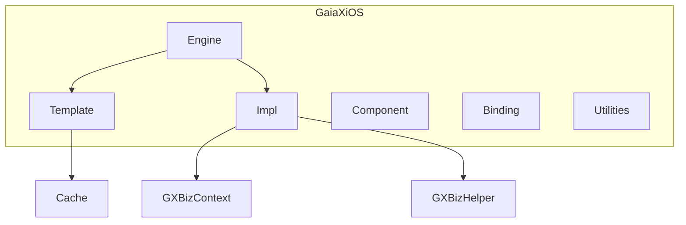
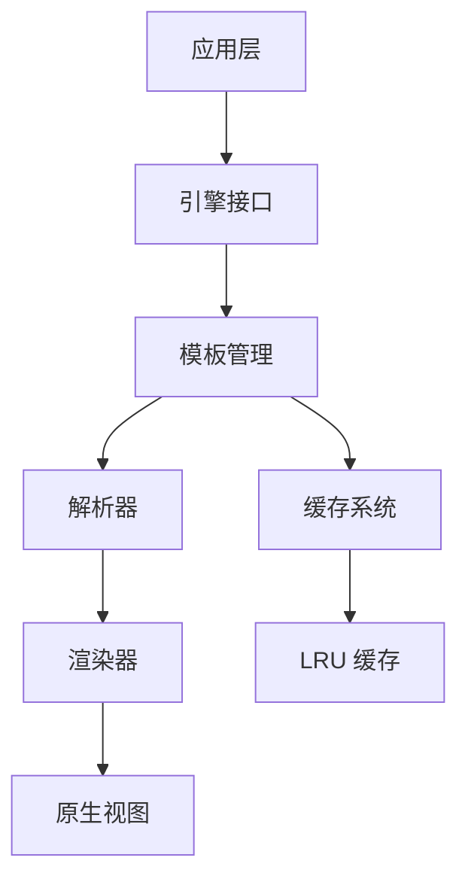
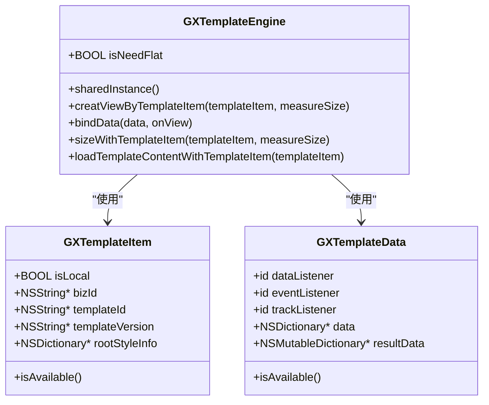
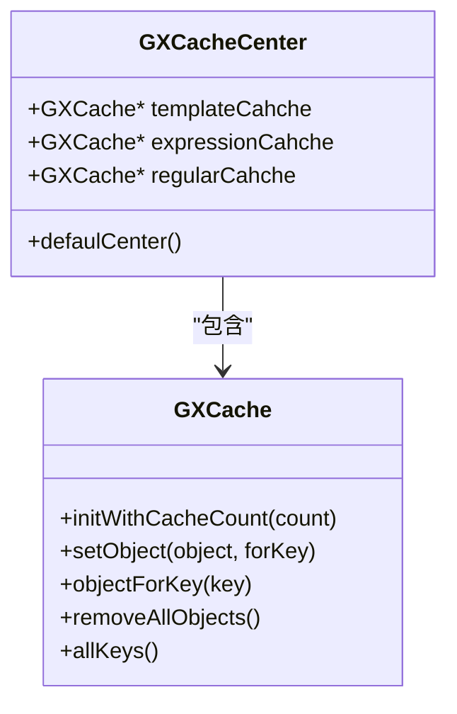
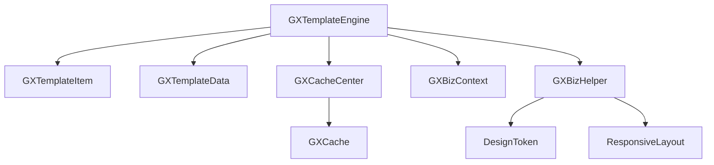

# 模板引擎

<cite>
**本文档引用文件**  
- [GXTemplateEngine.h](file://GaiaXiOS/GaiaXiOS/Engine/GXTemplateEngine.h)
- [GXTemplateItem.h](file://GaiaXiOS/GaiaXiOS/Engine/GXTemplateItem.h)
- [GXTemplateData.h](file://GaiaXiOS/GaiaXiOS/Engine/GXTemplateData.h)
- [GXCacheCenter.h](file://GaiaXiOS/GaiaXiOS/Template/Cache/GXCacheCenter.h)
- [GXCacheCenter.m](file://GaiaXiOS/GaiaXiOS/Template/Cache/GXCacheCenter.m)
- [GXCache.h](file://GaiaXiOS/GaiaXiOS/Template/Cache/GXCache.h)
- [GXBizContext.h](file://GaiaXiOS/GaiaXiOS/Impl/GXBizContext.h)
- [GXBizHelper.h](file://GaiaXiOS/GaiaXiOS/Impl/GXBizHelper.h)
- [GXTemplateLRUCache.ets](file://GaiaXHarmony/GaiaXCore/GaiaX/src/main/ets/template/GXTemplateLRUCache.ets)
- [GXTemplateInfoSource.kt](file://GaiaXAndroid/src/main/kotlin/com/alibaba/gaiax/data/cache/GXTemplateInfoSource.kt)
</cite>

## 目录
1. [简介](#简介)
2. [项目结构](#项目结构)
3. [核心组件](#核心组件)
4. [架构概述](#架构概述)
5. [详细组件分析](#详细组件分析)
6. [依赖分析](#依赖分析)
7. [性能考量](#性能考量)
8. [故障排除指南](#故障排除指南)
9. [结论](#结论)

## 简介
GXTemplateEngine 是 GaiaX 跨平台模板渲染框架在 iOS 平台的核心入口，负责模板的加载、解析、缓存与渲染全生命周期管理。该引擎通过统一的接口抽象，实现了高性能、可扩展的动态化 UI 渲染能力，支持异步加载、线程安全控制、内存优化及热更新机制，广泛应用于阿里巴巴旗下多个移动应用中。

## 项目结构
GaiaX 框架采用多平台统一架构设计，各平台共享核心逻辑，iOS 平台实现位于 `GaiaXiOS` 目录下，主要模块包括：

- **Engine**：核心引擎，包含模板加载、渲染等主流程
- **Template**：模板管理，包含缓存、版本控制等
- **Impl**：业务实现与扩展点
- **Component**：UI 组件实现
- **Binding**：数据绑定与事件处理
- **Utilities**：工具类与辅助方法

**Diagram sources**
- [GXTemplateEngine.h](file://GaiaXiOS/GaiaXiOS/Engine/GXTemplateEngine.h)
- [GXCacheCenter.h](file://GaiaXiOS/GaiaXiOS/Template/Cache/GXCacheCenter.h)

**Section sources**
- [GXTemplateEngine.h](file://GaiaXiOS/GaiaXiOS/Engine/GXTemplateEngine.h)
- [GXTemplateItem.h](file://GaiaXiOS/GaiaXiOS/Engine/GXTemplateItem.h)

## 核心组件

GXTemplateEngine 的核心组件包括模板项（GXTemplateItem）、模板数据（GXTemplateData）和缓存中心（GXCacheCenter），分别负责模板标识、数据绑定和资源管理。

**Section sources**
- [GXTemplateItem.h](file://GaiaXiOS/GaiaXiOS/Engine/GXTemplateItem.h)
- [GXTemplateData.h](file://GaiaXiOS/GaiaXiOS/Engine/GXTemplateData.h)
- [GXCacheCenter.h](file://GaiaXiOS/GaiaXiOS/Template/Cache/GXCacheCenter.h)

## 架构概述

GXTemplateEngine 采用分层架构设计，主要包括以下层级：

**Diagram sources**
- [GXTemplateEngine.h](file://GaiaXiOS/GaiaXiOS/Engine/GXTemplateEngine.h)
- [GXCacheCenter.h](file://GaiaXiOS/GaiaXiOS/Template/Cache/GXCacheCenter.h)

## 详细组件分析

### GXTemplateEngine 分析

GXTemplateEngine 是单例对象，提供模板创建、数据绑定、尺寸计算等核心功能。

#### 主要方法说明：
- `creatViewByTemplateItem:measureSize:`：根据模板项创建视图
- `bindData:onView:`：绑定数据到视图
- `sizeWithTemplateItem:measureSize:`：计算模板实际尺寸
- `loadTemplateContentWithTemplateItem:`：加载模板内容

**Diagram sources**
- [GXTemplateEngine.h](file://GaiaXiOS/GaiaXiOS/Engine/GXTemplateEngine.h)
- [GXTemplateItem.h](file://GaiaXiOS/GaiaXiOS/Engine/GXTemplateItem.h)
- [GXTemplateData.h](file://GaiaXiOS/GaiaXiOS/Engine/GXTemplateData.h)

**Section sources**
- [GXTemplateEngine.h](file://GaiaXiOS/GaiaXiOS/Engine/GXTemplateEngine.h)

### 缓存机制分析

GXTemplateEngine 通过 GXCacheCenter 实现多级缓存管理，包括模板缓存、表达式缓存和正则缓存。

**Diagram sources**
- [GXCacheCenter.h](file://GaiaXiOS/GaiaXiOS/Template/Cache/GXCacheCenter.h)
- [GXCache.h](file://GaiaXiOS/GaiaXiOS/Template/Cache/GXCache.h)

**Section sources**
- [GXCacheCenter.h](file://GaiaXiOS/GaiaXiOS/Template/Cache/GXCacheCenter.h)
- [GXCacheCenter.m](file://GaiaXiOS/GaiaXiOS/Template/Cache/GXCacheCenter.m)

## 依赖分析

GXTemplateEngine 依赖多个内部组件和外部系统，形成完整的渲染链路。

**Diagram sources**
- [GXTemplateEngine.h](file://GaiaXiOS/GaiaXiOS/Engine/GXTemplateEngine.h)
- [GXBizContext.h](file://GaiaXiOS/GaiaXiOS/Impl/GXBizContext.h)
- [GXBizHelper.h](file://GaiaXiOS/GaiaXiOS/Impl/GXBizHelper.h)

**Section sources**
- [GXBizContext.h](file://GaiaXiOS/GaiaXiOS/Impl/GXBizContext.h)
- [GXBizHelper.h](file://GaiaXiOS/GaiaXiOS/Impl/GXBizHelper.h)

## 性能考量

GXTemplateEngine 在性能方面进行了多项优化：

1. **缓存策略**：模板缓存无数量限制，表达式缓存上限200，正则缓存上限50
2. **线程安全**：通过 dispatch_once_t 实现单例安全初始化
3. **内存管理**：使用弱引用避免循环引用，及时释放无用资源
4. **异步加载**：支持异步模板加载，避免主线程阻塞

跨平台缓存机制采用 LRU 策略，通过模板 ID、版本号和业务 ID 构建缓存键，确保缓存唯一性和有效性。

**Section sources**
- [GXCacheCenter.m](file://GaiaXiOS/GaiaXiOS/Template/Cache/GXCacheCenter.m)
- [GXTemplateLRUCache.ets](file://GaiaXHarmony/GaiaXCore/GaiaX/src/main/ets/template/GXTemplateLRUCache.ets)

## 故障排除指南

常见问题及解决方案：

1. **模板加载失败**：检查模板 ID、版本号是否正确，确认模板源注册
2. **数据绑定无效**：确保 GXTemplateData 中 data 字段为有效字典
3. **视图尺寸异常**：检查 measureSize 参数是否合理，确认模板布局定义
4. **缓存未生效**：确认 GXTemplateItem 的标识字段是否完整

调试建议：启用日志输出，检查 GXGlobalCache 等缓存状态，验证模板解析流程。

**Section sources**
- [GXTemplateInfoSource.kt](file://GaiaXAndroid/src/main/kotlin/com/alibaba/gaiax/data/cache/GXTemplateInfoSource.kt)
- [GXCacheCenter.m](file://GaiaXiOS/GaiaXiOS/Template/Cache/GXCacheCenter.m)

## 结论

GXTemplateEngine 作为 GaiaX 框架在 iOS 平台的核心引擎，实现了高效、稳定、可扩展的模板渲染能力。其清晰的架构设计、完善的缓存机制和良好的性能表现，为跨平台动态化 UI 提供了坚实基础。通过统一的接口抽象和多平台一致性实现，有效提升了开发效率和维护性。