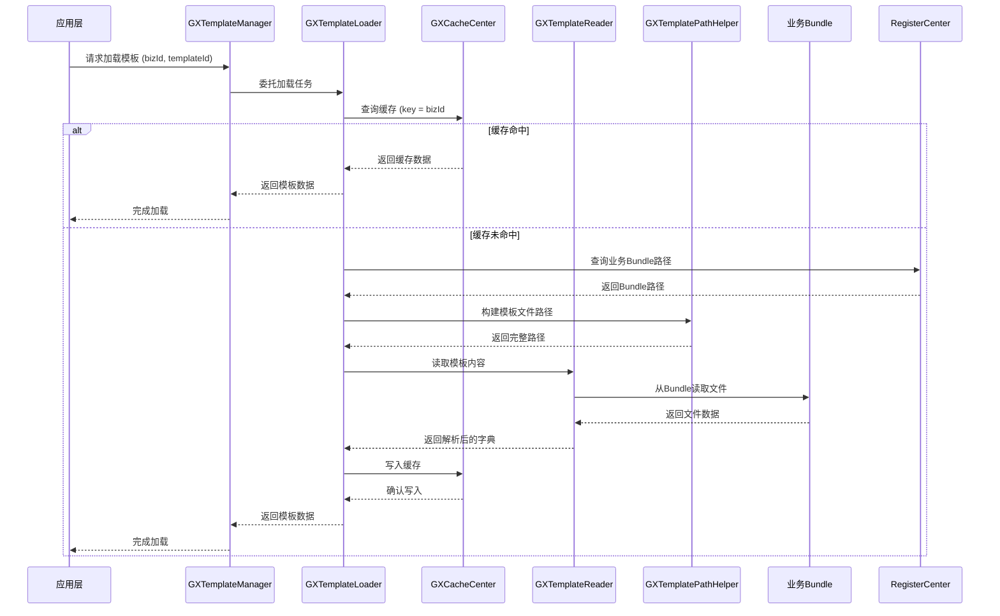
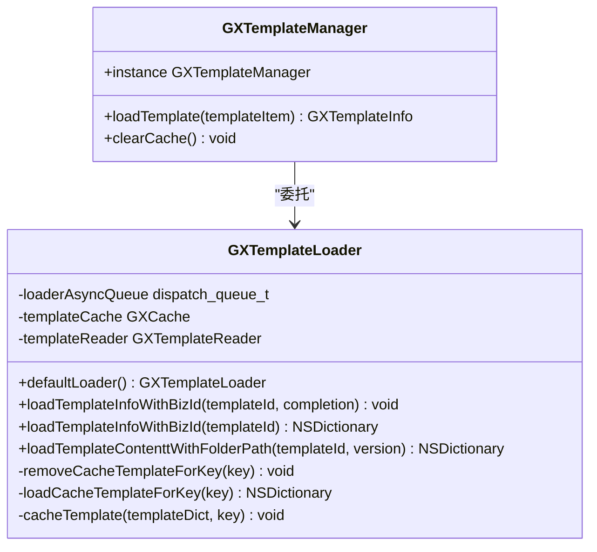

# 加载流程

<cite>
**本文档引用文件**  
- [GXTemplateLoader.m](file://GaiaXiOS/GaiaXiOS/Template/Loader/GXTemplateLoader.m)
- [GXTemplateLoader.h](file://GaiaXiOS/GaiaXiOS/Template/Loader/GXTemplateLoader.h)
- [GXTemplatePathHelper.m](file://GaiaXiOS/GaiaXiOS/Template/Loader/GXTemplatePathHelper.m)
- [GXTemplateReader.m](file://GaiaXiOS/GaiaXiOS/Template/Loader/GXTemplateReader.m)
- [GXTemplateManager.m](file://GaiaXiOS/GaiaXiOS/Template/Loader/GXTemplateManager.m)
- [GXTemplateInfo.h](file://GaiaXiOS/GaiaXiOS/Template/Model/GXTemplateInfo.h)
- [GXCacheCenter.h](file://GaiaXiOS/GaiaXiOS/Utilities/GXCacheCenter.h)
- [GXRegisterCenter.h](file://GaiaXiOS/GaiaXiOS/Core/GXRegisterCenter.h)
</cite>

## 目录
1. [简介](#简介)
2. [项目结构](#项目结构)
3. [核心组件](#核心组件)
4. [架构概览](#架构概览)
5. [详细组件分析](#详细组件分析)
6. [依赖分析](#依赖分析)
7. [性能考量](#性能考量)
8. [故障排查指南](#故障排查指南)
9. [结论](#结论)

## 简介
本文档详细阐述了 GaiaX iOS 模板加载流程的核心机制，重点分析 GXTemplateLoader 与 GXTemplateManager 的协同工作机制。内容涵盖模板资源定位、异步加载策略、网络请求处理、加载状态管理、热更新机制、版本校验与资源完整性验证等关键实现细节。为开发者提供从初学者到高级开发者的完整技术指导。

## 项目结构
GaiaX iOS 项目中的模板加载功能主要集中在 `Template/Loader` 模块中，涉及多个核心类的协作。该模块采用分层设计，职责清晰，便于扩展与维护。

```mermaid
graph TB
subgraph "模板加载模块"
GXTemplateLoader[GXTemplateLoader]
GXTemplateManager[GXTemplateManager]
GXTemplatePathHelper[GXTemplatePathHelper]
GXTemplateReader[GXTemplateReader]
GXCacheCenter[GXCacheCenter]
GXRegisterCenter[GXRegisterCenter]
end
GXTemplateLoader --> GXTemplatePathHelper : "获取路径"
GXTemplateLoader --> GXTemplateReader : "读取内容"
GXTemplateLoader --> GXCacheCenter : "缓存管理"
GXTemplateLoader --> GXRegisterCenter : "业务Bundle查询"
GXTemplateManager --> GXTemplateLoader : "委托加载"
```

**图示来源**
- [GXTemplateLoader.m](file://GaiaXiOS/GaiaXiOS/Template/Loader/GXTemplateLoader.m#L1-L182)
- [GXTemplateManager.m](file://GaiaXiOS/GaiaXiOS/Template/Loader/GXTemplateManager.m)

**本节来源**
- [GXTemplateLoader.m](file://GaiaXiOS/GaiaXiOS/Template/Loader/GXTemplateLoader.m#L1-L182)
- [GXTemplateManager.m](file://GaiaXiOS/GaiaXiOS/Template/Loader/GXTemplateManager.m)

## 核心组件
核心组件包括 `GXTemplateLoader`（加载器）、`GXTemplateManager`（管理器）、`GXTemplatePathHelper`（路径助手）、`GXTemplateReader`（读取器）、`GXCacheCenter`（缓存中心）和 `GXRegisterCenter`（注册中心）。这些组件共同协作，完成模板的定位、加载、缓存和管理。

**本节来源**
- [GXTemplateLoader.m](file://GaiaXiOS/GaiaXiOS/Template/Loader/GXTemplateLoader.m#L1-L182)
- [GXTemplateManager.m](file://GaiaXiOS/GaiaXiOS/Template/Loader/GXTemplateManager.m)

## 架构概览
GaiaX iOS 模板加载采用“管理器-加载器”模式。`GXTemplateManager` 作为高层管理者，负责模板的生命周期和状态管理。`GXTemplateLoader` 作为具体执行者，负责处理加载的细节，包括缓存、路径解析和文件读取。



**图示来源**
- [GXTemplateLoader.m](file://GaiaXiOS/GaiaXiOS/Template/Loader/GXTemplateLoader.m#L108-L181)
- [GXTemplateManager.m](file://GaiaXiOS/GaiaXiOS/Template/Loader/GXTemplateManager.m)

## 详细组件分析

### GXTemplateLoader 分析
`GXTemplateLoader` 是模板加载的核心执行单元，采用单例模式，通过串行队列保证线程安全。

#### 协同工作机制
`GXTemplateLoader` 与 `GXTemplateManager` 通过委托模式协作。`GXTemplateManager` 调用 `GXTemplateLoader` 的接口来执行具体的加载任务，自身则专注于更高层次的逻辑，如模板实例的创建和管理。



**图示来源**
- [GXTemplateLoader.m](file://GaiaXiOS/GaiaXiOS/Template/Loader/GXTemplateLoader.m#L41-L181)
- [GXTemplateLoader.h](file://GaiaXiOS/GaiaXiOS/Template/Loader/GXTemplateLoader.h#L54-L79)

#### 模板资源定位
`GXTemplatePathHelper` 负责根据 `bizId` 和 `templateId` 构建模板文件在 Bundle 中的相对路径。`GXTemplateLoader` 通过 `GXRegisterCenter` 获取业务 Bundle 的路径，再结合 `GXTemplatePathHelper` 生成的相对路径，最终确定模板文件的绝对路径。

#### 异步加载策略
`GXTemplateLoader` 使用名为 `com.gaiax.loader.queue` 的并发队列来执行异步加载任务。`loadTemplateInfoWithBizId:templateId:completion:` 方法将同步加载逻辑封装在 `dispatch_async` 中，避免阻塞主线程。同步方法 `loadTemplateInfoWithBizId:templateId:` 则直接执行加载流程。

#### 网络请求处理
虽然当前代码主要处理本地 Bundle 加载，但 `GXTemplateReader` 的设计为网络请求预留了扩展点。其 `readTemplateContenttWithFolderPath` 方法可以被重写以支持从网络 URL 读取模板内容，结合 `GXTemplateLoader` 的异步机制，可实现完整的网络加载流程。

#### 加载状态管理
加载状态通过缓存和回调机制进行管理。首先检查缓存，命中则直接返回；未命中则触发加载流程，完成后写入缓存并回调通知调用方。`GXTemplateInfo` 对象封装了加载后的模板数据，作为状态的最终表示。

**本节来源**
- [GXTemplateLoader.m](file://GaiaXiOS/GaiaXiOS/Template/Loader/GXTemplateLoader.m#L1-L182)
- [GXTemplatePathHelper.m](file://GaiaXiOS/GaiaXiOS/Template/Loader/GXTemplatePathHelper.m)
- [GXTemplateReader.m](file://GaiaXiOS/GaiaXiOS/Template/Loader/GXTemplateReader.m)
- [GXCacheCenter.h](file://GaiaXiOS/GaiaXiOS/Utilities/GXCacheCenter.h)

### 模板热更新与版本校验
#### 触发条件
模板热更新通常由以下条件触发：
1.  **版本号变更**：服务器下发的模板版本号高于本地缓存版本。
2.  **强制刷新指令**：接收到特定的刷新命令。
3.  **定时轮询**：达到预设的检查周期。

#### 版本校验流程
1.  **请求版本信息**：客户端向服务端请求特定 `bizId` 和 `templateId` 的最新版本号。
2.  **比较版本**：将服务端返回的版本号与本地缓存或 Bundle 中的版本号进行比较。
3.  **决定是否更新**：若服务端版本更高，则发起完整模板内容的下载请求。

#### 资源完整性验证
在下载模板内容后，应进行完整性校验：
1.  **校验和验证**：服务端提供模板内容的 MD5 或 SHA256 校验和，客户端下载后计算并比对。
2.  **JSON 解析验证**：尝试解析下载的 JSON 数据，确保其结构完整、无语法错误。
3.  **关键字段检查**：验证 `index.json` 中的 `id`、`uid` 等关键字段是否存在且有效。

**本节来源**
- [GXTemplateLoader.m](file://GaiaXiOS/GaiaXiOS/Template/Loader/GXTemplateLoader.m#L131-L134)
- [GXTemplateReader.m](file://GaiaXiOS/GaiaXiOS/Template/Loader/GXTemplateReader.m)

## 依赖分析
模板加载模块依赖于多个核心服务。

```mermaid
graph TD
GXTemplateLoader --> GXCacheCenter : "依赖"
GXTemplateLoader --> GXRegisterCenter : "依赖"
GXTemplateLoader --> GXTemplateReader : "依赖"
GXTemplateReader --> GXTemplatePathHelper : "依赖"
GXTemplateManager --> GXTemplateLoader : "依赖"
```

**图示来源**
- [GXTemplateLoader.m](file://GaiaXiOS/GaiaXiOS/Template/Loader/GXTemplateLoader.m#L19-L25)
- [GXTemplateManager.m](file://GaiaXiOS/GaiaXiOS/Template/Loader/GXTemplateManager.m)

**本节来源**
- [GXTemplateLoader.m](file://GaiaXiOS/GaiaXiOS/Template/Loader/GXTemplateLoader.m#L1-L182)
- [GXTemplateManager.m](file://GaiaXiOS/GaiaXiOS/Template/Loader/GXTemplateManager.m)

## 性能考量
- **缓存策略**：`GXTemplateLoader` 利用 `GXCacheCenter` 进行内存缓存，显著减少重复的磁盘 I/O 操作。
- **异步加载**：所有耗时操作均在后台队列执行，确保 UI 线程流畅。
- **单例模式**：`GXTemplateLoader` 和 `GXTemplateManager` 均为单例，避免了对象的重复创建和销毁开销。
- **路径缓存**：`GXRegisterCenter` 可能缓存了业务 Bundle 的路径，减少重复查询。

## 故障排查指南
- **模板加载失败**：检查 `bizId` 是否正确注册，`templateId` 对应的文件是否存在于 Bundle 中。
- **缓存未生效**：确认 `GXCacheCenter` 的 `templateCahche` 对象是否正确初始化。
-   **异步回调不执行**：检查 `completion` 回调是否为 `nil`，并确保 `loaderAsyncQueue` 已正确创建。
-   **路径错误**：验证 `GXTemplatePathHelper` 生成的路径格式是否符合 Bundle 内文件的实际存放结构。

**本节来源**
- [GXTemplateLoader.m](file://GaiaXiOS/GaiaXiOS/Template/Loader/GXTemplateLoader.m#L111-L114)
- [GXTemplateLoader.m](file://GaiaXiOS/GaiaXiOS/Template/Loader/GXTemplateLoader.m#L143-L145)

## 结论
GaiaX iOS 的模板加载流程设计精巧，通过 `GXTemplateLoader` 和 `GXTemplateManager` 的清晰分工，实现了高效、稳定和可扩展的模板加载机制。其内置的缓存、异步和路径管理策略，为高性能的动态化界面渲染提供了坚实的基础。开发者应充分理解其工作原理，以便在实际项目中正确使用并进行必要的定制和优化。