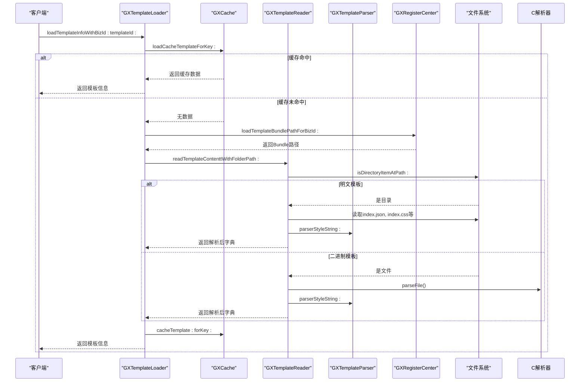
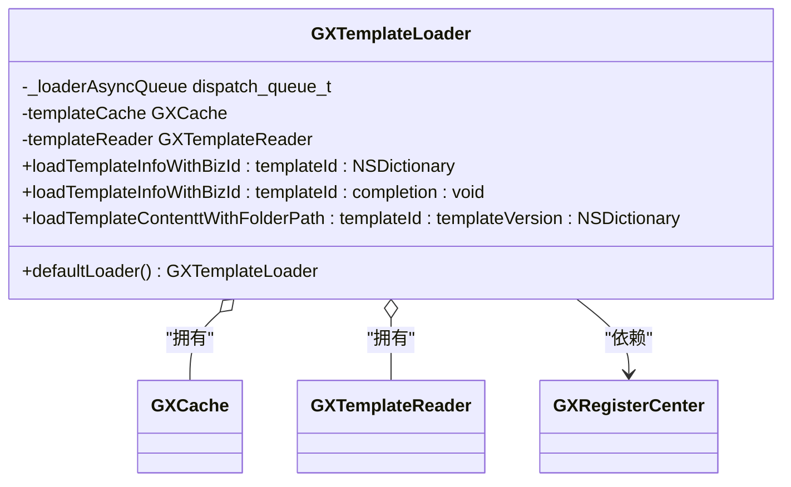
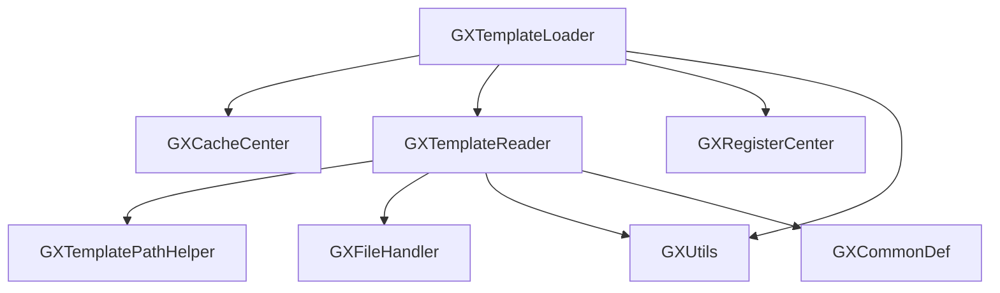

# 模板加载

<cite>
**本文档引用文件**  
- [GXTemplateLoader.m](file://GaiaXiOS/GaiaXiOS/Template/Loader/GXTemplateLoader.m)
- [GXTemplateReader.m](file://GaiaXiOS/GaiaXiOS/Template/Loader/GXTemplateReader.m)
- [GXTemplatePathHelper.h](file://GaiaXiOS/GaiaXiOS/Template/Loader/GXTemplatePathHelper.h)
- [GXRegisterCenter.h](file://GaiaXiOS/GaiaXiOS/Core/Register/GXRegisterCenter.h)
- [GXCacheCenter.m](file://GaiaXiOS/GaiaXiOS/Template/Cache/GXCacheCenter.m)
- [GXCache.m](file://GaiaXiOS/GaiaXiOS/Template/Cache/GXCache.m)
- [GXUtils.h](file://GaiaXiOS/GaiaXiOS/Utilities/GXUtils.h)
- [GXFileHandler.h](file://GaiaXiOS/GaiaXiOS/Utilities/GXFileHandler.h)
- [GXCommonDef.h](file://GaiaXiOS/GaiaXiOS/Macro/GXCommonDef.h)
</cite>

## 目录
1. [简介](#简介)
2. [项目结构](#项目结构)
3. [核心组件](#核心组件)
4. [架构概述](#架构概述)
5. [详细组件分析](#详细组件分析)
6. [依赖分析](#依赖分析)
7. [性能考量](#性能考量)
8. [故障排查指南](#故障排查指南)
9. [结论](#结论)

## 简介
本文档深入解析 GaiaX iOS 模板加载机制，重点阐述 GXTemplateLoader 与 GXTemplateManager 的协同工作流程。详细说明模板解析（GXTemplateParser）、缓存管理（GXCache/GXCacheCenter）和资源定位的实现细节。为初学者提供模板加载的完整流程示例；为高级开发者分析异步加载策略、缓存失效机制和网络优化技巧。同时涵盖模板版本管理、热更新策略和错误恢复机制的实现方案。

## 项目结构
GaiaX iOS 项目采用模块化设计，模板加载相关功能集中于 `Template` 模块下的 `Loader`、`Cache` 和 `Parser` 子模块。核心类包括 GXTemplateLoader、GXTemplateReader、GXTemplateParser、GXCacheCenter 和 GXRegisterCenter，分别负责加载调度、文件读取、内容解析、缓存管理和路径注册。

```mermaid
graph TB
subgraph "模板加载模块"
GXTemplateLoader["GXTemplateLoader (加载调度器)"]
GXTemplateReader["GXTemplateReader (文件读取器)"]
GXTemplateParser["GXTemplateParser (内容解析器)"]
GXCacheCenter["GXCacheCenter (缓存中心)"]
GXRegisterCenter["GXRegisterCenter (注册中心)"]
end
GXTemplateLoader --> GXTemplateReader : "委托读取"
GXTemplateReader --> GXTemplateParser : "委托解析"
GXTemplateLoader --> GXCacheCenter : "读写缓存"
GXTemplateLoader --> GXRegisterCenter : "获取Bundle路径"
GXTemplateReader --> GXFileHandler : "文件存在性检查"
```

**图示来源**
- [GXTemplateLoader.m](file://GaiaXiOS/GaiaXiOS/Template/Loader/GXTemplateLoader.m#L19-L37)
- [GXTemplateReader.m](file://GaiaXiOS/GaiaXiOS/Template/Loader/GXTemplateReader.m#L19-L27)
- [GXRegisterCenter.h](file://GaiaXiOS/GaiaXiOS/Core/Register/GXRegisterCenter.h)

**本节来源**
- [GXTemplateLoader.m](file://GaiaXiOS/GaiaXiOS/Template/Loader/GXTemplateLoader.m#L1-L182)
- [GXTemplateReader.m](file://GaiaXiOS/GaiaXiOS/Template/Loader/GXTemplateReader.m#L1-L250)

## 核心组件
核心组件包括 GXTemplateLoader、GXTemplateReader、GXCacheCenter 和 GXRegisterCenter。GXTemplateLoader 是模板加载的入口，负责协调缓存、读取和异步调度。GXTemplateReader 负责根据路径读取模板文件，区分明文和二进制格式。GXCacheCenter 提供统一的缓存服务，GXTemplateLoader 通过其 templateCache 属性访问模板缓存。GXRegisterCenter 则负责管理业务ID到Bundle路径的映射。

**本节来源**
- [GXTemplateLoader.m](file://GaiaXiOS/GaiaXiOS/Template/Loader/GXTemplateLoader.m#L41-L181)
- [GXTemplateReader.m](file://GaiaXiOS/GaiaXiOS/Template/Loader/GXTemplateReader.m#L27-L249)
- [GXCacheCenter.m](file://GaiaXiOS/GaiaXiOS/Template/Cache/GXCacheCenter.m)
- [GXRegisterCenter.h](file://GaiaXiOS/GaiaXiOS/Core/Register/GXRegisterCenter.h)

## 架构概述
GaiaX 模板加载采用分层架构，从上至下分为加载层、读取层、解析层和资源层。GXTemplateLoader 位于加载层，是客户端调用的直接接口。它首先检查缓存（GXCache），若命中则直接返回；未命中则通过 GXRegisterCenter 定位模板Bundle路径，并委托 GXTemplateReader 进行读取。GXTemplateReader 根据文件后缀判断是明文还是二进制模板，调用相应方法读取文件内容，并最终由 GXTemplateParser 解析成内存中的数据结构。



**图示来源**
- [GXTemplateLoader.m](file://GaiaXiOS/GaiaXiOS/Template/Loader/GXTemplateLoader.m#L108-L137)
- [GXTemplateReader.m](file://GaiaXiOS/GaiaXiOS/Template/Loader/GXTemplateReader.m#L29-L47)
- [GXUtils.h](file://GaiaXiOS/GaiaXiOS/Utilities/GXUtils.h)

## 详细组件分析

### GXTemplateLoader 分析
GXTemplateLoader 是模板加载的核心调度器，采用单例模式（`+defaultLoader`）确保全局唯一实例。它内部维护一个并发队列（`_loaderAsyncQueue`）用于异步加载，避免阻塞主线程。其主要职责是协调缓存、读取和路径注册。

#### 初始化与单例


**图示来源**
- [GXTemplateLoader.m](file://GaiaXiOS/GaiaXiOS/Template/Loader/GXTemplateLoader.m#L43-L58)

#### 同步加载流程
同步加载方法 `loadTemplateInfoWithBizId:templateId:` 遵循“缓存优先”原则：
1.  **参数校验**：检查 bizId 和 templateId 是否有效。
2.  **缓存查询**：使用 `bizId#templateId` 作为键查询 `templateCache`。
3.  **路径定位**：若缓存未命中，通过 `TheGXRegisterCenter` 获取业务Bundle路径。
4.  **委托读取**：调用 `templateReader` 的 `readTemplateContenttWithFolderPath:` 方法读取模板。
5.  **缓存写入**：将读取结果写入缓存，即使为空也写入空字典以防止重复加载失败。

**本节来源**
- [GXTemplateLoader.m](file://GaiaXiOS/GaiaXiOS/Template/Loader/GXTemplateLoader.m#L108-L137)

#### 异步加载策略
异步加载通过 `loadTemplateInfoWithBizId:templateId:completion:` 实现，利用 GCD 将同步加载操作提交到 `dispatch_queue_create(kGXTemplateLoaderAsyncQueue, DISPATCH_QUEUE_CONCURRENT)` 队列中执行，确保不会阻塞UI线程。这是高级开发者优化用户体验的关键点。

**本节来源**
- [GXTemplateLoader.m](file://GaiaXiOS/GaiaXiOS/Template/Loader/GXTemplateLoader.m#L139-L157)

### GXTemplateReader 分析
GXTemplateReader 是文件读取的执行者，负责处理明文和二进制两种模板格式。

#### 文件格式判断
通过 `GXFileHandler` 的 `isDirectoryItemAtPath:` 方法判断目标路径是目录（明文模板）还是文件（二进制模板），从而决定后续的读取逻辑。

#### 明文模板读取
对于明文模板，GXTemplateReader 会：
1.  使用 `GXTemplatePathHelper` 构建 `index.json`、`index.css`、`index.js` 和 `index.databinding` 的完整路径。
2.  依次读取这些文件的内容。
3.  调用 `GXUtils` 的 `parserStyleString:` 方法将CSS字符串解析为字典。
4.  将所有内容组装成一个包含 `kGXComDef_KW_VH` (视图层级)、`kGXComDef_KW_SY` (样式)、`kGXComDef_KW_JS` (JS) 和 `kGXComDef_KW_DB` (绑定) 键的字典。

#### 二进制模板读取
对于二进制模板，它调用C函数 `parseFile` 解析 `.gaiax` 文件，该函数将二进制包内的所有文件（如 index.json, index.css）解压到内存中，后续的解析流程与明文模板一致。

**本节来源**
- [GXTemplateReader.m](file://GaiaXiOS/GaiaXiOS/Template/Loader/GXTemplateReader.m#L29-L190)

## 依赖分析
GXTemplateLoader 的依赖关系清晰，体现了高内聚低耦合的设计原则。



**图示来源**
- [GXTemplateLoader.m](file://GaiaXiOS/GaiaXiOS/Template/Loader/GXTemplateLoader.m#L19-L25)
- [GXTemplateReader.m](file://GaiaXiOS/GaiaXiOS/Template/Loader/GXTemplateReader.m#L19-L23)

**本节来源**
- [GXTemplateLoader.m](file://GaiaXiOS/GaiaXiOS/Template/Loader/GXTemplateLoader.m#L19-L25)
- [GXTemplateReader.m](file://GaiaXiOS/GaiaXiOS/Template/Loader/GXTemplateReader.m#L19-L23)

## 性能考量
-   **异步加载**：所有耗时的I/O操作（文件读取、解析）都在后台队列执行，保证了UI流畅性。
-   **缓存机制**：`GXCacheCenter` 提供了内存缓存，显著减少了重复加载的开销。缓存键的设计（`bizId#templateId`）确保了唯一性。
-   **二进制优化**：二进制模板（.gaiax）将多个文件打包，减少了文件系统I/O次数，加载速度更快。
-   **懒加载**：`templateCache` 和 `templateReader` 属性采用懒加载模式，只有在首次使用时才初始化，节省了启动资源。

## 故障排查指南
-   **模板加载失败**：首先检查 `bizId` 是否正确注册到 `GXRegisterCenter`。其次确认Bundle路径下是否存在对应的模板文件夹或 `.gaiax` 文件。
-   **样式不生效**：检查 `index.css` 文件内容是否符合规范，`GXUtils parserStyleString:` 方法会将其解析为字典，任何语法错误都可能导致解析失败。
-   **缓存未生效**：确认 `GXCacheCenter` 是否正常工作，检查 `cacheKey` 的生成逻辑是否正确。
-   **版本号未更新**：在调用 `readTemplateContenttWithFolderPath:` 时，需传入 `templateVersion` 参数，该参数会被写入返回字典的 `"version"` 键中。

**本节来源**
- [GXTemplateLoader.m](file://GaiaXiOS/GaiaXiOS/Template/Loader/GXTemplateLoader.m#L124-L128)
- [GXTemplateReader.m](file://GaiaXiOS/GaiaXiOS/Template/Loader/GXTemplateReader.m#L89-L90)
- [GXTemplateReader.m](file://GaiaXiOS/GaiaXiOS/Template/Loader/GXTemplateReader.m#L145-L146)

## 结论
GaiaX iOS 的模板加载机制设计精巧，通过 GXTemplateLoader、GXTemplateReader、GXCacheCenter 等组件的协同工作，实现了高效、稳定、可扩展的模板加载流程。其“缓存优先、异步加载、格式兼容”的设计原则，为开发者提供了强大的功能和良好的性能保障。理解其内部工作原理，有助于更好地进行性能优化和问题排查。