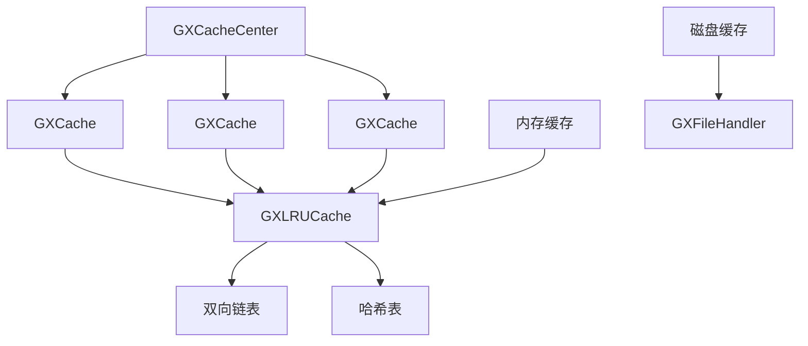
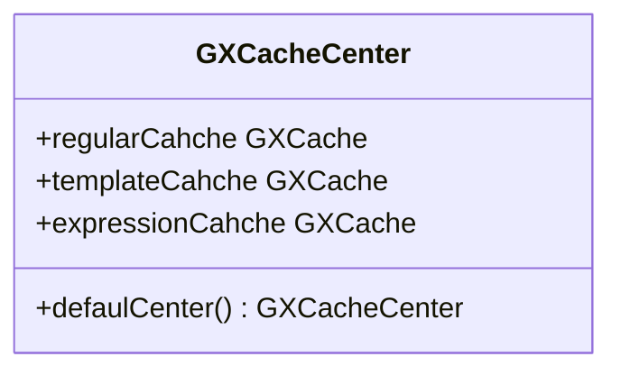
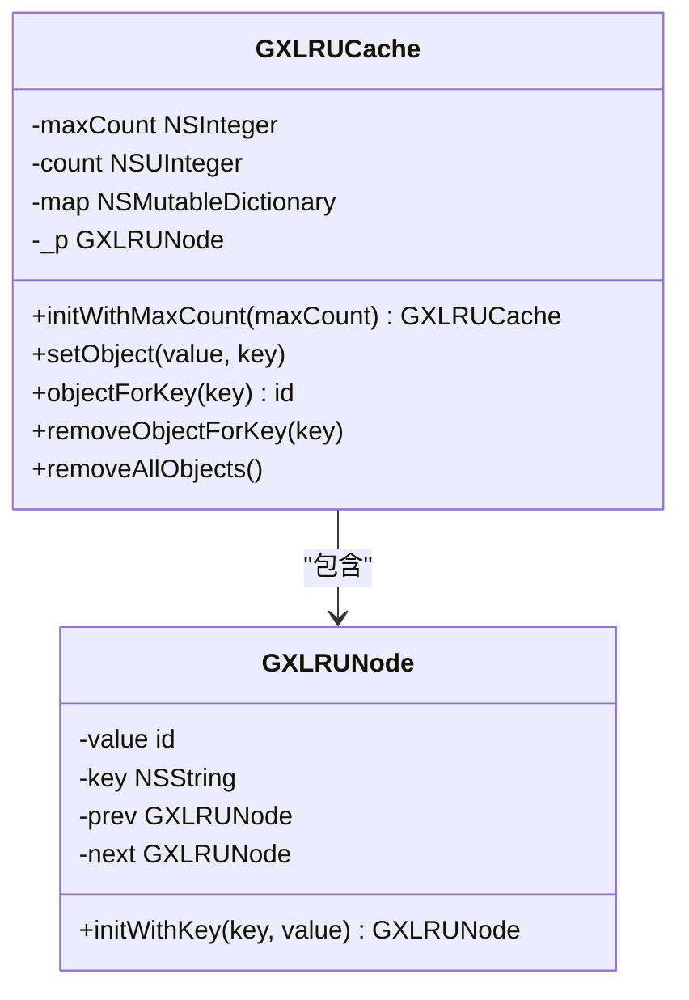
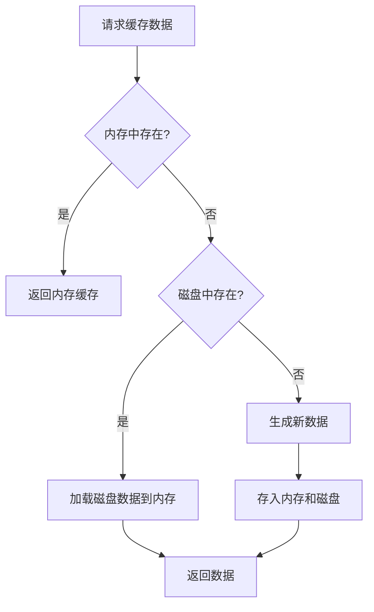

# 缓存策略

<cite>
**本文档引用的文件**
- [GXCacheCenter.h](file://GaiaXiOS/GaiaXiOS/Template/Cache/GXCacheCenter.h)
- [GXCacheCenter.m](file://GaiaXiOS/GaiaXiOS/Template/Cache/GXCacheCenter.m)
- [GXLRUCache.h](file://GaiaXiOS/GaiaXiOS/Template/Cache/GXLRUCache.h)
- [GXLRUCache.m](file://GaiaXiOS/GaiaXiOS/Template/Cache/GXLRUCache.m)
- [GXCache.h](file://GaiaXiOS/GaiaXiOS/Template/Cache/GXCache.h)
- [GXCache.m](file://GaiaXiOS/GaiaXiOS/Template/Cache/GXCache.m)
- [GXFileHandler.h](file://GaiaXiOS/GaiaXiOS/Utilities/FileHandler/GXFileHandler.h)
- [GXFileHandler.m](file://GaiaXiOS/GaiaXiOS/Utilities/FileHandler/GXFileHandler.m)
</cite>

## 目录
1. [简介](#简介)
2. [核心组件](#核心组件)
3. [缓存架构概述](#缓存架构概述)
4. [详细组件分析](#详细组件分析)
5. [分级存储机制](#分级存储机制)
6. [缓存键生成与失效规则](#缓存键生成与失效规则)
7. [缓存配置与监控指南](#缓存配置与监控指南)
8. [高级主题](#高级主题)
9. [结论](#结论)

## 简介
GaiaX iOS模板引擎通过GXCacheCenter和GXLRUCache实现了高效的缓存管理机制。该系统采用内存与磁盘的分级存储策略，结合LRU淘汰算法，确保模板、表达式和正则等资源的快速访问与合理存储。本文档详细阐述了缓存系统的实现原理，为不同层次的开发者提供配置、监控和优化的实用指南。

## 核心组件

GXCacheCenter作为缓存管理的中心枢纽，提供模板、表达式和正则三种专用缓存实例。GXLRUCache是底层的缓存淘汰算法实现，基于双向链表和哈希表构建，确保了O(1)时间复杂度的存取和淘汰操作。GXCache封装了GXLRUCache，并添加了线程安全的互斥锁，为上层应用提供安全的缓存接口。

**本文档引用的文件**
- [GXCacheCenter.h](file://GaiaXiOS/GaiaXiOS/Template/Cache/GXCacheCenter.h)
- [GXLRUCache.h](file://GaiaXiOS/GaiaXiOS/Template/Cache/GXLRUCache.h)
- [GXCache.h](file://GaiaXiOS/GaiaXiOS/Template/Cache/GXCache.h)

## 缓存架构概述

**Diagram sources**
- [GXCacheCenter.h](file://GaiaXiOS/GaiaXiOS/Template/Cache/GXCacheCenter.h#L24-L37)
- [GXLRUCache.h](file://GaiaXiOS/GaiaXiOS/Template/Cache/GXLRUCache.h#L35-L60)
- [GXFileHandler.h](file://GaiaXiOS/GaiaXiOS/Utilities/FileHandler/GXFileHandler.h#L23-L42)

## 详细组件分析

### GXCacheCenter 统一缓存管理

GXCacheCenter采用单例模式，为整个应用提供统一的缓存访问入口。它通过属性暴露三种缓存实例，实现了缓存资源的集中管理和配置。

**Diagram sources**
- [GXCacheCenter.h](file://GaiaXiOS/GaiaXiOS/Template/Cache/GXCacheCenter.h#L24-L37)
- [GXCacheCenter.m](file://GaiaXiOS/GaiaXiOS/Template/Cache/GXCacheCenter.m#L23-L55)

### GXLRUCache 淘汰算法实现

GXLRUCache实现了经典的LRU（Least Recently Used）缓存淘汰算法。其核心是一个双向链表和一个哈希表。链表头部为最近使用节点，尾部为最久未使用节点。当缓存满时，自动移除尾部节点。

**Diagram sources**
- [GXLRUCache.h](file://GaiaXiOS/GaiaXiOS/Template/Cache/GXLRUCache.h#L35-L60)
- [GXLRUCache.m](file://GaiaXiOS/GaiaXiOS/Template/Cache/GXLRUCache.m#L46-L209)

## 分级存储机制

GaiaX的缓存系统采用内存与磁盘的分级存储策略。内存缓存由GXLRUCache实现，提供极快的访问速度。对于需要持久化的数据，系统通过GXFileHandler提供的路径管理，将数据写入磁盘的Caches或Documents目录。

**Diagram sources**
- [GXCache.m](file://GaiaXiOS/GaiaXiOS/Template/Cache/GXCache.m#L57-L77)
- [GXFileHandler.m](file://GaiaXiOS/GaiaXiOS/Utilities/FileHandler/GXFileHandler.m#L29-L98)

## 缓存键生成与失效规则

缓存键的生成遵循特定的命名规范，通常结合业务ID、模板ID和尺寸等信息。缓存失效主要通过两种机制：一是基于LRU算法的自动淘汰，当缓存数量超过预设阈值时触发；二是手动清除，通过调用`removeObjectForKey:`或`removeAllObjects`方法。

**本文档引用的文件**
- [GXCacheCenter.m](file://GaiaXiOS/GaiaXiOS/Template/Cache/GXCacheCenter.m#L32-L53)
- [GXLRUCache.m](file://GaiaXiOS/GaiaXiOS/Template/Cache/GXLRUCache.m#L79-L83)

## 缓存配置与监控指南

对于初学者，可以通过GXCacheCenter的单例获取缓存实例，并使用标准的`setObject:forKey:`和`objectForKey:`方法进行数据存取。建议定期监控缓存的`count`属性，以了解缓存使用情况。对于表达式缓存，其默认容量为200，可根据实际需求调整。

**本文档引用的文件**
- [GXCacheCenter.h](file://GaiaXiOS/GaiaXiOS/Template/Cache/GXCacheCenter.h#L29-L36)
- [GXCache.h](file://GaiaXiOS/GaiaXiOS/Template/Cache/GXCache.h#L26-L35)

## 高级主题

### 缓存一致性维护
在多线程环境下，GXCache通过`pthread_mutex_t`互斥锁保证了缓存操作的原子性，有效维护了缓存一致性。

### 多线程访问控制
所有对GXLRUCache的访问都通过GXCache的互斥锁进行同步，确保了在并发场景下的线程安全。

### 存储空间优化
通过为不同类型的缓存设置不同的容量限制（如表达式缓存200，正则缓存50），实现了存储空间的精细化管理。

### 缓存预加载与增量更新
系统可在应用启动时预加载常用模板，减少首次渲染延迟。增量更新机制允许只更新缓存中的部分数据，提高效率。

### 缓存加密存储
对于敏感数据，可结合GXFileHandler的路径管理，在写入磁盘前进行加密处理，确保数据安全。

**本文档引用的文件**
- [GXCache.m](file://GaiaXiOS/GaiaXiOS/Template/Cache/GXCache.m#L26-L27)
- [GXFileHandler.h](file://GaiaXiOS/GaiaXiOS/Utilities/FileHandler/GXFileHandler.h#L26-L39)

## 结论
GaiaX iOS的缓存策略通过GXCacheCenter和GXLRUCache的协同工作，构建了一个高效、稳定且可扩展的缓存系统。该系统不仅满足了模板渲染的性能需求，还为开发者提供了灵活的配置和监控能力。通过深入理解其分级存储、键值管理和淘汰算法，开发者可以更好地优化应用性能，提升用户体验。