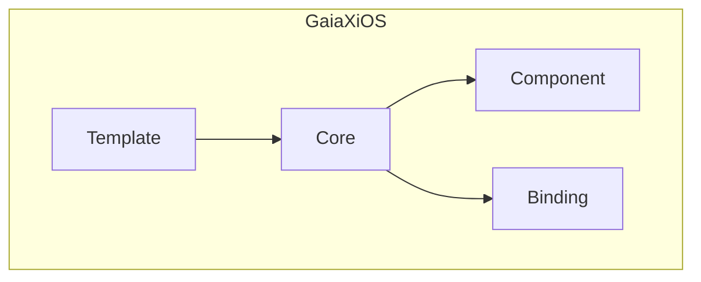
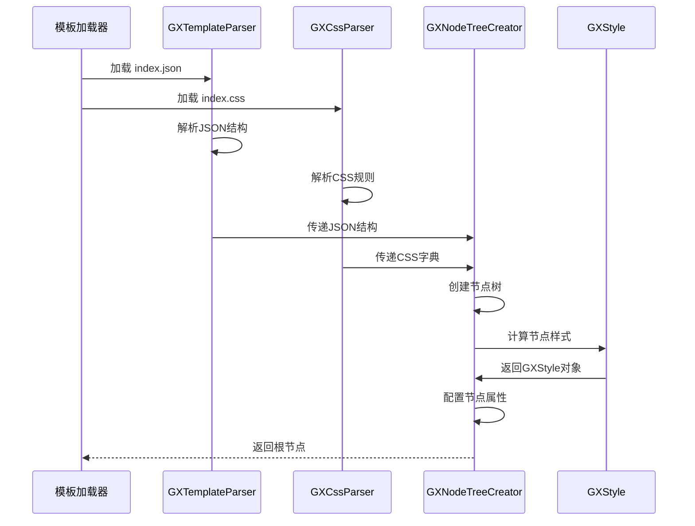
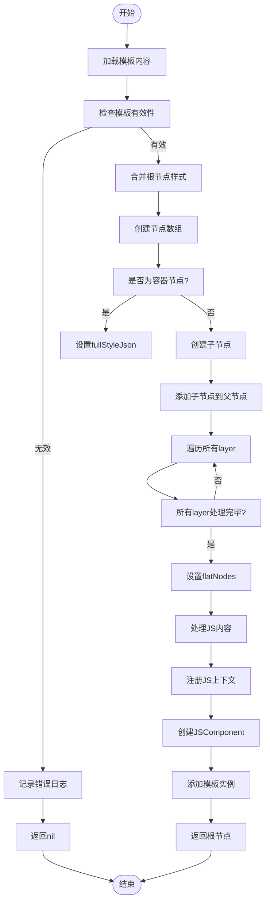
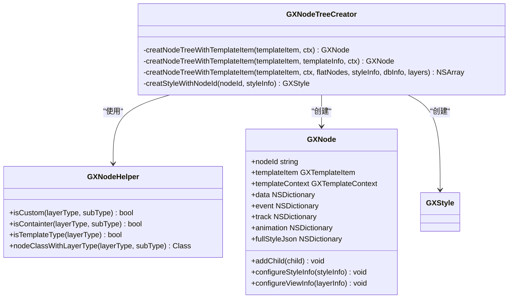
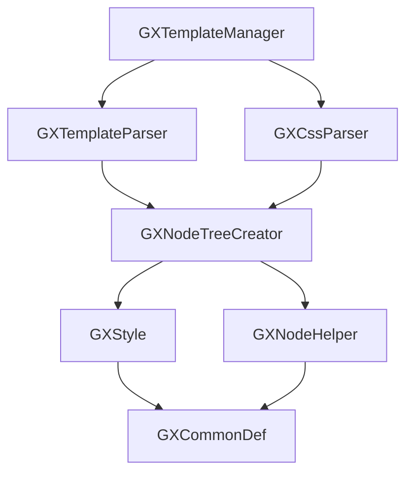

# 解析机制

<cite>
**本文档引用的文件**
- [GXCssParser.h](file://GaiaXiOS/GaiaXiOS/Template/CssParser/GXCssParser.h)
- [GXCssParser.m](file://GaiaXiOS/GaiaXiOS/Template/CssParser/GXCssParser.m)
- [GXNodeTreeCreator.h](file://GaiaXiOS/GaiaXiOS/Core/Creator/GXNodeTreeCreator.h)
- [GXNodeTreeCreator.m](file://GaiaXiOS/GaiaXiOS/Core/Creator/GXNodeTreeCreator.m)
- [GXTemplateManager.h](file://GaiaXiOS/GaiaXiOS/Template/GXTemplateManager.h)
- [GXTemplateManager.m](file://GaiaXiOS/GaiaXiOS/Template/GXTemplateManager.m)
- [GXStyle.h](file://GaiaXiOS/GaiaXiOS/Core/Style/GXStyle.h)
- [GXStyle.m](file://GaiaXiOS/GaiaXiOS/Core/Style/GXStyle.m)
- [GXNodeHelper.h](file://GaiaXiOS/GaiaXiOS/Core/Creator/GXNodeHelper.h)
- [GXNodeHelper.m](file://GaiaXiOS/GaiaXiOS/Core/Creator/GXNodeHelper.m)
- [GXCommonDef.h](file://GaiaXiOS/GaiaXiOS/Macro/GXCommonDef.h)
</cite>

## 目录
1. [简介](#简介)
2. [项目结构](#项目结构)
3. [核心组件](#核心组件)
4. [架构概述](#架构概述)
5. [详细组件分析](#详细组件分析)
6. [依赖分析](#依赖分析)
7. [性能考虑](#性能考虑)
8. [故障排除指南](#故障排除指南)
9. [结论](#结论)

## 简介
本文档深入解析 GaiaX iOS 模板引擎的解析机制，重点阐述 GXTemplateParser 的 JSON 模板解析流程与 GXCssParser 的 CSS 样式处理逻辑。内容涵盖模板结构转换、样式继承计算、表达式分析及节点树构建等核心实现细节。为初学者提供模板语法解析的逐步演示；为高级开发者分析解析性能优化、内存管理策略和异常语法处理机制。同时包含 CSS 兼容性处理、自定义属性解析和动态样式计算的实现方案。

## 项目结构
GaiaX iOS 项目采用模块化设计，核心解析功能集中在 `Template` 和 `Core` 模块中。`Template` 模块负责模板的加载与预处理，`Core` 模块负责节点树的创建与样式应用。



**图源**
- [GXNodeTreeCreator.h](file://GaiaXiOS/GaiaXiOS/Core/Creator/GXNodeTreeCreator.h#L1-L45)
- [GXCssParser.h](file://GaiaXiOS/GaiaXiOS/Template/CssParser/GXCssParser.h#L1-L30)

**本节来源**
- [GXNodeTreeCreator.h](file://GaiaXiOS/GaiaXiOS/Core/Creator/GXNodeTreeCreator.h#L1-L45)
- [GXCssParser.h](file://GaiaXiOS/GaiaXiOS/Template/CssParser/GXCssParser.h#L1-L30)

## 核心组件
核心组件包括 `GXTemplateParser`（负责 JSON 模板解析）、`GXCssParser`（负责 CSS 样式解析）、`GXNodeTreeCreator`（负责节点树构建）和 `GXStyle`（负责样式计算与应用）。这些组件协同工作，将原始的 JSON 和 CSS 模板文件转换为可渲染的视图节点树。

**本节来源**
- [GXNodeTreeCreator.m](file://GaiaXiOS/GaiaXiOS/Core/Creator/GXNodeTreeCreator.m#L1-L280)
- [GXCssParser.m](file://GaiaXiOS/GaiaXiOS/Template/CssParser/GXCssParser.m#L1-L340)

## 架构概述
GaiaX 模板解析流程遵循典型的编译器架构，分为加载、解析、构建和应用四个阶段。首先加载模板文件，然后分别解析 JSON 结构和 CSS 样式，接着构建节点树并计算最终样式，最后将样式应用到视图节点。



**图源**
- [GXNodeTreeCreator.m](file://GaiaXiOS/GaiaXiOS/Core/Creator/GXNodeTreeCreator.m#L49-L74)
- [GXCssParser.m](file://GaiaXiOS/GaiaXiOS/Template/CssParser/GXCssParser.m#L69-L115)

## 详细组件分析
本节深入分析模板解析的核心组件，包括 CSS 解析器、节点树构建器和样式计算引擎。

### GXCssParser 分析
`GXCssParser` 是一个基于状态机的 CSS 解析器，负责将 CSS 字符串转换为字典结构。

#### CSS 解析状态机

```mermaid
stateDiagram-v2
[*] --> GXCssStateSelector
GXCssStateSelector --> GXCssStatePropertyName : '{'
GXCssStatePropertyName --> GXCssStatePropertyValue : ' : '
GXCssStatePropertyValue --> GXCssStatePropertyName : ';'
GXCssStatePropertyValue --> GXCssStateSelector : '}'
GXCssStatePropertyName --> GXCssStateSelector : '}'
GXCssStatePropertyValue --> GXCssStateSingleQuotes : '\''
GXCssStatePropertyValue --> GXCssStateDoubleQuotes : '"'
GXCssStatePropertyValue --> GXCssStateInsideBraces : '('
GXCssStateSingleQuotes --> GXCssStatePropertyValue : '\''
GXCssStateDoubleQuotes --> GXCssStatePropertyValue : '"'
GXCssStateInsideBraces --> GXCssStatePropertyValue : ')'
GXCssStateSelector --> GXCssStateComment : '/*'
GXCssStateComment --> GXCssStateSelector : '*/'
```


**图源**
- [GXCssParser.m](file://GaiaXiOS/GaiaXiOS/Template/CssParser/GXCssParser.m#L21-L29)

#### CSS 解析流程
```mermaid
flowchart TD
Start([开始]) --> CheckInput["检查输入有效性"]
CheckInput --> |无效| ReturnNil["返回 nil"]
CheckInput --> |有效| ReplaceNewLine["替换换行为空格"]
ReplaceNewLine --> InitState["初始化状态机"]
InitState --> Loop["遍历字符"]
Loop --> Selector["GXCssStateSelector"]
Loop --> PropertyName["GXCssStatePropertyName"]
Loop --> PropertyValue["GXCssStatePropertyValue"]
Loop --> Quotes["GXCssStateSingle/DoubleQuotes"]
Loop --> Braces["GXCssStateInsideBraces"]
Loop --> Comment["GXCssStateComment"]
Selector --> |遇到 '{'| SwitchToProperty["切换到属性名状态"]
PropertyName --> |遇到 ':'| SwitchToValue["切换到属性值状态"]
PropertyName --> |遇到 ';' 或 '}'| HandleEnd["处理结束"]
PropertyValue --> |遇到 ';'| AddToSet["添加到itemSet"]
PropertyValue --> |遇到 '\''| SwitchToSingleQuote["切换到单引号状态"]
PropertyValue --> |遇到 '"'| SwitchToDoubleQuote["切换到双引号状态"]
PropertyValue --> |遇到 '('| SwitchToBraces["切换到括号状态"]
AddToSet --> ResetState["重置状态"]
ResetState --> PropertyName
HandleEnd --> |遇到 ';'| ResetProperty["重置属性名"]
HandleEnd --> |遇到 '}'| AddToSelector["添加到resultDict"]
AddToSelector --> ResetSelector["重置选择器"]
ResetSelector --> Selector
ReturnNil --> End([结束])
AddToSelector --> End
```

**图源**
- [GXCssParser.m](file://GaiaXiOS/GaiaXiOS/Template/CssParser/GXCssParser.m#L69-L115)

**本节来源**
- [GXCssParser.h](file://GaiaXiOS/GaiaXiOS/Template/CssParser/GXCssParser.h#L1-L30)
- [GXCssParser.m](file://GaiaXiOS/GaiaXiOS/Template/CssParser/GXCssParser.m#L1-L340)

### GXNodeTreeCreator 分析
`GXNodeTreeCreator` 负责将解析后的模板信息构建成节点树。

#### 节点树构建流程


**图源**
- [GXNodeTreeCreator.m](file://GaiaXiOS/GaiaXiOS/Core/Creator/GXNodeTreeCreator.m#L49-L255)

#### 节点类型判断


**图源**
- [GXNodeHelper.h](file://GaiaXiOS/GaiaXiOS/Core/Creator/GXNodeHelper.h#L1-L30)
- [GXNodeTreeCreator.h](file://GaiaXiOS/GaiaXiOS/Core/Creator/GXNodeTreeCreator.h#L1-L45)

**本节来源**
- [GXNodeTreeCreator.h](file://GaiaXiOS/GaiaXiOS/Core/Creator/GXNodeTreeCreator.h#L1-L45)
- [GXNodeTreeCreator.m](file://GaiaXiOS/GaiaXiOS/Core/Creator/GXNodeTreeCreator.m#L1-L280)
- [GXNodeHelper.h](file://GaiaXiOS/GaiaXiOS/Core/Creator/GXNodeHelper.h#L1-L30)
- [GXNodeHelper.m](file://GaiaXiOS/GaiaXiOS/Core/Creator/GXNodeHelper.m#L1-L100)

## 依赖分析
GaiaX iOS 模板解析系统各组件间存在明确的依赖关系，确保了解析流程的有序执行。



**图源**
- [GXTemplateManager.m](file://GaiaXiOS/GaiaXiOS/Template/GXTemplateManager.m#L1-L200)
- [GXNodeTreeCreator.m](file://GaiaXiOS/GaiaXiOS/Core/Creator/GXNodeTreeCreator.m#L1-L280)

**本节来源**
- [GXTemplateManager.h](file://GaiaXiOS/GaiaXiOS/Template/GXTemplateManager.h#L1-L50)
- [GXTemplateManager.m](file://GaiaXiOS/GaiaXiOS/Template/GXTemplateManager.m#L1-L200)

## 性能考虑
`GXCssParser` 采用状态机模式，避免了正则表达式的性能开销，通过单次遍历完成解析。`GXNodeTreeCreator` 使用 `NSMapTable` 存储扁平化节点，确保节点查找的高效性。样式计算采用懒加载策略，仅在需要时进行计算，减少内存占用。

## 故障排除指南
当模板解析失败时，应首先检查模板文件的完整性和格式正确性。对于 CSS 解析错误，需确认语法是否符合规范，特别是选择器、属性名和值的书写。对于节点树构建失败，应检查 JSON 结构是否正确，特别是 `id`、`type` 等关键字段是否存在。

**本节来源**
- [GXNodeTreeCreator.m](file://GaiaXiOS/GaiaXiOS/Core/Creator/GXNodeTreeCreator.m#L124-L130)
- [GXCssParser.m](file://GaiaXiOS/GaiaXiOS/Template/CssParser/GXCssParser.m#L70-L71)

## 结论
GaiaX iOS 模板解析机制通过模块化设计和高效的状态机算法，实现了对复杂模板的快速解析和渲染。`GXCssParser` 和 `GXNodeTreeCreator` 作为核心组件，分别负责样式和结构的处理，共同构建出完整的视图节点树。该机制具有良好的扩展性和维护性，为动态化界面提供了坚实的基础。