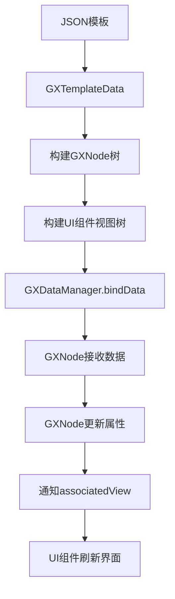

# UI组件

<cite>
**本文档中引用的文件**  
- [GXText.h](file://GaiaXiOS/GaiaXiOS/Component/View/Basic/GXText.h)
- [GXImageView.h](file://GaiaXiOS/GaiaXiOS/Component/View/Basic/GXImageView.h)
- [GXProgressView.h](file://GaiaXiOS/GaiaXiOS/Component/View/Basic/GXProgressView.h)
- [GXScrollView.h](file://GaiaXiOS/GaiaXiOS/Component/View/Container/GXScrollView.h)
- [GXGridView.h](file://GaiaXiOS/GaiaXiOS/Component/View/Container/GXGridView.h)
- [GXTextNode.h](file://GaiaXiOS/GaiaXiOS/Component/Node/GXTextNode.h)
- [GXImageNode.h](file://GaiaXiOS/GaiaXiOS/Component/Node/GXImageNode.h)
- [GXProgressNode.h](file://GaiaXiOS/GaiaXiOS/Component/Node/GXProgressNode.h)
- [GXScrollNode.h](file://GaiaXiOS/GaiaXiOS/Component/Node/GXScrollNode.h)
- [GXGridNode.h](file://GaiaXiOS/GaiaXiOS/Component/Node/GXGridNode.h)
- [GXDataManager.h](file://GaiaXiOS/GaiaXiOS/Binding/Data/GXDataManager.h)
- [GXNode.h](file://GaiaXiOS/GaiaXiOS/Core/StretchKit/Classes/GXNode.h)
- [GXEventManager.m](file://GaiaXiOS/GaiaXiOS/Binding/Event/GXEventManager.m)
- [GaiaXJSModulesImplDelegate.h](file://GaiaXJSiOS/GaiaXJS/src/GaiaXJSModulesImplDelegate.h)
</cite>

## 目录
1. [简介](#简介)
2. [基础UI组件](#基础ui组件)
3. [容器UI组件](#容器ui组件)
4. [UI组件与Node节点的数据绑定机制](#ui组件与node节点的数据绑定机制)
5. [组件组合使用最佳实践](#组件组合使用最佳实践)
6. [渲染性能与内存管理策略](#渲染性能与内存管理策略)

## 简介
GaiaX 是一个跨平台的高性能动态化UI框架，其iOS实现提供了丰富的UI组件系统，支持灵活的布局、动态数据绑定和高效的渲染能力。本文档系统介绍GaiaX iOS平台中Basic和Container目录下的核心UI组件，涵盖其视觉特性、属性配置、使用方式、数据同步机制以及性能优化策略，为开发者提供全面的技术参考。

## 基础UI组件

GaiaX的基础UI组件（Basic Components）是构建用户界面的原子元素，直接对应于具体的视觉元素。这些组件继承自UIKit的基础视图，并通过扩展协议和属性来支持GaiaX特有的样式和数据绑定能力。

### GXText（文本组件）

**视觉元素**  
`GXText` 组件用于显示静态或动态文本内容，其底层实现继承自 `UILabel`，确保了与原生文本渲染一致的性能和外观。

**核心属性**  
- `gxPadding`：`UIEdgeInsets` 类型，用于设置文本内容的内边距，实现文本与组件边界的间距控制。
- `font`：字体设置，通过关联的 `GXTextNode` 节点进行配置。
- `textColor`：文本颜色。
- `numberOfLines`：控制文本行数，0表示无限制。
- `lineBreakMode`：定义文本截断方式（如省略号、截断字符等）。
- `textAlignment`：文本对齐方式（左、中、右）。

**使用方法**  
`GXText` 组件通过数据绑定机制接收文本内容。开发者在模板中定义数据源，框架会自动将数据中的文本值填充到组件中。其内边距 `gxPadding` 属性允许在不改变布局约束的情况下调整文本的视觉位置。

**Section sources**
- [GXText.h](file://GaiaXiOS/GaiaXiOS/Component/View/Basic/GXText.h#L23-L28)
- [GXTextNode.h](file://GaiaXiOS/GaiaXiOS/Component/Node/GXTextNode.h#L27-L49)

### GXImageView（图像组件）

**视觉元素**  
`GXImageView` 组件用于显示图片，其底层实现继承自 `UIImageView`，并遵循 `GXImageViewProtocal` 协议以支持网络图片加载和资源管理。

**核心属性**  
- `contentMode`：`UIViewContentMode` 类型，定义图片的拉伸和缩放模式（如 `ScaleAspectFit`, `ScaleToFill` 等），通过 `GXImageNode` 节点进行配置。
- 支持本地资源（`local:` 前缀）和网络资源（`http:`/`https:` 前缀）的加载。

**使用方法**  
组件通过 `bindUri` 方法解析数据源中的图片路径或URL。对于网络图片，框架会调用具体的加载器（如SDWebImage）进行异步加载；对于本地资源，则通过资源ID进行查找和显示。`GXImageView` 还支持占位图和加载错误处理。

**Section sources**
- [GXImageView.h](file://GaiaXiOS/GaiaXiOS/Component/View/Basic/GXImageView.h#L24)
- [GXImageNode.h](file://GaiaXiOS/GaiaXiOS/Component/Node/GXImageNode.h#L26)

### GXProgressView（进度条组件）

**视觉元素**  
`GXProgressView` 组件用于可视化地展示任务的完成进度，其底层实现是一个自定义的 `UIView`，通过 `Core Graphics` 绘制进度条。

**核心属性**  
- `strokeColor`：`UIColor` 类型，表示已完成部分的进度条颜色。
- `trailColor`：`UIColor` 类型，表示未完成部分的背景颜色。
- `updateProgress:animated:`：核心方法，用于更新进度值并可选择是否启用动画效果。

**使用方法**  
通过调用 `updateProgress:animated:` 方法，传入0.0到1.0之间的浮点数来设置当前进度。当 `animated` 参数为 `YES` 时，进度条会以平滑的动画过渡到目标值，提升用户体验。

**Section sources**
- [GXProgressView.h](file://GaiaXiOS/GaiaXiOS/Component/View/Basic/GXProgressView.h#L26-L30)
- [GXProgressNode.h](file://GaiaXiOS/GaiaXiOS/Component/Node/GXProgressNode.h)

## 容器UI组件

GaiaX的容器UI组件（Container Components）负责管理子节点的布局和排列，是构建复杂界面结构的基础。它们通常基于 `UICollectionView` 实现，以支持高效的滚动和复用。

### GXScrollView（滚动容器）

**布局管理能力**  
`GXScrollView` 是一个垂直或水平滚动的列表容器，其底层实现是 `UICollectionView`，并采用 `GXFlowLayout` 作为布局管理器。

**子节点组织方式**  
- **滚动方向**：通过 `scrollDirection` 属性（在 `GXScrollNode` 中定义）控制为垂直或水平滚动。
- **内边距**：`contentInset` 属性定义了内容区域与容器边缘的间距。
- **项间距**：`itemSpacing` 属性控制相邻子项之间的间距。
- **重力对齐**：`GXFlowLayout` 的 `gravity` 属性支持类似CSS的对齐方式（如居中、靠左/右）。

**使用方法**  
`GXScrollView` 将其子节点作为独立的 `UICollectionViewCell`（即 `GXScrollViewCell`）进行管理。每个 `GXScrollViewCell` 内部包含一个 `GXRootView`，用于承载子节点的具体UI。这种设计实现了列表项的高效复用。

**Section sources**
- [GXScrollView.h](file://GaiaXiOS/GaiaXiOS/Component/View/Container/GXScrollView.h#L25-L50)
- [GXScrollNode.h](file://GaiaXiOS/GaiaXiOS/Component/Node/GXScrollNode.h#L26-L30)

### GXGridView（网格容器）

**布局管理能力**  
`GXGridView` 用于创建网格布局，同样基于 `UICollectionView` 实现，但其布局逻辑更侧重于行列的划分。

**子节点组织方式**  
- **列数**：`column` 属性（在 `GXGridNode` 中定义）明确指定网格的列数，布局管理器会根据此值计算每个单元格的宽度。
- **滚动能力**：`scrollEnable` 属性决定网格是否支持滚动。
- **间距**：除了 `itemSpacing`（坑位间距），还提供了 `rowSpacing`（行间距），用于控制垂直方向上的间距。
- **内边距**：`contentInset` 属性定义网格内容与容器边缘的间距。

**使用方法**  
`GXGridView` 将子节点按顺序排列成网格。当子节点数量超过单行容量时，会自动换行。每个子节点被封装在 `GXGridViewCell` 中，内部同样通过 `GXRootView` 渲染具体内容。

**Section sources**
- [GXGridView.h](file://GaiaXiOS/GaiaXiOS/Component/View/Container/GXGridView.h#L25-L34)
- [GXGridNode.h](file://GaiaXiOS/GaiaXiOS/Component/Node/GXGridNode.h#L26-L34)

## UI组件与Node节点的数据绑定机制

GaiaX的UI组件系统采用“节点-视图”（Node-View）分离的架构。UI组件（View）负责视觉呈现，而 `GXNode` 及其子类（如 `GXTextNode`, `GXImageNode`）则负责存储样式、数据和布局信息。两者通过数据绑定机制实现同步。

### 绑定流程

1.  **数据解析**：框架首先解析JSON模板，生成 `GXTemplateData` 对象。
2.  **节点树构建**：根据模板结构，创建对应的 `GXNode` 对象树（如 `GXTextNode`, `GXScrollNode`）。
3.  **视图树构建**：根据节点树，创建对应的UI组件视图树（如 `GXText`, `GXScrollView`）。
4.  **数据绑定**：调用 `GXDataManager` 的 `bindData:onRootNode:` 方法，将 `GXTemplateData` 中的数据递归地绑定到 `GXNode` 树上。
5.  **视图更新**：`GXNode` 在接收到数据后，会更新自身的属性，并通过 `associatedView` 弱引用通知其对应的UI组件进行视觉更新。

**Diagram sources**
- [GXDataManager.h](file://GaiaXiOS/GaiaXiOS/Binding/Data/GXDataManager.h#L28-L47)
- [GXNode.h](file://GaiaXiOS/GaiaXiOS/Core/StretchKit/Classes/GXNode.h#L23-L30)
- [GXEventManager.m](file://GaiaXiOS/GaiaXiOS/Binding/Event/GXEventManager.m#L57-L98)

### 同步机制

- **单向数据流**：数据绑定是单向的，从 `GXTemplateData` 流向 `GXNode`，再流向UI组件。UI组件的交互（如点击）会通过事件系统反馈给上层逻辑，而不是直接修改数据。
- **增量更新**：`GXNode` 的 `dirty` 标记用于优化性能。只有当节点的数据或样式发生变化时，才会触发其对应UI组件的重新渲染。
- **JS交互**：当数据从JavaScript层更新时，会通过 `GaiaXJSModulesImplDelegate` 协议的 `setBindingData:extendInfo:` 方法通知原生层，进而触发 `GXDataManager` 的数据绑定流程，实现跨语言的数据同步。

**Section sources**
- [GXNode.h](file://GaiaXiOS/GaiaXiOS/Core/StretchKit/Classes/GXNode.h#L159-L197)
- [GaiaXJSModulesImplDelegate.h](file://GaiaXJSiOS/GaiaXJS/src/GaiaXJSModulesImplDelegate.h#L50-L55)

## 组件组合使用最佳实践

构建复杂的UI界面需要将基础组件和容器组件进行有效组合。以下是一个包含文本、图片和滚动容器的复杂卡片的构建示例。

### 构建复杂卡片

1.  **顶层容器**：使用一个 `GXScrollView` 作为根容器，使其内容可以垂直滚动。
2.  **卡片容器**：在 `GXScrollView` 内部放置一个或多个 `GXView`（或 `GXRootView`）作为单个卡片的容器。
3.  **卡片布局**：
    - 在卡片容器内，可以使用 `GXImageView` 显示封面图片。
    - 在图片下方，使用 `GXText` 组件显示标题、描述等文本信息。
    - 可以使用 `GXProgressView` 显示视频播放进度或加载状态。
4.  **样式与间距**：通过设置 `GXView` 的背景、圆角，以及 `GXText` 的 `gxPadding` 和 `GXScrollView` 的 `contentInset`、`itemSpacing` 来控制整体的视觉样式和间距。

这种组合方式遵循了“容器嵌套内容”的原则，利用 `GXScrollView` 管理卡片列表，利用 `GXView` 管理单个卡片内的元素，结构清晰，易于维护。

**Section sources**
- [GXScrollView.h](file://GaiaXiOS/GaiaXiOS/Component/View/Container/GXScrollView.h)
- [GXText.h](file://GaiaXiOS/GaiaXiOS/Component/View/Basic/GXText.h)
- [GXImageView.h](file://GaiaXiOS/GaiaXiOS/Component/View/Basic/GXImageView.h)

## 渲染性能与内存管理策略

GaiaX通过一系列策略确保UI组件的高性能渲染和低内存占用。

### 渲染性能

- **基于Stretch的布局引擎**：GaiaX使用自研的 `Stretch` 布局引擎（基于Rust），它是一个高性能的Flexbox实现。布局计算在后台线程完成，避免阻塞主线程，确保UI流畅。
- **高效的视图复用**：`GXScrollView` 和 `GXGridView` 基于 `UICollectionView`，天然支持单元格的复用。当列表滚动时，不可见的单元格会被回收并用于显示新出现的内容，极大地减少了视图创建和销毁的开销。
- **增量布局计算**：`GXNode` 的 `dirty` 机制确保只有发生变化的节点才会重新计算布局，避免了全量重排。

### 内存管理

- **弱引用关联**：`GXNode` 通过 `weak` 属性 `associatedView` 关联其UI组件，防止了循环引用。
- **资源释放**：`GXImageView` 等组件遵循 `GXIRelease` 协议，在视图从窗口移除时（`onDetachedFromWindow`）会主动释放持有的资源（如网络图片加载器的回调）。
- **事件管理**：`GXEventManager` 使用信号量（`dispatch_semaphore`）保证事件注册和分发的线程安全，避免了因并发操作导致的内存问题。
- **JS上下文管理**：通过 `GXTemplateContext` 管理JavaScript执行上下文，在模板销毁时及时清理，防止内存泄漏。

**Section sources**
- [GXNode.m](file://GaiaXiOS/GaiaXiOS/Core/StretchKit/Classes/GXNode.m#L86-L124)
- [GXEventManager.m](file://GaiaXiOS/GaiaXiOS/Binding/Event/GXEventManager.m#L57-L98)
- [GXScrollView.h](file://GaiaXiOS/GaiaXiOS/Component/View/Container/GXScrollView.h#L31-L35)
- [GXGridView.h](file://GaiaXiOS/GaiaXiOS/Component/View/Container/GXGridView.h#L30-L34)