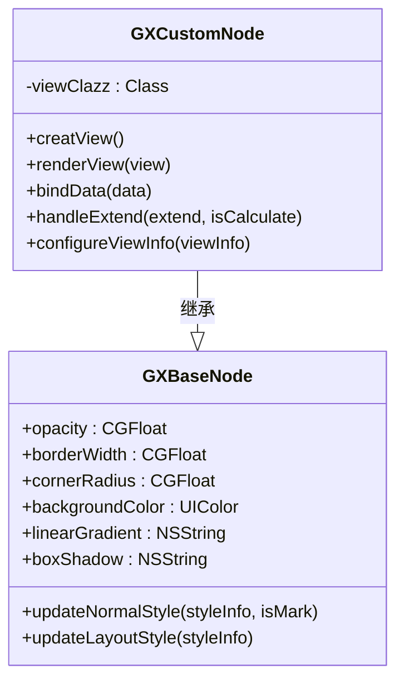
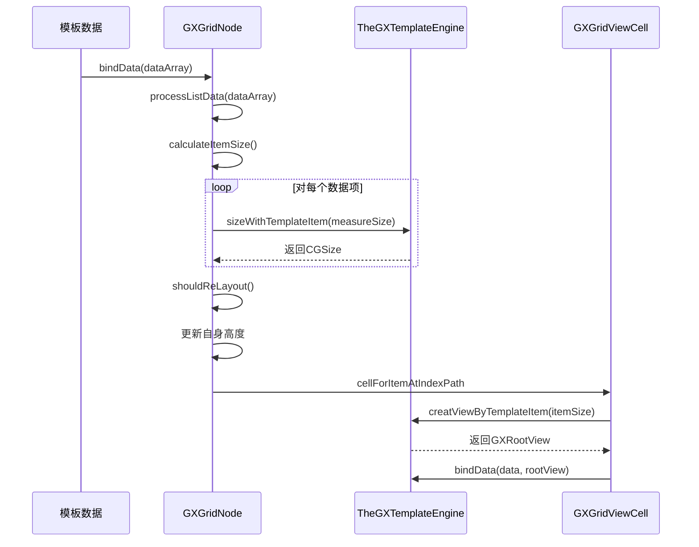
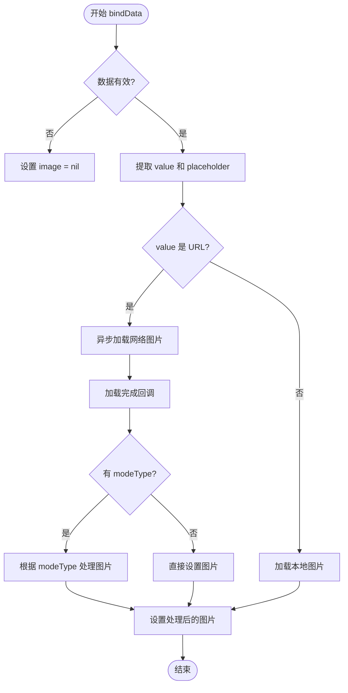

# 具体节点实现

<cite>
**本文档引用的文件**  
- [GXBaseNode.h](file://GaiaXiOS/GaiaXiOS/Component/Node/GXBaseNode.h)
- [GXBaseNode.m](file://GaiaXiOS/GaiaXiOS/Component/Node/GXBaseNode.m)
- [GXCustomNode.h](file://GaiaXiOS/GaiaXiOS/Component/Node/GXCustomNode.h)
- [GXCustomNode.m](file://GaiaXiOS/GaiaXiOS/Component/Node/GXCustomNode.m)
- [GXGridNode.h](file://GaiaXiOS/GaiaXiOS/Component/Node/GXGridNode.h)
- [GXGridNode.m](file://GaiaXiOS/GaiaXiOS/Component/Node/GXGridNode.m)
- [GXImageNode.h](file://GaiaXiOS/GaiaXiOS/Component/Node/GXImageNode.h)
- [GXImageNode.m](file://GaiaXiOS/GaiaXiOS/Component/Node/GXImageNode.m)
- [GXScrollNode.h](file://GaiaXiOS/GaiaXiOS/Component/Node/GXScrollNode.h)
- [GXScrollNode.m](file://GaiaXiOS/GaiaXiOS/Component/Node/GXScrollNode.m)
</cite>

## 目录
1. [引言](#引言)
2. [基础节点 GXBaseNode](#基础节点-gxbasenode)
3. [自定义节点 GXCustomNode](#自定义节点-gxcustomnode)
4. [网格节点 GXGridNode](#网格节点-gxgridnode)
5. [图片节点 GXImageNode](#图片节点-gximagenode)
6. [滚动节点 GXScrollNode](#滚动节点-gxscrollnode)
7. [节点继承与组合模式](#节点继承与组合模式)
8. [性能考量](#性能考量)
9. [总结](#总结)

## 引言

GaiaX 是一个跨平台的动态模板渲染引擎，其 iOS 实现中定义了多种具体节点类型，用于构建复杂的用户界面。这些节点类型均继承自基础节点 `GXBaseNode`，并根据各自的功能扩展了特定的属性、方法和渲染逻辑。本文档将深入分析 `GXCustomNode`、`GXGridNode`、`GXImageNode` 和 `GXScrollNode` 四种具体节点类型的实现细节与使用场景，阐述其在性能优化和复杂 UI 构建中的应用。

**节点来源**
- [GXCustomNode.h](file://GaiaXiOS/GaiaXiOS/Component/Node/GXCustomNode.h)
- [GXGridNode.h](file://GaiaXiOS/GaiaXiOS/Component/Node/GXGridNode.h)
- [GXImageNode.h](file://GaiaXiOS/GaiaXiOS/Component/Node/GXImageNode.h)
- [GXScrollNode.h](file://GaiaXiOS/GaiaXiOS/Component/Node/GXScrollNode.h)

## 基础节点 GXBaseNode

`GXBaseNode` 是所有具体节点的基类，它定义了节点共有的样式属性和基础方法，为上层节点提供了统一的接口和功能支持。

### 核心属性

`GXBaseNode` 封装了常见的视图样式属性，包括：

- **透明度 (opacity)**：控制节点的透明度，默认值为 1。
- **边框 (border)**：包含边框宽度 (`borderWidth`)、颜色 (`borderColor`) 和圆角 (`cornerRadius` 或 `percentCornerRadius`)。
- **背景 (background)**：支持纯色背景 (`backgroundColor`) 和线性渐变背景 (`linearGradient`)。
- **阴影 (shadow)**：通过 `boxShadow` 属性控制阴影效果。
- **毛玻璃效果 (blur)**：通过 `backdropFilter` 属性实现视觉模糊效果。
- **布局属性**：继承自底层布局引擎，包含 `display`、`flex` 相关属性、`width`、`height`、`margin`、`padding` 等。

### 核心方法

`GXBaseNode` 提供了两类关键方法，用于区分对布局的影响：

- **`updateNormalStyle:`**：更新不影响布局的样式属性（如 `opacity`、`backgroundColor`），直接修改视图的外观。
- **`updateLayoutStyle:`**：更新影响布局的属性（如 `width`、`height`、`margin`）。该方法会返回一个布尔值，指示布局是否发生变化。如果发生变化，需要标记节点为“脏”（dirty），并触发重新布局。

此外，`GXBaseNode` 还提供了 `setupCornerRadius:`、`setupShadow:`、`setupGradientBackground:` 等私有方法，用于将样式属性应用到具体的 `UIView` 上。

**节点来源**
- [GXBaseNode.h](file://GaiaXiOS/GaiaXiOS/Component/Node/GXBaseNode.h#L27-L54)
- [GXBaseNode.m](file://GaiaXiOS/GaiaXiOS/Component/Node/GXBaseNode.m#L51-L434)

## 自定义节点 GXCustomNode

`GXCustomNode` 允许开发者集成自定义的 `UIView` 子类，从而扩展 GaiaX 的能力，实现原生组件的复用。

### 实现细节

`GXCustomNode` 的核心在于其 `viewClazz` 属性，该属性通过模板中的 `view-class-ios` 字段配置，指定了要实例化的自定义视图类。

- **视图创建 (`creatView`)**：重写了 `creatView` 方法，使用 `viewClazz` 动态创建视图实例，并建立节点与视图的弱引用关联。
- **数据绑定 (`bindData`)**：在 `bindData:` 方法中，通过 `performSelector:withObject:` 机制，尝试调用视图的 `gx_bindData:` 方法，将模板数据传递给自定义视图。
- **属性处理 (`handleExtend`)**：`handleExtend:isCalculate:` 方法是 `GXCustomNode` 的关键。它接收 `extend` 字段中的动态属性，先调用 `updateLayoutStyle:` 判断布局是否变化，再调用 `updateNormalStyle:` 更新普通样式。如果布局发生变化，则标记节点为“脏”，并通知上下文需要重新布局。

### 使用场景

`GXCustomNode` 非常适合用于集成复杂的、具有特定交互逻辑的业务组件，例如自定义的图表、富文本编辑器或特定的播放器控件。



**节点来源**
- [GXCustomNode.h](file://GaiaXiOS/GaiaXiOS/Component/Node/GXCustomNode.h)
- [GXCustomNode.m](file://GaiaXiOS/GaiaXiOS/Component/Node/GXCustomNode.m)

## 网格节点 GXGridNode

`GXGridNode` 用于实现网格布局，支持固定列数和垂直滚动。

### 实现细节

`GXGridNode` 内部封装了一个 `GXGridView`（即 `UICollectionView`），并实现了其数据源和代理协议。

- **布局配置**：通过 `column` 属性定义列数，`itemSpacing` 和 `rowSpacing` 分别定义横向和纵向的间距。
- **尺寸计算 (`calculateItemSize`)**：这是 `GXGridNode` 的核心。它根据当前容器的宽度、列数和间距，计算出每个网格项的宽度。然后，通过 `TheGXTemplateEngine` 的 `sizeWithTemplateItem:measureSize:` 方法，异步计算每个网格项的高度。计算结果缓存于 `sizeValues` 数组中。
- **高度自适应 (`shouldReLayout`)**：当 `scrollEnable` 为 `NO` 时，`GXGridNode` 会自动计算其自身高度。它遍历 `sizeValues` 数组，结合行间距和内边距，累加出总高度，并更新自身的 `styleModel`，从而实现内容撑开。
- **数据绑定 (`bindData`)**：将传入的数组数据转换为 `GXTemplateData` 对象数组，并在必要时触发 `reloadData`。

### 使用场景

适用于商品列表、图片墙、标签云等需要规则网格布局的场景。



**节点来源**
- [GXGridNode.h](file://GaiaXiOS/GaiaXiOS/Component/Node/GXGridNode.h)
- [GXGridNode.m](file://GaiaXiOS/GaiaXiOS/Component/Node/GXGridNode.m)

## 图片节点 GXImageNode

`GXImageNode` 专门用于处理图片的加载、显示和裁剪。

### 实现细节

`GXImageNode` 继承自 `GXViewNode`，并专注于图片相关的功能。

- **图片加载 (`setImageView:withImageInfo:`)**：该方法是图片加载的核心。它首先判断 `imgData` 是否为有效的字典。如果是，则提取 `value` 字段作为图片源（URL 或本地资源名）和 `placeholder` 作为占位图。
- **网络图片加载**：如果 `value` 是 URL，会调用 `GXImageView` 的 `gx_setImageWithURLString:placeholderImage:completed:` 方法进行异步加载。加载完成后，根据 `modeType` 进行缩放或裁剪。
- **本地图片加载**：如果 `value` 是本地资源名，则直接调用 `gx_setLocalImage:` 方法。
- **内容模式 (`contentMode`)**：通过 `configureStyleInfo:` 方法，将 CSS 中的 `mode` 或 `background-size` 属性转换为 `UIViewContentMode`。
- **自定义裁剪 (`modeType`)**：当 `contentMode` 不是标准模式时，`modeType` 属性（值为 `scale` 或 `crop`）会触发额外的图像处理逻辑，使用 `UIImage+GX` 分类中的方法进行精确的缩放或裁剪。

### 使用场景

适用于需要显示网络图片、本地图片，并对图片进行特定缩放或裁剪处理的场景。



**节点来源**
- [GXImageNode.h](file://GaiaXiOS/GaiaXiOS/Component/Node/GXImageNode.h)
- [GXImageNode.m](file://GaiaXiOS/GaiaXiOS/Component/Node/GXImageNode.m)

## 滚动节点 GXScrollNode

`GXScrollNode` 提供了灵活的滚动容器，支持水平和垂直方向的滚动。

### 实现细节

`GXScrollNode` 与 `GXGridNode` 类似，也基于 `UICollectionView`，但更侧重于一维滚动。

- **滚动方向 (`scrollDirection`)**：通过 `direction` 配置项设置为 `vertical` 或 `horizontal`。
- **多类型坑位支持**：`GXScrollNode` 的强大之处在于支持多种不同类型的子视图（坑位）。通过 `item-type` 配置中的 `path` 和 `config`，可以根据数据中的某个字段动态决定每个坑位应使用的模板。
- **尺寸计算**：与 `GXGridNode` 类似，`calculateItemSize:` 方法会为每个坑位计算尺寸。在水平滚动模式下，它会记录所有坑位中的最大高度，并将此高度作为 `GXScrollNode` 自身的高度，确保所有坑位都能完整显示。
- **对齐 (`gravity`)**：在水平滚动时，`gravity` 属性可以控制坑位在垂直方向上的对齐方式（如居中）。

### 使用场景

适用于信息流、横向滚动的推荐列表、Tab 切换等需要一维滚动且内容多样的场景。

```mermaid
classDiagram
class GXScrollNode {
+contentInset : UIEdgeInsets
+itemSpacing : CGFloat
+scrollDirection : UICollectionViewScrollDirection
+gravity : NSString
+configureViewInfo(viewInfo)
+parserItemType()
+identifierWithIndex(index)
+calculateItemSize(extend)
}
class GXGridNode {
+column : NSInteger
+scrollEnable : BOOL
+contentInset : UIEdgeInsets
+rowSpacing : CGFloat
+itemSpacing : CGFloat
+updateFitContentLayout()
}
GXScrollNode --|> GXBaseNode : 继承
GXGridNode --|> GXBaseNode : 继承
note right of GXScrollNode
支持多类型坑位和水平滚动
end
note right of GXGridNode
固定列数，垂直滚动
end
```

**节点来源**
- [GXScrollNode.h](file://GaiaXiOS/GaiaXiOS/Component/Node/GXScrollNode.h)
- [GXScrollNode.m](file://GaiaXiOS/GaiaXiOS/Component/Node/GXScrollNode.m)

## 节点继承与组合模式

GaiaX 的节点系统采用了清晰的继承和组合设计模式。

- **继承 (`Inheritance`)**：所有具体节点都继承自 `GXBaseNode`，这保证了样式属性和基础方法的一致性。例如，`GXImageNode` 继承自 `GXViewNode`，而 `GXViewNode` 又继承自 `GXBaseNode`，形成了一个层次化的继承链。
- **组合 (`Composition`)**：复杂 UI 通过节点的组合来实现。例如，一个 `GXScrollNode` 可以包含多个 `GXGridNode`，而每个 `GXGridNode` 的子项又可以是 `GXImageNode` 或 `GXCustomNode`。这种组合方式使得模板可以构建出任意复杂的界面结构。

## 性能考量

### GXImageNode 的图片加载与缓存

`GXImageNode` 本身不直接管理图片缓存，而是依赖于其内部的 `GXImageView`。`GXImageView` 通常会集成一个成熟的图片加载库（如 SDWebImage 或 YYWebImage），这些库内置了内存和磁盘缓存机制，能有效避免重复下载和解码，显著提升性能。此外，`GXImageNode` 在 `renderView:` 中通过 `_sizeDidChanged` 标志位，确保只有在视图尺寸变化时才重新加载图片，避免了不必要的网络请求。

### GXScrollNode 的滚动性能优化

`GXScrollNode` 的性能优化主要体现在以下几个方面：
1.  **复用机制**：基于 `UICollectionView`，天然支持 Cell 复用，极大地减少了视图创建和销毁的开销。
2.  **异步计算**：在 `calculateItemSize:` 中，通过 `TheGXTemplateEngine` 异步计算每个坑位的尺寸，避免了在主线程上进行耗时的布局计算，保证了滚动的流畅性。
3.  **懒加载**：`items`、`sizeValues` 等数据源采用懒加载（lazy load）模式，只有在真正需要时才进行初始化，减少了内存占用。
4.  **增量更新**：`handleExtend:` 方法会精确判断属性变化，并仅在必要时才触发重新布局，避免了全量刷新。

## 总结

通过对 `GXCustomNode`、`GXGridNode`、`GXImageNode` 和 `GXScrollNode` 的深入分析，可以看出 GaiaX iOS 的节点设计具有高度的模块化和可扩展性。`GXBaseNode` 提供了坚实的基础，而具体节点则在继承的基础上，通过组合和复用，实现了丰富的 UI 功能。其性能优化策略，如异步计算、Cell 复用和懒加载，确保了在复杂场景下的流畅用户体验。开发者可以基于这些节点，灵活地构建出高性能、高复用的动态界面。