# 组件系统

<cite>
**本文档引用文件**   
- [GXNode.h](file://GaiaXiOS/GaiaXiOS/Core/StretchKit/Classes/GXNode.h)
- [GXNode.m](file://GaiaXiOS/GaiaXiOS/Core/StretchKit/Classes/GXNode.m)
- [GXBaseNode.h](file://GaiaXiOS/GaiaXiOS/Component/Node/GXBaseNode.h)
- [GXBaseNode.m](file://GaiaXiOS/GaiaXiOS/Component/Node/GXBaseNode.m)
- [GXCustomNode.h](file://GaiaXiOS/GaiaXiOS/Component/Node/GXCustomNode.h)
- [GXCustomNode.m](file://GaiaXiOS/GaiaXiOS/Component/Node/GXCustomNode.m)
- [GXGridNode.h](file://GaiaXiOS/GaiaXiOS/Component/Node/GXGridNode.h)
- [GXGridNode.m](file://GaiaXiOS/GaiaXiOS/Component/Node/GXGridNode.m)
- [GXImageNode.h](file://GaiaXiOS/GaiaXiOS/Component/Node/GXImageNode.h)
- [GXImageNode.m](file://GaiaXiOS/GaiaXiOS/Component/Node/GXImageNode.m)
- [GXScrollNode.h](file://GaiaXiOS/GaiaXiOS/Component/Node/GXScrollNode.h)
- [GXScrollNode.m](file://GaiaXiOS/GaiaXiOS/Component/Node/GXScrollNode.m)
- [GXViewNode.h](file://GaiaXiOS/GaiaXiOS/Component/Node/GXViewNode.h)
- [GXRootViewNode.h](file://GaiaXiOS/GaiaXiOS/Component/Node/GXRootViewNode.h)
- [GXNodeTreeCreator.h](file://GaiaXiOS/GaiaXiOS/Core/Creator/GXNodeTreeCreator.h)
</cite>

## 目录
1. [简介](#简介)
2. [节点树架构](#节点树架构)
3. [核心节点类型](#核心节点类型)
4. [基本视图与容器组件](#基本视图与容器组件)
5. [自定义组件开发指南](#自定义组件开发指南)
6. [节点生命周期与事件机制](#节点生命周期与事件机制)
7. [渲染性能优化策略](#渲染性能优化策略)
8. [组件复用与性能瓶颈](#组件复用与性能瓶颈)

## 简介
GaiaX iOS组件系统是一个基于节点树架构的高性能UI渲染框架，以GXBaseNode为核心构建完整的视图层级。该系统通过GXNode作为基础节点，支持GXCustomNode、GXGridNode、GXImageNode、GXScrollNode等多种具体节点类型，实现了灵活的组件化开发模式。系统采用声明式语法定义UI结构，结合数据绑定和表达式计算，为开发者提供了一套完整的跨平台UI解决方案。

## 节点树架构

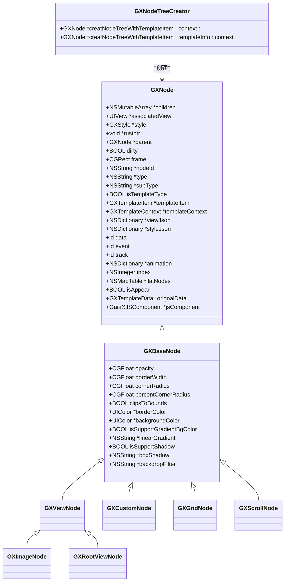

**图示来源**
- [GXNode.h](file://GaiaXiOS/GaiaXiOS/Core/StretchKit/Classes/GXNode.h#L36-L198)
- [GXBaseNode.h](file://GaiaXiOS/GaiaXiOS/Component/Node/GXBaseNode.h#L25-L80)
- [GXNodeTreeCreator.h](file://GaiaXiOS/GaiaXiOS/Core/Creator/GXNodeTreeCreator.h#L26-L45)

**节点树架构说明**
GaiaX的节点树架构以GXNode为基类，通过继承关系构建完整的组件体系。GXNode作为最基础的节点类型，定义了节点的基本属性和行为，包括子节点管理、样式设置、布局计算等核心功能。GXBaseNode在此基础上扩展了视觉属性，如透明度、边框、圆角、阴影等，为具体视图组件提供了统一的样式接口。节点树的创建由GXNodeTreeCreator负责，根据模板信息递归构建完整的节点层级结构。

**Section sources**
- [GXNode.h](file://GaiaXiOS/GaiaXiOS/Core/StretchKit/Classes/GXNode.h#L36-L198)
- [GXNodeTreeCreator.h](file://GaiaXiOS/GaiaXiOS/Core/Creator/GXNodeTreeCreator.h#L26-L45)

## 核心节点类型

### GXCustomNode
GXCustomNode是自定义组件的核心实现，允许开发者集成特定业务逻辑的视图组件。该节点通过viewClazz属性指定自定义视图类，支持数据绑定和属性扩展。

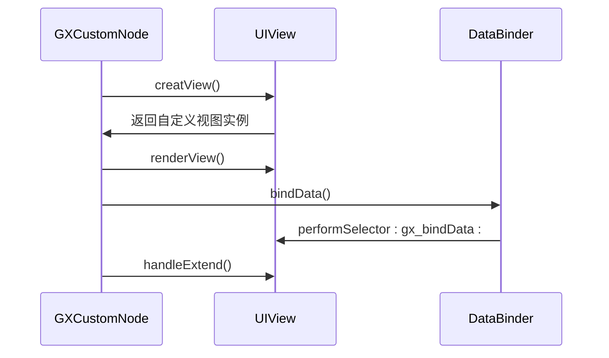

**图示来源**
- [GXCustomNode.h](file://GaiaXiOS/GaiaXiOS/Component/Node/GXCustomNode.h#L23-L25)
- [GXCustomNode.m](file://GaiaXiOS/GaiaXiOS/Component/Node/GXCustomNode.m#L35-L48)

### GXGridNode
GXGridNode实现网格布局容器，支持多列展示和滚动功能。通过column属性控制列数，itemSpacing和rowSpacing分别控制横向和纵向间距。

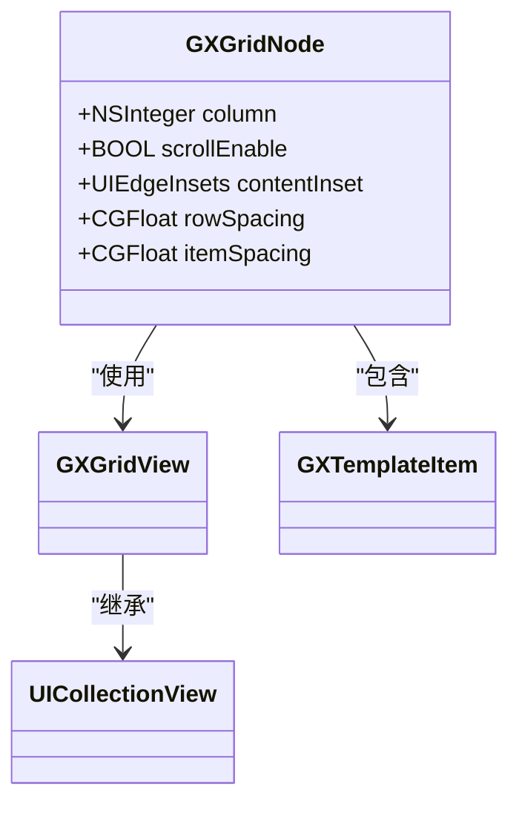

**图示来源**
- [GXGridNode.h](file://GaiaXiOS/GaiaXiOS/Component/Node/GXGridNode.h#L23-L38)
- [GXGridNode.m](file://GaiaXiOS/GaiaXiOS/Component/Node/GXGridNode.m#L62-L77)

### GXImageNode
GXImageNode专门用于图片展示，支持多种内容模式和裁剪方式。通过contentMode属性控制图片的显示方式，支持渐变背景和阴影效果。

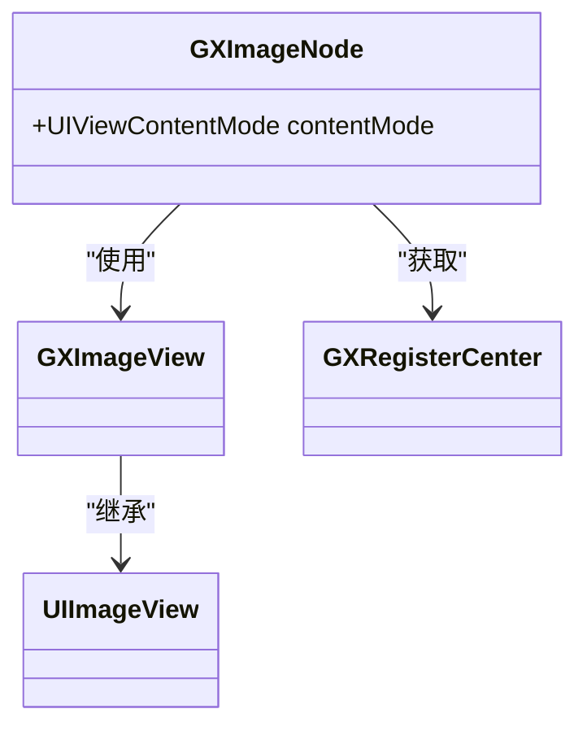

**图示来源**
- [GXImageNode.h](file://GaiaXiOS/GaiaXiOS/Component/Node/GXImageNode.h#L23-L28)
- [GXImageNode.m](file://GaiaXiOS/GaiaXiOS/Component/Node/GXImageNode.m#L52-L68)

### GXScrollNode
GXScrollNode实现滚动容器，支持水平和垂直两种滚动方向。通过scrollDirection属性控制滚动方向，contentInset设置内容边距。

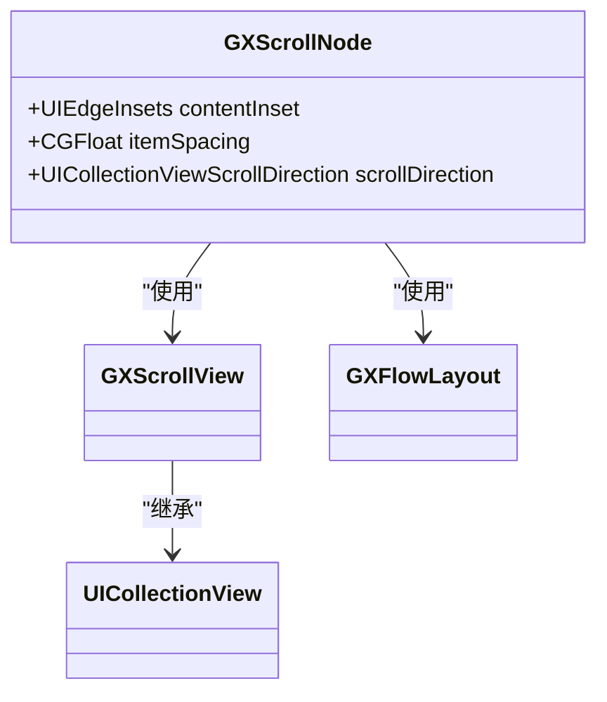

**图示来源**
- [GXScrollNode.h](file://GaiaXiOS/GaiaXiOS/Component/Node/GXScrollNode.h#L23-L32)
- [GXScrollNode.m](file://GaiaXiOS/GaiaXiOS/Component/Node/GXScrollNode.m#L62-L76)

**Section sources**
- [GXCustomNode.h](file://GaiaXiOS/GaiaXiOS/Component/Node/GXCustomNode.h#L23-L25)
- [GXGridNode.h](file://GaiaXiOS/GaiaXiOS/Component/Node/GXGridNode.h#L23-L38)
- [GXImageNode.h](file://GaiaXiOS/GaiaXiOS/Component/Node/GXImageNode.h#L23-L28)
- [GXScrollNode.h](file://GaiaXiOS/GaiaXiOS/Component/Node/GXScrollNode.h#L23-L32)

## 基本视图与容器组件

### 设计模式分析
GaiaX组件系统采用组合模式构建UI层级，GXViewNode作为基本视图组件，GXGridNode和GXScrollNode作为容器组件，形成树状结构。这种设计模式使得组件可以灵活嵌套，支持复杂的UI布局。

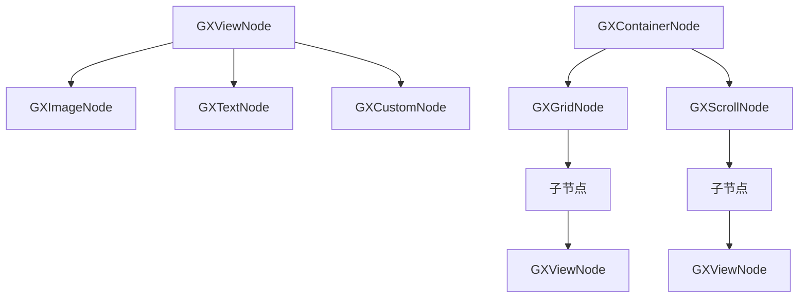

**图示来源**
- [GXViewNode.h](file://GaiaXiOS/GaiaXiOS/Component/Node/GXViewNode.h#L23-L25)
- [GXGridNode.h](file://GaiaXiOS/GaiaXiOS/Component/Node/GXGridNode.h#L23-L38)
- [GXScrollNode.h](file://GaiaXiOS/GaiaXiOS/Component/Node/GXScrollNode.h#L23-L32)

### 扩展机制
组件系统通过extend机制支持动态属性扩展，允许在运行时修改组件的样式和布局属性。GXBaseNode中的updateLayoutStyle和updateNormalStyle方法分别处理影响布局和不影响布局的属性更新。

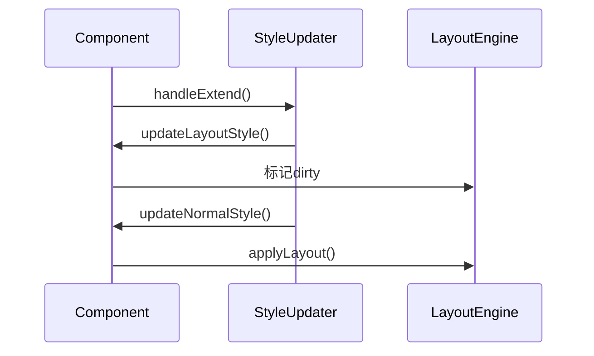

**图示来源**
- [GXBaseNode.m](file://GaiaXiOS/GaiaXiOS/Component/Node/GXBaseNode.m#L125-L434)
- [GXCustomNode.m](file://GaiaXiOS/GaiaXiOS/Component/Node/GXCustomNode.m#L124-L143)

**Section sources**
- [GXBaseNode.h](file://GaiaXiOS/GaiaXiOS/Component/Node/GXBaseNode.h#L25-L80)
- [GXBaseNode.m](file://GaiaXiOS/GaiaXiOS/Component/Node/GXBaseNode.m#L125-L434)

## 自定义组件开发指南

### 基础开发步骤
1. 创建继承GXCustomNode的子类
2. 实现creatView方法创建自定义视图
3. 重写renderView方法设置视图属性
4. 实现bindData方法处理数据绑定
5. 通过configureViewInfo解析自定义属性

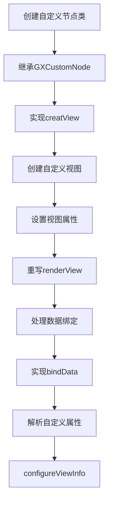

**图示来源**
- [GXCustomNode.m](file://GaiaXiOS/GaiaXiOS/Component/Node/GXCustomNode.m#L35-L48)
- [GXCustomNode.m](file://GaiaXiOS/GaiaXiOS/Component/Node/GXCustomNode.m#L53-L75)

### 数据绑定实现
自定义组件通过performSelector机制实现数据绑定，视图需要实现gx_bindData:方法接收绑定数据。

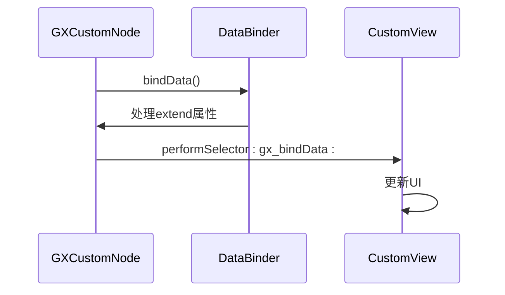

**图示来源**
- [GXCustomNode.m](file://GaiaXiOS/GaiaXiOS/Component/Node/GXCustomNode.m#L80-L103)

**Section sources**
- [GXCustomNode.m](file://GaiaXiOS/GaiaXiOS/Component/Node/GXCustomNode.m#L35-L170)

## 节点生命周期与事件机制

### 生命周期管理
GaiaX节点具有完整的生命周期，包括onReady、onShow、onHide和onDestroy四个阶段，支持JS组件的生命周期回调。

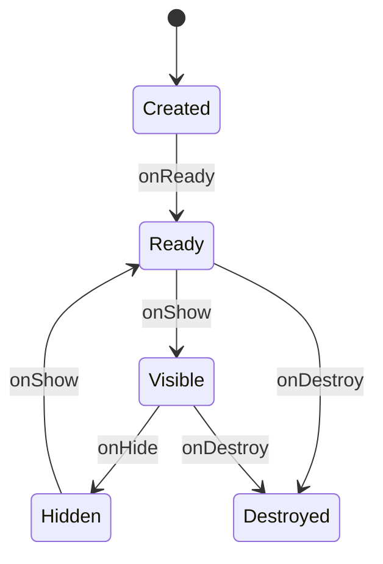

**图示来源**
- [GXNode.m](file://GaiaXiOS/GaiaXiOS/Core/StretchKit/Classes/GXNode.m#L601-L645)

### 事件冒泡机制
系统采用事件冒泡机制处理用户交互，从子节点向父节点传递事件，支持tap和longPress两种手势。

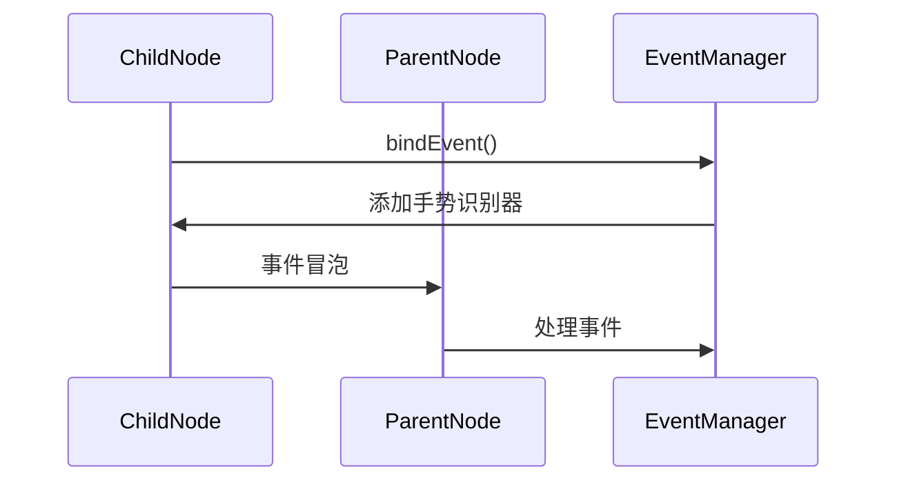

**图示来源**
- [GXNode.m](file://GaiaXiOS/GaiaXiOS/Core/StretchKit/Classes/GXNode.m#L494-L514)
- [GXNode.m](file://GaiaXiOS/GaiaXiOS/Core/StretchKit/Classes/GXNode.m#L621-L625)

**Section sources**
- [GXNode.m](file://GaiaXiOS/GaiaXiOS/Core/StretchKit/Classes/GXNode.m#L599-L647)

## 渲染性能优化策略

### 布局计算优化
系统采用Rust实现的Stretch布局引擎进行高效布局计算，通过dirty标记机制避免不必要的重新计算。

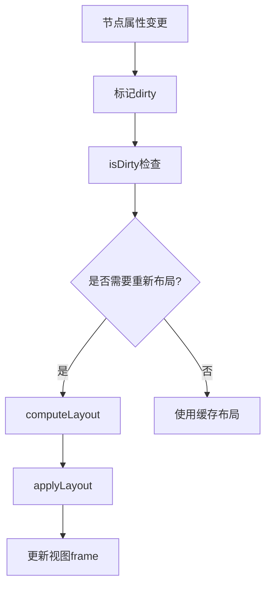

**图示来源**
- [GXNode.m](file://GaiaXiOS/GaiaXiOS/Core/StretchKit/Classes/GXNode.m#L187-L190)
- [GXNode.m](file://GaiaXiOS/GaiaXiOS/Core/StretchKit/Classes/GXNode.m#L202-L208)

### 视图扁平化
通过isFlat属性实现视图扁平化优化，减少不必要的UIView层级，提升渲染性能。

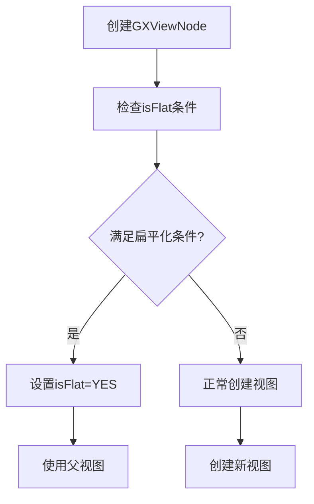

**图示来源**
- [GXBaseNode.m](file://GaiaXiOS/GaiaXiOS/Component/Node/GXBaseNode.m#L747-L750)

**Section sources**
- [GXNode.m](file://GaiaXiOS/GaiaXiOS/Core/StretchKit/Classes/GXNode.m#L187-L208)
- [GXBaseNode.m](file://GaiaXiOS/GaiaXiOS/Component/Node/GXBaseNode.m#L747-L750)

## 组件复用与性能瓶颈

### 最佳实践
1. 合理使用视图扁平化减少层级
2. 避免频繁的布局重计算
3. 使用itemSameHeight优化列表性能
4. 合理设置contentInset和spacing

### 常见性能瓶颈
- 过多的嵌套层级导致渲染性能下降
- 频繁的数据更新触发不必要的布局计算
- 复杂的阴影和渐变效果影响绘制性能
- 大量图片加载导致内存压力

**Section sources**
- [GXGridNode.m](file://GaiaXiOS/GaiaXiOS/Component/Node/GXGridNode.m#L235-L297)
- [GXScrollNode.m](file://GaiaXiOS/GaiaXiOS/Component/Node/GXScrollNode.m#L211-L245)