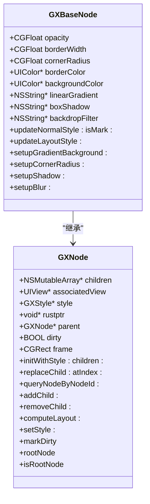
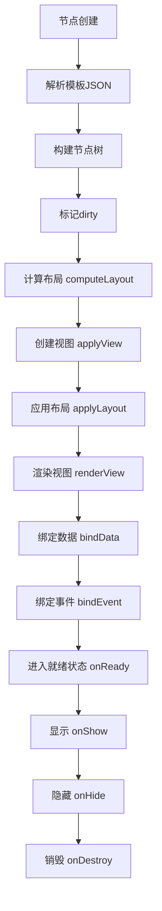
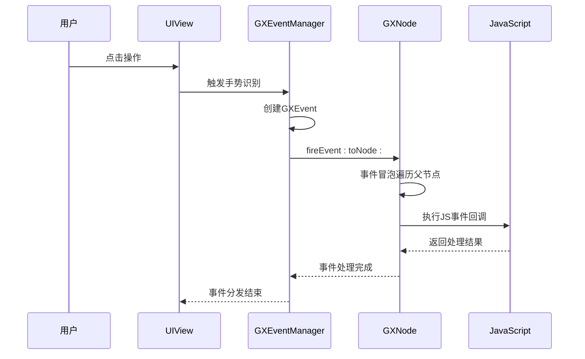

# 节点架构

<cite>
**本文档引用文件**  
- [GXBaseNode.h](file://GaiaXiOS/GaiaXiOS/Component/Node/GXBaseNode.h)
- [GXNode.h](file://GaiaXiOS/GaiaXiOS/Core/StretchKit/Classes/GXNode.h)
- [GXLayout.h](file://GaiaXiOS/GaiaXiOS/Core/StretchKit/Classes/GXLayout.h)
- [GXLayoutManager.h](file://GaiaXiOS/GaiaXiOS/Core/Render/GXLayoutManager.h)
- [GXRenderManager.h](file://GaiaXiOS/GaiaXiOS/Core/Render/GXRenderManager.h)
- [GXEvent.h](file://GaiaXiOS/GaiaXiOS/Binding/Event/GXEvent.h)
- [GXEventManager.h](file://GaiaXiOS/GaiaXiOS/Binding/Event/GXEventManager.h)
- [GXTemplateEngine.h](file://GaiaXiOS/GaiaXiOS/Engine/GXTemplateEngine.h)
</cite>

## 目录
1. [引言](#引言)
2. [节点继承体系](#节点继承体系)
3. [节点生命周期管理](#节点生命周期管理)
4. [事件冒泡与传递机制](#事件冒泡与传递机制)
5. [节点与视图的映射关系](#节点与视图的映射关系)
6. [属性同步与性能优化](#属性同步与性能优化)
7. [自定义节点扩展实践](#自定义节点扩展实践)
8. [模板解析与数据绑定中的节点作用](#模板解析与数据绑定中的节点作用)
9. [关键流程调用示例](#关键流程调用示例)
10. [总结](#总结)

## 引言

GaiaX iOS组件系统采用基于节点树的UI构建架构，以`GXBaseNode`为核心构建完整的视图层级体系。该架构通过声明式模板驱动UI渲染，结合数据绑定与表达式计算，实现高性能、可扩展的动态化界面能力。本文档深入剖析以`GXBaseNode`为核心的节点系统设计，涵盖节点继承、生命周期、事件机制、视图映射、性能优化及扩展实践等核心内容。

**Section sources**
- [GXBaseNode.h](file://GaiaXiOS/GaiaXiOS/Component/Node/GXBaseNode.h#L1-L83)
- [GXNode.h](file://GaiaXiOS/GaiaXiOS/Core/StretchKit/Classes/GXNode.h#L1-L198)

## 节点继承体系

GaiaX的节点系统采用面向对象的继承结构，形成清晰的层级关系。`GXNode`作为所有节点的基类，定义了节点树的基本结构和通用行为，而`GXBaseNode`在此基础上扩展了样式、渲染和数据绑定能力。

**Diagram sources**
- [GXNode.h](file://GaiaXiOS/GaiaXiOS/Core/StretchKit/Classes/GXNode.h#L36-L198)
- [GXBaseNode.h](file://GaiaXiOS/GaiaXiOS/Component/Node/GXBaseNode.h#L25-L83)

**Section sources**
- [GXNode.h](file://GaiaXiOS/GaiaXiOS/Core/StretchKit/Classes/GXNode.h#L36-L198)
- [GXBaseNode.h](file://GaiaXiOS/GaiaXiOS/Component/Node/GXBaseNode.h#L25-L83)

## 节点生命周期管理

节点的生命周期贯穿从创建、布局、渲染到销毁的全过程，由模板引擎统一调度管理。

### 创建阶段
节点树通过`GXNodeTreeCreator`根据模板JSON结构递归创建。每个节点实例化时会解析其样式（style）和属性（viewJson），并建立父子关系。

### 布局阶段
调用`computeLayout:`方法触发布局计算。该过程基于Yoga布局引擎（封装于Rust层），结合`GXLayout`对象完成尺寸与位置的计算。`GXLayoutManager`负责协调整体布局流程。

### 渲染阶段
`GXRenderManager`调用`applyView`递归创建视图，并通过`applyLayout:`将布局信息应用到UIView。`renderView:`方法完成最终的属性渲染。

### 销毁阶段
当模板卸载时，`onDestroy`生命周期方法被调用，释放JS上下文、事件监听及资源引用，确保无内存泄漏。

**Diagram sources**
- [GXNode.h](file://GaiaXiOS/GaiaXiOS/Core/StretchKit/Classes/GXNode.h#L72-L147)
- [GXRenderManager.h](file://GaiaXiOS/GaiaXiOS/Core/Render/GXRenderManager.h#L38-L56)
- [GXBaseNode.h](file://GaiaXiOS/GaiaXiOS/Component/Node/GXBaseNode.h#L57-L80)

**Section sources**
- [GXNode.h](file://GaiaXiOS/GaiaXiOS/Core/StretchKit/Classes/GXNode.h#L72-L193)
- [GXRenderManager.h](file://GaiaXiOS/GaiaXiOS/Core/Render/GXRenderManager.h#L30-L62)
- [GXBaseNode.h](file://GaiaXiOS/GaiaXiOS/Component/Node/GXBaseNode.h#L57-L80)

## 事件冒泡与传递机制

GaiaX实现了基于节点树的事件冒泡机制，支持Tap和长按等手势事件的注册与分发。

### 事件注册
通过`GXEventManager`单例管理事件映射表。调用`registerEvent:forNode:`将`GXEvent`实例与特定节点绑定，存储于`NSMapTable`中。

### 事件触发
当用户交互发生时，系统生成`GXEvent`对象，包含`nodeId`、`eventType`和`eventParams`等信息，通过`fireEvent:toNode:`沿节点树向上冒泡。

### 优先级控制
支持`GXEventLevel`机制，允许JS事件覆盖Native事件（`GXEventLevelCover`），或反之，实现灵活的交互控制。

**Diagram sources**
- [GXEvent.h](file://GaiaXiOS/GaiaXiOS/Binding/Event/GXEvent.h#L27-L81)
- [GXEventManager.h](file://GaiaXiOS/GaiaXiOS/Binding/Event/GXEventManager.h#L27-L56)

**Section sources**
- [GXEvent.h](file://GaiaXiOS/GaiaXiOS/Binding/Event/GXEvent.h#L27-L81)
- [GXEventManager.h](file://GaiaXiOS/GaiaXiOS/Binding/Event/GXEventManager.h#L27-L56)

## 节点与视图的映射关系

每个`GXNode`通过`associatedView`弱引用关联一个UIView实例，实现逻辑节点与UI视图的解耦映射。

- **创建时机**：在`applyView`阶段首次创建，延迟初始化以提升性能。
- **复用机制**：结合`GXNodeHelper`实现节点复用，避免频繁创建销毁。
- **扁平化优化**：对无样式的容器节点，设置`isFlat=YES`，跳过UIView创建，减少视图层级。

**Section sources**
- [GXNode.h](file://GaiaXiOS/GaiaXiOS/Core/StretchKit/Classes/GXNode.h#L41-L42)
- [GXNode.h](file://GaiaXiOS/GaiaXiOS/Core/StretchKit/Classes/GXNode.h#L137-L147)
- [GXNode.h](file://GaiaXiOS/GaiaXiOS/Core/StretchKit/Classes/GXNode.h#L126-L127)

## 属性同步与性能优化

### 属性同步策略
- **样式属性分离**：`updateNormalStyle:`仅更新非布局属性（如颜色、阴影），`updateLayoutStyle:`触发布局重算。
- **脏检查机制**：通过`markDirty`标记节点变更，延迟更新，批量提交。

### 性能优化手段
- **懒加载**：视图在`applyView`时才创建，避免预加载开销。
- **节点复用**：滚动场景下通过`GXNodeHelper`复用节点实例。
- **Rust核心计算**：布局计算由Rust层`stretch`库执行，性能优于纯OC实现。
- **JS隔离**：JS逻辑通过`GaiaXJSComponent`隔离，避免阻塞主线程。

**Section sources**
- [GXBaseNode.h](file://GaiaXiOS/GaiaXiOS/Component/Node/GXBaseNode.h#L57-L60)
- [GXNode.h](file://GaiaXiOS/GaiaXiOS/Core/StretchKit/Classes/GXNode.h#L77-L79)
- [GXNode.h](file://GaiaXiOS/GaiaXiOS/Core/StretchKit/Classes/GXNode.h#L134-L135)

## 自定义节点扩展实践

开发者可通过继承`GXBaseNode`实现自定义节点，需重写关键方法：

1. **布局计算**：若需自定义布局逻辑，重写`computeLayout:`并返回`GXLayout`对象。
2. **视图创建**：重写`creatView`返回自定义UIView子类。
3. **属性渲染**：在`renderView:`中设置自定义属性。
4. **事件处理**：通过`bindEvent:`注册手势，并在回调中处理逻辑。

**最佳实践**：
- 避免在`computeLayout:`中执行耗时操作。
- 复用`GXStyle`属性，减少重复解析。
- 正确管理`associatedView`生命周期，防止野指针。

**Section sources**
- [GXBaseNode.h](file://GaiaXiOS/GaiaXiOS/Component/Node/GXBaseNode.h#L25-L83)
- [GXNode.h](file://GaiaXiOS/GaiaXiOS/Core/StretchKit/Classes/GXNode.h#L144-L146)

## 模板解析与数据绑定中的节点作用

### 模板解析阶段
`GXTemplateEngine`调用`loadTemplateContentWithTemplateItem:`加载JSON模板，`GXNodeTreeCreator`解析`viewJson`和`styleJson`，构建初始节点树。

### 数据绑定阶段
调用`bindData: onView:`时，节点树遍历所有节点：
- 调用`applyData:`处理数据绑定。
- `calculateWithData:`执行表达式计算。
- `updateTextNodes:`更新文本内容。
- `handleExtend:`处理扩展逻辑。

节点作为数据绑定的最小单元，确保变更精准作用于目标视图。

**Section sources**
- [GXTemplateEngine.h](file://GaiaXiOS/GaiaXiOS/Engine/GXTemplateEngine.h#L98-L103)
- [GXNode.h](file://GaiaXiOS/GaiaXiOS/Core/StretchKit/Classes/GXNode.h#L141-L162)

## 关键流程调用示例

以下为创建模板视图并绑定数据的核心调用链：

```mermaid
flowchart LR
A[GXTemplateEngine.creatViewByTemplateItem] --> B[GXRenderManager.renderViewByTemplateItem]
B --> C[GXNodeTreeCreator.createNodeTree]
C --> D[GXNode.computeLayout]
D --> E[GXNode.applyView]
E --> F[GXNode.applyLayout]
F --> G[GXTemplateEngine.bindData:onView:]
G --> H[GXNode.applyData]
H --> I[GXNode.calculateWithData]
I --> J[GXNode.updateTextNodes]
```

**Diagram sources**
- [GXTemplateEngine.h](file://GaiaXiOS/GaiaXiOS/Engine/GXTemplateEngine.h#L44-L45)
- [GXRenderManager.h](file://GaiaXiOS/GaiaXiOS/Core/Render/GXRenderManager.h#L35-L36)
- [GXNode.h](file://GaiaXiOS/GaiaXiOS/Core/StretchKit/Classes/GXNode.h#L137-L142)

**Section sources**
- [GXTemplateEngine.h](file://GaiaXiOS/GaiaXiOS/Engine/GXTemplateEngine.h#L39-L64)
- [GXRenderManager.h](file://GaiaXiOS/GaiaXiOS/Core/Render/GXRenderManager.h#L30-L62)

## 总结

GaiaX iOS的节点架构以`GXBaseNode`为核心，构建了一个高效、灵活、可扩展的UI系统。通过清晰的继承体系、完整的生命周期管理、事件冒泡机制和性能优化策略，实现了动态化模板的高性能渲染。开发者可基于此架构安全扩展自定义节点，满足复杂业务需求。