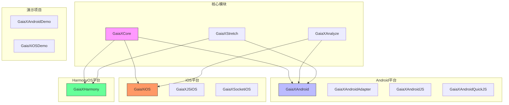
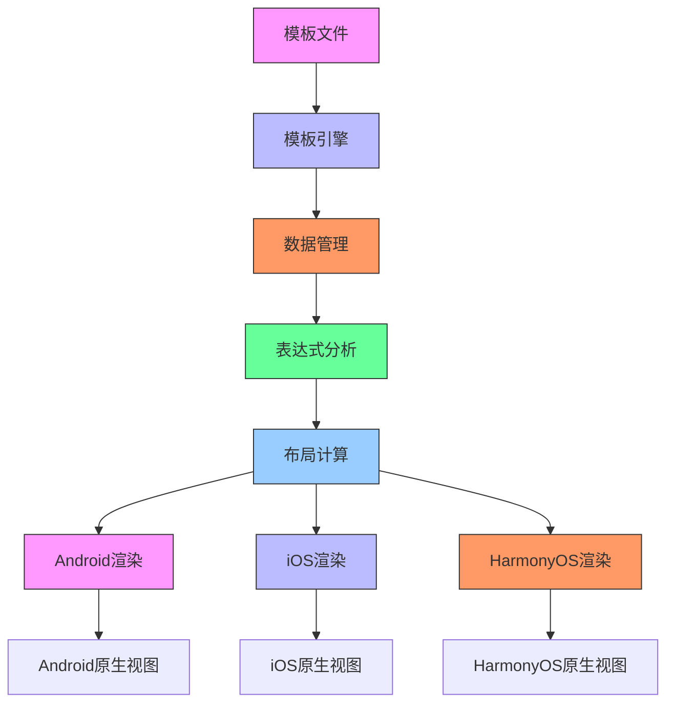
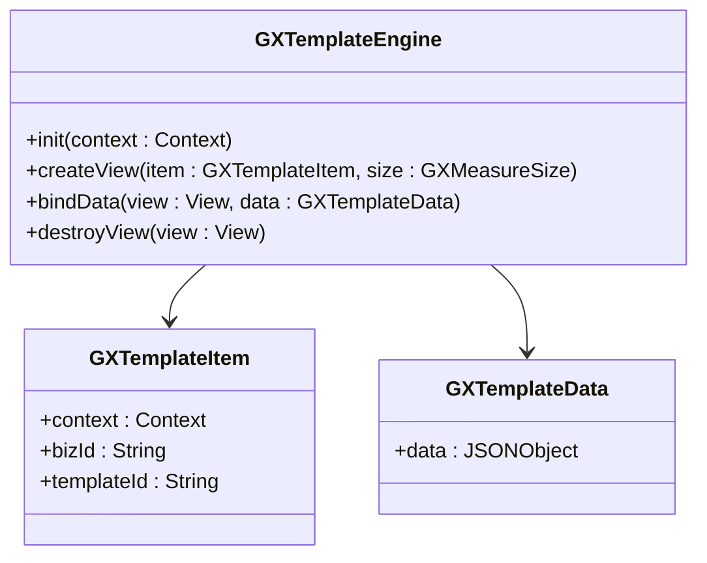
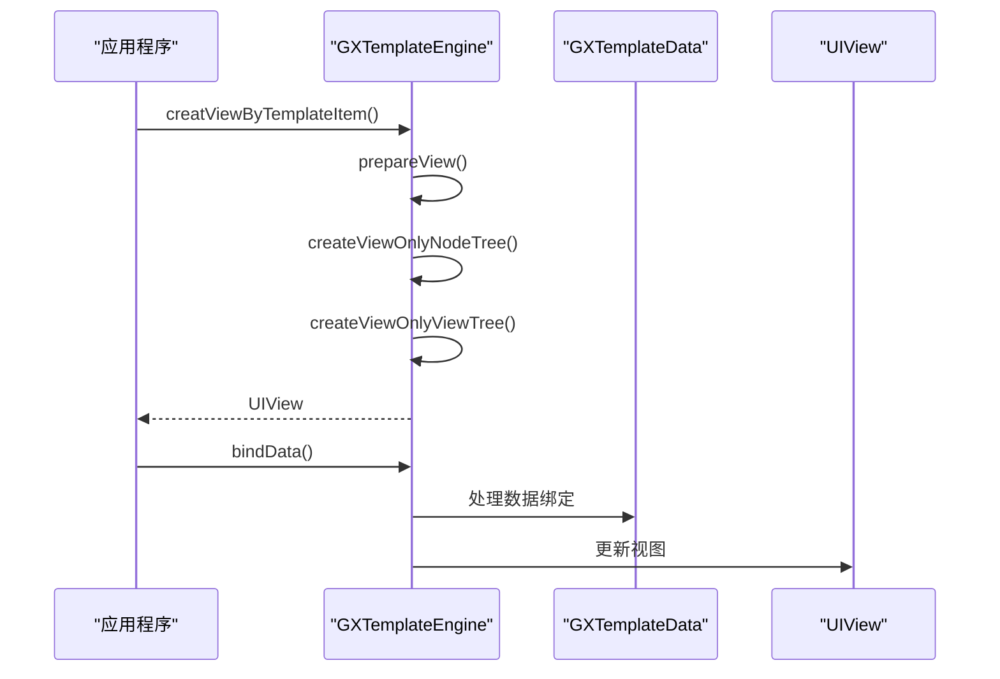
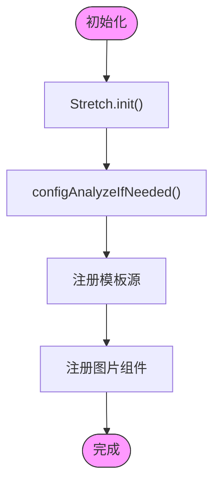
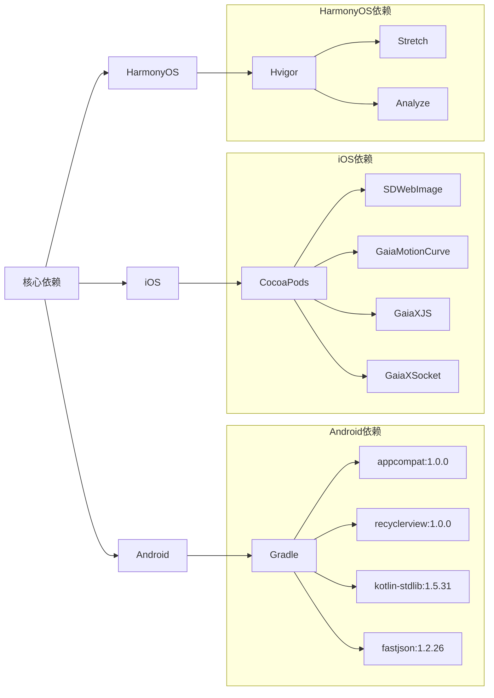

# 平台实现

<cite>
**本文档中引用的文件**  
- [build.gradle](file://GaiaXAndroid/build.gradle)
- [Podfile](file://GaiaXiOS/Podfile)
- [hvigorfile.ts](file://GaiaXHarmony/GaiaXCore/hvigorfile.ts)
- [GXTemplateEngine.kt](file://GaiaXAndroid/src/main/kotlin/com/alibaba/gaiax/GXTemplateEngine.kt)
- [GXTemplateEngine.ets](file://GaiaXHarmony/GaiaXCore/GaiaX/src/main/ets/GXTemplateEngine.ets)
- [GXTemplateEngine.h](file://GaiaXiOS/GaiaXiOS/Engine/GXTemplateEngine.h)
- [GaiaXiOS.h](file://GaiaXiOS/GaiaXiOS/GaiaXiOS.h)
- [README.md](file://README.md)
</cite>

## 目录
1. [简介](#简介)
2. [项目结构](#项目结构)
3. [核心组件](#核心组件)
4. [架构概述](#架构概述)
5. [详细组件分析](#详细组件分析)
6. [依赖分析](#依赖分析)
7. [性能考虑](#性能考虑)
8. [故障排除指南](#故障排除指南)
9. [结论](#结论)

## 简介
GaiaX 是阿里巴巴优酷技术团队研发的一套轻量级纯原生动态化卡片跨端解决方案。该平台旨在保证原生体验与性能的同时，帮助客户端开发实现低代码。GaiaX 支持 Android、iOS 和 HarmonyOS 三大平台，通过统一的模板引擎和渲染机制，实现跨平台一致性。本文档将深入探讨各平台的具体实现方式、技术栈、构建系统和集成方法。

## 项目结构
GaiaX 项目采用模块化设计，每个平台都有独立的实现模块，同时共享核心逻辑。项目结构清晰，便于维护和扩展。

**图源**
- [README.md](file://README.md#L39-L43)

**本节来源**
- [README.md](file://README.md#L1-L283)

## 核心组件
GaiaX 的核心组件包括模板引擎、数据管理、表达式分析和渲染系统。这些组件在各平台上共享，确保了跨平台的一致性。

**本节来源**
- [GXTemplateEngine.kt](file://GaiaXAndroid/src/main/kotlin/com/alibaba/gaiax/GXTemplateEngine.kt#L78-L925)
- [GXTemplateEngine.ets](file://GaiaXHarmony/GaiaXCore/GaiaX/src/main/ets/GXTemplateEngine.ets#L24-L47)
- [GXTemplateEngine.h](file://GaiaXiOS/GaiaXiOS/Engine/GXTemplateEngine.h#L25-L26)

## 架构概述
GaiaX 采用分层架构设计，将核心逻辑与平台特定实现分离。核心层包含模板解析、数据绑定和布局计算等通用功能，而各平台实现层则负责原生视图的创建和渲染。

**图源**
- [GXTemplateEngine.kt](file://GaiaXAndroid/src/main/kotlin/com/alibaba/gaiax/GXTemplateEngine.kt#L557-L582)
- [GXTemplateEngine.ets](file://GaiaXHarmony/GaiaXCore/GaiaX/src/main/ets/GXTemplateEngine.ets#L24-L47)

## 详细组件分析
### 模板引擎分析
模板引擎是 GaiaX 的核心组件，负责创建视图、绑定数据和管理模板生命周期。

#### Android实现
在 Android 平台上，模板引擎通过 Kotlin 实现，利用 Gradle 构建系统进行依赖管理。

**图源**
- [GXTemplateEngine.kt](file://GaiaXAndroid/src/main/kotlin/com/alibaba/gaiax/GXTemplateEngine.kt#L78-L925)

#### iOS实现
在 iOS 平台上，模板引擎通过 Objective-C 实现，使用 CocoaPods 进行依赖管理。

**图源**
- [GXTemplateEngine.h](file://GaiaXiOS/GaiaXiOS/Engine/GXTemplateEngine.h#L25-L26)
- [GaiaXiOS.h](file://GaiaXiOS/GaiaXiOS/GaiaXiOS.h#L30-L33)

#### HarmonyOS实现
在 HarmonyOS 平台上，模板引擎通过 ArkTS 实现，使用 Hvigor 构建工具进行项目管理。

**图源**
- [GXTemplateEngine.ets](file://GaiaXHarmony/GaiaXCore/GaiaX/src/main/ets/GXTemplateEngine.ets#L24-L47)
- [hvigorfile.ts](file://GaiaXHarmony/GaiaXCore/hvigorfile.ts#L1-L7)

**本节来源**
- [GXTemplateEngine.kt](file://GaiaXAndroid/src/main/kotlin/com/alibaba/gaiax/GXTemplateEngine.kt#L78-L925)
- [GXTemplateEngine.ets](file://GaiaXHarmony/GaiaXCore/GaiaX/src/main/ets/GXTemplateEngine.ets#L24-L47)
- [GXTemplateEngine.h](file://GaiaXiOS/GaiaXiOS/Engine/GXTemplateEngine.h#L25-L26)

## 依赖分析
GaiaX 各平台的依赖管理方式不同，但都遵循模块化原则，确保核心功能与平台特定实现的分离。

**图源**
- [build.gradle](file://GaiaXAndroid/build.gradle#L114-L134)
- [Podfile](file://GaiaXiOS/Podfile#L1-L32)
- [hvigorfile.ts](file://GaiaXHarmony/GaiaXCore/hvigorfile.ts#L1-L7)

**本节来源**
- [build.gradle](file://GaiaXAndroid/build.gradle#L1-L144)
- [Podfile](file://GaiaXiOS/Podfile#L1-L32)
- [hvigorfile.ts](file://GaiaXHarmony/GaiaXCore/hvigorfile.ts#L1-L7)

## 性能考虑
GaiaX 在设计时充分考虑了性能优化，通过多种策略确保各平台的高性能表现。

1. **缓存机制**：使用 GXGlobalCache 缓存布局计算结果，避免重复计算
2. **懒加载**：关键组件采用 lazy 初始化，减少启动时间
3. **内存管理**：及时释放不再使用的视图和上下文，防止内存泄漏
4. **异步处理**：耗时操作在后台线程执行，避免阻塞主线程

**本节来源**
- [GXTemplateEngine.kt](file://GaiaXAndroid/src/main/kotlin/com/alibaba/gaiax/GXTemplateEngine.kt#L493-L499)
- [GXTemplateEngine.kt](file://GaiaXAndroid/src/main/kotlin/com/alibaba/gaiax/GXTemplateEngine.kt#L634-L647)

## 故障排除指南
### 常见问题
1. **视图创建失败**：检查模板文件路径和格式是否正确
2. **数据绑定异常**：确认数据格式符合模板要求
3. **性能问题**：检查是否启用了调试模式，关闭 Trace 功能
4. **依赖冲突**：确保各平台依赖版本兼容

### 调试建议
- 使用 GXPropUtils.isTrace() 控制调试信息输出
- 通过 GXExceptionHelper 捕获和处理异常
- 利用 GXGlobalCache.clean() 清理缓存进行问题排查

**本节来源**
- [GXTemplateEngine.kt](file://GaiaXAndroid/src/main/kotlin/com/alibaba/gaiax/GXTemplateEngine.kt#L534-L540)
- [GXTemplateEngine.kt](file://GaiaXAndroid/src/main/kotlin/com/alibaba/gaiax/GXTemplateEngine.kt#L916-L919)

## 结论
GaiaX 平台通过统一的架构设计和平台特定的优化策略，成功实现了跨平台一致性与原生性能的平衡。Android 平台利用 Gradle 构建系统和 Kotlin 语言特性，iOS 平台采用 CocoaPods 依赖管理和 Objective-C 实现，而 HarmonyOS 平台则基于 ArkTS 和 Hvigor 工具链。各平台共享核心逻辑，同时保持对原生特性的充分利用，为开发者提供了高效、灵活的跨平台开发解决方案。