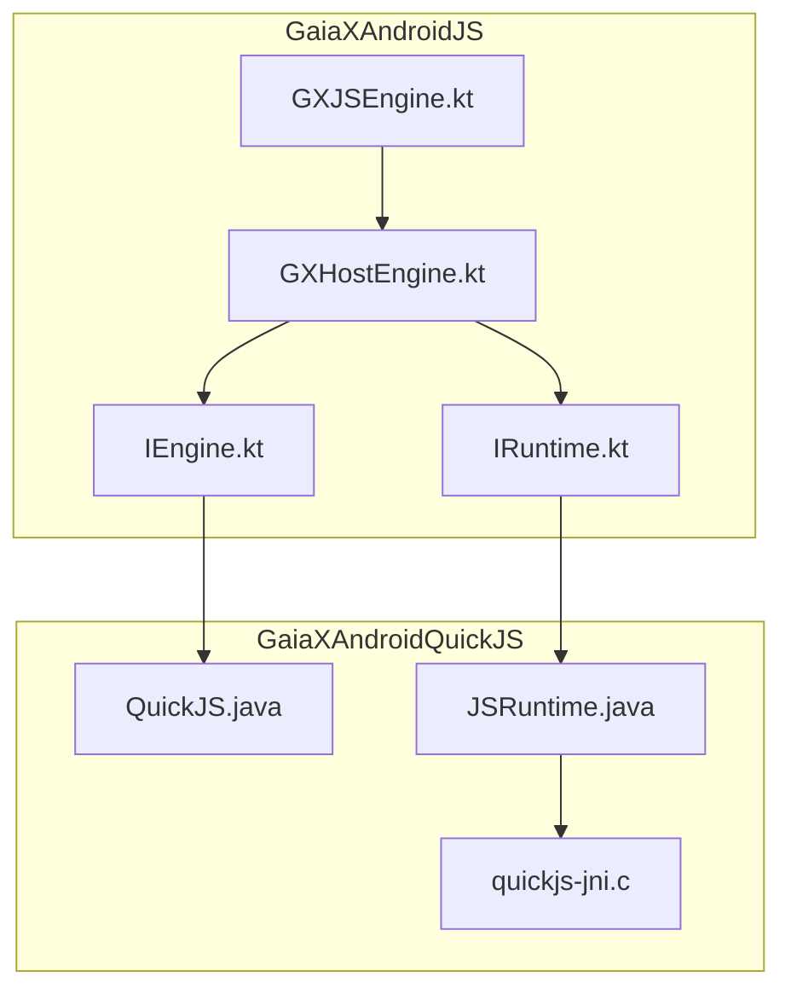
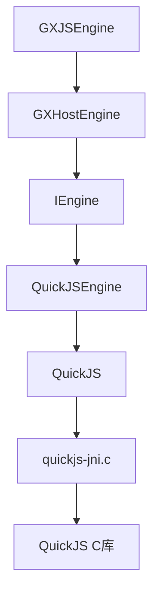
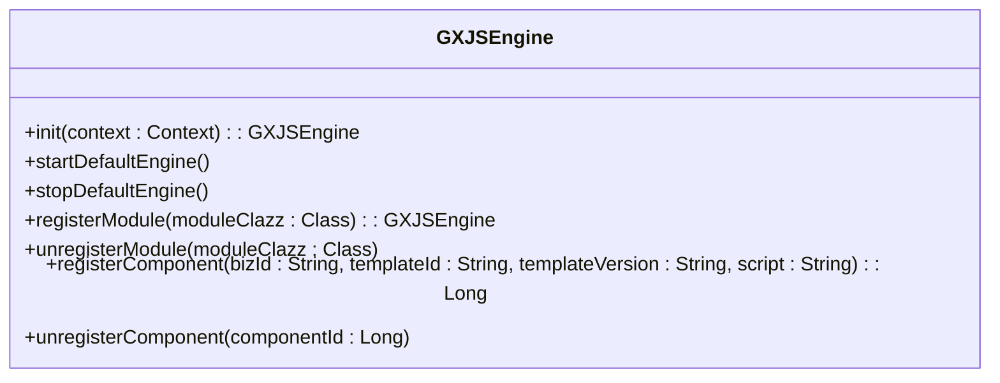
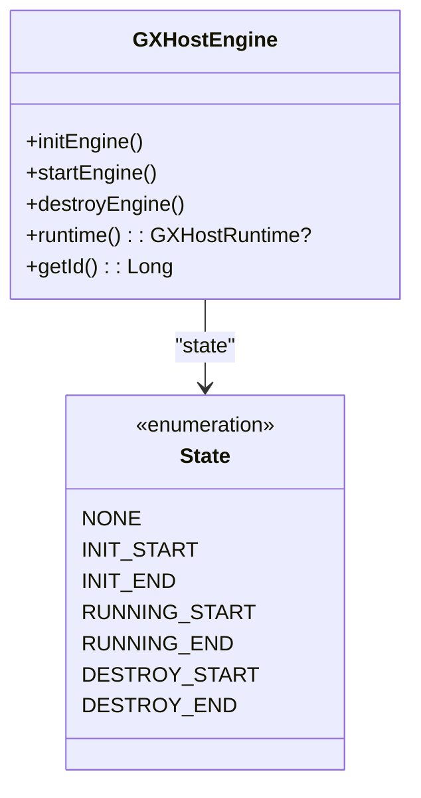
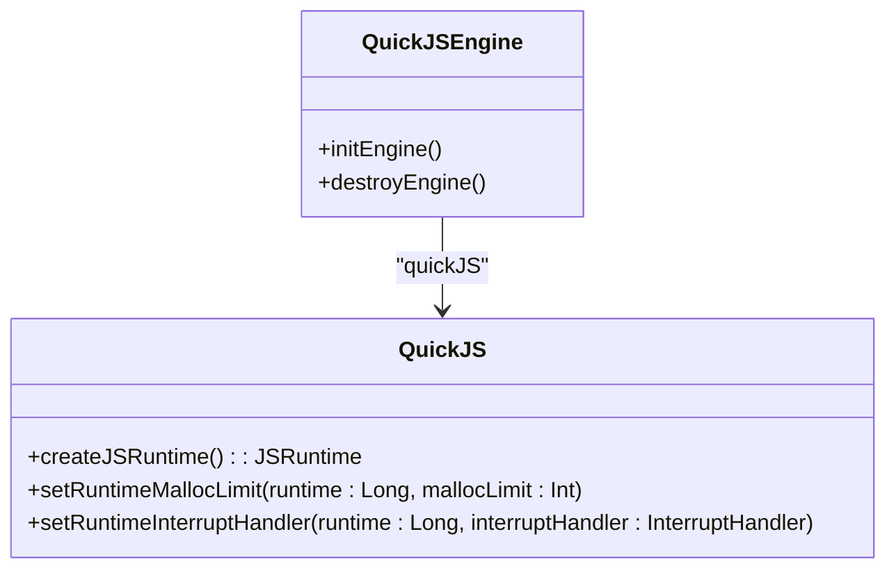
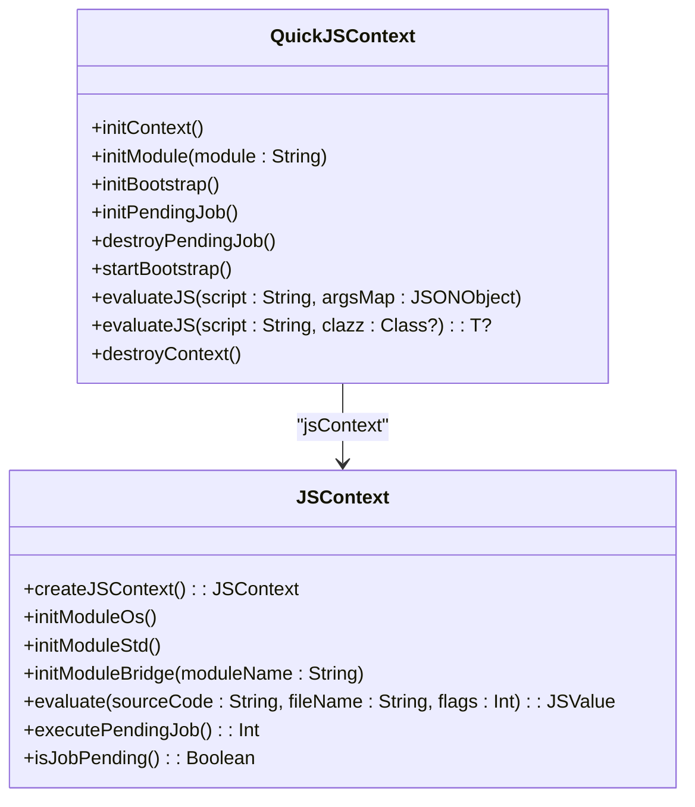
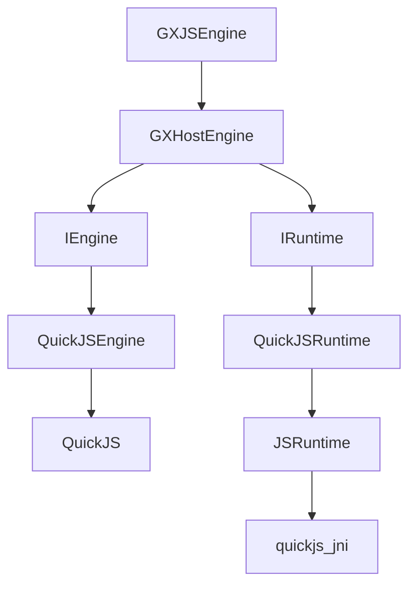

# JS引擎核心

<cite>
**本文档中引用的文件**  
- [GXJSEngine.kt](file://GaiaXAndroidJS/src/main/kotlin/com/alibaba/gaiax/js/GXJSEngine.kt)
- [GXHostEngine.kt](file://GaiaXAndroidJS/src/main/kotlin/com/alibaba/gaiax/js/engine/GXHostEngine.kt)
- [IEngine.kt](file://GaiaXAndroidJS/src/main/kotlin/com/alibaba/gaiax/js/engine/IEngine.kt)
- [IRuntime.kt](file://GaiaXAndroidJS/src/main/kotlin/com/alibaba/gaiax/js/engine/IRuntime.kt)
- [QuickJSEngine.kt](file://GaiaXAndroidJS/src/main/kotlin/com/alibaba/gaiax/js/impl/qjs/QuickJSEngine.kt)
- [QuickJSContext.kt](file://GaiaXAndroidJS/src/main/kotlin/com/alibaba/gaiax/js/impl/qjs/QuickJSContext.kt)
- [quickjs-jni.c](file://GaiaXAndroidQuickJS/src/main/c/quickjs-jni.c)
- [QuickJS.java](file://GaiaXAndroidQuickJS/src/main/java/com/alibaba/gaiax/quickjs/QuickJS.java)
- [JSRuntime.java](file://GaiaXAndroidQuickJS/src/main/java/com/alibaba/gaiax/quickjs/JSRuntime.java)
</cite>

## 目录
1. [简介](#简介)
2. [项目结构](#项目结构)
3. [核心组件](#核心组件)
4. [架构概述](#架构概述)
5. [详细组件分析](#详细组件分析)
6. [依赖分析](#依赖分析)
7. [性能考虑](#性能考虑)
8. [故障排除指南](#故障排除指南)
9. [结论](#结论)

## 简介
本文档深入探讨了GaiaX JS引擎的核心实现，重点分析了GXJSEngine作为JavaScript执行环境的核心组件。文档详细解释了引擎的初始化流程、生命周期管理以及与底层QuickJS的交互机制。同时，阐述了GXHostEngine如何协调原生环境与JS运行时的交互，包括上下文创建、内存管理和线程调度。为开发者提供了引擎配置和初始化的最佳实践，并深入解析了运行时性能优化策略和多实例管理。

## 项目结构
GaiaX JS引擎的实现主要分布在`GaiaXAndroidJS`和`GaiaXAndroidQuickJS`两个模块中。`GaiaXAndroidJS`模块提供了Kotlin层的高级封装，而`GaiaXAndroidQuickJS`模块则包含了与QuickJS交互的JNI（Java Native Interface）代码。

**图表来源**
- [GXJSEngine.kt](file://GaiaXAndroidJS/src/main/kotlin/com/alibaba/gaiax/js/GXJSEngine.kt)
- [GXHostEngine.kt](file://GaiaXAndroidJS/src/main/kotlin/com/alibaba/gaiax/js/engine/GXHostEngine.kt)
- [IEngine.kt](file://GaiaXAndroidJS/src/main/kotlin/com/alibaba/gaiax/js/engine/IEngine.kt)
- [IRuntime.kt](file://GaiaXAndroidJS/src/main/kotlin/com/alibaba/gaiax/js/engine/IRuntime.kt)
- [QuickJS.java](file://GaiaXAndroidQuickJS/src/main/java/com/alibaba/gaiax/quickjs/QuickJS.java)
- [JSRuntime.java](file://GaiaXAndroidQuickJS/src/main/java/com/alibaba/gaiax/quickjs/JSRuntime.java)
- [quickjs-jni.c](file://GaiaXAndroidQuickJS/src/main/c/quickjs-jni.c)

**章节来源**
- [GXJSEngine.kt](file://GaiaXAndroidJS/src/main/kotlin/com/alibaba/gaiax/js/GXJSEngine.kt)
- [GXHostEngine.kt](file://GaiaXAndroidJS/src/main/kotlin/com/alibaba/gaiax/js/engine/GXHostEngine.kt)

## 核心组件
GXJSEngine是整个JS引擎的入口点，负责管理引擎的生命周期和模块注册。GXHostEngine作为宿主引擎，封装了底层的IEngine实现（如QuickJSEngine），并提供了统一的接口。IEngine和IRuntime接口定义了引擎和运行时的基本行为，确保了不同实现之间的兼容性。

**章节来源**
- [GXJSEngine.kt](file://GaiaXAndroidJS/src/main/kotlin/com/alibaba/gaiax/js/GXJSEngine.kt)
- [GXHostEngine.kt](file://GaiaXAndroidJS/src/main/kotlin/com/alibaba/gaiax/js/engine/GXHostEngine.kt)
- [IEngine.kt](file://GaiaXAndroidJS/src/main/kotlin/com/alibaba/gaiax/js/engine/IEngine.kt)
- [IRuntime.kt](file://GaiaXAndroidJS/src/main/kotlin/com/alibaba/gaiax/js/engine/IRuntime.kt)

## 架构概述
GaiaX JS引擎采用分层架构，上层为Kotlin封装，下层为JNI与QuickJS交互。GXJSEngine通过GXHostEngine管理引擎实例，GXHostEngine通过IEngine接口与具体的引擎实现（如QuickJSEngine）交互。QuickJSEngine通过JNI调用底层的QuickJS C库，实现JavaScript的执行。

**图表来源**
- [GXJSEngine.kt](file://GaiaXAndroidJS/src/main/kotlin/com/alibaba/gaiax/js/GXJSEngine.kt)
- [GXHostEngine.kt](file://GaiaXAndroidJS/src/main/kotlin/com/alibaba/gaiax/js/engine/GXHostEngine.kt)
- [IEngine.kt](file://GaiaXAndroidJS/src/main/kotlin/com/alibaba/gaiax/js/engine/IEngine.kt)
- [QuickJSEngine.kt](file://GaiaXAndroidJS/src/main/kotlin/com/alibaba/gaiax/js/impl/qjs/QuickJSEngine.kt)
- [QuickJS.java](file://GaiaXAndroidQuickJS/src/main/java/com/alibaba/gaiax/quickjs/QuickJS.java)
- [quickjs-jni.c](file://GaiaXAndroidQuickJS/src/main/c/quickjs-jni.c)

## 详细组件分析

### GXJSEngine分析
GXJSEngine是JS引擎的管理类，负责引擎的初始化、启动、停止和模块注册。它通过单例模式提供全局访问点，并管理QuickJS和DebugJS两种引擎实例。

**图表来源**
- [GXJSEngine.kt](file://GaiaXAndroidJS/src/main/kotlin/com/alibaba/gaiax/js/GXJSEngine.kt)

### GXHostEngine分析
GXHostEngine是宿主引擎，负责管理引擎的生命周期。它通过状态机管理引擎的初始化、运行和销毁过程，并通过IEngine接口与具体的引擎实现交互。

**图表来源**
- [GXHostEngine.kt](file://GaiaXAndroidJS/src/main/kotlin/com/alibaba/gaiax/js/engine/GXHostEngine.kt)

### QuickJSEngine分析
QuickJSEngine是IEngine接口的具体实现，负责与QuickJS底层交互。它通过QuickJS类创建JSRuntime，并在初始化时配置内存限制和中断处理。

**图表来源**
- [QuickJSEngine.kt](file://GaiaXAndroidJS/src/main/kotlin/com/alibaba/gaiax/js/impl/qjs/QuickJSEngine.kt)
- [QuickJS.java](file://GaiaXAndroidQuickJS/src/main/java/com/alibaba/gaiax/quickjs/QuickJS.java)

### QuickJSContext分析
QuickJSContext是JS执行上下文的封装，负责管理JS代码的执行、模块初始化和定时器。它通过JSContext与底层QuickJS交互，并提供了模块初始化和脚本执行的接口。

**图表来源**
- [QuickJSContext.kt](file://GaiaXAndroidJS/src/main/kotlin/com/alibaba/gaiax/js/impl/qjs/QuickJSContext.kt)
- [JSRuntime.java](file://GaiaXAndroidQuickJS/src/main/java/com/alibaba/gaiax/quickjs/JSRuntime.java)

**章节来源**
- [QuickJSContext.kt](file://GaiaXAndroidJS/src/main/kotlin/com/alibaba/gaiax/js/impl/qjs/QuickJSContext.kt)
- [JSRuntime.java](file://GaiaXAndroidQuickJS/src/main/java/com/alibaba/gaiax/quickjs/JSRuntime.java)

## 依赖分析
GaiaX JS引擎的依赖关系清晰，上层模块依赖下层模块，通过接口进行解耦。GXJSEngine依赖GXHostEngine，GXHostEngine依赖IEngine和IRuntime，IEngine和IRuntime依赖具体的实现类。

**图表来源**
- [GXJSEngine.kt](file://GaiaXAndroidJS/src/main/kotlin/com/alibaba/gaiax/js/GXJSEngine.kt)
- [GXHostEngine.kt](file://GaiaXAndroidJS/src/main/kotlin/com/alibaba/gaiax/js/engine/GXHostEngine.kt)
- [IEngine.kt](file://GaiaXAndroidJS/src/main/kotlin/com/alibaba/gaiax/js/engine/IEngine.kt)
- [IRuntime.kt](file://GaiaXAndroidJS/src/main/kotlin/com/alibaba/gaiax/js/engine/IRuntime.kt)
- [QuickJSEngine.kt](file://GaiaXAndroidJS/src/main/kotlin/com/alibaba/gaiax/js/impl/qjs/QuickJSEngine.kt)
- [QuickJS.java](file://GaiaXAndroidQuickJS/src/main/java/com/alibaba/gaiax/quickjs/QuickJS.java)
- [JSRuntime.java](file://GaiaXAndroidQuickJS/src/main/java/com/alibaba/gaiax/quickjs/JSRuntime.java)
- [quickjs-jni.c](file://GaiaXAndroidQuickJS/src/main/c/quickjs-jni.c)

**章节来源**
- [GXJSEngine.kt](file://GaiaXAndroidJS/src/main/kotlin/com/alibaba/gaiax/js/GXJSEngine.kt)
- [GXHostEngine.kt](file://GaiaXAndroidJS/src/main/kotlin/com/alibaba/gaiax/js/engine/GXHostEngine.kt)
- [IEngine.kt](file://GaiaXAndroidJS/src/main/kotlin/com/alibaba/gaiax/js/engine/IEngine.kt)
- [IRuntime.kt](file://GaiaXAndroidJS/src/main/kotlin/com/alibaba/gaiax/js/engine/IRuntime.kt)

## 性能考虑
在性能方面，GaiaX JS引擎通过多种机制优化执行效率。首先，通过`setRuntimeMallocLimit`和`setRuntimeMaxStackSize`限制内存和栈大小，防止资源耗尽。其次，通过`setRuntimeInterruptHandler`实现中断处理，避免长时间运行的脚本阻塞主线程。此外，通过`executePendingJob`和`isJobPending`管理异步任务，确保事件循环的高效运行。

**章节来源**
- [QuickJS.java](file://GaiaXAndroidQuickJS/src/main/java/com/alibaba/gaiax/quickjs/QuickJS.java)
- [JSRuntime.java](file://GaiaXAndroidQuickJS/src/main/java/com/alibaba/gaiax/quickjs/JSRuntime.java)
- [quickjs-jni.c](file://GaiaXAndroidQuickJS/src/main/c/quickjs-jni.c)

## 故障排除指南
在使用GaiaX JS引擎时，可能会遇到内存泄漏、线程阻塞等问题。为解决这些问题，建议启用内存限制和中断处理，并定期检查`isJobPending`状态。此外，通过`setPromiseRejectionHandler`捕获未处理的Promise拒绝，可以及时发现和修复异步错误。

**章节来源**
- [JSRuntime.java](file://GaiaXAndroidQuickJS/src/main/java/com/alibaba/gaiax/quickjs/JSRuntime.java)
- [quickjs-jni.c](file://GaiaXAndroidQuickJS/src/main/c/quickjs-jni.c)

## 结论
GaiaX JS引擎通过分层架构和接口抽象，实现了高效、灵活的JavaScript执行环境。通过深入理解其核心组件和交互机制，开发者可以更好地利用该引擎，构建高性能的动态化应用。