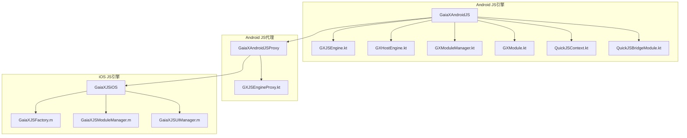
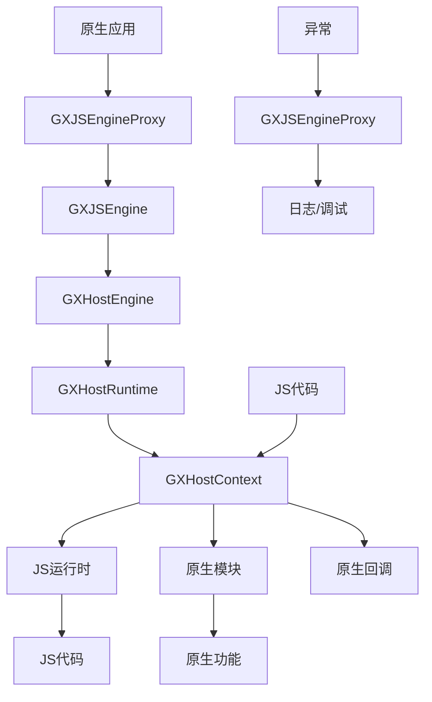
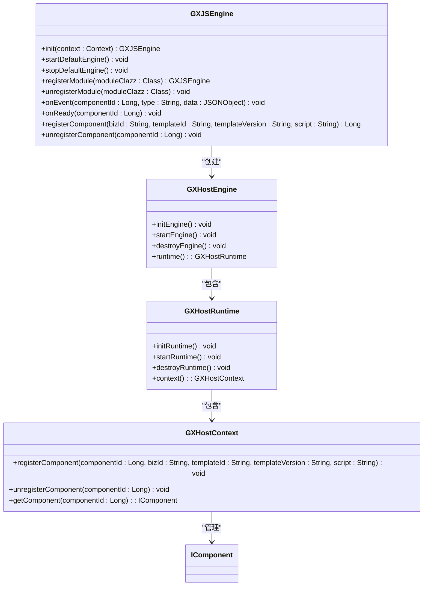
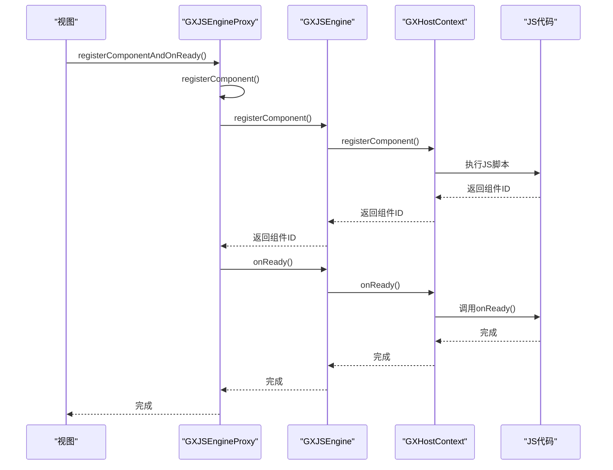
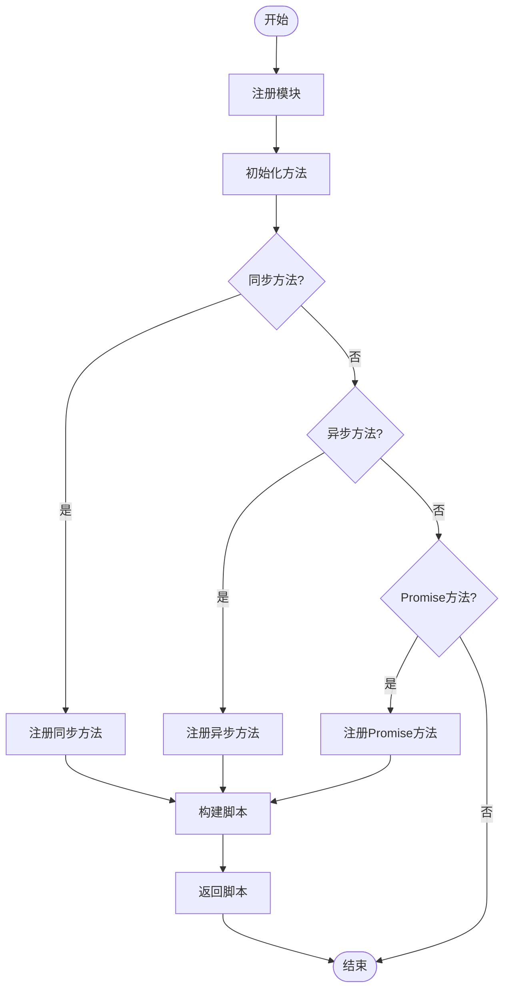
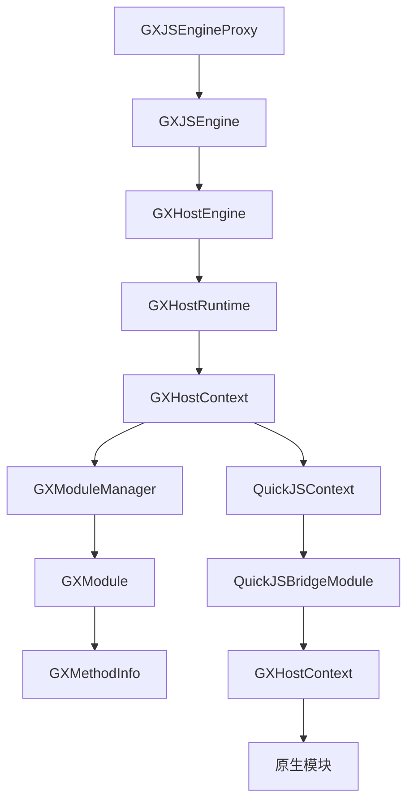

# JS引擎集成

<cite>
**本文档引用的文件**   
- [GXJSEngine.kt](file://GaiaXAndroidJS/src/main/kotlin/com/alibaba/gaiax/js/GXJSEngine.kt)
- [GXHostEngine.kt](file://GaiaXAndroidJS/src/main/kotlin/com/alibaba/gaiax/js/engine/GXHostEngine.kt)
- [GXJSEngineProxy.kt](file://GaiaXAndroidJSProxy/src/main/java/com/alibaba/gaiax/js/proxy/GXJSEngineProxy.kt)
- [GXModuleManager.kt](file://GaiaXAndroidJS/src/main/kotlin/com/alibaba/gaiax/js/support/GXModuleManager.kt)
- [GXModule.kt](file://GaiaXAndroidJS/src/main/kotlin/com/alibaba/gaiax/js/support/GXModule.kt)
- [QuickJSContext.kt](file://GaiaXAndroidJS/src/main/kotlin/com/alibaba/gaiax/js/impl/qjs/QuickJSContext.kt)
- [QuickJSBridgeModule.kt](file://GaiaXAndroidJS/src/main/kotlin/com/alibaba/gaiax/js/impl/qjs/module/QuickJSBridgeModule.kt)
- [GaiaXJSFactory.m](file://GaiaXJSiOS/GaiaXJS/src/GaiaXJSFactory.m)
- [GaiaXJSModuleManager.m](file://GaiaXJSiOS/GaiaXJS/src/wrapper/module/GaiaXJSModuleManager.m)
- [GaiaXJSUIManager.m](file://GaiaXJSiOS/GaiaXJS/src/wrapper/ui/GaiaXJSUIManager.m)
</cite>

## 目录
1. [简介](#简介)
2. [项目结构](#项目结构)
3. [核心组件](#核心组件)
4. [架构概述](#架构概述)
5. [详细组件分析](#详细组件分析)
6. [依赖分析](#依赖分析)
7. [性能考虑](#性能考虑)
8. [故障排除指南](#故障排除指南)
9. [结论](#结论)

## 简介
本文档深入探讨了GaiaX JS引擎的集成机制，重点介绍GXJSEngine如何实现JavaScript脚本支持。文档详细解释了JS引擎的初始化、上下文管理、模块注册和方法调用机制，以及GXHostEngine如何在原生环境中执行JS代码。同时，文档还阐述了GXJSEngineProxy如何实现原生与JS的双向通信，为初学者提供JS模块的创建和注册方法，并为经验丰富的开发者提供性能优化建议和内存管理策略。

## 项目结构
项目结构清晰地展示了JS引擎相关的模块和文件组织。核心JS引擎功能位于`GaiaXAndroidJS`模块中，而JS引擎的代理和增强功能则位于`GaiaXAndroidJSProxy`模块中。iOS平台的JS引擎实现位于`GaiaXJSiOS`模块中。

**图表来源**
- [GXJSEngine.kt](file://GaiaXAndroidJS/src/main/kotlin/com/alibaba/gaiax/js/GXJSEngine.kt)
- [GXJSEngineProxy.kt](file://GaiaXAndroidJSProxy/src/main/java/com/alibaba/gaiax/js/proxy/GXJSEngineProxy.kt)
- [GaiaXJSFactory.m](file://GaiaXJSiOS/GaiaXJS/src/GaiaXJSFactory.m)

## 核心组件
本节深入分析JS引擎的核心组件，包括GXJSEngine、GXHostEngine、GXJSEngineProxy等，探讨它们的职责和相互关系。

**章节来源**
- [GXJSEngine.kt](file://GaiaXAndroidJS/src/main/kotlin/com/alibaba/gaiax/js/GXJSEngine.kt)
- [GXHostEngine.kt](file://GaiaXAndroidJS/src/main/kotlin/com/alibaba/gaiax/js/engine/GXHostEngine.kt)
- [GXJSEngineProxy.kt](file://GaiaXAndroidJSProxy/src/main/java/com/alibaba/gaiax/js/proxy/GXJSEngineProxy.kt)

## 架构概述
本节提供JS引擎集成的全面架构视图，解释各组件如何协同工作。

**图表来源**
- [GXJSEngine.kt](file://GaiaXAndroidJS/src/main/kotlin/com/alibaba/gaiax/js/GXJSEngine.kt)
- [GXHostEngine.kt](file://GaiaXAndroidJS/src/main/kotlin/com/alibaba/gaiax/js/engine/GXHostEngine.kt)
- [GXJSEngineProxy.kt](file://GaiaXAndroidJSProxy/src/main/java/com/alibaba/gaiax/js/proxy/GXJSEngineProxy.kt)

## 详细组件分析
本节对JS引擎的关键组件进行彻底分析，包括组件分析、代码片段路径、解释和图表。

### GXJSEngine分析
GXJSEngine是JS引擎的核心类，负责JS引擎的启动、关闭和自定义模块的注册等逻辑。

#### 类图

**图表来源**
- [GXJSEngine.kt](file://GaiaXAndroidJS/src/main/kotlin/com/alibaba/gaiax/js/GXJSEngine.kt)
- [GXHostEngine.kt](file://GaiaXAndroidJS/src/main/kotlin/com/alibaba/gaiax/js/engine/GXHostEngine.kt)

### GXJSEngineProxy分析
GXJSEngineProxy是JS引擎的代理增强类，封装了与GaiaX渲染库组合使用的一些常用方法。

#### 序列图

**图表来源**
- [GXJSEngineProxy.kt](file://GaiaXAndroidJSProxy/src/main/java/com/alibaba/gaiax/js/proxy/GXJSEngineProxy.kt)
- [GXJSEngine.kt](file://GaiaXAndroidJS/src/main/kotlin/com/alibaba/gaiax/js/GXJSEngine.kt)

### 模块注册分析
本节分析JS模块的注册机制，包括同步、异步和Promise方法的注册。

#### 流程图

**图表来源**
- [GXModule.kt](file://GaiaXAndroidJS/src/main/kotlin/com/alibaba/gaiax/js/support/GXModule.kt)
- [GXModuleManager.kt](file://GaiaXAndroidJS/src/main/kotlin/com/alibaba/gaiax/js/support/GXModuleManager.kt)

**章节来源**
- [GXModule.kt](file://GaiaXAndroidJS/src/main/kotlin/com/alibaba/gaiax/js/support/GXModule.kt)
- [GXModuleManager.kt](file://GaiaXAndroidJS/src/main/kotlin/com/alibaba/gaiax/js/support/GXModuleManager.kt)

## 依赖分析
本节分析组件之间的依赖关系。

**图表来源**
- [GXJSEngineProxy.kt](file://GaiaXAndroidJSProxy/src/main/java/com/alibaba/gaiax/js/proxy/GXJSEngineProxy.kt)
- [GXJSEngine.kt](file://GaiaXAndroidJS/src/main/kotlin/com/alibaba/gaiax/js/GXJSEngine.kt)
- [GXHostEngine.kt](file://GaiaXAndroidJS/src/main/kotlin/com/alibaba/gaiax/js/engine/GXHostEngine.kt)
- [GXModuleManager.kt](file://GaiaXAndroidJS/src/main/kotlin/com/alibaba/gaiax/js/support/GXModuleManager.kt)
- [GXModule.kt](file://GaiaXAndroidJS/src/main/kotlin/com/alibaba/gaiax/js/support/GXModule.kt)
- [QuickJSContext.kt](file://GaiaXAndroidJS/src/main/kotlin/com/alibaba/gaiax/js/impl/qjs/QuickJSContext.kt)
- [QuickJSBridgeModule.kt](file://GaiaXAndroidJS/src/main/kotlin/com/alibaba/gaiax/js/impl/qjs/module/QuickJSBridgeModule.kt)

**章节来源**
- [GXJSEngineProxy.kt](file://GaiaXAndroidJSProxy/src/main/java/com/alibaba/gaiax/js/proxy/GXJSEngineProxy.kt)
- [GXJSEngine.kt](file://GaiaXAndroidJS/src/main/kotlin/com/alibaba/gaiax/js/GXJSEngine.kt)
- [GXHostEngine.kt](file://GaiaXAndroidJS/src/main/kotlin/com/alibaba/gaiax/js/engine/GXHostEngine.kt)

## 性能考虑
本节讨论JS引擎的性能优化策略，包括上下文池化、异步调用优化和内存管理。

**章节来源**
- [GXJSEngine.kt](file://GaiaXAndroidJS/src/main/kotlin/com/alibaba/gaiax/js/GXJSEngine.kt)
- [GXHostEngine.kt](file://GaiaXAndroidJS/src/main/kotlin/com/alibaba/gaiax/js/engine/GXHostEngine.kt)
- [QuickJSContext.kt](file://GaiaXAndroidJS/src/main/kotlin/com/alibaba/gaiax/js/impl/qjs/QuickJSContext.kt)

## 故障排除指南
本节分析错误处理代码和调试工具。

**章节来源**
- [GXJSEngine.kt](file://GaiaXAndroidJS/src/main/kotlin/com/alibaba/gaiax/js/GXJSEngine.kt)
- [GXJSEngineProxy.kt](file://GaiaXAndroidJSProxy/src/main/java/com/alibaba/gaiax/js/proxy/GXJSEngineProxy.kt)
- [QuickJSBridgeModule.kt](file://GaiaXAndroidJS/src/main/kotlin/com/alibaba/gaiax/js/impl/qjs/module/QuickJSBridgeModule.kt)

## 结论
本文档全面介绍了GaiaX JS引擎的集成机制，涵盖了从初始化到模块注册、方法调用和错误处理的各个方面。通过深入分析核心组件和架构，为开发者提供了理解和优化JS引擎集成的坚实基础。