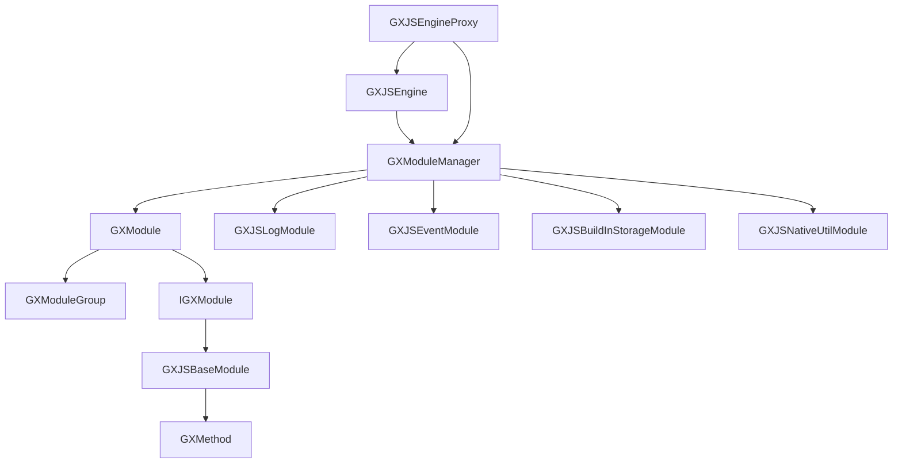

# JS模块系统

<cite>
**本文档引用的文件**  
- [GXJSEngine.kt](file://GaiaXAndroidJS/src/main/kotlin/com/alibaba/gaiax/js/GXJSEngine.kt)
- [GXModuleManager.kt](file://GaiaXAndroidJS/src/main/kotlin/com/alibaba/gaiax/js/support/GXModuleManager.kt)
- [GXModule.kt](file://GaiaXAndroidJS/src/main/kotlin/com/alibaba/gaiax/js/support/GXModule.kt)
- [GXModuleGroup.kt](file://GaiaXAndroidJS/src/main/kotlin/com/alibaba/gaiax/js/support/GXModuleGroup.kt)
- [GXJSBaseModule.kt](file://GaiaXAndroidJS/src/main/kotlin/com/alibaba/gaiax/js/api/GXJSBaseModule.kt)
- [IGXModule.kt](file://GaiaXAndroidJS/src/main/kotlin/com/alibaba/gaiax/js/api/IGXModule.kt)
- [GXJSLogModule.kt](file://GaiaXAndroidJSProxy/src/main/java/com/alibaba/gaiax/js/proxy/modules/GXJSLogModule.kt)
- [GXJSEventModule.kt](file://GaiaXAndroidJSProxy/src/main/java/com/alibaba/gaiax/js/proxy/modules/GXJSEventModule.kt)
- [GXJSBuildInStorageModule.kt](file://GaiaXAndroidJSProxy/src/main/java/com/alibaba/gaiax/js/proxy/modules/GXJSBuildInStorageModule.kt)
- [GXJSNativeUtilModule.kt](file://GaiaXAndroidJSProxy/src/main/java/com/alibaba/gaiax/js/proxy/modules/GXJSNativeUtilModule.kt)
- [GXJSEngineProxy.kt](file://GaiaXAndroidJSProxy/src/main/java/com/alibaba/gaiax/js/proxy/GXJSEngineProxy.kt)
- [GXRegisterCenter.tsx](file://GaiaXTaro/packages/gaiax-taro/src/gaiax/GXRegisterCenter.tsx)
- [GXRegisterCenterInstance.tsx](file://GaiaXTaro/packages/gaiax-taro/src/gaiax/GXRegisterCenterInstance.tsx)
</cite>

## 目录
1. [简介](#简介)
2. [项目结构](#项目结构)
3. [核心组件](#核心组件)
4. [架构概述](#架构概述)
5. [详细组件分析](#详细组件分析)
6. [依赖分析](#依赖分析)
7. [性能考虑](#性能考虑)
8. [故障排除指南](#故障排除指南)
9. [结论](#结论)

## 简介
本文档深入探讨GaiaX框架中的JS模块系统，重点介绍GXModuleManager如何管理JS模块的注册、发现和调用。文档详细说明了自定义JS模块的创建方法，包括使用@GXMethod注解声明导出方法和实现IGXModule接口。同时，文档还介绍了内置模块如GXJSLogModule、GXJSEventModule和GXJSBuildInStorageModule的功能和使用场景。为初学者提供模块开发的完整示例，同时为经验丰富的开发者讲解模块间通信、依赖管理和版本控制策略。文档包含实际代码示例，展示如何在模板中调用JS模块方法以及处理回调和Promise。此外，文档还解释了模块安全机制和权限控制，以及如何扩展自定义功能模块。最后，文档解决常见问题如模块冲突、方法找不到等，并提供模块化设计的最佳实践。

## 项目结构
GaiaX的JS模块系统主要分布在以下几个模块中：
- **GaiaXAndroidJS**: 包含JS引擎核心实现，包括模块管理、方法调用等。
- **GaiaXAndroidJSProxy**: 包含内置JS模块的实现，如日志、事件、存储等。
- **GaiaXAndroidJSProxy**: 包含JS引擎代理，负责与原生代码的通信。
- **GaiaXAndroidJS**: 包含JS引擎的初始化和配置。
- **GaiaXAndroidJS**: 包含JS模块的注解和接口定义。

```mermaid
graph TB
subgraph "JS引擎核心"
GXJSEngine[GXJSEngine]
GXModuleManager[GXModuleManager]
GXModule[GXModule]
GXModuleGroup[GXModuleGroup]
end
subgraph "JS模块接口"
IGXModule[IGXModule]
GXJSBaseModule[GXJSBaseModule]
GXMethod[@GXMethod]
end
subgraph "内置模块实现"
GXJSLogModule[GXJSLogModule]
GXJSEventModule[GXJSEventModule]
GXJSBuildInStorageModule[GXJSBuildInStorageModule]
GXJSNativeUtilModule[GXJSNativeUtilModule]
end
subgraph "JS引擎代理"
GXJSEngineProxy[GXJSEngineProxy]
end
GXJSEngine --> GXModuleManager
GXModuleManager --> GXModule
GXModule --> GXModuleGroup
GXModule --> IGXModule
IGXModule --> GXJSBaseModule
GXJSBaseModule --> GXMethod
GXModuleManager --> GXJSLogModule
GXModuleManager --> GXJSEventModule
GXModuleManager --> GXJSBuildInStorageModule
GXModuleManager --> GXJSNativeUtilModule
GXJSEngineProxy --> GXJSEngine
GXJSEngineProxy --> GXModuleManager
```

**图示来源**
- [GXJSEngine.kt](file://GaiaXAndroidJS/src/main/kotlin/com/alibaba/gaiax/js/GXJSEngine.kt)
- [GXModuleManager.kt](file://GaiaXAndroidJS/src/main/kotlin/com/alibaba/gaiax/js/support/GXModuleManager.kt)
- [GXModule.kt](file://GaiaXAndroidJS/src/main/kotlin/com/alibaba/gaiax/js/support/GXModule.kt)
- [GXModuleGroup.kt](file://GaiaXAndroidJS/src/main/kotlin/com/alibaba/gaiax/js/support/GXModuleGroup.kt)
- [GXJSBaseModule.kt](file://GaiaXAndroidJS/src/main/kotlin/com/alibaba/gaiax/js/api/GXJSBaseModule.kt)
- [IGXModule.kt](file://GaiaXAndroidJS/src/main/kotlin/com/alibaba/gaiax/js/api/IGXModule.kt)
- [GXJSLogModule.kt](file://GaiaXAndroidJSProxy/src/main/java/com/alibaba/gaiax/js/proxy/modules/GXJSLogModule.kt)
- [GXJSEventModule.kt](file://GaiaXAndroidJSProxy/src/main/java/com/alibaba/gaiax/js/proxy/modules/GXJSEventModule.kt)
- [GXJSBuildInStorageModule.kt](file://GaiaXAndroidJSProxy/src/main/java/com/alibaba/gaiax/js/proxy/modules/GXJSBuildInStorageModule.kt)
- [GXJSNativeUtilModule.kt](file://GaiaXAndroidJSProxy/src/main/java/com/alibaba/gaiax/js/proxy/modules/GXJSNativeUtilModule.kt)
- [GXJSEngineProxy.kt](file://GaiaXAndroidJSProxy/src/main/java/com/alibaba/gaiax/js/proxy/GXJSEngineProxy.kt)

## 核心组件
### GXModuleManager
GXModuleManager是JS模块系统的核心管理器，负责模块的注册、注销和调用。它维护了一个模块组的映射，每个模块组包含多个模块实例。模块组通过模块名称进行索引，模块实例通过模块ID进行索引。

**模块注册**
当一个模块被注册时，GXModuleManager会检查该模块是否已经存在。如果不存在，则创建一个新的模块实例，并将其添加到相应的模块组中。模块实例的创建涉及到反射调用模块类的无参构造函数。

**模块调用**
GXModuleManager提供了同步、异步和Promise三种调用方式。调用时，首先根据模块ID找到对应的模块组，然后在模块组中查找对应的模块实例，最后调用模块实例的方法。

**模块脚本生成**
GXModuleManager还负责生成模块的JavaScript脚本。脚本生成过程中，会遍历所有模块组，为每个模块组生成相应的模块声明脚本和方法声明脚本。

### GXModule
GXModule是模块的封装类，负责管理模块的方法。每个GXModule实例对应一个具体的模块类实例。GXModule通过反射扫描模块类中的方法，识别出带有@GXSyncMethod、@GXAsyncMethod和@GXPromiseMethod注解的方法，并将这些方法注册到相应的映射中。

**方法注册**
GXModule在初始化时会扫描模块类中的所有方法，识别出带有特定注解的方法，并为每个方法生成一个唯一的ID。这些方法ID和方法信息被存储在syncMethods、asyncMethods和promiseMethods三个映射中。

**方法调用**
当收到调用请求时，GXModule会根据方法ID从相应的映射中查找方法信息，然后通过反射调用对应的方法。调用过程中会捕获异常并记录日志。

### GXModuleGroup
GXModuleGroup是模块组的封装类，负责管理一组模块实例。每个模块组对应一个模块名称，可以包含多个模块实例。GXModuleGroup提供了添加、删除和查找模块实例的方法。

**模块脚本生成**
GXModuleGroup负责生成模块组的JavaScript脚本。脚本生成过程中，会遍历所有模块实例，为每个模块实例生成相应的模块声明脚本和方法声明脚本。

## 架构概述
GaiaX的JS模块系统采用分层架构设计，主要包括以下几个层次：
- **模块管理层**: 负责模块的注册、注销和调用，由GXModuleManager实现。
- **模块封装层**: 负责模块的封装和方法管理，由GXModule实现。
- **模块组管理层**: 负责模块组的管理，由GXModuleGroup实现。
- **模块接口层**: 定义模块的基本接口，由IGXModule和GXJSBaseModule实现。
- **模块注解层**: 定义模块方法的注解，由@GXSyncMethod、@GXAsyncMethod和@GXPromiseMethod实现。
- **内置模块层**: 实现具体的内置模块功能，如日志、事件、存储等。
- **JS引擎代理层**: 负责与原生代码的通信，由GXJSEngineProxy实现。

```mermaid
graph TD
subgraph "模块管理层"
GXModuleManager
end
subgraph "模块封装层"
GXModule
end
subgraph "模块组管理层"
GXModuleGroup
end
subgraph "模块接口层"
IGXModule
GXJSBaseModule
end
subgraph "模块注解层"
GXSyncMethod[@GXSyncMethod]
GXAsyncMethod[@GXAsyncMethod]
GXPromiseMethod[@GXPromiseMethod]
end
subgraph "内置模块层"
GXJSLogModule
GXJSEventModule
GXJSBuildInStorageModule
GXJSNativeUtilModule
end
subgraph "JS引擎代理层"
GXJSEngineProxy
end
GXModuleManager --> GXModule
GXModule --> GXModuleGroup
GXModule --> IGXModule
IGXModule --> GXJSBaseModule
GXJSBaseModule --> GXSyncMethod
GXJSBaseModule --> GXAsyncMethod
GXJSBaseModule --> GXPromiseMethod
GXModuleManager --> GXJSLogModule
GXModuleManager --> GXJSEventModule
GXModuleManager --> GXJSBuildInStorageModule
GXModuleManager --> GXJSNativeUtilModule
GXJSEngineProxy --> GXModuleManager
```

**图示来源**
- [GXModuleManager.kt](file://GaiaXAndroidJS/src/main/kotlin/com/alibaba/gaiax/js/support/GXModuleManager.kt)
- [GXModule.kt](file://GaiaXAndroidJS/src/main/kotlin/com/alibaba/gaiax/js/support/GXModule.kt)
- [GXModuleGroup.kt](file://GaiaXAndroidJS/src/main/kotlin/com/alibaba/gaiax/js/support/GXModuleGroup.kt)
- [GXJSBaseModule.kt](file://GaiaXAndroidJS/src/main/kotlin/com/alibaba/gaiax/js/api/GXJSBaseModule.kt)
- [IGXModule.kt](file://GaiaXAndroidJS/src/main/kotlin/com/alibaba/gaiax/js/api/IGXModule.kt)
- [GXJSLogModule.kt](file://GaiaXAndroidJSProxy/src/main/java/com/alibaba/gaiax/js/proxy/modules/GXJSLogModule.kt)
- [GXJSEventModule.kt](file://GaiaXAndroidJSProxy/src/main/java/com/alibaba/gaiax/js/proxy/modules/GXJSEventModule.kt)
- [GXJSBuildInStorageModule.kt](file://GaiaXAndroidJSProxy/src/main/java/com/alibaba/gaiax/js/proxy/modules/GXJSBuildInStorageModule.kt)
- [GXJSNativeUtilModule.kt](file://GaiaXAndroidJSProxy/src/main/java/com/alibaba/gaiax/js/proxy/modules/GXJSNativeUtilModule.kt)
- [GXJSEngineProxy.kt](file://GaiaXAndroidJSProxy/src/main/java/com/alibaba/gaiax/js/proxy/GXJSEngineProxy.kt)

## 详细组件分析
### GXModuleManager分析
GXModuleManager是JS模块系统的核心管理器，负责模块的注册、注销和调用。它维护了一个模块组的映射，每个模块组包含多个模块实例。模块组通过模块名称进行索引，模块实例通过模块ID进行索引。

#### 模块注册
当一个模块被注册时，GXModuleManager会检查该模块是否已经存在。如果不存在，则创建一个新的模块实例，并将其添加到相应的模块组中。模块实例的创建涉及到反射调用模块类的无参构造函数。

```kotlin
override fun registerModule(moduleClazz: Class<out GXJSBaseModule>) {
    if (!clazzs.contains(moduleClazz)) {
        clazzs.add(moduleClazz)
        val module = GXModule(moduleClazz.newInstance()).also {
            if (moduleGroup[it.name] == null) {
                moduleGroup[it.name] = GXModuleGroup.create(it.name)
            }
        }
        clazzIds[moduleClazz] = module.id
        moduleGroupKey[module.id] = module.name
        moduleGroup[module.name]?.addModule(module)
    }
}
```

#### 模块调用
GXModuleManager提供了同步、异步和Promise三种调用方式。调用时，首先根据模块ID找到对应的模块组，然后在模块组中查找对应的模块实例，最后调用模块实例的方法。

```kotlin
override fun invokeMethodSync(moduleId: Long, methodId: Long, args: JSONArray): Any? {
    return moduleGroup[moduleGroupKey[moduleId]]?.invokeMethodSync(moduleId, methodId, args)
}
```

#### 模块脚本生成
GXModuleManager还负责生成模块的JavaScript脚本。脚本生成过程中，会遍历所有模块组，为每个模块组生成相应的模块声明脚本和方法声明脚本。

```kotlin
override fun buildModulesScript(type: GXJSEngine.EngineType): String {
    val script = StringBuilder()
    moduleGroup.forEach {
        script.append(it.value.buildModuleScript(type))
    }
    return script.toString()
}
```

**模块来源**
- [GXModuleManager.kt](file://GaiaXAndroidJS/src/main/kotlin/com/alibaba/gaiax/js/support/GXModuleManager.kt#L27-L59)

### GXModule分析
GXModule是模块的封装类，负责管理模块的方法。每个GXModule实例对应一个具体的模块类实例。GXModule通过反射扫描模块类中的方法，识别出带有@GXSyncMethod、@GXAsyncMethod和@GXPromiseMethod注解的方法，并将这些方法注册到相应的映射中。

#### 方法注册
GXModule在初始化时会扫描模块类中的所有方法，识别出带有特定注解的方法，并为每个方法生成一个唯一的ID。这些方法ID和方法信息被存储在syncMethods、asyncMethods和promiseMethods三个映射中。

```kotlin
private fun initSyncMethods() {
    val classForMethods = module.javaClass
    val targetMethods = classForMethods.declaredMethods
    for (targetMethod in targetMethods) {
        val annotation = targetMethod.getAnnotation(GXSyncMethod::class.java)
        if (annotation != null) {
            val id = IdGenerator.genLongId()
            val methodInfo = GXMethodInfo.GaiaXSyncMethodInfo(id, targetMethod)
            syncMethods[id] = methodInfo
        }
    }
}
```

#### 方法调用
当收到调用请求时，GXModule会根据方法ID从相应的映射中查找方法信息，然后通过反射调用对应的方法。调用过程中会捕获异常并记录日志。

```kotlin
fun invokeMethodSync(methodId: Long, args: JSONArray): Any? {
    Log.runE(TAG) { "invokeMethodSync() called with: methodId = $methodId args = $args" }
    try {
        return syncMethods[methodId]?.invoke(module, args)
    } catch (e: Exception) {
        e.printStackTrace()
        Log.runE(TAG) { "invokeMethodSync() called with: exception message = ${e.message}" }
    }
    return null
}
```

**模块来源**
- [GXModule.kt](file://GaiaXAndroidJS/src/main/kotlin/com/alibaba/gaiax/js/support/GXModule.kt#L37-L171)

### GXModuleGroup分析
GXModuleGroup是模块组的封装类，负责管理一组模块实例。每个模块组对应一个模块名称，可以包含多个模块实例。GXModuleGroup提供了添加、删除和查找模块实例的方法。

#### 模块脚本生成
GXModuleGroup负责生成模块组的JavaScript脚本。脚本生成过程中，会遍历所有模块实例，为每个模块实例生成相应的模块声明脚本和方法声明脚本。

```kotlin
fun buildModuleScript(type: GXJSEngine.EngineType): String {
    val script = StringBuilder()
    val moduleScript = initModuleScript(type)
    val moduleGlobalScript = initModuleGlobalScript()
    script.append(moduleScript)
    script.append(moduleGlobalScript)
    modules.forEach {
        script.append(it.value.buildModuleScript())
    }
    return script.toString()
}
```

**模块来源**
- [GXModuleGroup.kt](file://GaiaXAndroidJS/src/main/kotlin/com/alibaba/gaiax/js/support/GXModuleGroup.kt#L1-L64)

## 依赖分析
GaiaX的JS模块系统依赖于以下几个关键组件：
- **GXJSEngine**: JS引擎的核心，负责初始化和管理JS环境。
- **GXModuleManager**: 模块管理器，负责模块的注册、注销和调用。
- **GXModule**: 模块封装类，负责管理模块的方法。
- **GXModuleGroup**: 模块组管理器，负责管理模块组。
- **GXJSBaseModule**: 模块基类，提供模块的基本功能。
- **IGXModule**: 模块接口，定义模块的基本属性。
- **@GXMethod**: 模块方法注解，用于标记模块方法。
- **GXJSEngineProxy**: JS引擎代理，负责与原生代码的通信。



**图示来源**
- [GXJSEngine.kt](file://GaiaXAndroidJS/src/main/kotlin/com/alibaba/gaiax/js/GXJSEngine.kt)
- [GXModuleManager.kt](file://GaiaXAndroidJS/src/main/kotlin/com/alibaba/gaiax/js/support/GXModuleManager.kt)
- [GXModule.kt](file://GaiaXAndroidJS/src/main/kotlin/com/alibaba/gaiax/js/support/GXModule.kt)
- [GXModuleGroup.kt](file://GaiaXAndroidJS/src/main/kotlin/com/alibaba/gaiax/js/support/GXModuleGroup.kt)
- [GXJSBaseModule.kt](file://GaiaXAndroidJS/src/main/kotlin/com/alibaba/gaiax/js/api/GXJSBaseModule.kt)
- [IGXModule.kt](file://GaiaXAndroidJS/src/main/kotlin/com/alibaba/gaiax/js/api/IGXModule.kt)
- [GXJSLogModule.kt](file://GaiaXAndroidJSProxy/src/main/java/com/alibaba/gaiax/js/proxy/modules/GXJSLogModule.kt)
- [GXJSEventModule.kt](file://GaiaXAndroidJSProxy/src/main/java/com/alibaba/gaiax/js/proxy/modules/GXJSEventModule.kt)
- [GXJSBuildInStorageModule.kt](file://GaiaXAndroidJSProxy/src/main/java/com/alibaba/gaiax/js/proxy/modules/GXJSBuildInStorageModule.kt)
- [GXJSNativeUtilModule.kt](file://GaiaXAndroidJSProxy/src/main/java/com/alibaba/gaiax/js/proxy/modules/GXJSNativeUtilModule.kt)
- [GXJSEngineProxy.kt](file://GaiaXAndroidJSProxy/src/main/java/com/alibaba/gaiax/js/proxy/GXJSEngineProxy.kt)

## 性能考虑
在设计和使用JS模块系统时，需要考虑以下几个性能方面：
- **模块注册**: 模块注册涉及到反射调用，可能会有一定的性能开销。建议在应用启动时一次性注册所有模块，避免在运行时频繁注册。
- **方法调用**: 方法调用涉及到反射调用，可能会有一定的性能开销。建议在性能敏感的场景下，尽量减少方法调用的频率。
- **脚本生成**: 脚本生成涉及到字符串拼接，可能会有一定的性能开销。建议在应用启动时一次性生成所有模块的脚本，避免在运行时频繁生成。
- **内存使用**: 每个模块实例都会占用一定的内存。建议合理管理模块实例的生命周期，避免内存泄漏。

## 故障排除指南
在使用JS模块系统时，可能会遇到以下常见问题：
- **模块冲突**: 当多个模块使用相同的模块名称时，可能会导致模块冲突。建议在命名模块时使用唯一的名称。
- **方法找不到**: 当调用一个不存在的方法时，可能会导致方法找不到的错误。建议在调用方法前，先检查方法是否存在。
- **异常处理**: 当模块方法抛出异常时，可能会导致应用崩溃。建议在模块方法中捕获异常并记录日志。
- **权限控制**: 当模块方法需要特定权限时，可能会导致权限不足的错误。建议在调用模块方法前，先检查权限。

**模块来源**
- [GXJSLogModule.kt](file://GaiaXAndroidJSProxy/src/main/java/com/alibaba/gaiax/js/proxy/modules/GXJSLogModule.kt#L1-L45)
- [GXJSEngineProxy.kt](file://GaiaXAndroidJSProxy/src/main/java/com/alibaba/gaiax/js/proxy/GXJSEngineProxy.kt#L98-L120)

## 结论
GaiaX的JS模块系统提供了一套完整的模块管理机制，支持模块的注册、注销和调用。通过使用@GXMethod注解，可以方便地声明模块方法，并通过GXModuleManager进行管理。内置模块如GXJSLogModule、GXJSEventModule和GXJSBuildInStorageModule提供了常用的功能，如日志、事件和存储。通过合理的设计和使用，可以充分发挥JS模块系统的优势，提高应用的可维护性和可扩展性。