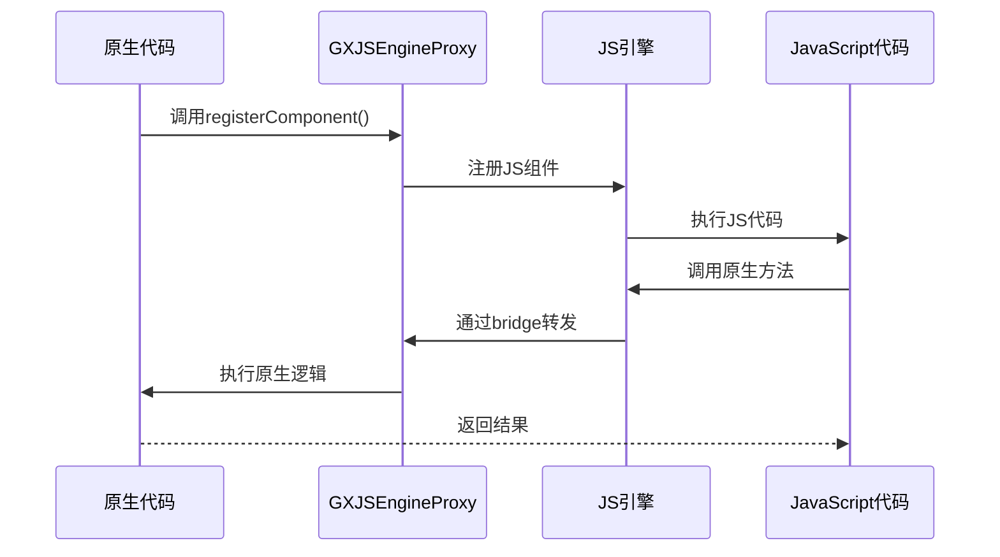
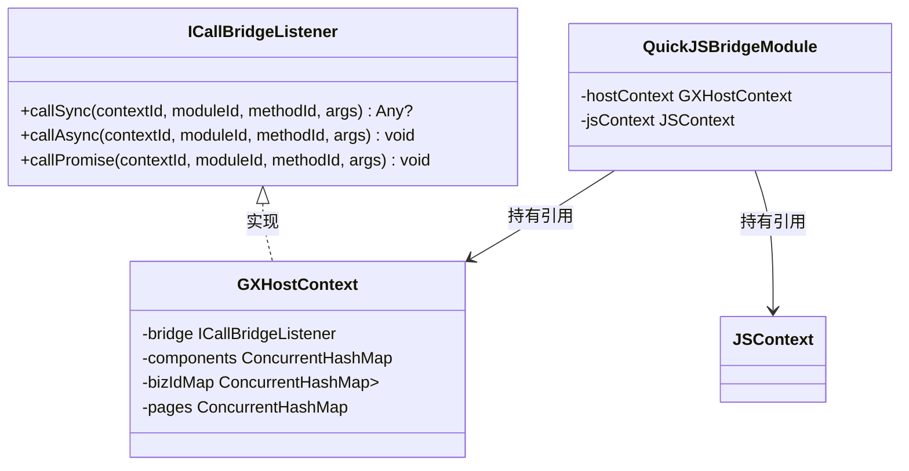
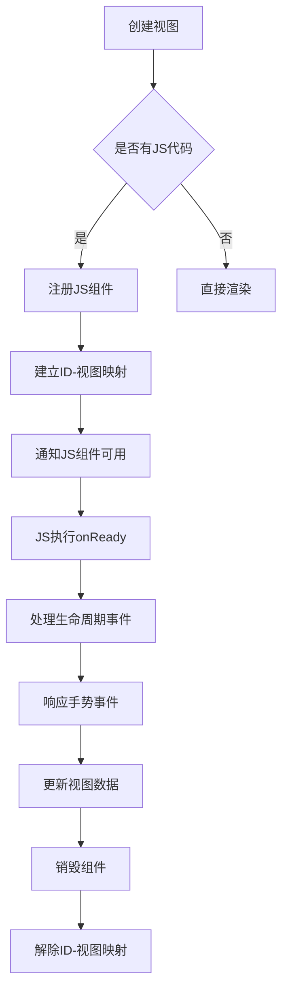
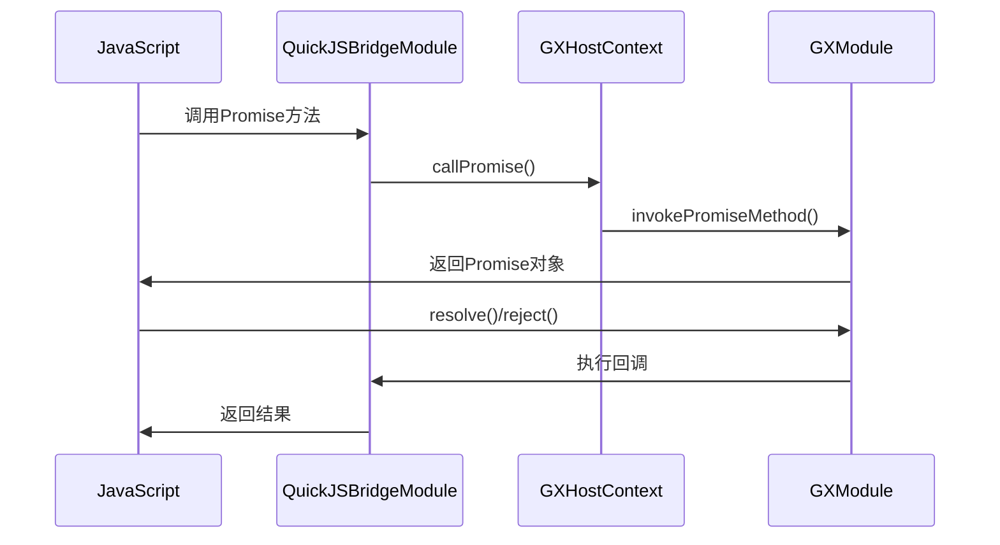

# JS运行时交互

<cite>
**本文档引用文件**   
- [GXJSEngineProxy.kt](file://GaiaXAndroidJSProxy/src/main/java/com/alibaba/gaiax/js/proxy/GXJSEngineProxy.kt)
- [GXJSRenderProxy.kt](file://GaiaXAndroidJSProxy/src/main/java/com/alibaba/gaiax/js/proxy/GXJSRenderProxy.kt)
- [GXHostContext.kt](file://GaiaXAndroidJS/src/main/kotlin/com/alibaba/gaiax/js/engine/GXHostContext.kt)
- [ICallBridgeListener.kt](file://GaiaXAndroidJS/src/main/kotlin/com/alibaba/gaiax/js/engine/ICallBridgeListener.kt)
- [QuickJSBridgeModule.kt](file://GaiaXAndroidJS/src/main/kotlin/com/alibaba/gaiax/js/impl/qjs/module/QuickJSBridgeModule.kt)
- [GXTemplateContext.kt](file://GaiaXAndroid/src/main/kotlin/com/alibaba/gaiax/context/GXTemplateContext.kt)
- [GXTemplateInfo.kt](file://GaiaXAndroid/src/main/kotlin/com/alibaba/gaiax/template/GXTemplateInfo.kt)
</cite>

## 目录
1. [引言](#引言)
2. [核心组件](#核心组件)
3. [双向通信机制](#双向通信机制)
4. [调用桥接机制](#调用桥接机制)
5. [渲染交互流程](#渲染交互流程)
6. [执行上下文管理](#执行上下文管理)
7. [异步调用与Promise处理](#异步调用与promise处理)
8. [回调机制与事件监听](#回调机制与事件监听)
9. [数据类型转换与错误处理](#数据类型转换与错误处理)
10. [性能优化与调试技巧](#性能优化与调试技巧)

## 引言
GaiaX JS运行时交互系统实现了原生代码与JavaScript之间的高效双向通信。该系统通过GXJSEngineProxy、GXJSRenderProxy和GXHostContext等核心组件，构建了一个完整的通信桥梁，支持方法调用、参数传递和结果返回的完整流程。系统设计充分考虑了跨平台兼容性，为开发者提供了统一的API接口，使得JS代码能够无缝调用原生功能，同时原生代码也能有效控制JS执行环境。

**Section sources**
- [GXJSEngineProxy.kt](file://GaiaXAndroidJSProxy/src/main/java/com/alibaba/gaiax/js/proxy/GXJSEngineProxy.kt#L1-L407)
- [GXJSRenderProxy.kt](file://GaiaXAndroidJSProxy/src/main/java/com/alibaba/gaiax/js/proxy/GXJSRenderProxy.kt#L1-L181)

## 核心组件

GXJSEngineProxy作为JS引擎的代理增强类，封装了与GaiaX渲染库组合使用的一些常用方法。它提供了注册Socket消息发送者、获取Socket通信桥、初始化JS引擎等核心功能。通过单例模式实现，确保了全局唯一性，避免了资源浪费和状态不一致的问题。

GXJSRenderProxy负责管理JS组件ID与视图之间的全局映射关系，由于JS运行时在一个独立的线程中，无法直接保存与视图相关的信息，因此通过组件ID作为桥梁，实现了线程间的通信。这种设计模式有效地解决了跨线程访问UI组件的问题。

GXHostContext作为JS执行上下文的管理者，负责维护每个Context下的Component，处理JS运行时调用Module代码的桥接。它通过内部的bridge对象实现了同步、异步和Promise调用的分发，是整个通信系统的核心枢纽。

**Section sources**
- [GXJSEngineProxy.kt](file://GaiaXAndroidJSProxy/src/main/java/com/alibaba/gaiax/js/proxy/GXJSEngineProxy.kt#L1-L407)
- [GXJSRenderProxy.kt](file://GaiaXAndroidJSProxy/src/main/java/com/alibaba/gaiax/js/proxy/GXJSRenderProxy.kt#L1-L181)
- [GXHostContext.kt](file://GaiaXAndroidJS/src/main/kotlin/com/alibaba/gaiax/js/engine/GXHostContext.kt#L1-L266)

## 双向通信机制

**Diagram sources**
- [GXJSEngineProxy.kt](file://GaiaXAndroidJSProxy/src/main/java/com/alibaba/gaiax/js/proxy/GXJSEngineProxy.kt#L305-L322)
- [GXHostContext.kt](file://GaiaXAndroidJS/src/main/kotlin/com/alibaba/gaiax/js/engine/GXHostContext.kt#L26-L39)

GXJSEngineProxy通过registerComponent方法将视图与JS组件进行关联，建立组件ID与视图的映射关系。当JS代码需要调用原生功能时，通过GXHostContext中的bridge对象进行转发，最终由GXJSEngineProxy调用相应的原生方法。这种设计实现了JS与原生代码的解耦，提高了系统的可维护性和扩展性。

## 调用桥接机制

**Diagram sources**
- [ICallBridgeListener.kt](file://GaiaXAndroidJS/src/main/kotlin/com/alibaba/gaiax/js/engine/ICallBridgeListener.kt#L5-L11)
- [GXHostContext.kt](file://GaiaXAndroidJS/src/main/kotlin/com/alibaba/gaiax/js/engine/GXHostContext.kt#L26-L39)
- [QuickJSBridgeModule.kt](file://GaiaXAndroidJS/src/main/kotlin/com/alibaba/gaiax/js/impl/qjs/module/QuickJSBridgeModule.kt#L19-L22)

ICallBridgeListener接口定义了三种调用方式：同步调用(callSync)、异步调用(callAsync)和Promise调用(callPromise)。GXHostContext实现了该接口，作为调用桥接的核心。当JS代码调用原生方法时，QuickJSBridgeModule会将调用请求转发给GXHostContext的bridge对象，由其负责具体的调用分发。这种设计模式实现了调用逻辑的集中管理，便于统一处理异常和日志记录。

## 渲染交互流程

**Diagram sources**
- [GXJSEngineProxy.kt](file://GaiaXAndroidJSProxy/src/main/java/com/alibaba/gaiax/js/proxy/GXJSEngineProxy.kt#L294-L300)
- [GXJSRenderProxy.kt](file://GaiaXAndroidJSProxy/src/main/java/com/alibaba/gaiax/js/proxy/GXJSRenderProxy.kt#L27-L27)

在渲染过程中，当创建包含JS代码的模板时，系统会自动调用registerComponentAndOnReady方法，该方法首先注册JS组件，然后通知JS组件可用。GXJSRenderProxy负责维护jsGlobalComponentMap，将JS组件ID与对应的视图进行映射。当发生手势事件时，GXJSRenderProxy会通过dispatchGestureEvent方法将事件转发给GXJSEngineProxy，最终由JS代码处理。

## 执行上下文管理

GXHostContext通过components、bizIdMap和pages三个ConcurrentHashMap来管理JS执行上下文。components存储了所有JS组件的实例，bizIdMap用于根据业务ID和模板ID快速查找组件ID，pages则管理了页面级别的JS组件。这种分层管理的设计使得系统能够高效地处理复杂的模板嵌套场景。

当JS组件需要访问视图数据时，可以通过GXJSRenderProxy的getData方法获取。该方法利用jsGlobalComponentMap反向查找对应的视图，然后通过GXTemplateEngine获取模板上下文，最终返回数据。这种设计模式有效地解决了JS运行时无法直接访问UI组件的问题。

**Section sources**
- [GXHostContext.kt](file://GaiaXAndroidJS/src/main/kotlin/com/alibaba/gaiax/js/engine/GXHostContext.kt#L48-L55)
- [GXJSRenderProxy.kt](file://GaiaXAndroidJSProxy/src/main/java/com/alibaba/gaiax/js/proxy/GXJSRenderProxy.kt#L50-L55)

## 异步调用与Promise处理

**Diagram sources**
- [QuickJSBridgeModule.kt](file://GaiaXAndroidJS/src/main/kotlin/com/alibaba/gaiax/js/impl/qjs/module/QuickJSBridgeModule.kt#L100-L143)
- [GXHostContext.kt](file://GaiaXAndroidJS/src/main/kotlin/com/alibaba/gaiax/js/engine/GXHostContext.kt#L37-L39)

对于Promise调用，系统通过createJSPromise方法创建Promise对象，并设置resolve和reject回调。当原生方法执行完成后，通过IGXPromise接口的resolve或reject方法触发相应的回调。这种机制确保了异步操作的正确执行顺序，避免了回调地狱的问题。

## 回调机制与事件监听

GXJSNativeEventModule提供了addNativeEventListener和removeNativeEventListener两个方法，用于从JS中监听Native发送来的消息。当原生代码需要向JS发送消息时，可以通过dispatchNativeEvent方法分发事件。GXJSRenderProxy维护了一个nativeEvents集合，存储了所有注册的事件监听器。

这种事件驱动的设计模式使得JS代码能够响应原生系统的各种状态变化，如网络状态变化、用户登录状态更新等。通过事件类型(type)和上下文ID(contextId)的组合，系统能够精确地将事件分发给正确的JS组件。

**Section sources**
- [GXJSNativeEventModule.kt](file://GaiaXAndroidJSProxy/src/main/java/com/alibaba/gaiax/js/proxy/modules/GXJSNativeEventModule.kt#L1-L46)
- [GXJSRenderProxy.kt](file://GaiaXAndroidJSProxy/src/main/java/com/alibaba/gaiax/js/proxy/GXJSRenderProxy.kt#L146-L175)

## 数据类型转换与错误处理

系统通过JSDataConvert工具类实现了JS值与Java对象之间的转换。对于基本类型，直接进行类型转换；对于复杂对象，则通过JSON序列化的方式进行传递。这种设计确保了数据在跨语言调用时的完整性和一致性。

当JS代码执行出现异常时，系统会通过GXJSEngine的jsExceptionListener进行捕获和处理。异常信息会被包装成JSONObject，包含模板ID、业务ID和错误消息等上下文信息，便于开发者定位问题。同时，系统会将异常信息通过Socket发送到调试工具，方便远程调试。

**Section sources**
- [JSDataConvert.java](file://GaiaXAndroidJS/src/main/kotlin/com/alibaba/gaiax/js/support/JSDataConvert.kt)
- [GXJSEngineProxy.kt](file://GaiaXAndroidJSProxy/src/main/java/com/alibaba/gaiax/js/proxy/GXJSEngineProxy.kt#L80-L80)

## 性能优化与调试技巧

为提高性能，系统采用了多种优化策略：使用ConcurrentHashMap保证线程安全的同时提高访问效率；通过懒加载(lazy)减少内存占用；使用对象池技术复用频繁创建的对象。对于大型模板，建议将JS代码拆分为多个模块，按需加载，避免一次性加载过多代码导致内存压力。

调试时，可以通过setSocketSender方法注册Socket消息发送者，将JS日志发送到调试工具。同时，系统提供了详细的调用日志，包括方法调用时间戳、参数信息等，便于分析性能瓶颈。对于常见的类型转换错误，建议在传递复杂对象时明确指定类型，并进行必要的空值检查。

**Section sources**
- [GXJSEngineProxy.kt](file://GaiaXAndroidJSProxy/src/main/java/com/alibaba/gaiax/js/proxy/GXJSEngineProxy.kt#L69-L71)
- [GXJSEngineProxy.kt](file://GaiaXAndroidJSProxy/src/main/java/com/alibaba/gaiax/js/proxy/GXJSEngineProxy.kt#L89-L95)