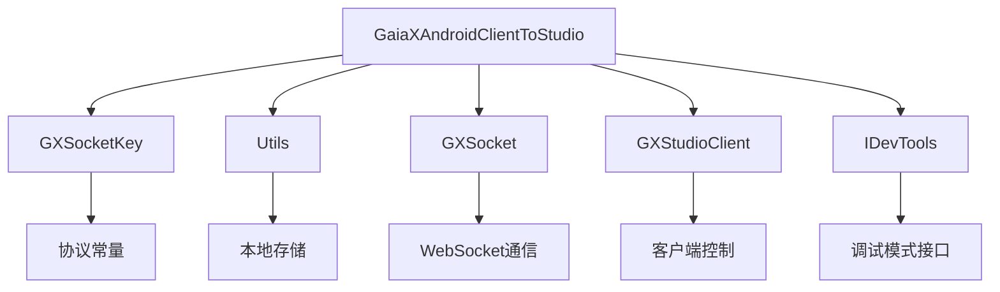
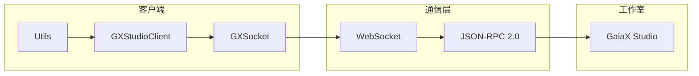
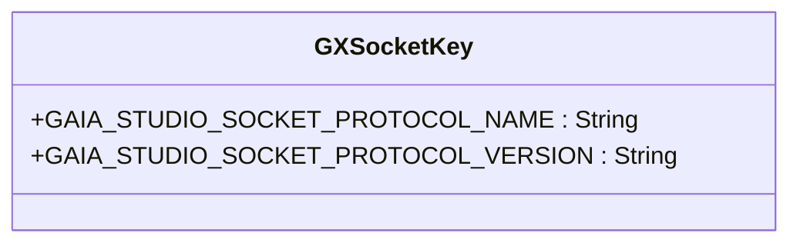
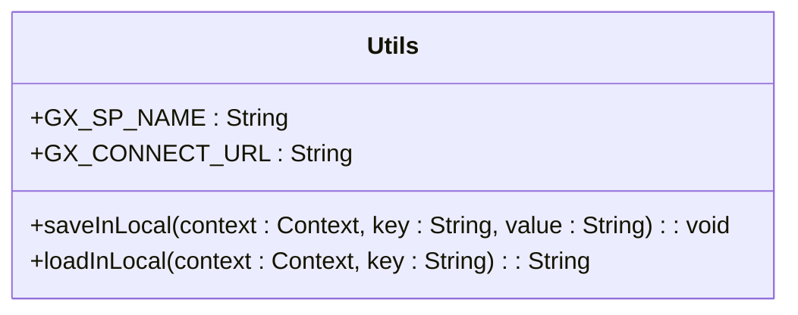
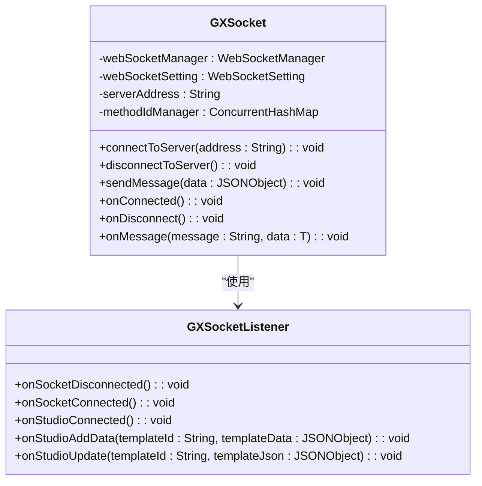
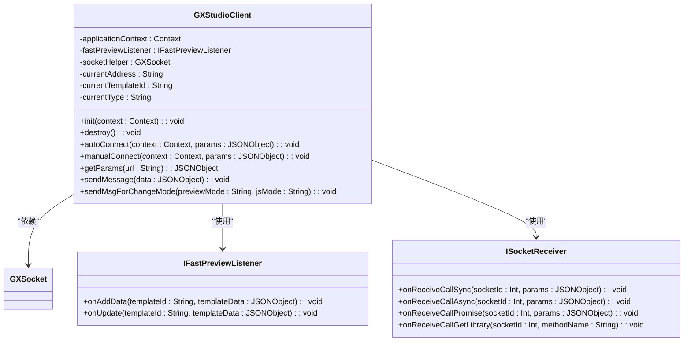
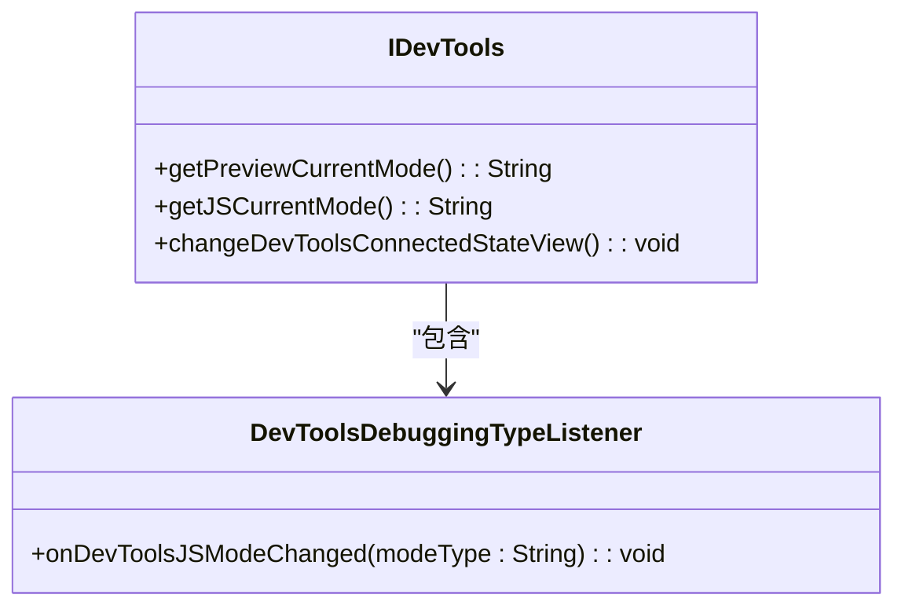
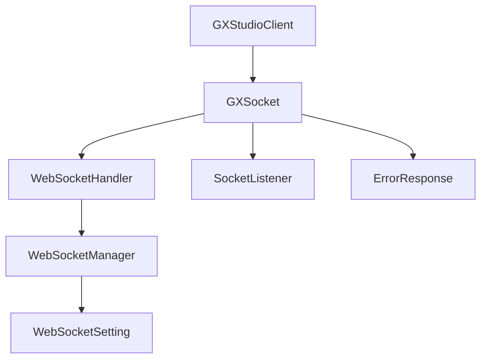

# 安全策略与稳定性保障

<cite>
**本文档引用文件**  
- [GXSocketKey.kt](file://GaiaXAndroidClientToStudio/src/main/java/com/alibaba/gaiax/studio/GXSocketKey.kt)
- [Utils.kt](file://GaiaXAndroidClientToStudio/src/main/java/com/alibaba/gaiax/studio/Utils.kt)
- [GXSocket.kt](file://GaiaXAndroidClientToStudio/src/main/java/com/alibaba/gaiax/studio/GXSocket.kt)
- [GXStudioClient.kt](file://GaiaXAndroidClientToStudio/src/main/java/com/alibaba/gaiax/studio/GXStudioClient.kt)
- [IDevTools.kt](file://GaiaXAndroidClientToStudio/src/main/java/com/alibaba/gaiax/studio/IDevTools.kt)
</cite>

## 目录
1. [引言](#引言)
2. [项目结构](#项目结构)
3. [核心组件](#核心组件)
4. [架构概述](#架构概述)
5. [详细组件分析](#详细组件分析)
6. [依赖分析](#依赖分析)
7. [性能考量](#性能考量)
8. [故障排查指南](#故障排查指南)
9. [结论](#结论)

## 引言
本文档旨在全面阐述GaiaX开发工具的安全策略与稳定性保障机制。重点涵盖通信过程中的安全机制、身份验证、数据加密、错误处理与恢复机制，以及稳定性保障方案。通过分析关键代码实现，为开发者提供安全配置的最佳实践，并提出针对常见安全威胁的防护措施。

## 项目结构
GaiaX开发工具的客户端与工作室通信模块主要位于`GaiaXAndroidClientToStudio`目录下，其核心功能围绕WebSocket通信构建，包含密钥管理、安全工具、套接字通信、客户端控制和开发工具接口等组件。

**图示来源**
- [GXSocketKey.kt](file://GaiaXAndroidClientToStudio/src/main/java/com/alibaba/gaiax/studio/GXSocketKey.kt)
- [Utils.kt](file://GaiaXAndroidClientToStudio/src/main/java/com/alibaba/gaiax/studio/Utils.kt)
- [GXSocket.kt](file://GaiaXAndroidClientToStudio/src/main/java/com/alibaba/gaiax/studio/GXSocket.kt)
- [GXStudioClient.kt](file://GaiaXAndroidClientToStudio/src/main/java/com/alibaba/gaiax/studio/GXStudioClient.kt)
- [IDevTools.kt](file://GaiaXAndroidClientToStudio/src/main/java/com/alibaba/gaiax/studio/IDevTools.kt)

**本节来源**
- [GXSocketKey.kt](file://GaiaXAndroidClientToStudio/src/main/java/com/alibaba/gaiax/studio/GXSocketKey.kt)
- [Utils.kt](file://GaiaXAndroidClientToStudio/src/main/java/com/alibaba/gaiax/studio/Utils.kt)
- [GXSocket.kt](file://GaiaXAndroidClientToStudio/src/main/java/com/alibaba/gaiax/studio/GXSocket.kt)
- [GXStudioClient.kt](file://GaiaXAndroidClientToStudio/src/main/java/com/alibaba/gaiax/studio/GXStudioClient.kt)
- [IDevTools.kt](file://GaiaXAndroidClientToStudio/src/main/java/com/alibaba/gaiax/studio/IDevTools.kt)

## 核心组件
本节分析GaiaX开发工具中与安全和稳定性直接相关的核心组件，包括通信协议定义、本地数据存储、WebSocket通信管理、客户端控制逻辑和开发工具接口。

**本节来源**
- [GXSocketKey.kt](file://GaiaXAndroidClientToStudio/src/main/java/com/alibaba/gaiax/studio/GXSocketKey.kt#L1-L13)
- [Utils.kt](file://GaiaXAndroidClientToStudio/src/main/java/com/alibaba/gaiax/studio/Utils.kt#L1-L20)
- [GXSocket.kt](file://GaiaXAndroidClientToStudio/src/main/java/com/alibaba/gaiax/studio/GXSocket.kt#L1-L442)
- [GXStudioClient.kt](file://GaiaXAndroidClientToStudio/src/main/java/com/alibaba/gaiax/studio/GXStudioClient.kt#L1-L282)
- [IDevTools.kt](file://GaiaXAndroidClientToStudio/src/main/java/com/alibaba/gaiax/studio/IDevTools.kt#L1-L22)

## 架构概述
GaiaX开发工具的安全与通信架构基于WebSocket协议，采用JSON-RPC 2.0标准进行消息交换。整体架构分为客户端、通信层和工作室三部分，通过明确的接口和协议保证通信的安全性与稳定性。

**图示来源**
- [GXSocket.kt](file://GaiaXAndroidClientToStudio/src/main/java/com/alibaba/gaiax/studio/GXSocket.kt#L1-L442)
- [GXStudioClient.kt](file://GaiaXAndroidClientToStudio/src/main/java/com/alibaba/gaiax/studio/GXStudioClient.kt#L1-L282)
- [GXSocketKey.kt](file://GaiaXAndroidClientToStudio/src/main/java/com/alibaba/gaiax/studio/GXSocketKey.kt#L1-L13)

## 详细组件分析
本节对各核心组件进行深入分析，阐述其在安全策略与稳定性保障中的具体作用。

### GXSocketKey 分析
`GXSocketKey`对象定义了WebSocket通信的协议名称和版本，作为通信双方的身份标识，确保通信协议的一致性。

**图示来源**
- [GXSocketKey.kt](file://GaiaXAndroidClientToStudio/src/main/java/com/alibaba/gaiax/studio/GXSocketKey.kt#L8-L13)

**本节来源**
- [GXSocketKey.kt](file://GaiaXAndroidClientToStudio/src/main/java/com/alibaba/gaiax/studio/GXSocketKey.kt#L1-L13)

### Utils 分析
`Utils`文件提供了本地数据存储功能，用于保存和读取连接URL等配置信息，使用SharedPreferences进行安全存储。

**图示来源**
- [Utils.kt](file://GaiaXAndroidClientToStudio/src/main/java/com/alibaba/gaiax/studio/Utils.kt#L5-L20)

**本节来源**
- [Utils.kt](file://GaiaXAndroidClientToStudio/src/main/java/com/alibaba/gaiax/studio/Utils.kt#L1-L20)

### GXSocket 分析
`GXSocket`类是WebSocket通信的核心，负责连接管理、消息收发和事件回调。它实现了`SocketListener`接口，处理连接、断开、消息接收等事件。

**图示来源**
- [GXSocket.kt](file://GaiaXAndroidClientToStudio/src/main/java/com/alibaba/gaiax/studio/GXSocket.kt#L17-L442)

**本节来源**
- [GXSocket.kt](file://GaiaXAndroidClientToStudio/src/main/java/com/alibaba/gaiax/studio/GXSocket.kt#L1-L442)

### GXStudioClient 分析
`GXStudioClient`是客户端的控制中心，负责初始化、连接、断开和消息发送。它封装了`GXSocket`的复杂性，为上层应用提供简洁的接口。

**图示来源**
- [GXStudioClient.kt](file://GaiaXAndroidClientToStudio/src/main/java/com/alibaba/gaiax/studio/GXStudioClient.kt#L18-L282)

**本节来源**
- [GXStudioClient.kt](file://GaiaXAndroidClientToStudio/src/main/java/com/alibaba/gaiax/studio/GXStudioClient.kt#L1-L282)

### IDevTools 分析
`IDevTools`接口定义了开发工具的调试模式，允许客户端获取当前的预览模式和JS调试模式，并更新连接状态视图。

**图示来源**
- [IDevTools.kt](file://GaiaXAndroidClientToStudio/src/main/java/com/alibaba/gaiax/studio/IDevTools.kt#L11-L22)

**本节来源**
- [IDevTools.kt](file://GaiaXAndroidClientToStudio/src/main/java/com/alibaba/gaiax/studio/IDevTools.kt#L1-L22)

## 依赖分析
GaiaX开发工具的通信模块依赖于第三方WebSocket库，通过`WebSocketHandler`、`WebSocketManager`和`WebSocketSetting`等类进行封装，实现了连接管理、心跳检测和断线重连等稳定性保障功能。

**图示来源**
- [GXSocket.kt](file://GaiaXAndroidClientToStudio/src/main/java/com/alibaba/gaiax/studio/GXSocket.kt#L7-L15)
- [GXStudioClient.kt](file://GaiaXAndroidClientToStudio/src/main/java/com/alibaba/gaiax/studio/GXStudioClient.kt#L39-L40)

**本节来源**
- [GXSocket.kt](file://GaiaXAndroidClientToStudio/src/main/java/com/alibaba/gaiax/studio/GXSocket.kt#L1-L442)
- [GXStudioClient.kt](file://GaiaXAndroidClientToStudio/src/main/java/com/alibaba/gaiax/studio/GXStudioClient.kt#L1-L282)

## 性能考量
本节讨论GaiaX开发工具在性能方面的考量，包括连接超时设置、心跳间隔、重连策略和UI线程处理等。

**本节来源**
- [GXSocket.kt](file://GaiaXAndroidClientToStudio/src/main/java/com/alibaba/gaiax/studio/GXSocket.kt#L82-L90)
- [GXSocket.kt](file://GaiaXAndroidClientToStudio/src/main/java/com/alibaba/gaiax/studio/GXSocket.kt#L41-L42)

## 故障排查指南
本节分析错误处理和恢复机制，包括异常捕获、日志记录和自动恢复策略。

**本节来源**
- [GXSocket.kt](file://GaiaXAndroidClientToStudio/src/main/java/com/alibaba/gaiax/studio/GXSocket.kt#L104-L107)
- [GXSocket.kt](file://GaiaXAndroidClientToStudio/src/main/java/com/alibaba/gaiax/studio/GXSocket.kt#L121-L122)
- [GXStudioClient.kt](file://GaiaXAndroidClientToStudio/src/main/java/com/alibaba/gaiax/studio/GXStudioClient.kt#L135-L137)

## 结论
GaiaX开发工具通过WebSocket协议和JSON-RPC 2.0标准，构建了一个安全、稳定的通信通道。其安全策略体现在协议一致性、本地数据安全存储和连接状态管理上。稳定性保障则通过连接超时、心跳检测、断线重连和UI线程安全等机制实现。开发者应遵循最佳实践，合理配置安全策略，以确保开发过程的顺利进行。