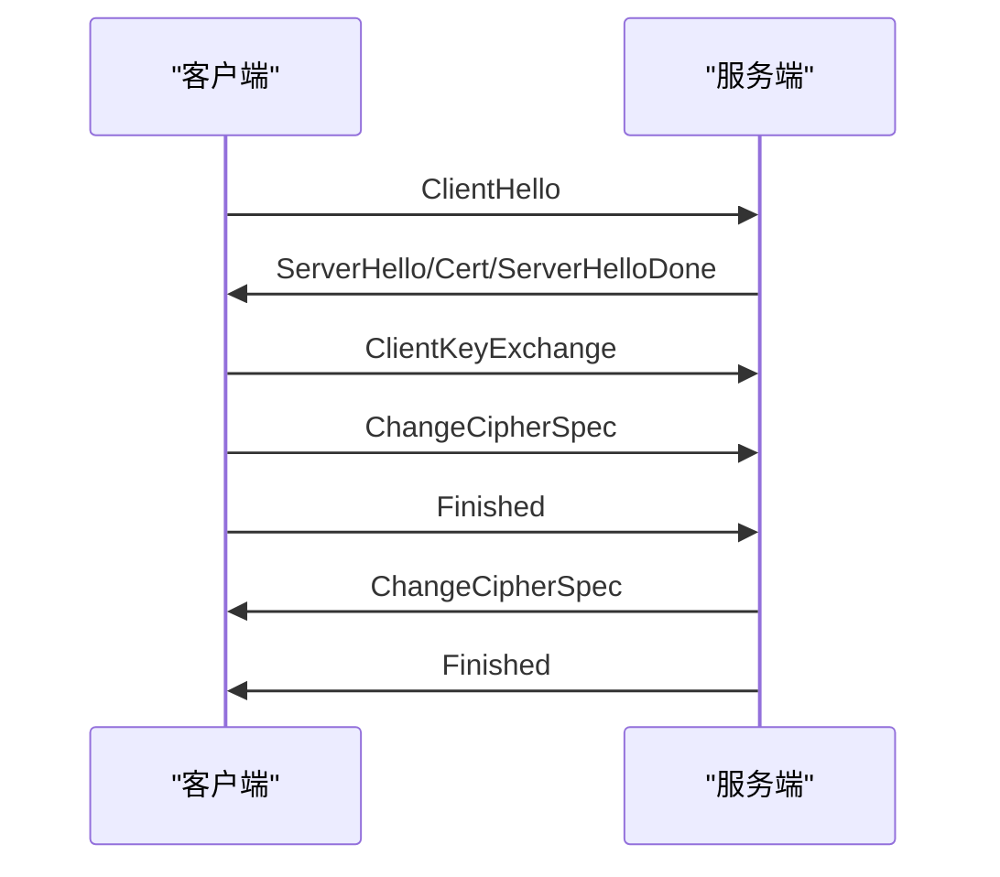
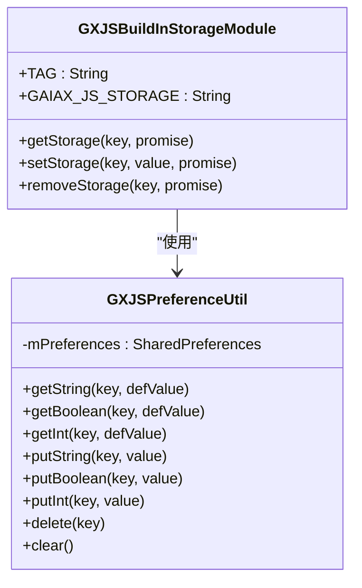
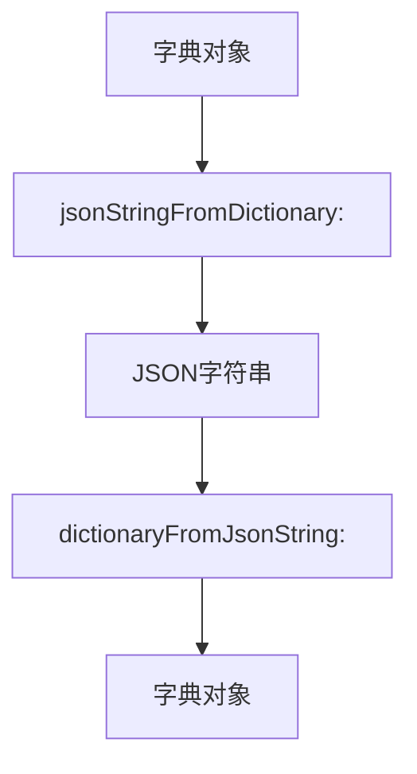

# 数据安全

<cite>
**本文档中引用的文件**
- [GaiaXSocketUtils.h](file://GaiaXSocketiOS/GaiaXSocket/GaiaXSocketUtils.h)
- [GaiaXSocketUtils.m](file://GaiaXSocketiOS/GaiaXSocket/GaiaXSocketUtils.m)
- [SSLSocketChannel.java](file://GaiaXAndroidClientToStudio/src/main/java/com/alibaba/gaiax/studio/third/socket/java_websocket/SSLSocketChannel.java)
- [SSLParametersWebSocketServerFactory.java](file://GaiaXAndroidClientToStudio/src/main/java/com/alibaba/gaiax/studio/third/socket/java_websocket/server/SSLParametersWebSocketServerFactory.java)
- [GXJSBuildInStorageModule.kt](file://GaiaXAndroidJSProxy/src/main/java/com/alibaba/gaiax/js/proxy/modules/GXJSBuildInStorageModule.kt)
- [GXJSPreferenceUtil.kt](file://GaiaXAndroidJSProxy/src/main/java/com/alibaba/gaiax/js/proxy/utils/GXJSPreferenceUtil.kt)
</cite>

## 目录
1. [引言](#引言)
2. [传输安全机制](#传输安全机制)
3. [本地存储安全策略](#本地存储安全策略)
4. [加密工具类分析](#加密工具类分析)
5. [安全配置最佳实践](#安全配置最佳实践)
6. [总结](#总结)

## 引言
GaiaX开发工具为保障数据安全，提供了一套完整的安全机制，涵盖数据传输和本地存储两个核心方面。在数据传输过程中，通过SSL/TLS协议确保通信通道的安全性；在本地存储方面，采用安全的存储机制保护敏感信息。本文档将深入分析GaiaX中的数据安全方案，重点介绍加密传输、存储机制以及相关工具类的实现原理。

## 传输安全机制
GaiaX通过SSL/TLS协议实现数据传输的安全保护。系统使用`SSLSocketChannel`类作为SSL/TLS通信的核心组件，该类基于Java的SSLEngine实现安全套接层协议。

SSL/TLS握手过程遵循标准的七步协议：
1. 客户端发送ClientHello消息
2. 服务端返回ServerHello、证书和ServerHelloDone
3. 客户端发送ClientKeyExchange
4. 客户端发送ChangeCipherSpec
5. 客户端发送Finished
6. 服务端发送ChangeCipherSpec
7. 服务端发送Finished

在握手过程中，系统会交换加密配置信息，包括可用的密码套件列表。`SSLSocketChannel`类通过`doHandshake()`方法实现完整的握手协议，确保连接建立前完成安全参数协商。

**图表来源**
- [SSLSocketChannel.java](file://GaiaXAndroidClientToStudio/src/main/java/com/alibaba/gaiax/studio/third/socket/java_websocket/SSLSocketChannel.java#L224-L252)

**本节来源**
- [SSLSocketChannel.java](file://GaiaXAndroidClientToStudio/src/main/java/com/alibaba/gaiax/studio/third/socket/java_websocket/SSLSocketChannel.java#L48-L511)

## 本地存储安全策略
GaiaX在本地存储方面采用SharedPreferences作为数据持久化方案，并通过`GXJSBuildInStorageModule`和`GXJSPreferenceUtil`类提供安全的存储接口。

系统通过`GXJSPreferenceUtil`类封装SharedPreferences操作，提供类型安全的读写方法，包括getString、getBoolean、getInt等获取方法，以及putString、putBoolean、putInt等存储方法。这种封装不仅简化了API使用，还增强了类型安全性。

存储的数据采用JSON格式序列化，包含"type"和"data"两个字段，其中type字段标识数据类型，data字段存储实际数据。这种结构化存储方式便于数据的类型识别和安全处理。

**图表来源**
- [GXJSBuildInStorageModule.kt](file://GaiaXAndroidJSProxy/src/main/java/com/alibaba/gaiax/js/proxy/modules/GXJSBuildInStorageModule.kt#L11-L77)
- [GXJSPreferenceUtil.kt](file://GaiaXAndroidJSProxy/src/main/java/com/alibaba/gaiax/js/proxy/utils/GXJSPreferenceUtil.kt#L1-L114)

**本节来源**
- [GXJSBuildInStorageModule.kt](file://GaiaXAndroidJSProxy/src/main/java/com/alibaba/gaiax/js/proxy/modules/GXJSBuildInStorageModule.kt#L11-L77)
- [GXJSPreferenceUtil.kt](file://GaiaXAndroidJSProxy/src/main/java/com/alibaba/gaiax/js/proxy/utils/GXJSPreferenceUtil.kt#L1-L114)

## 加密工具类分析
GaiaXSocketUtils是iOS平台上的工具类，提供基础的数据处理功能。该类主要包含JSON序列化和反序列化方法，用于在字典和JSON字符串之间进行转换。

`jsonStringFromDictionary:`方法将NSDictionary对象转换为JSON字符串，使用NSJSONSerialization进行序列化。`dictionaryFromJsonString:`方法将JSON字符串解析为NSDictionary对象。这些方法为数据传输提供了基础支持，确保数据格式的统一和兼容性。

**图表来源**
- [GaiaXSocketUtils.h](file://GaiaXSocketiOS/GaiaXSocket/GaiaXSocketUtils.h#L19-L28)
- [GaiaXSocketUtils.m](file://GaiaXSocketiOS/GaiaXSocket/GaiaXSocketUtils.m#L17-L46)

**本节来源**
- [GaiaXSocketUtils.h](file://GaiaXSocketiOS/GaiaXSocket/GaiaXSocketUtils.h#L19-L28)
- [GaiaXSocketUtils.m](file://GaiaXSocketiOS/GaiaXSocket/GaiaXSocketUtils.m#L17-L46)

## 安全配置最佳实践
为确保GaiaX应用的数据安全，建议遵循以下最佳实践：

1. **传输安全配置**：使用`SSLParametersWebSocketServerFactory`类配置SSL参数，明确指定支持的协议版本和密码套件，禁用不安全的旧版本协议。

2. **存储安全策略**：敏感数据不应直接存储在SharedPreferences中，建议对敏感信息进行额外加密处理后再存储。

3. **密钥管理**：避免在代码中硬编码密钥，应使用安全的密钥管理服务或系统提供的密钥链服务。

4. **数据完整性校验**：在数据传输和存储过程中，应添加数据完整性校验机制，防止数据被篡改。

5. **权限控制**：严格控制文件和数据的访问权限，确保只有授权组件可以访问敏感数据。

6. **安全审计**：定期进行安全审计，检查是否存在安全漏洞或配置不当的情况。

**本节来源**
- [SSLParametersWebSocketServerFactory.java](file://GaiaXAndroidClientToStudio/src/main/java/com/alibaba/gaiax/studio/third/socket/java_websocket/server/SSLParametersWebSocketServerFactory.java#L45-L82)

## 总结
GaiaX开发工具通过多层次的安全机制保障数据安全。在传输层面，采用标准的SSL/TLS协议确保通信安全；在存储层面，通过封装的存储接口提供安全的数据持久化方案。开发者应充分理解这些安全机制，并遵循最佳实践，确保应用的整体安全性。未来可考虑引入更高级的加密算法和密钥管理方案，进一步提升数据保护水平。