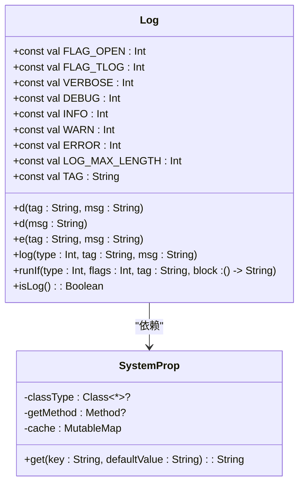
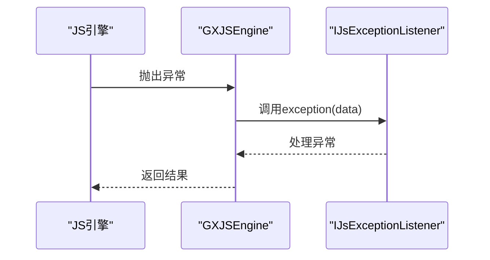
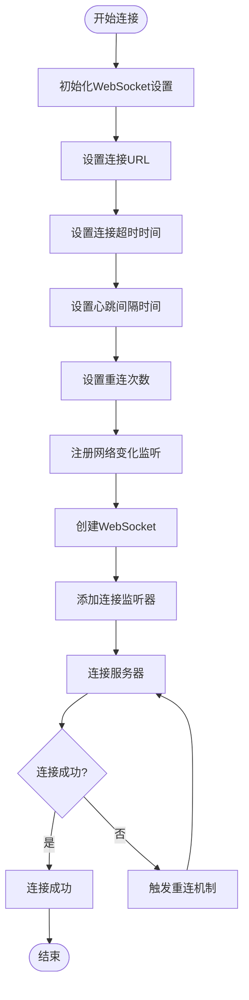
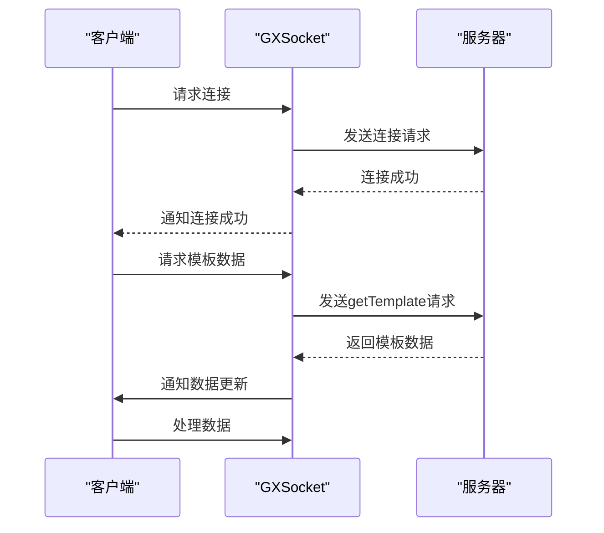
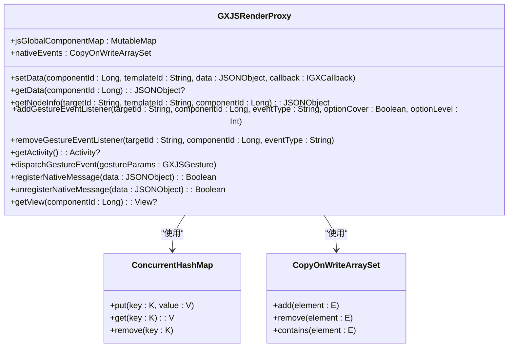
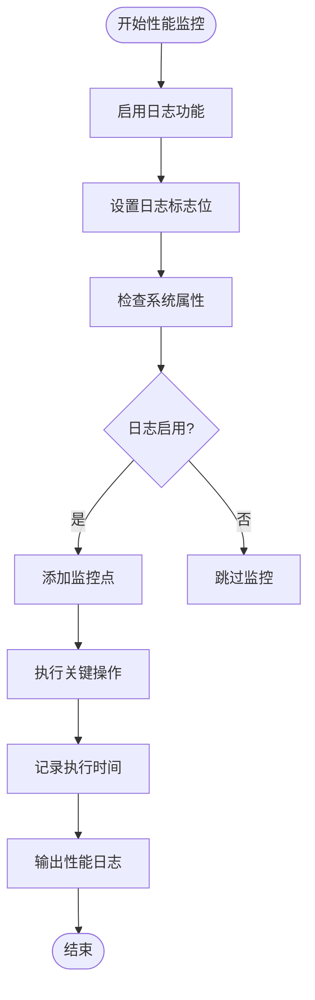
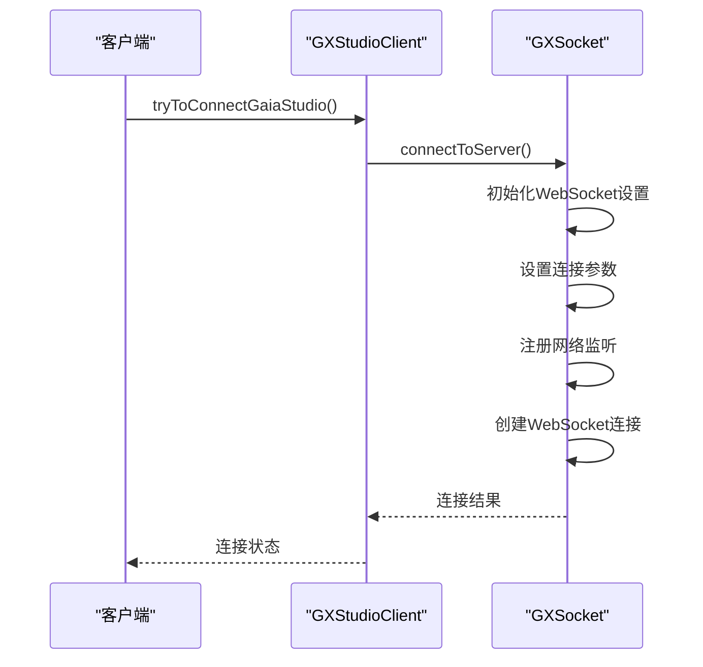
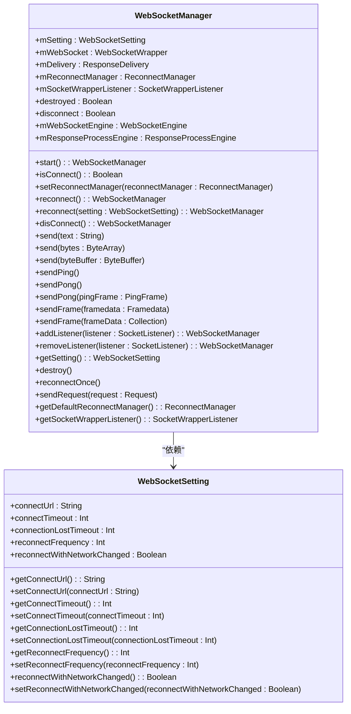

# 稳定性保障

<cite>
**本文档引用文件**   
- [GXSocket.kt](file://GaiaXAndroidClientToStudio/src/main/java/com/alibaba/gaiax/studio/GXSocket.kt)
- [GXStudioClient.kt](file://GaiaXAndroidClientToStudio/src/main/java/com/alibaba/gaiax/studio/GXStudioClient.kt)
- [GXJSEngine.kt](file://GaiaXAndroidJS/src/main/kotlin/com/alibaba/gaiax/js/GXJSEngine.kt)
- [GXJSRenderProxy.kt](file://GaiaXAndroidJSProxy/src/main/java/com/alibaba/gaiax/js/proxy/GXJSRenderProxy.kt)
- [Log.kt](file://GaiaXAndroid/src/main/kotlin/com/alibaba/gaiax/utils/Log.kt)
- [Log.kt](file://GaiaXAndroidJS/src/main/kotlin/com/alibaba/gaiax/js/utils/Log.kt)
- [Log.kt](file://GaiaXAndroidJSProxy/src/main/java/com/alibaba/gaiax/js/proxy/Log.kt)
- [Utils.kt](file://GaiaXAndroidClientToStudio/src/main/java/com/alibaba/gaiax/studio/Utils.kt)
</cite>

## 目录
1. [引言](#引言)
2. [错误处理与日志记录](#错误处理与日志记录)
3. [自动恢复机制](#自动恢复机制)
4. [流量控制与资源管理](#流量控制与资源管理)
5. [性能监控](#性能监控)
6. [代码示例](#代码示例)
7. [最佳实践](#最佳实践)
8. [结论](#结论)

## 引言
GaiaX开发工具通过一系列稳定性保障机制确保系统在各种场景下的可靠运行。本文档系统性地介绍这些机制，涵盖错误处理、恢复机制和性能监控等方面，为开发者提供全面的稳定性优化指导。

## 错误处理与日志记录
GaiaX开发工具通过多层次的日志记录和错误处理机制，确保关键操作的错误能够被有效追踪和诊断。

### 日志记录机制
GaiaX在多个模块中实现了统一的日志记录框架，通过`Log`对象提供日志输出功能。不同模块使用不同的TAG标识，如`GaiaX.SDK`、`GaiaX.JS`和`GaiaX.JS.Proxy`，便于日志的分类和过滤。

日志系统支持多种日志级别，包括VERBOSE、DEBUG、INFO、WARN和ERROR，开发者可以根据需要选择合适的日志级别。日志输出时会自动处理长消息的分段，确保消息完整输出。

**图表来源**
- [Log.kt](file://GaiaXAndroid/src/main/kotlin/com/alibaba/gaiax/utils/Log.kt#L9-L73)
- [Log.kt](file://GaiaXAndroidJS/src/main/kotlin/com/alibaba/gaiax/js/utils/Log.kt#L9-L67)
- [Log.kt](file://GaiaXAndroidJSProxy/src/main/java/com/alibaba/gaiax/js/proxy/Log.kt#L9-L53)

### 异常捕获与诊断
GaiaX通过`IJsExceptionListener`接口捕获JS执行过程中的异常，并将异常信息封装为JSON对象进行处理。异常信息包括模板ID、模板版本、业务ID、错误消息和堆栈信息，为开发者提供完整的诊断数据。

**图表来源**
- [GXJSEngine.kt](file://GaiaXAndroidJS/src/main/kotlin/com/alibaba/gaiax/js/GXJSEngine.kt#L404-L417)

**章节来源**
- [GXJSEngine.kt](file://GaiaXAndroidJS/src/main/kotlin/com/alibaba/gaiax/js/GXJSEngine.kt#L404-L417)

## 自动恢复机制
GaiaX开发工具通过智能的连接管理和数据同步机制，确保系统在异常情况下的自动恢复能力。

### 连接重连策略
GaiaX通过`GXSocket`类实现WebSocket连接的自动重连。当连接断开时，系统会根据配置的重连策略自动尝试重新连接。重连策略包括：

- 可配置的重连次数
- 网络状态变化后的自动重连
- 连接超时时间设置

**图表来源**
- [GXSocket.kt](file://GaiaXAndroidClientToStudio/src/main/java/com/alibaba/gaiax/studio/GXSocket.kt#L70-L96)

**章节来源**
- [GXSocket.kt](file://GaiaXAndroidClientToStudio/src/main/java/com/alibaba/gaiax/studio/GXSocket.kt#L70-L96)

### 数据同步恢复
当连接恢复后，GaiaX会自动同步丢失的数据，确保状态的一致性。系统通过`sendGetTemplateData`方法获取最新的模板数据，并通过`obtainResultFromGetTemplate`方法处理获取到的数据。

**图表来源**
- [GXSocket.kt](file://GaiaXAndroidClientToStudio/src/main/java/com/alibaba/gaiax/studio/GXSocket.kt#L260-L272)
- [GXSocket.kt](file://GaiaXAndroidClientToStudio/src/main/java/com/alibaba/gaiax/studio/GXSocket.kt#L394-L414)

**章节来源**
- [GXSocket.kt](file://GaiaXAndroidClientToStudio/src/main/java/com/alibaba/gaiax/studio/GXSocket.kt#L260-L272)
- [GXSocket.kt](file://GaiaXAndroidClientToStudio/src/main/java/com/alibaba/gaiax/studio/GXSocket.kt#L394-L414)

## 流量控制与资源管理
GaiaX通过有效的流量控制和资源管理策略，防止系统过载和资源耗尽。

### 流量控制
系统通过WebSocket的连接超时和心跳机制控制流量。连接超时时间设置为15秒，心跳间隔时间可配置，确保连接的活跃性同时避免不必要的资源消耗。

### 资源管理
GaiaX通过`ConcurrentHashMap`和`CopyOnWriteArraySet`等线程安全的数据结构管理资源，避免资源竞争和内存泄漏。JS组件ID与视图的映射关系通过`jsGlobalComponentMap`维护，确保资源的正确引用和释放。

**图表来源**
- [GXJSRenderProxy.kt](file://GaiaXAndroidJSProxy/src/main/java/com/alibaba/gaiax/js/proxy/GXJSRenderProxy.kt#L28-L33)

**章节来源**
- [GXJSRenderProxy.kt](file://GaiaXAndroidJSProxy/src/main/java/com/alibaba/gaiax/js/proxy/GXJSRenderProxy.kt#L28-L33)

## 性能监控
GaiaX通过日志系统和性能指标采集，帮助开发者识别潜在的性能瓶颈。

### 指标采集
系统通过`runE`扩展函数在关键路径上添加性能监控点，记录方法的执行时间和参数。这些日志信息可以帮助开发者分析性能问题。

### 分析方法
开发者可以通过分析日志中的时间戳和执行路径，识别耗时较长的操作，优化代码性能。系统还提供了`ILogListener`接口，允许开发者自定义日志处理逻辑。

**图表来源**
- [Log.kt](file://GaiaXAndroid/src/main/kotlin/com/alibaba/gaiax/utils/Log.kt#L62-L65)
- [Log.kt](file://GaiaXAndroidJS/src/main/kotlin/com/alibaba/gaiax/js/utils/Log.kt#L56-L59)

**章节来源**
- [Log.kt](file://GaiaXAndroid/src/main/kotlin/com/alibaba/gaiax/utils/Log.kt#L62-L65)
- [Log.kt](file://GaiaXAndroidJS/src/main/kotlin/com/alibaba/gaiax/js/utils/Log.kt#L56-L59)

## 代码示例
以下代码示例展示了GaiaX中稳定性相关功能的实现。

### 重试机制

**图表来源**
- [GXStudioClient.kt](file://GaiaXAndroidClientToStudio/src/main/java/com/alibaba/gaiax/studio/GXStudioClient.kt#L177-L193)
- [GXSocket.kt](file://GaiaXAndroidClientToStudio/src/main/java/com/alibaba/gaiax/studio/GXSocket.kt#L70-L96)

**章节来源**
- [GXStudioClient.kt](file://GaiaXAndroidClientToStudio/src/main/java/com/alibaba/gaiax/studio/GXStudioClient.kt#L177-L193)
- [GXSocket.kt](file://GaiaXAndroidClientToStudio/src/main/java/com/alibaba/gaiax/studio/GXSocket.kt#L70-L96)

### 超时处理

**图表来源**
- [WebSocketSetting.java](file://GaiaXAndroidClientToStudio/src/main/java/com/alibaba/gaiax/studio/third/socket/websocket/WebSocketSetting.java#L18-L241)
- [WebSocketManager.java](file://GaiaXAndroidClientToStudio/src/main/java/com/alibaba/gaiax/studio/third/socket/websocket/WebSocketManager.java#L26-L414)

**章节来源**
- [WebSocketSetting.java](file://GaiaXAndroidClientToStudio/src/main/java/com/alibaba/gaiax/studio/third/socket/websocket/WebSocketSetting.java#L18-L241)
- [WebSocketManager.java](file://GaiaXAndroidClientToStudio/src/main/java/com/alibaba/gaiax/studio/third/socket/websocket/WebSocketManager.java#L26-L414)

## 最佳实践
为确保GaiaX应用的稳定性，建议遵循以下最佳实践：

### 资源使用监控
- 定期检查内存使用情况，避免内存泄漏
- 监控网络连接状态，及时处理连接异常
- 使用线程安全的数据结构管理共享资源

### 异常处理策略
- 在关键路径上添加异常捕获
- 记录详细的错误日志，包括堆栈信息
- 实现优雅的错误恢复机制

### 系统健康检查
- 定期执行系统自检
- 监控关键性能指标
- 实现自动化的故障检测和恢复

## 结论
GaiaX开发工具通过完善的稳定性保障方案，确保系统在各种场景下的可靠运行。通过合理的错误处理、自动恢复机制、流量控制和性能监控，开发者可以构建稳定高效的GaiaX应用。遵循本文档提供的最佳实践，可以进一步提升应用的稳定性和用户体验。