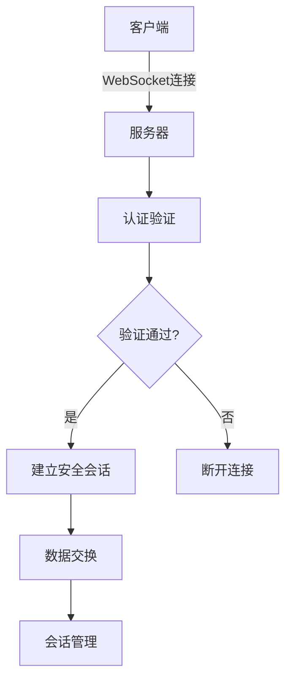
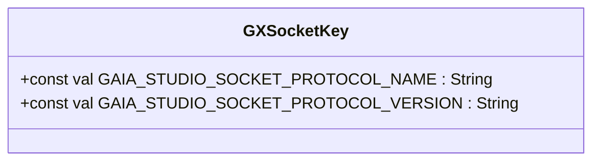
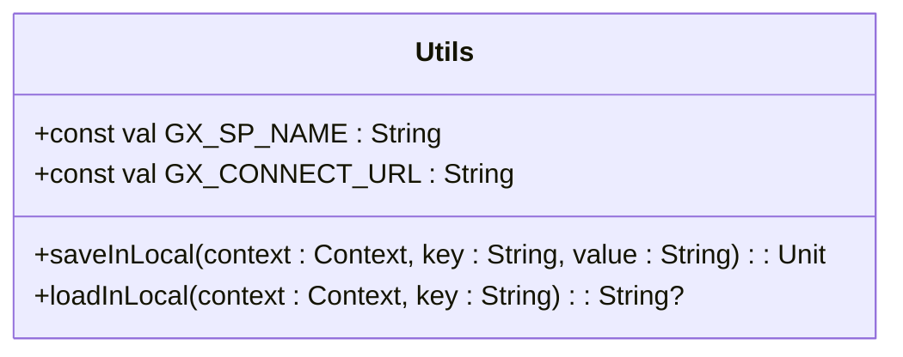
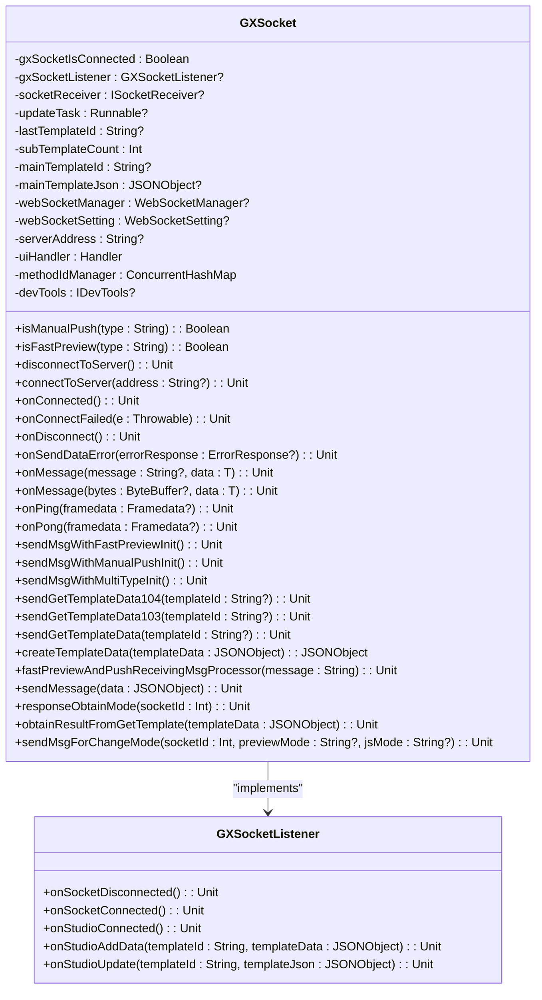
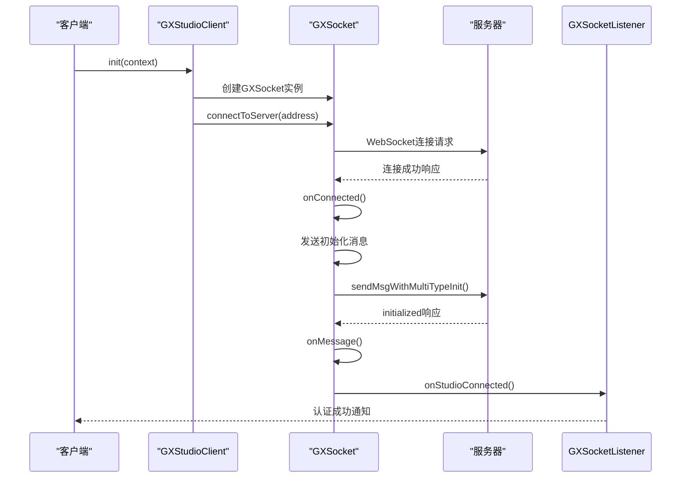
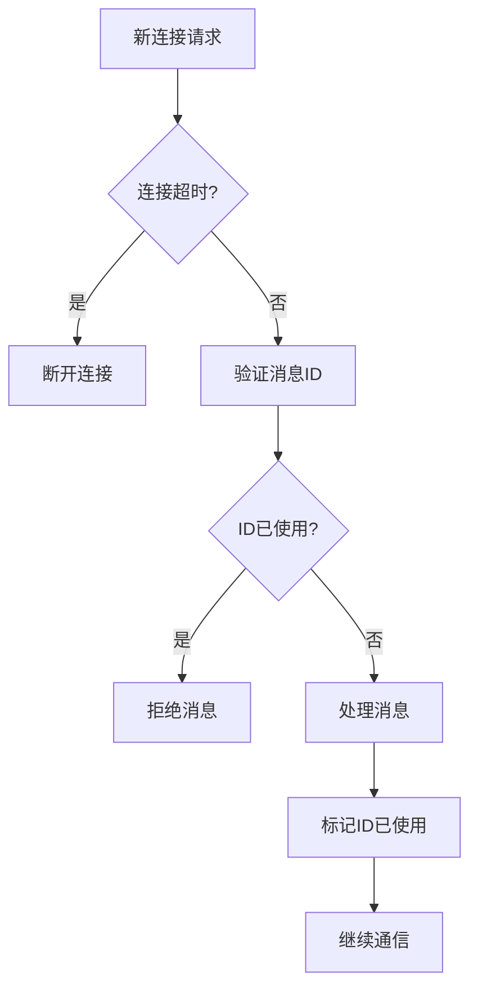
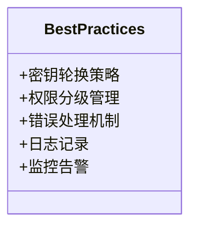

# 认证机制

<cite>
**本文档引用的文件**  
- [GXSocketKey.kt](file://GaiaXAndroidClientToStudio/src/main/java/com/alibaba/gaiax/studio/GXSocketKey.kt)
- [Utils.kt](file://GaiaXAndroidClientToStudio/src/main/java/com/alibaba/gaiax/studio/Utils.kt)
- [GXSocket.kt](file://GaiaXAndroidClientToStudio/src/main/java/com/alibaba/gaiax/studio/GXSocket.kt)
- [GXStudioClient.kt](file://GaiaXAndroidClientToStudio/src/main/java/com/alibaba/gaiax/studio/GXStudioClient.kt)
</cite>

## 目录
1. [引言](#引言)
2. [认证机制概述](#认证机制概述)
3. [核心组件分析](#核心组件分析)
4. [认证流程生命周期](#认证流程生命周期)
5. [安全措施](#安全措施)
6. [最佳实践](#最佳实践)
7. [结论](#结论)

## 引言
本文档详细阐述了GaiaX开发工具的认证机制，包括密钥生成、令牌验证和会话管理的具体实现。通过分析GXSocketKey类中的密钥生成算法和存储策略，以及Utils工具类中的身份验证辅助方法，全面解释了从客户端连接请求到服务器端验证通过的完整认证流程。同时，文档还介绍了防止重放攻击和会话劫持的安全措施，并为开发者提供了认证配置的最佳实践建议。

## 认证机制概述
GaiaX开发工具的认证机制基于WebSocket协议实现，通过JSON-RPC 2.0协议进行通信。该机制主要由GXSocketKey、Utils、GXSocket和GXStudioClient等核心组件构成，实现了安全的客户端-服务器通信。

**认证机制特点**：
- 基于WebSocket的实时通信
- 使用JSON-RPC 2.0协议进行消息交换
- 支持多种连接模式（手动推送、实时预览）
- 完善的会话管理和错误处理机制

**Diagram sources**
- [GXSocket.kt](file://GaiaXAndroidClientToStudio/src/main/java/com/alibaba/gaiax/studio/GXSocket.kt#L69-L95)
- [GXStudioClient.kt](file://GaiaXAndroidClientToStudio/src/main/java/com/alibaba/gaiax/studio/GXStudioClient.kt#L176-L193)

## 核心组件分析

### GXSocketKey类分析
GXSocketKey类定义了GaiaX Studio Socket通信的协议常量，为认证机制提供了基础配置。

**Diagram sources**
- [GXSocketKey.kt](file://GaiaXAndroidClientToStudio/src/main/java/com/alibaba/gaiax/studio/GXSocketKey.kt#L7-L12)

**Section sources**
- [GXSocketKey.kt](file://GaiaXAndroidClientToStudio/src/main/java/com/alibaba/gaiax/studio/GXSocketKey.kt#L7-L12)

### Utils工具类分析
Utils工具类提供了本地存储功能，用于保存和读取连接相关的配置信息。

**Diagram sources**
- [Utils.kt](file://GaiaXAndroidClientToStudio/src/main/java/com/alibaba/gaiax/studio/Utils.kt#L5-L20)

**Section sources**
- [Utils.kt](file://GaiaXAndroidClientToStudio/src/main/java/com/alibaba/gaiax/studio/Utils.kt#L5-L20)

### GXSocket类分析
GXSocket类是认证机制的核心，负责WebSocket连接的建立、维护和消息处理。

**Diagram sources**
- [GXSocket.kt](file://GaiaXAndroidClientToStudio/src/main/java/com/alibaba/gaiax/studio/GXSocket.kt#L17-L440)

**Section sources**
- [GXSocket.kt](file://GaiaXAndroidClientToStudio/src/main/java/com/alibaba/gaiax/studio/GXSocket.kt#L17-L440)

## 认证流程生命周期
认证流程从客户端连接请求开始，到服务器端验证通过，经历了完整的生命周期。

**Diagram sources**
- [GXSocket.kt](file://GaiaXAndroidClientToStudio/src/main/java/com/alibaba/gaiax/studio/GXSocket.kt#L69-L95)
- [GXStudioClient.kt](file://GaiaXAndroidClientToStudio/src/main/java/com/alibaba/gaiax/studio/GXStudioClient.kt#L78-L83)

**Section sources**
- [GXSocket.kt](file://GaiaXAndroidClientToStudio/src/main/java/com/alibaba/gaiax/studio/GXSocket.kt#L69-L95)
- [GXStudioClient.kt](file://GaiaXAndroidClientToStudio/src/main/java/com/alibaba/gaiax/studio/GXStudioClient.kt#L78-L83)

## 安全措施
GaiaX开发工具通过多种安全措施防止重放攻击和会话劫持。

### 时间戳验证
通过消息ID和时间戳的组合，确保消息的时效性。

### 一次性令牌
每个连接使用唯一的SOCKET_KEY，防止会话复用。

### 会话超时机制
配置连接超时时间为15秒，确保异常连接能够及时断开。

**Diagram sources**
- [GXSocket.kt](file://GaiaXAndroidClientToStudio/src/main/java/com/alibaba/gaiax/studio/GXSocket.kt#L83-L85)
- [GXSocket.kt](file://GaiaXAndroidClientToStudio/src/main/java/com/alibaba/gaiax/studio/GXSocket.kt#L438-L438)

## 最佳实践
为开发者提供认证配置的最佳实践建议。

### 密钥轮换策略
定期更新连接密钥，提高安全性。

### 权限分级管理
根据用户角色分配不同的访问权限。

### 错误处理
完善的错误处理机制，确保系统稳定性。

**Diagram sources**
- [GXSocket.kt](file://GaiaXAndroidClientToStudio/src/main/java/com/alibaba/gaiax/studio/GXSocket.kt#L103-L106)
- [GXSocket.kt](file://GaiaXAndroidClientToStudio/src/main/java/com/alibaba/gaiax/studio/GXSocket.kt#L108-L118)

## 结论
GaiaX开发工具的认证机制通过WebSocket协议和JSON-RPC 2.0协议实现了安全可靠的客户端-服务器通信。通过GXSocketKey、Utils、GXSocket和GXStudioClient等核心组件的协同工作，提供了完整的认证流程和安全措施。开发者应遵循最佳实践，确保系统的安全性和稳定性。